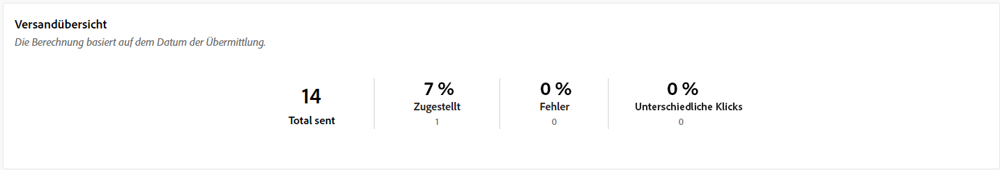
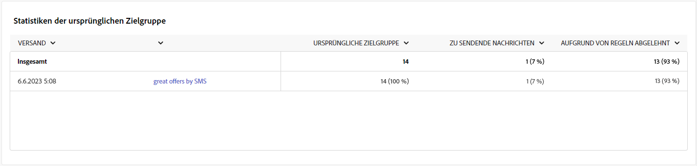
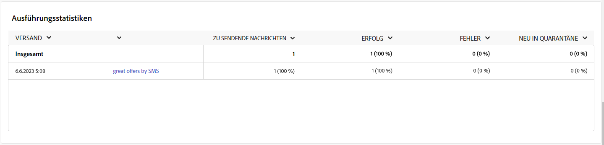
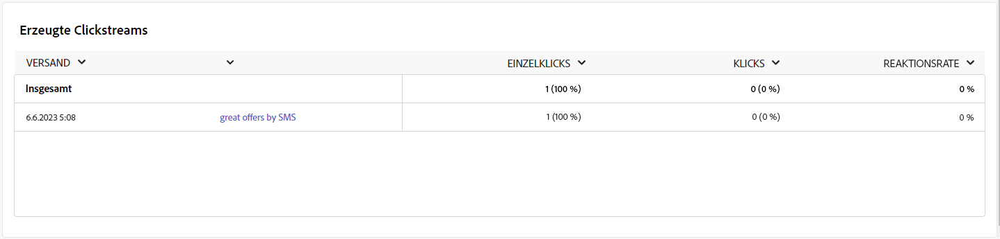

# Kampagnenberichte für den SMS-Kanal {#campaign-reports-sms-channel}

Jeder Kampagnenbericht ist in verschiedene Widgets unterteilt, die den Erfolg und die Fehler Ihrer Kampagne detailliert beschreiben. Für den SMS-Kanal werden im Folgenden Berichte und Metriken beschrieben. Erfahren Sie auf [dieser Seite](campaign-reports.md), wie Sie auf Ihre Kampagnenberichte zugreifen können.

## Versandzusammenfassung {#delivery-summary-sms}

>[!CONTEXTUALHELP]
>id="acw_campaign_reporting_sms_deliveries_overview"
>title="Versandübersicht"
>abstract="Die **Versandübersicht** bietet wichtige Leistungsindikatoren (KPIs), die detaillierte Informationen darüber enthalten, wie Ihre Besucherinnen und Besucher mit Ihrem SMS-Versand interagieren."

Die **[!UICONTROL Versandübersicht]** bietet wichtige Leistungsindikatoren (KPIs), die detaillierte Informationen darüber enthalten, wie Ihre Besucherinnen und Besucher mit Ihrem SMS-Versand interagieren. Metriken werden nachfolgend beschrieben.

+++Erfahren Sie mehr über die Metriken des SMS-Kampagnenberichts.

* **[!UICONTROL Insgesamt gesendet]**: Gesamtzahl der während der Versandvorbereitung verarbeiteten Nachrichten.

* **[!UICONTROL Zugestellt]**: Anzahl der erfolgreich gesendeten Nachrichten im Verhältnis zur Gesamtzahl der gesendeten Nachrichten.

* **[!UICONTROL Fehler]**: Summe der Fehler, die beim Versand und bei der automatischen Rücksendung kumuliert wurden, bezogen auf die Gesamtzahl der gesendeten Nachrichten.

* **[!UICONTROL Unterschiedliche Klicks (Unique Clicks)]**: Gesamtzahl der unterschiedlichen Empfängerinnen und Empfänger, die einen Versand mindestens einmal angeklickt haben.

+++

### Statistiken der ursprünglichen Zielgruppe {#delivery-summary-sms-initial-target}

>[!CONTEXTUALHELP]
>id="acw_campaign_reporting_sms_target"
>title="Statistiken der ursprünglichen Zielgruppe"
>abstract="Die Tabelle **Statistiken der anfänglichen Zielgruppe** zeigt Daten zu Ihren Empfängerinnen und Empfängern an."

Die Tabelle **[!UICONTROL Statistiken der anfänglichen Zielgruppe]** zeigt Daten zu Ihren Empfängerinnen und Empfängern an. Metriken werden nachfolgend beschrieben.

+++Erfahren Sie mehr über die Metriken des SMS-Kampagnenberichts.

* **[!UICONTROL Ursprüngliche Zielgruppe]**: Gesamtzahl der Zielgruppenempfängerinnen und -empfänger.

* **[!UICONTROL Zu versendende Nachricht]**: Gesamtzahl der nach erfolgter Versandvorbereitung zu versendenden Nachrichten.

* **[!UICONTROL Aufgrund von Regeln abgelehnt]**: Gesamtzahl der Adressen, die während der Analyse beim Anwenden von Regeln ignoriert wurden: fehlende Adresse, in Quarantäne, auf Blockierungsliste usw.

+++

### Ausführungsstatistiken {#delivery-summary-sms-exec-stats}

>[!CONTEXTUALHELP]
>id="acw_campaign_reporting_sms_exec_stats"
>title="Ausführungsstatistiken"
>abstract="Die Tabelle **Ausführungsstatistiken** zeigt den Erfolg Ihres Versands: Zu sendende Nachrichten, Erfolg, Fehler und Neu in Quarantäne."

Die Tabelle **[!UICONTROL Ausführungsstatistiken]** zeigt den Erfolg Ihres Versands im Detail. Metriken werden nachfolgend beschrieben.

+++Erfahren Sie mehr über die Metriken des SMS-Kampagnenberichts.

* **[!UICONTROL Zu versendende Nachricht]**: Gesamtzahl der nach erfolgter Versandvorbereitung zu versendenden Nachrichten.

* **[!UICONTROL Erfolg]**: Anzahl der erfolgreich verarbeiteten Nachrichten im Verhältnis zur Anzahl der zu versendenden Nachrichten.

* **[!UICONTROL Fehler]**: Gesamtzahl der über alle Sendungen hinweg kumulierten Fehler und der automatischen Bounce-Verarbeitungen im Verhältnis zur Anzahl der zu versendenden Nachrichten.

* **[!UICONTROL Neue Quarantänen]**: Gesamtzahl der Adressen, die infolge eines fehlgeschlagenen Versands unter Quarantäne gestellt wurden (unbekannter Nutzer, ungültige Domain), im Verhältnis zur Anzahl der zu versendenden Nachrichten.

  Die SMS-Fehlertypen werden im Abschnitt [Dokumentation zu Adobe Campaign v8 (Client-Konsole)](https://experienceleague.adobe.com/docs/campaign/campaign-v8/send/failures/delivery-failures.html?lang=de#sms-quarantines){target="_blank"} aufgelistet.

+++

### Generierte Clickstreams {#delivery-summary-sms-click-streams}

>[!CONTEXTUALHELP]
>id="acw_campaign_reporting_sms_click_streams"
>title="Generierte Clickstreams"
>abstract="Die Tabelle **Generierte Clickstreams** zeigt Daten dazu an, wie Ihre Empfängerinnen und Empfänger mit Ihrem Versand interagiert haben."

Die Tabelle **[!UICONTROL Generierte Clickstreams]** zeigt Daten dazu an, wie Ihre Empfängerinnen und Empfänger mit Ihrem Versand interagiert haben. Metriken werden nachfolgend beschrieben.

+++Erfahren Sie mehr über die Metriken des SMS-Kampagnenberichts.

* **[!UICONTROL Unterschiedliche Klicks (Unique Clicks)]**: Gesamtzahl der unterschiedlichen Empfängerinnen und Empfänger, die einen Versand mindestens einmal angeklickt haben.

* **[!UICONTROL Klicks]**: Gesamtzahl der Klicks auf Links in Sendungen.

* **[!UICONTROL Reaktionsrate]**: Verhältnis der Anzahl an Zielgruppenempfängerinnen und -empfängern, die auf einen Versand geklickt haben, in Bezug zur geschätzten Anzahl der Zielgruppenempfängerinnen und -empfänger, die einen Versand geöffnet haben.

+++
