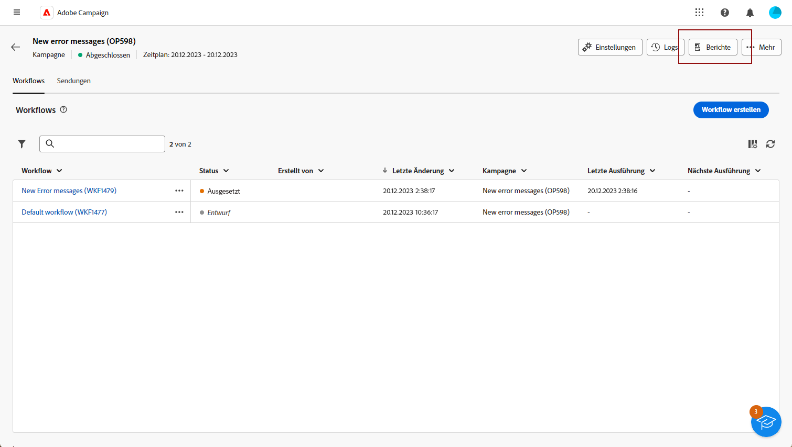
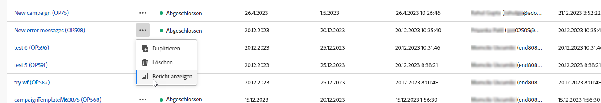
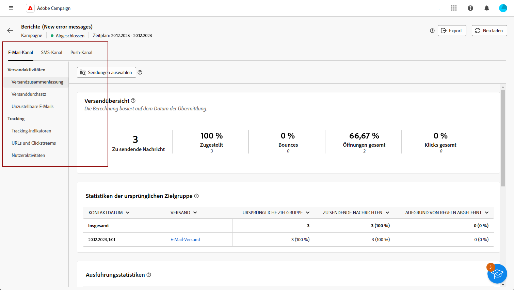

# Erste Schritte mit Kampagnenberichten {#campaign-reports}

<!-- CAN BE REMOVED___
>[!CONTEXTUALHELP]
>id="acw_campaign_reporting_sending"
>title="Reporting Sending"
>abstract="The Sending tab within your report provides in-depth insights into your visitors' interactions with your deliveries and any potential errors they may have encountered."

>[!CONTEXTUALHELP]
>id="acw_campaign_reporting_tracking"
>title="Reporting tracking"
>abstract="The Tracking tab within your report offers valuable data, including recipient behavior per link, breakdown of opens and clicks, as well as detailed information about the most frequently clicked URLs during a delivery."
-->

**Kampagnenberichte** bieten einen umfassenden Überblick über Ihre **Kampagne** und enthalten alle relevanten Informationen zu den verschiedenen zugehörigen Sendungen. Diese Berichte enthalten eine gründliche Analyse der Leistung jedes Versands pro Kanal: Erfolgsraten, Zielgruppeninteraktion und andere wichtige Metriken. Sie ermöglichen es Ihnen, die Effektivität und Wirkung Ihrer Kampagne insgesamt zu bewerten.

Die vollständige Liste der Berichte und zugehörigen Metriken für jeden Kanal finden Sie auf den folgenden Seiten:

* [Email-Kampagnenkanal](campaign-reports-email.md)
* [SMS-Kampagnenkanal](campaign-reports-sms.md)
* [Push-Kampagnenkanal](campaign-reports-push.md)

## Bericht-Dashboard verwalten {#manage-reports}

Gehen Sie wie folgt vor, um auf Kampagnenberichte zuzugreifen und diese zu verwalten:

1. Navigieren Sie zum **[!UICONTROL Kampagnen]** Menü. Klicken Sie auf **Berichte** im Dashboard Ihrer Kampagne.

   

   Alternativ können Sie die drei Punkte verwenden **Mehr Aktionen** neben dem Kampagnennamen in der Kampagnenliste und wählen Sie **[!UICONTROL Bericht anzeigen]**.

   

1. Wählen Sie im linken Menü einen Bericht aus der Liste aus und navigieren Sie durch die Registerkarte , um Daten aus den einzelnen Kanälen anzuzeigen.

   

1. Klicken Sie in Ihrem Dashboard auf **[!UICONTROL Sendungen auswählen]** , wenn Sie einen bestimmten Versand in Ihrer Kampagne auswählen möchten.

1. Im **[!UICONTROL Versanddurchsatz]** Menü, wählen Sie eine **Starten** und **[!UICONTROL Endzeit]** , um bestimmte Daten auszuwählen.

   

1. Aus dem **[!UICONTROL Ordner auswählen]** auswählen, ob Sie Sendungen oder Kampagnen aus einem bestimmten Ordner in die Zielgruppe aufnehmen möchten.

   Sie können auch **[!UICONTROL Regeln hinzufügen]** , um Abfragen zu erstellen und Berichtsdaten besser zu filtern. [Erfahren Sie, wie Sie das Abfragemodell verwenden](../query/query-modeler-overview.md)

   

1. Aus dem **[!UICONTROL URLs und Clickstreams]** können Sie auch die **[!UICONTROL Top besuchte Links]** oder **[!UICONTROL Zeitraum]**.

   Die **[!UICONTROL Anzeigen nach]** -Optionen ermöglichen das Filtern nach URLs, Bezeichnungen oder Kategorien.
