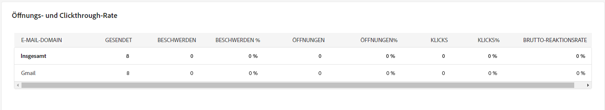
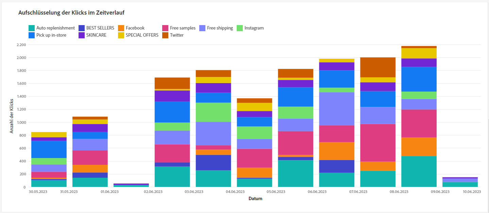

# Kampagnenberichte {#campaign-reports}

## E-Mail-Kanal {#email-channel}

### Versandzusammenfassung {#delivery-summary-email}

* **[!UICONTROL Versandübersicht]** bietet wichtige Leistungsindikatoren (Key Performance Indicators, KPIs), die detaillierte Informationen darüber enthalten, wie Ihre Besucher mit Ihrem E-Mail-Versand interagieren.

  +++ Erfahren Sie mehr über E-Mail-Kampagnen-Berichtsmetriken.

   * **[!UICONTROL Gesendete Summe]**: Gesamtzahl der bei der Versandanalyse verarbeiteten Nachrichten.

   * **[!UICONTROL Zugestellt]**: Anzahl der erfolgreich gesendeten Nachrichten in Bezug auf die Gesamtzahl der gesendeten Nachrichten

   * **[!UICONTROL Bounces]**: Gesamtzahl der über alle Sendungen hinweg kumulierten Fehler und der automatischen Bounce-Verarbeitung in Bezug auf die Gesamtzahl der gesendeten Nachrichten.

   * **[!UICONTROL Unique Opens]**: Gesamtzahl der Zielgruppenempfänger, die mindestens einmal die betreffende Nachricht geöffnet haben.

   * **[!UICONTROL Unique Clicks]**: Gesamtzahl unterschiedlicher Empfänger, die mindestens einmal im betreffenden Versand geklickt haben.

+++

  

* **[!UICONTROL Statistiken der ursprünglichen Zielgruppen-Audience]**

  +++ Erfahren Sie mehr über E-Mail-Kampagnen-Berichtsmetriken.

   * **[!UICONTROL Ursprüngliche Zielgruppe]**: Gesamtzahl der Zielgruppenempfänger

   * **[!UICONTROL Zu sendende Nachricht]**: Gesamtzahl der nach erfolgter Versandanalyse zu versendenden Nachrichten.

   * **[!UICONTROL Nach Regeln abgelehnt]**: Gesamtzahl der im Zuge der Regelanalyse ignorierten Adressen: Adresse fehlt, in Quarantäne, auf Blockierungsliste usw.

+++

  

* **[!UICONTROL Ausführungsstatistiken]**

  +++ Erfahren Sie mehr über E-Mail-Kampagnen-Berichtsmetriken.

   * **[!UICONTROL Zu sendende Nachricht]**: Gesamtzahl der nach erfolgter Versandanalyse zu versendenden Nachrichten.

   * **[!UICONTROL Erfolg]**: Anzahl der erfolgreich verarbeiteten Nachrichten in Bezug auf die Anzahl der zu sendenden Nachrichten.

   * **[!UICONTROL Fehler]**: Gesamtzahl der über alle Sendungen hinweg kumulierten Fehler und der automatischen Bounce-Verarbeitung in Bezug auf die Zahl der zu sendenden Nachrichten.

   * **[!UICONTROL Neue Quarantänen]**: Gesamtzahl der Adressen, die infolge eines fehlgeschlagenen Versands unter Quarantäne gestellt wurden (unbekannter Nutzer, ungültige Domain), in Bezug auf die Zahl der zu sendenden Nachrichten.

+++

  

* **[!UICONTROL Reaktionsstatistik]**

  +++ Erfahren Sie mehr über E-Mail-Kampagnen-Berichtsmetriken.

   * **[!UICONTROL Unique Opens]**: Gesamtzahl der Zielgruppenempfänger, die mindestens einmal die betreffende Nachricht geöffnet haben.

   * **[!UICONTROL Öffnungen]**: Anzahl unterschiedlicher Zielgruppenempfänger dieser Domain, die mindestens einmal die betreffende Nachricht geöffnet haben.

   * **[!UICONTROL Abmeldungen]**: Anzahl der Empfänger, die in dem betreffenden Zeitraum auf Abmeldungen geklickt haben

   * **[!UICONTROL Mirrorseite]**: Anzahl der Empfänger, die auf den Mirrorseiten-Link geklickt haben

   * **[!UICONTROL Forwards]**: Anzahl der Empfänger, die geklickt haben, die die E-Mail weitergeleitet haben

  
+++

* **[!UICONTROL Erzeugte Clickstreams]**

  

  +++ Erfahren Sie mehr über E-Mail-Kampagnen-Berichtsmetriken.

   * **[!UICONTROL Unique Clicks]**: Gesamtzahl unterschiedlicher Empfänger, die mindestens einmal im betreffenden Versand geklickt haben.

   * **[!UICONTROL Klicks]**: Gesamtzahl der Klicks auf Links in Sendungen.

   * **[!UICONTROL Reaktivität]**: Prozentualer Anteil der Zielgruppenempfänger, die in einen Versand geklickt haben, in Bezug auf die geschätzte Anzahl der Zielgruppenempfänger, die einen Versand geöffnet haben.

+++

### Unzustellbare E-Mails {#non-deliverables-email}

* **[!UICONTROL Verteilung der Fehler nach Typ]** und **[!UICONTROL Verteilung der Fehler nach Browsern]**

  +++ Erfahren Sie mehr über E-Mail-Kampagnen-Berichtsmetriken.

   * **[!UICONTROL Fehler]**: Gesamtzahl der über alle Sendungen hinweg kumulierten Fehler und der automatischen Bounce-Verarbeitung in Bezug auf die Zahl der zu sendenden Nachrichten.

   * **[!UICONTROL Beitrag]**:

   * **[!UICONTROL Verteilung]**:

+++

  

### Tracking-Indikatoren {#tracking-indicators-email}

* **[!UICONTROL Versandstatistiken]**

  +++ Erfahren Sie mehr über E-Mail-Kampagnen-Berichtsmetriken.

   * **[!UICONTROL Erfolg]**: Anzahl der erfolgreich verarbeiteten Nachrichten in Bezug auf die Anzahl der zu sendenden Nachrichten.

   * **[!UICONTROL Unique Opens]**: Gesamtzahl der Zielgruppenempfänger, die mindestens einmal die betreffende Nachricht geöffnet haben.

   * **[!UICONTROL Öffnungen]**: Anzahl unterschiedlicher Zielgruppenempfänger dieser Domain, die mindestens einmal die betreffende Nachricht geöffnet haben.

   * **[!UICONTROL Klicks auf den Ausschluss-Link]**: Anzahl der Klicks auf den Abmelde-Link.

   * **[!UICONTROL Klicks auf den Mirrorlink]**: Anzahl der Klicks auf den Mirrorseite-Link.

   * **[!UICONTROL Schätzung der Weiterleitungen]**: Schätzung der Anzahl der E-Mails, die von den Zielgruppenempfängern weitergeleitet werden.
+++

  

* **[!UICONTROL Öffnungs- und Klickrate]**

  +++ Erfahren Sie mehr über E-Mail-Kampagnen-Berichtsmetriken.

   * **[!UICONTROL Gesendet]**: Gesamtzahl der gesendeten Nachrichten

   * **[!UICONTROL Beschwerden]**: Anzahl der Nachrichten für diese Domain, die vom Empfänger als unerwünscht gemeldet wurden.

   * **[!UICONTROL Öffnungen]**: Anzahl unterschiedlicher Zielgruppenempfänger dieser Domain, die mindestens einmal die betreffende Nachricht geöffnet haben.

   * **[!UICONTROL Klicks]**: Anzahl unterschiedlicher Zielgruppenempfänger, die mindestens einmal im betreffenden Versand geklickt haben.

   * **[!UICONTROL Brutto-Reaktionsrate]**: Prozentualer Anteil der Empfänger, die mindestens einmal im betreffenden Versand geklickt haben, in Bezug auf die Empfänger, die mindestens einmal den betreffenden Versand geöffnet haben.
+++

  

### URLs und Clickstreams {#url-email}

* **[!UICONTROL URLs und Clickstreams]**

  +++ Erfahren Sie mehr über E-Mail-Kampagnen-Berichtsmetriken.

   * **[!UICONTROL Reaktivität]**: Prozentualer Anteil der Zielgruppenempfänger, die in einen Versand geklickt haben, in Bezug auf die geschätzte Anzahl der Zielgruppenempfänger, die einen Versand geöffnet haben.

   * **[!UICONTROL Unique Clicks]**: Gesamtzahl unterschiedlicher Empfänger, die mindestens einmal im betreffenden Versand geklickt haben.

   * **[!UICONTROL Klicks]**: Gesamtzahl der Klicks auf Links in Sendungen.

+++

  

* **[!UICONTROL Die 10 meistbesuchten Links]**

  +++ Erfahren Sie mehr über E-Mail-Kampagnen-Berichtsmetriken.

   * **[!UICONTROL Klicks]**: Gesamtzahl der Klicks auf Links in Sendungen.

   * **[!UICONTROL Prozentsatz]**: Prozentsatz der Benutzer, die mit dem Versand interagiert haben

+++

  

* **[!UICONTROL Zeitliche Klickverteilung]**, Anzahl der Klicks

  

### Benutzeraktivitäten {#user-activities-email}

* **[!UICONTROL Nutzer-Aktivitäten]**

   * **[!UICONTROL Klicks]**: Gesamtzahl der Klicks auf Links in Sendungen.

   * **[!UICONTROL Öffnungen]**: Anzahl unterschiedlicher Zielgruppenempfänger dieser Domain, die mindestens einmal die betreffende Nachricht geöffnet haben.

+++

  

## SMS-Kanal {#sms-channel}

### Versandzusammenfassung {#delivery-summary-sms}

* **[!UICONTROL Versandübersicht]** bietet wichtige Leistungsindikatoren (KPIs), die detaillierte Informationen zur Interaktion Ihrer Besucher mit Ihrem SMS-Versand enthalten.

  +++ Erfahren Sie mehr über SMS-Kampagnenberichtsmetriken.

   * **[!UICONTROL Gesendete Summe]**: Gesamtzahl der bei der Versandanalyse verarbeiteten Nachrichten.

   * **[!UICONTROL Zugestellt]**: Anzahl der erfolgreich gesendeten Nachrichten in Bezug auf die Gesamtzahl der gesendeten Nachrichten

   * **[!UICONTROL Fehler]**: Gesamtzahl der über alle Sendungen hinweg kumulierten Fehler und der automatischen Bounce-Verarbeitung in Bezug auf die Gesamtzahl der gesendeten Nachrichten.

   * **[!UICONTROL Unique Clicks]**: Gesamtzahl unterschiedlicher Empfänger, die mindestens einmal im betreffenden Versand geklickt haben.

+++

* **[!UICONTROL Statistiken der ursprünglichen Zielgruppen-Audience]**

  +++ Erfahren Sie mehr über SMS-Kampagnenberichtsmetriken.

   * **[!UICONTROL Ursprüngliche Zielgruppe]**: Gesamtzahl der Zielgruppenempfänger

   * **[!UICONTROL Zu sendende Nachricht]**: Gesamtzahl der nach erfolgter Versandanalyse zu versendenden Nachrichten.

   * **[!UICONTROL Nach Regeln abgelehnt]**: Gesamtzahl der im Zuge der Regelanalyse ignorierten Adressen: Adresse fehlt, in Quarantäne, auf Blockierungsliste usw.

+++

* **[!UICONTROL Ausführungsstatistiken]**

  +++ Erfahren Sie mehr über SMS-Kampagnenberichtsmetriken.

   * **[!UICONTROL Zu sendende Nachricht]**: Gesamtzahl der nach erfolgter Versandanalyse zu versendenden Nachrichten.

   * **[!UICONTROL Erfolg]**: Anzahl der erfolgreich verarbeiteten Nachrichten in Bezug auf die Anzahl der zu sendenden Nachrichten.

   * **[!UICONTROL Fehler]**: Gesamtzahl der über alle Sendungen hinweg kumulierten Fehler und der automatischen Bounce-Verarbeitung in Bezug auf die Zahl der zu sendenden Nachrichten.

   * **[!UICONTROL Neue Quarantänen]**: Gesamtzahl der Adressen, die infolge eines fehlgeschlagenen Versands unter Quarantäne gestellt wurden (unbekannter Nutzer, ungültige Domain), in Bezug auf die Zahl der zu sendenden Nachrichten.

+++

* **[!UICONTROL Erzeugte Clickstreams]**

  +++ Erfahren Sie mehr über SMS-Kampagnenberichtsmetriken.

   * **[!UICONTROL Unique Clicks]**: Gesamtzahl unterschiedlicher Empfänger, die mindestens einmal im betreffenden Versand geklickt haben.

   * **[!UICONTROL Klicks]**: Gesamtzahl der Klicks auf Links in Sendungen.

   * **[!UICONTROL Reaktivität]**: Prozentualer Anteil der Zielgruppenempfänger, die in einen Versand geklickt haben, in Bezug auf die geschätzte Anzahl der Zielgruppenempfänger, die einen Versand geöffnet haben.

+++

## Push-Kanal {#push-channel}

### Versandzusammenfassung {#delivery-summary-push}

* **[!UICONTROL Versandübersicht]** bietet wichtige Leistungsindikatoren (Key Performance Indicators, KPIs), die detaillierte Informationen darüber enthalten, wie Ihre Besucher mit Ihrem Push-Benachrichtigungsversand interagieren.

  +++ Erfahren Sie mehr über die Metriken des Push-Kampagnen-Berichts.

   * **[!UICONTROL Gesendete Summe]**: Gesamtzahl der bei der Versandanalyse verarbeiteten Nachrichten.

   * **[!UICONTROL Zugestellt]**: Anzahl der erfolgreich gesendeten Nachrichten in Bezug auf die Gesamtzahl der gesendeten Nachrichten

   * **[!UICONTROL Fehler]**: Gesamtzahl der über alle Sendungen hinweg kumulierten Fehler und der automatischen Bounce-Verarbeitung in Bezug auf die Gesamtzahl der gesendeten Nachrichten.

   * **[!UICONTROL Unique Clicks]**: Gesamtzahl unterschiedlicher Empfänger, die mindestens einmal im betreffenden Versand geklickt haben.

+++

* **[!UICONTROL Statistiken der ursprünglichen Zielgruppen-Audience]**

  +++ Erfahren Sie mehr über die Metriken des Push-Kampagnen-Berichts.

   * **[!UICONTROL Ursprüngliche Zielgruppe]**: Gesamtzahl der Zielgruppenempfänger

   * **[!UICONTROL Zu sendende Nachricht]**: Gesamtzahl der nach erfolgter Versandanalyse zu versendenden Nachrichten.

   * **[!UICONTROL Nach Regeln abgelehnt]**: Gesamtzahl der im Zuge der Regelanalyse ignorierten Adressen: Adresse fehlt, in Quarantäne, auf Blockierungsliste usw.

+++

* **[!UICONTROL Ausführungsstatistiken]**

  +++ Erfahren Sie mehr über die Metriken des Push-Kampagnen-Berichts.

   * **[!UICONTROL Zu sendende Nachricht]**: Gesamtzahl der nach erfolgter Versandanalyse zu versendenden Nachrichten.

   * **[!UICONTROL Erfolg]**: Anzahl der erfolgreich verarbeiteten Nachrichten in Bezug auf die Anzahl der zu sendenden Nachrichten.

   * **[!UICONTROL Fehler]**: Gesamtzahl der über alle Sendungen hinweg kumulierten Fehler und der automatischen Bounce-Verarbeitung in Bezug auf die Zahl der zu sendenden Nachrichten.

   * **[!UICONTROL Neue Quarantänen]**: Gesamtzahl der Adressen, die infolge eines fehlgeschlagenen Versands unter Quarantäne gestellt wurden (unbekannter Nutzer, ungültige Domain), in Bezug auf die Zahl der zu sendenden Nachrichten.

+++

* **[!UICONTROL Erzeugte Clickstreams]**

  +++ Erfahren Sie mehr über die Metriken des Push-Kampagnen-Berichts.

   * **[!UICONTROL Unique Clicks]**: Gesamtzahl unterschiedlicher Empfänger, die mindestens einmal im betreffenden Versand geklickt haben.

   * **[!UICONTROL Klicks]**: Gesamtzahl der Klicks auf Links in Sendungen.

   * **[!UICONTROL Reaktivität]**: Prozentualer Anteil der Zielgruppenempfänger, die in einen Versand geklickt haben, in Bezug auf die geschätzte Anzahl der Zielgruppenempfänger, die einen Versand geöffnet haben.

+++
