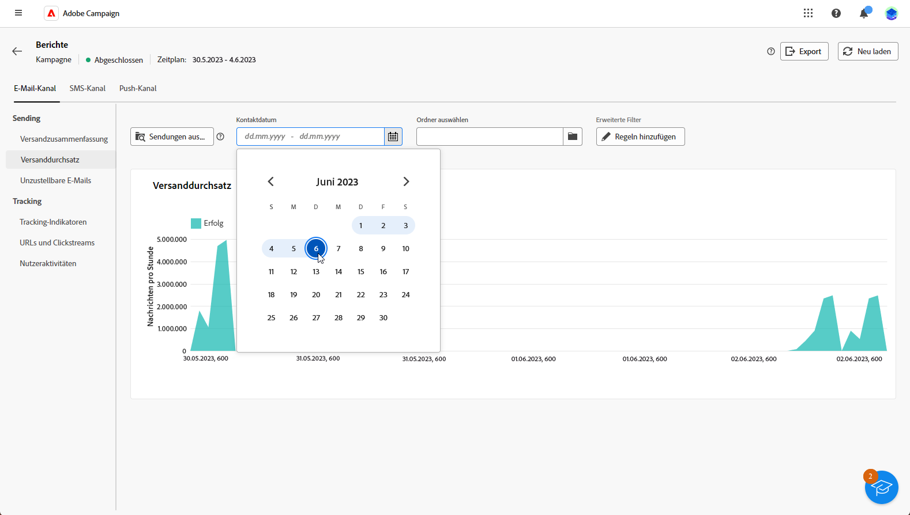

# Erste Schritte mit Kampagnenberichten {#campaign-reports}

<!-- CAN BE REMOVED___
>[!CONTEXTUALHELP]
>id="acw_campaign_reporting_sending"
>title="Reporting Sending"
>abstract="The Sending tab within your report provides in-depth insights into your visitors' interactions with your deliveries and any potential errors they may have encountered."

>[!CONTEXTUALHELP]
>id="acw_campaign_reporting_tracking"
>title="Reporting tracking"
>abstract="The Tracking tab within your report offers valuable data, including recipient behavior per link, breakdown of opens and clicks, as well as detailed information about the most frequently clicked URLs during a delivery."
-->

Die **Kampagnenberichte** bieten einen umfassenden Überblick über Ihre **Kampagne** und alle relevanten Informationen zu den verschiedenen zugehörigen Sendungen. Diese Berichte enthalten eine gründliche Analyse der Performance jedes Versands pro Kanal: Erfolgsraten, Zielgruppeninteraktion und andere wichtige Metriken. Sie ermöglichen es Ihnen, die Effektivität und Wirkung Ihrer Kampagne insgesamt zu bewerten.

Die vollständige Liste der Berichte und zugehörigen Metriken für jeden Kanal finden Sie auf den folgenden Seiten:

* [E-Mail-Kampagnenkanal](campaign-reports-email.md)
* [SMS-Kampagnenkanal](campaign-reports-sms.md)
* [Push-Kampagnenkanal](campaign-reports-push.md)
* [Briefpost-Kampagnenkanal](campaign-reports-direct-mail.md)

## Verwalten Ihres Bericht-Dashboards {#manage-reports}

Gehen Sie wie folgt vor, um auf Kampagnenberichte zuzugreifen und diese zu verwalten:

1. Navigieren Sie zum Menü **[!UICONTROL Kampagnen]**. Klicken Sie auf die Schaltfläche **Berichte** im Dashboard Ihrer Kampagne.

   {zoomable=&quot;yes&quot;}

   Alternativ können Sie auch in der Kampagnenliste auf die Schaltfläche mit den drei Punkten **Mehr Aktionen** neben dem Kampagnennamen klicken und **[!UICONTROL Bericht anzeigen]** auswählen.

   {zoomable=&quot;yes&quot;}

1. Wählen Sie im linken Menü einen Bericht aus der Liste aus und navigieren Sie durch die Registerkarte, um Daten aus den einzelnen Kanälen anzuzeigen.

   {zoomable=&quot;yes&quot;}

1. Klicken Sie in Ihrem Dashboard auf **[!UICONTROL Sendungen auswählen]**, um einen bestimmten Versand in Ihrer Kampagne auszuwählen.

1. Wählen Sie im Menü **[!UICONTROL Versanddurchsatz]** eine **Startzeit** und eine **[!UICONTROL Endzeit]** aus, um bestimmte Daten einzuschließen.

   {zoomable=&quot;yes&quot;}

1. Geben Sie im Feld **[!UICONTROL Ordner auswählen]** an, ob Sie Sendungen oder Kampagnen aus einem bestimmten Ordner als Ziel verwenden möchten.

   Sie können auch mit **[!UICONTROL Regeln hinzufügen]** Abfragen erstellen, um die Berichtsdaten besser zu filtern. [So verwenden Sie den Abfrage-Modeler](../query/query-modeler-overview.md)

   {zoomable=&quot;yes&quot;}

1. Unter **[!UICONTROL URLs und Clickstreams]** können Sie auch die Option **[!UICONTROL Am häufigsten besuchte Links]** oder **[!UICONTROL Zeitraum]** auswählen.

   Mit der Option **[!UICONTROL Anzeigen nach]** können Sie nach URLs, Bezeichnungen oder Kategorien filtern.
