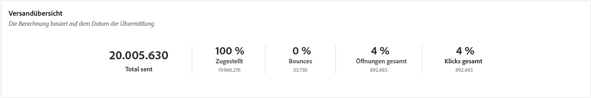
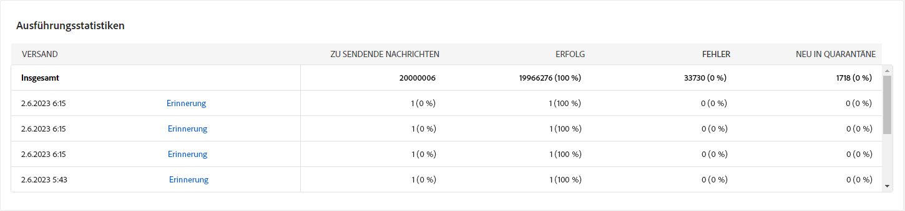
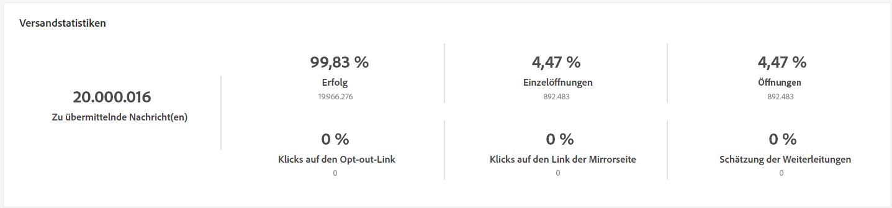

# Kampagnenberichte {#campaign-reports}

Der Kampagnenbericht ist in verschiedene Widgets unterteilt, die den Erfolg und die Fehler Ihrer Kampagne detailliert beschreiben.

Die Seite des Kampagnenberichts wird mit den folgenden Registerkarten angezeigt:

* [E-Mail-Kanal](#email-channel)
* [SMS-Kanal](#sms-channel)
* [Push-Kanal](#push-channel)

Um auf Ihren Kampagnenbericht zuzugreifen, klicken Sie im Dashboard Ihrer Kampagne auf „Berichte“.

## E-Mail-Kanal {#email-channel}

### Versandzusammenfassung {#delivery-summary-email}

* Die **[!UICONTROL Versandübersicht]** bietet wichtige Leistungsindikatoren (KPIs), die detaillierte Informationen darüber enthalten, wie Ihre Besucherinnen und Besucher mit Ihrem E-Mail-Versand interagieren.

  

  +++ Erfahren Sie mehr über die Metriken des E-Mail-Kampagnen-Berichts.

   * **[!UICONTROL Insgesamt gesendet]**: Gesamtzahl der während der Versandanalyse verarbeiteten Nachrichten.

   * **[!UICONTROL Zugestellt]**: Anzahl der erfolgreich gesendeten Nachrichten im Verhältnis zur Gesamtzahl der gesendeten Nachrichten.

   * **[!UICONTROL Bounces]**: Summe der Fehler, die beim Versand und bei der automatischen Rücksendung kumuliert wurden, bezogen auf die Gesamtzahl der gesendeten Nachrichten.

   * **[!UICONTROL Unterschiedliche Öffnungen (Unique Opens)]**: Gesamtzahl der Zielgruppenempfängerinnen und -empfänger, die mindestens einmal eine Nachricht geöffnet haben.

   * **[!UICONTROL Unterschiedliche Klicks (Unique Clicks)]**: Gesamtzahl der unterschiedlichen Empfängerinnen und Empfänger, die einen Versand mindestens einmal angeklickt haben.

+++

* Die Tabelle **[!UICONTROL Ursprüngliche Zielgruppenstatistiken]** zeigt Daten zu Ihren Empfängerinnen und Empfängern an:

  

  +++ Erfahren Sie mehr über die Metriken des E-Mail-Kampagnen-Berichts.

   * **[!UICONTROL Ursprüngliche Zielgruppe]**: Gesamtzahl der Zielgruppenempfängerinnen und -empfänger.

   * **[!UICONTROL Zu versendende Nachricht]**: Gesamtzahl der nach erfolgter Versandanalyse zu versendenden Nachrichten.

   * **[!UICONTROL Aufgrund von Regeln abgelehnt]**: Gesamtzahl der Adressen, die während der Analyse beim Anwenden von Regeln ignoriert wurden: fehlende Adresse, in Quarantäne, auf Blockierungsliste usw.

+++

* Die Tabelle **[!UICONTROL Ausführungsstatistiken]** zeigt den Erfolg Ihres Versands im Detail.

  

  +++ Erfahren Sie mehr über die Metriken des E-Mail-Kampagnen-Berichts.

   * **[!UICONTROL Zu versendende Nachricht]**: Gesamtzahl der nach erfolgter Versandanalyse zu versendenden Nachrichten.

   * **[!UICONTROL Erfolg]**: Anzahl der erfolgreich verarbeiteten Nachrichten im Verhältnis zur Anzahl der zu versendenden Nachrichten.

   * **[!UICONTROL Fehler]**: Gesamtzahl der über alle Sendungen hinweg kumulierten Fehler und der automatischen Bounce-Verarbeitungen im Verhältnis zur Anzahl der zu versendenden Nachrichten.

   * **[!UICONTROL Neue Quarantänen]**: Gesamtzahl der Adressen, die infolge eines fehlgeschlagenen Versands unter Quarantäne gestellt wurden (unbekannter Nutzer, ungültige Domain), im Verhältnis zur Anzahl der zu versendenden Nachrichten.

+++

* Die Tabelle **[!UICONTROL Reaktionsstatistiken]** enthält die verfügbaren Daten zur Empfängeraktivität für Ihren Versand.

  

  +++ Erfahren Sie mehr über die Metriken des E-Mail-Kampagnen-Berichts.

   * **[!UICONTROL Unterschiedliche Öffnungen (Unique Opens)]**: Gesamtzahl der Zielgruppenempfängerinnen und -empfänger, die mindestens einmal eine Nachricht geöffnet haben.

   * **[!UICONTROL Öffnungen]**: Anzahl der unterschiedlichen Zielgruppenempfängerinnen und -empfänger dieser Domain, die mindestens einmal eine Nachricht geöffnet haben.

   * **[!UICONTROL Abmeldungen]**: Anzahl der Empfängerinnen und Empfänger, die in dem betreffenden Zeitraum auf Abmeldungen geklickt haben

   * **[!UICONTROL Mirrorseite]**: Anzahl der Empfängerinnen und Empfänger, die auf den Link zur Mirrorseite geklickt haben.

   * **[!UICONTROL Weiterleitungen]**: Anzahl der Empfängerinnen und Empfänger, die die E-Mail weitergeleitet haben.
+++

* Die Tabelle **[!UICONTROL Erzeugte Clickstreams]** zeigt Daten dazu an, wie Ihre Empfängerinnen und Empfänger mit Ihrem Versand interagiert haben.

  

  +++ Erfahren Sie mehr über die Metriken des E-Mail-Kampagnen-Berichts.

   * **[!UICONTROL Unterschiedliche Klicks (Unique Clicks)]**: Gesamtzahl der unterschiedlichen Empfängerinnen und Empfänger, die einen Versand mindestens einmal angeklickt haben.

   * **[!UICONTROL Klicks]**: Gesamtzahl der Klicks auf Links in Sendungen.

   * **[!UICONTROL Reaktionsrate]**: Verhältnis der Anzahl an Zielgruppenempfängerinnen und -empfängern, die auf einen Versand geklickt haben, in Bezug zur geschätzten Anzahl der Zielgruppenempfängerinnen und -empfänger, die einen Versand geöffnet haben.

+++

### Unzustellbare Nachrichten {#non-deliverables-email}

* Die Tabellen und Diagramme **[!UICONTROL Aufschlüsselung der Fehler nach Typ]** und **[!UICONTROL Aufschlüsselung der Fehler nach Domain]** enthalten die verfügbaren Daten zu möglichen Fehlern, die bei jeder Domain aufgetreten sind.

  Die in diesem Bericht angezeigten Fehler lösen einen Quarantäneprozess aus. Weitere Informationen zur Quarantäneverwaltung finden Sie in der [Dokumentation zu Campaign v8 (Konsole)](https://experienceleague.adobe.com/docs/campaign/campaign-v8/campaigns/send/failures/delivery-failures.html?lang=de){target="_blank"}.

  

  +++ Erfahren Sie mehr über die Metriken des E-Mail-Kampagnen-Berichts.

   * **[!UICONTROL Unbekannter Nutzer]**: Fehlertyp, der während des Versands erzeugt wird, um anzuzeigen, dass die E-Mail-Adresse ungültig ist.

   * **[!UICONTROL Ungültige Domain]**: Fehlertyp, der beim Senden eines Versands erzeugt wird, um anzuzeigen, dass die Domain der E-Mail-Adresse falsch ist oder nicht existiert.

   * **[!UICONTROL Postfach voll]**: Fehlertyp, der nach fünf fehlgeschlagenen Zustellversuchen erzeugt wird, wenn das Postfach zu viele Nachrichten enthält.

   * **[!UICONTROL Account deaktiviert]**: Fehlertyp, der beim Senden eines Versands erzeugt wird, um anzuzeigen, dass die Adresse nicht mehr existiert.

   * **[!UICONTROL Verweigert]**: Fehlertyp, der erzeugt wird, wenn eine Adresse vom IAP (Internet Access Provider) abgelehnt wird, z. B. nach Anwendung einer Sicherheitsregel (Anti-Spam-Software).

   * **[!UICONTROL Unerreichbar]**: Fehlertyp, der in der Verteilungskette der Nachricht auftritt: Vorfall im SMTP-Relais, Domain vorübergehend unerreichbar, usw.

   * **[!UICONTROL Nicht angemeldet]**: Fehlertyp, wenn das Mobiltelefon der Empfängerin bzw. des Empfängers zum Zeitpunkt des Versands ausgeschaltet war oder über keinen Netzempfang verfügte.

+++

### Tracking-Indikatoren {#tracking-indicators-email}

* **[!UICONTROL Versandstatistiken]** bieten wichtige Leistungsindikatoren (KPIs), die detaillierte Informationen zu den für gesendete E-Mails verfügbaren Daten enthalten.

  

  +++ Erfahren Sie mehr über die Metriken des E-Mail-Kampagnen-Berichts.

   * **[!UICONTROL Erfolg]**: Anzahl der erfolgreich verarbeiteten Nachrichten im Verhältnis zur Anzahl der zu versendenden Nachrichten.

   * **[!UICONTROL Unterschiedliche Öffnungen (Unique Opens)]**: Gesamtzahl der Zielgruppenempfängerinnen und -empfänger, die mindestens einmal eine Nachricht geöffnet haben.

   * **[!UICONTROL Öffnungen]**: Anzahl der unterschiedlichen Zielgruppenempfängerinnen und -empfänger dieser Domain, die mindestens einmal eine Nachricht geöffnet haben.

   * **[!UICONTROL Klicks auf den Abmelde-Link]**: Anzahl der Klicks auf den Abmelde-Link.

   * **[!UICONTROL Klicks auf den Mirror-Link]**: Anzahl der Klicks auf den Link der Mirrorseite.

   * **[!UICONTROL Schätzung der Weiterleitungen]**: Schätzung der Anzahl der E-Mails, die von den Zielgruppenempfängerinnen und -empfängern weitergeleitet werden.
+++

* Die Tabelle **[!UICONTROL Ursprüngliche Zielgruppenstatistiken]** zeigt Daten zu Ihren Empfängerinnen und Empfängern an:

  

  +++ Erfahren Sie mehr über die Metriken des E-Mail-Kampagnen-Berichts.

   * **[!UICONTROL Gesendet]**: Gesamtzahl der gesendeten Nachrichten.

   * **[!UICONTROL Beschwerden]**: Anzahl der Nachrichten für diese Domain, die von der Empfängerin oder vom Empfänger als unerwünscht gemeldet wurden.

   * **[!UICONTROL Öffnungen]**: Anzahl der unterschiedlichen Zielgruppenempfängerinnen und -empfänger dieser Domain, die mindestens einmal eine Nachricht geöffnet haben.

   * **[!UICONTROL Klicks]**: Anzahl der unterschiedlichen Zielgruppenempfängerinnen und -empfänger, die mindestens einmal in einem Versand geklickt haben.

   * **[!UICONTROL Brutto-Reaktionsrate]**: Prozentualer Anteil der Empfängerinnen und Empfänger, die mindestens einmal in einem Versand geklickt haben, in Bezug auf die Empfängerinnen und Empfänger, die mindestens einmal einen Versand geöffnet haben.
+++

### URLs und Clickstreams {#url-email}

* **[!UICONTROL URLs und Clickstreams]**: Bietet wichtige Leistungsindikatoren (KPIs), die detaillierte Informationen zu den URLs enthalten, auf die während eines Versands am häufigsten geklickt wurde.

  

  +++ Erfahren Sie mehr über die Metriken des E-Mail-Kampagnen-Berichts.

   * **[!UICONTROL Reaktionsrate]**: Verhältnis der Anzahl an Zielgruppenempfängerinnen und -empfängern, die auf einen Versand geklickt haben, in Bezug zur geschätzten Anzahl der Zielgruppenempfängerinnen und -empfänger, die einen Versand geöffnet haben.

   * **[!UICONTROL Unterschiedliche Klicks (Unique Clicks)]**: Gesamtzahl der unterschiedlichen Empfängerinnen und Empfänger, die einen Versand mindestens einmal angeklickt haben.

   * **[!UICONTROL Klicks]**: Gesamtzahl der Klicks auf Links in Sendungen.

   * **[!UICONTROL Plattform-Durchschnitt]**: Dieser unter jeder Rate (Reaktivität, Unique Clicks und Klicks insgesamt) angezeigte Wert bezieht sich auf die Gesamtheit der in den letzten sechs Monaten gesendeten Sendungen. Nur Sendungen, die dieselbe Typologie aufweisen und die auf demselben Kanal gesendet wurden, werden berücksichtigt. Testsendungen sind von der Statistik ausgenommen.
+++

* **[!UICONTROL Die 10 meistbesuchten Links]**: Diagramm und Tabelle mit den verfügbaren Daten für das Empfängerverhalten pro Link.

  

  +++ Erfahren Sie mehr über die Metriken des E-Mail-Kampagnen-Berichts.

   * **[!UICONTROL Klicks]**: Gesamtzahl der Klicks auf Links in Sendungen.

   * **[!UICONTROL Prozentsatz]**: Prozentsatz der Benutzerinnen und Benutzer, die mit dem Versand interagiert haben

+++

* **[!UICONTROL Aufschlüsselung der Klicks im Zeitverlauf]**: Das Diagramm enthält die verfügbaren Daten zum Empfängerverhalten pro Link.

  

### Benutzeraktivitäten {#user-activities-email}

* **[!UICONTROL Benutzeraktivitäten]**: Zeigt die Aufschlüsselung der Öffnungen und Klicks in Form eines Diagramms.

  

  +++ Erfahren Sie mehr über die Metriken des E-Mail-Kampagnen-Berichts.

   * **[!UICONTROL Klicks]**: Gesamtzahl der Klicks auf Links in Sendungen.

   * **[!UICONTROL Öffnungen]**: Anzahl der unterschiedlichen Zielgruppenempfängerinnen und -empfänger dieser Domain, die mindestens einmal eine Nachricht geöffnet haben.

+++

## SMS-Kanal {#sms-channel}

### Versandzusammenfassung {#delivery-summary-sms}

* Die **[!UICONTROL Versandübersicht]** bietet wichtige Leistungsindikatoren (KPIs), die detaillierte Informationen darüber enthalten, wie Ihre Besucherinnen und Besucher mit Ihrem SMS-Versand interagieren.

  

  +++ Erfahren Sie mehr über die Metriken des SMS-Kampagnenberichts.

   * **[!UICONTROL Insgesamt gesendet]**: Gesamtzahl der während der Versandanalyse verarbeiteten Nachrichten.

   * **[!UICONTROL Zugestellt]**: Anzahl der erfolgreich gesendeten Nachrichten im Verhältnis zur Gesamtzahl der gesendeten Nachrichten.

   * **[!UICONTROL Fehler]**: Summe der Fehler, die beim Versand und bei der automatischen Rücksendung kumuliert wurden, bezogen auf die Gesamtzahl der gesendeten Nachrichten.

   * **[!UICONTROL Unterschiedliche Klicks (Unique Clicks)]**: Gesamtzahl der unterschiedlichen Empfängerinnen und Empfänger, die einen Versand mindestens einmal angeklickt haben.

+++

* Die Tabelle **[!UICONTROL Ursprüngliche Zielgruppenstatistiken]** zeigt Daten zu Ihren Empfängerinnen und Empfängern an:

  

  +++ Erfahren Sie mehr über die Metriken des SMS-Kampagnenberichts.

   * **[!UICONTROL Ursprüngliche Zielgruppe]**: Gesamtzahl der Zielgruppenempfängerinnen und -empfänger.

   * **[!UICONTROL Zu versendende Nachricht]**: Gesamtzahl der nach erfolgter Versandanalyse zu versendenden Nachrichten.

   * **[!UICONTROL Aufgrund von Regeln abgelehnt]**: Gesamtzahl der Adressen, die während der Analyse beim Anwenden von Regeln ignoriert wurden: fehlende Adresse, in Quarantäne, auf Blockierungsliste usw.

+++

* Die Tabelle **[!UICONTROL Ausführungsstatistiken]** zeigt den Erfolg Ihres Versands im Detail.

  

  +++ Erfahren Sie mehr über die Metriken des SMS-Kampagnenberichts.

   * **[!UICONTROL Zu versendende Nachricht]**: Gesamtzahl der nach erfolgter Versandanalyse zu versendenden Nachrichten.

   * **[!UICONTROL Erfolg]**: Anzahl der erfolgreich verarbeiteten Nachrichten im Verhältnis zur Anzahl der zu versendenden Nachrichten.

   * **[!UICONTROL Fehler]**: Gesamtzahl der über alle Sendungen hinweg kumulierten Fehler und der automatischen Bounce-Verarbeitungen im Verhältnis zur Anzahl der zu versendenden Nachrichten.

   * **[!UICONTROL Neue Quarantänen]**: Gesamtzahl der Adressen, die infolge eines fehlgeschlagenen Versands unter Quarantäne gestellt wurden (unbekannter Nutzer, ungültige Domain), im Verhältnis zur Anzahl der zu versendenden Nachrichten.

+++

* Die Tabelle **[!UICONTROL Erzeugte Clickstreams]** zeigt Daten dazu an, wie Ihre Empfängerinnen und Empfänger mit Ihrem Versand interagiert haben:

  

  +++ Erfahren Sie mehr über die Metriken des SMS-Kampagnenberichts.

   * **[!UICONTROL Unterschiedliche Klicks (Unique Clicks)]**: Gesamtzahl der unterschiedlichen Empfängerinnen und Empfänger, die einen Versand mindestens einmal angeklickt haben.

   * **[!UICONTROL Klicks]**: Gesamtzahl der Klicks auf Links in Sendungen.

   * **[!UICONTROL Reaktionsrate]**: Verhältnis der Anzahl an Zielgruppenempfängerinnen und -empfängern, die auf einen Versand geklickt haben, in Bezug zur geschätzten Anzahl der Zielgruppenempfängerinnen und -empfänger, die einen Versand geöffnet haben.

+++

## Push-Kanal {#push-channel}

### Versandzusammenfassung {#delivery-summary-push}

* **[!UICONTROL Versandübersicht]**: bietet wichtige Leistungsindikatoren (KPIs), die detaillierte Informationen darüber enthalten, wie Ihre Besucherinnen und Besucher mit Ihrem Push-Benachrichtigungs-Versand interagieren.

  +++ Erfahren Sie mehr über die Metriken des Push-Kampagnenberichts.

   * **[!UICONTROL Insgesamt gesendet]**: Gesamtzahl der während der Versandanalyse verarbeiteten Nachrichten.

   * **[!UICONTROL Zugestellt]**: Anzahl der erfolgreich gesendeten Nachrichten im Verhältnis zur Gesamtzahl der gesendeten Nachrichten.

   * **[!UICONTROL Fehler]**: Summe der Fehler, die beim Versand und bei der automatischen Rücksendung kumuliert wurden, bezogen auf die Gesamtzahl der gesendeten Nachrichten.

   * **[!UICONTROL Unterschiedliche Klicks (Unique Clicks)]**: Gesamtzahl der unterschiedlichen Empfängerinnen und Empfänger, die einen Versand mindestens einmal angeklickt haben.

+++

* Die Tabelle **[!UICONTROL Ursprüngliche Zielgruppenstatistiken]** zeigt Daten zu Ihren Empfängerinnen und Empfängern an:

  +++ Erfahren Sie mehr über die Metriken des Push-Kampagnenberichts.

   * **[!UICONTROL Ursprüngliche Zielgruppe]**: Gesamtzahl der Zielgruppenempfängerinnen und -empfänger.

   * **[!UICONTROL Zu versendende Nachricht]**: Gesamtzahl der nach erfolgter Versandanalyse zu versendenden Nachrichten.

   * **[!UICONTROL Aufgrund von Regeln abgelehnt]**: Gesamtzahl der Adressen, die während der Analyse beim Anwenden von Regeln ignoriert wurden: fehlende Adresse, in Quarantäne, auf Blockierungsliste usw.

+++

* Die Tabelle **[!UICONTROL Ausführungsstatistiken]** zeigt den Erfolg Ihres Versands im Detail.

  +++ Erfahren Sie mehr über die Metriken des Push-Kampagnenberichts.

   * **[!UICONTROL Zu versendende Nachricht]**: Gesamtzahl der nach erfolgter Versandanalyse zu versendenden Nachrichten.

   * **[!UICONTROL Erfolg]**: Anzahl der erfolgreich verarbeiteten Nachrichten im Verhältnis zur Anzahl der zu versendenden Nachrichten.

   * **[!UICONTROL Fehler]**: Gesamtzahl der über alle Sendungen hinweg kumulierten Fehler und der automatischen Bounce-Verarbeitungen im Verhältnis zur Anzahl der zu versendenden Nachrichten.

   * **[!UICONTROL Neue Quarantänen]**: Gesamtzahl der Adressen, die infolge eines fehlgeschlagenen Versands unter Quarantäne gestellt wurden (unbekannter Nutzer, ungültige Domain), im Verhältnis zur Anzahl der zu versendenden Nachrichten.

+++

* Die Tabelle **[!UICONTROL Erzeugte Clickstreams]** zeigt Daten dazu an, wie Ihre Empfängerinnen und Empfänger mit Ihrem Versand interagiert haben:

  +++ Erfahren Sie mehr über die Metriken des Push-Kampagnenberichts.

   * **[!UICONTROL Unterschiedliche Klicks (Unique Clicks)]**: Gesamtzahl der unterschiedlichen Empfängerinnen und Empfänger, die einen Versand mindestens einmal angeklickt haben.

   * **[!UICONTROL Klicks]**: Gesamtzahl der Klicks auf Links in Sendungen.

   * **[!UICONTROL Reaktionsrate]**: Verhältnis der Anzahl an Zielgruppenempfängerinnen und -empfängern, die auf einen Versand geklickt haben, in Bezug zur geschätzten Anzahl der Zielgruppenempfängerinnen und -empfänger, die einen Versand geöffnet haben.

+++
