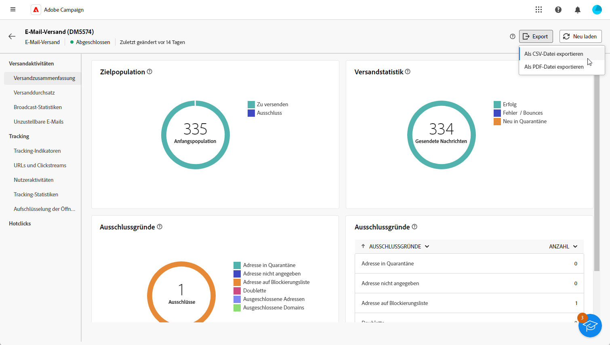

# Erste Schritte mit Versandberichten {#reports}

>[!CONTEXTUALHELP]
>id="acw_campaign_reporting_deliveries_selection"
>title="Aggregierte Berichte für Sendungen"
>abstract="Wählen Sie mindestens zwei Sendungen aus, um einen aggregierten Datenbericht anzuzeigen."

>[!CONTEXTUALHELP]
>id="acw_reporting_email_exportation"
>title="Exportieren"
>abstract="Auf die Schaltfläche **Exportieren** klicken, um diese Metriken in PDF- oder CSV-Formaten zu exportieren, sodass sie freigegeben oder gedruckt werden können."

Die **Versandberichte** bietet umfassende Einblicke und Daten, die ausschließlich auf Ihre **Sendungen** über jeden Kanal hinweg. Diese Berichte enthalten detaillierte Informationen über Leistung, Effektivität und Ergebnisse Ihrer einzelnen Sendungen und verschaffen Ihnen einen umfassenden Überblick.

Die vollständige Liste der Berichte und zugehörigen Metriken für jeden Kanal finden Sie auf den folgenden Seiten:

* [E-Mail-Versandberichte](email-report.md)
* [SMS-Versandberichte](sms-report.md)
* [Push-Versandberichte](push-report.md)

## Bericht-Dashboard verwalten {#manage-reports}

Adobe Campaign bietet verschiedene Berichtstypen für jeden Versand. Mit diesen Berichten können Sie die Wirkung und Leistung Ihrer Nachrichten in einem integrierten Dashboard messen und visualisieren.

Gehen Sie wie folgt vor, um Berichte anzuzeigen und zu verwalten:

1. Um einen Bericht für einen bestimmten Versand zu erstellen, navigieren Sie zum Menü **[!UICONTROL Sendungen]** und wählen Sie den Versand aus, für den Sie einen Bericht erstellen möchten.

1. Klicken Sie in Ihrem **[!UICONTROL Versand]**-Dashboard auf **[!UICONTROL Berichte]**.

   

   Alternativ können Sie die drei Punkte verwenden **Mehr Aktionen** neben dem Versandnamen in der Versandliste und wählen Sie **[!UICONTROL Bericht anzeigen]**.

   {width="50%" zoomable="yes"}

1. Wählen Sie im linken Menü einen Bericht aus der Liste aus.

   

1. Wenn Ihr Versand wiederkehrend ist, können Sie einen bestimmten Versand auswählen, zu dem ein Bericht erstellt werden soll, indem Sie auf **[!UICONTROL Sendungen auswählen]** klicken.

   Sie können auch einen Zeitraum auf Ihren Bericht anwenden, indem Sie das **[!UICONTROL Kontaktdatum]** auswählen.

   

1. Aus dem **[!UICONTROL URLs und Clickstreams]** können Sie auch die **[!UICONTROL Top besuchte Links]** oder **[!UICONTROL Zeitraum]**.

   Die **[!UICONTROL Anzeigen nach]** -Optionen ermöglichen das Filtern nach URLs, Bezeichnungen oder Kategorien.

   

## Exportieren der Berichte {#export-reports}

Sie können Ihre verschiedenen Berichte einfach in das PDF- oder CSV-Format exportieren, sodass Sie sie freigeben, bearbeiten oder drucken können.

1. Klicken Sie in Ihrem Bericht auf **[!UICONTROL Export]** und wählen **[!UICONTROL Als PDF-Datei exportieren]** oder **[!UICONTROL Als CSV-Datei exportieren]**.

   

1. Suchen Sie den Ordner, in dem Sie die Datei speichern möchten, benennen Sie sie bei Bedarf um und klicken Sie auf **[!UICONTROL Speichern]**.

Ihr Bericht kann jetzt in einer PDF- oder CSV-Datei angezeigt oder freigegeben werden.

