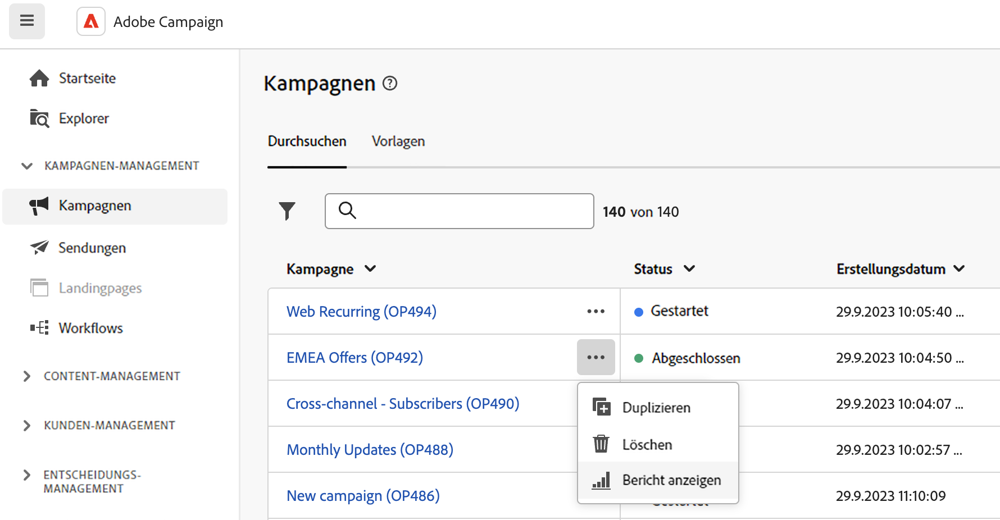

# Zugreifen auf Versandberichte {#reports}

>[!CONTEXTUALHELP]
>id="acw_campaign_reporting_deliveries_selection"
>title="Aggregierte Berichte für Sendungen"
>abstract="Wählen Sie mindestens zwei Sendungen aus, um einen aggregierten Datenbericht anzuzeigen."

>[!CONTEXTUALHELP]
>id="acw_reporting_email_exportation"
>title="Exportieren"
>abstract="Auf die Schaltfläche **Exportieren** klicken, um diese Metriken in PDF- oder CSV-Formaten zu exportieren, sodass sie freigegeben oder gedruckt werden können. "

Adobe Campaign bietet verschiedene Berichtstypen für jeden Versand. Mit diesen Berichten können Sie die Wirkung und Leistung Ihrer Nachrichten in einem integrierten Dashboard messen und visualisieren.

Führen Sie folgende Schritte aus, um Berichte anzuzeigen:

1. Um einen Bericht für einen bestimmten Versand zu erstellen, navigieren Sie zum Menü **[!UICONTROL Sendungen]** und wählen Sie den Versand aus, für den Sie einen Bericht erstellen möchten.

1. Klicken Sie in Ihrem **[!UICONTROL Versand]**-Dashboard auf **[!UICONTROL Berichte]**.

   

   Alternativ können Sie die Schaltfläche mit den drei Punkten **Mehr Aktionen** neben dem Versandnamen in der Kampagnenliste verwenden, wie unten dargestellt:

   {width="50%" align="left" zoomable="yes"}

1. Wählen Sie im linken Menü einen Bericht aus der Liste aus.

   

1. Wenn Ihr Versand wiederkehrend ist, können Sie einen bestimmten Versand auswählen, zu dem ein Bericht erstellt werden soll, indem Sie auf **[!UICONTROL Sendungen auswählen]** klicken.

   Sie können auch einen Zeitraum auf Ihren Bericht anwenden, indem Sie das **[!UICONTROL Kontaktdatum]** auswählen.

   

Die vollständige Liste der Berichte und zugehörigen Metriken für jeden Kanal finden Sie auf den folgenden Seiten:

* [E-Mail-Versandberichte](email-report.md)
* [SMS-Versandberichte](sms-report.md)
* [Push-Versandberichte](push-report.md)
