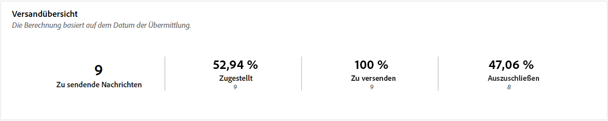
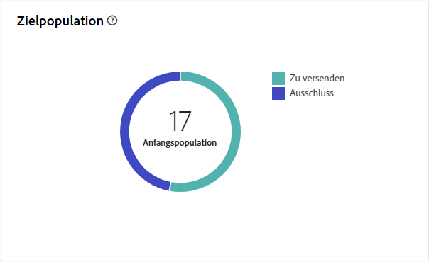
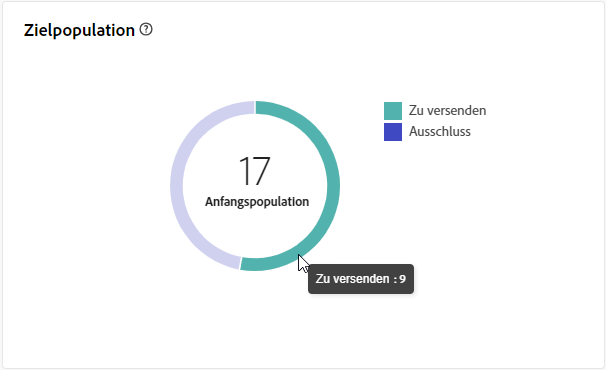
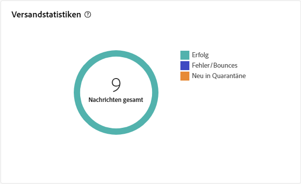
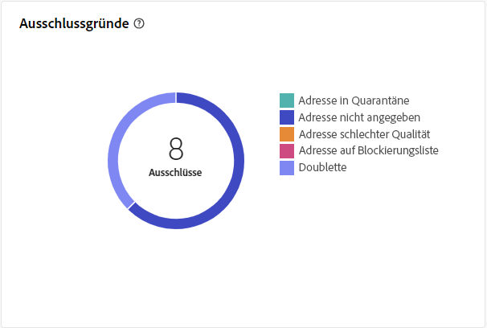
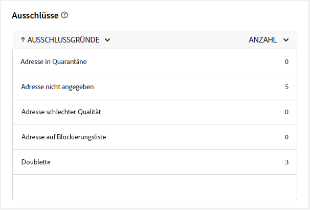

# Briefpost-Versandbericht {#direct-mail-report}

Die **Briefpost-Versandbericht** bietet umfassende Einblicke und Daten, die für Ihren Briefpost-Versand spezifisch sind. Er bietet detaillierte Informationen über Performance, Effektivität und Ergebnisse Ihrer einzelnen Sendungen und verschafft Ihnen einen umfassenden Überblick.

## Versandzusammenfassung {#delivery-summary-direct-mail}

### Versandübersicht {#delivery-overview-direct-mail}

>[!CONTEXTUALHELP]
>id="acw_delivery_reporting_delivery_overview_direct_mail"
>title="Versandübersicht"
>abstract="Die **Versandübersicht** präsentiert wichtige Leistungsmetriken (KPIs) mit umfassenden Einblicken in die Interaktion Ihrer Besucher mit jedem Briefpost-Versand. Die Metriken sind unten dargestellt."

Die **[!UICONTROL Versandübersicht]** bietet detaillierte Einblicke in die Interaktion Ihrer Besucher mit jedem Briefpost-Versand und zeigt wichtige KPIs (Key Performance Metrics).  Die Metriken sind unten dargestellt.

{zoomable=&quot;yes&quot;}{align="center"}

+++Erfahren Sie mehr über Versandübersichtsmetriken.

* **[!UICONTROL Zu sendende Nachrichten]**: Gesamtzahl der während der Versandvorbereitung verarbeiteten Nachrichten.

* **[!UICONTROL Targeting]**: Anzahl der Benutzerprofile, die als Zielprofile für Ihre Briefpost-Nachrichten gelten.

* **[!UICONTROL Ausschließen]**: Anzahl der Benutzerprofile, die von den Zielgruppenprofilen ausgeschlossen sind und Ihre Briefpost-Nachrichten nicht erhalten.
+++

### Anfängliche Zielgruppenpopulation {#direct-mail-delivery-targeted-population}

>[!CONTEXTUALHELP]
>id="acw_delivery_reporting_initial_target_direct_mail"
>title="Anfängliche Zielgruppenpopulation"
>abstract="Der Graph **Anfängliche Zielgruppenpopulation** zeigt Daten zu Ihren Empfängerinnen und Empfängern sowie Nachrichten basierend auf den Ergebnissen der Versandvorbereitung an."

Der Graph **[!UICONTROL Anfängliche Zielgruppenpopulation]** zeigt Daten zu Ihren Empfängerinnen und Empfängern an. Die Metriken werden bei der Versandvorbereitung berechnet und zeigen: die anfängliche Zielgruppe, die Anzahl der zu sendenden Nachrichten und die Anzahl der ausgeschlossenen Empfängerinnen und Empfänger.

{zoomable=&quot;yes&quot;}

Bewegen Sie den Mauszeiger über einen Abschnitt des Graphen, um die genaue Zahl anzuzeigen.

{zoomable=&quot;yes&quot;}

+++ Erfahren Sie mehr über die Metriken des Berichts zum Briefpostversand.

* **[!UICONTROL Ursprüngliche Zielgruppe]**: Gesamtzahl der Zielgruppenempfängerinnen und -empfänger.

* **[!UICONTROL Zu versenden]**: Gesamtzahl der nach erfolgter Versandanalyse zu versendenden Nachrichten.

* **[!UICONTROL Ausschluss]**: Gesamtzahl der vom Versand an die Zielgruppe ausgeschlossenen Nachrichten.
+++

### Versandstatistiken {#direct-mail-delivery-stats}

>[!CONTEXTUALHELP]
>id="acw_delivery_reporting_delivery_statistics_summary_direct_mail"
>title="Versandstatistiken"
>abstract="Die **Versandstatistiken** -Diagramm zeigt den Erfolg Ihres Briefpost-Versands und die aufgetretenen Fehler."

Die **[!UICONTROL Versandstatistiken]** -Diagramm bietet einen umfassenden Überblick über Ihre Versandleistung und bietet detaillierte Metriken zur Messung von Erfolg und Effektivität.

{zoomable=&quot;yes&quot;}

+++ Erfahren Sie mehr über die Metriken des Berichts &quot;Briefpost-Kampagne&quot;.

* **[!UICONTROL Gesendete Nachricht]**: Gesamtzahl der nach erfolgter Versandvorbereitung zu versendenden Nachrichten.

* **[!UICONTROL Erfolg]**: Anzahl der erfolgreich verarbeiteten Nachrichten im Verhältnis zur Anzahl der zu versendenden Nachrichten.

* **[!UICONTROL Fehler]**: Gesamtzahl der über alle Sendungen hinweg kumulierten Fehler und der automatischen Bounce-Verarbeitungen im Verhältnis zur Anzahl der zu versendenden Nachrichten.

* **[!UICONTROL Neue Quarantänen]**: Gesamtzahl der Adressen, die infolge eines fehlgeschlagenen Versands unter Quarantäne gestellt wurden (unbekannter Nutzer, ungültige Domain), im Verhältnis zur Anzahl der zu versendenden Nachrichten.

+++

### Ausschlussgründe {#direct-mail-delivery-exclusions}

>[!CONTEXTUALHELP]
>id="acw_delivery_reporting_causes_exclusion_direct_mail"
>title="Versand – Ausschlussgründe"
>abstract="Die **Ausschlussgründe** Diagramm zeigt die Verteilung der zurückgewiesenen Nachrichten während der Versandvorbereitung, kategorisiert nach jeder Regel."

Die **[!UICONTROL Ausschlussgründe]** Das Diagramm bietet eine detaillierte Auflistung der Gründe für die Ablehnung von Nachrichten während der Versandvorbereitung. Diese Aufschlüsselung erfolgt nach verschiedenen Regeln und bietet einen umfassenden Überblick über die Faktoren, die zum Ausschluss einer Nachricht beitragen. Ausschlussregeln werden in der[Dokumentation zu Campaign v8 (Konsole)](https://experienceleague.adobe.com/docs/campaign/campaign-v8/send/failures/delivery-failures.html?lang=de#email-error-types){_blank} detailliert beschrieben.

{zoomable=&quot;yes&quot;}{align="center" zoomable="yes"}

+++ Erfahren Sie mehr über Ursachen für Ausschlussmetriken.

* **[!UICONTROL Adresse in Quarantäne]**: Fehler, der erzeugt wird, wenn eine Adresse unter Quarantäne gestellt wird.

* **[!UICONTROL Adresse nicht angegeben]**: Fehler, der beim Versand erzeugt wird, um anzugeben, dass die Adresse nicht vorhanden ist.

* **[!UICONTROL Adresse schlechter Qualität]**: Fehler, der erzeugt wird, wenn die Qualität der Postanschrift zu niedrig ist.

* **[!UICONTROL Auf die Blockierungsliste gesetzt Adresse]**: Fehler, der erzeugt wurde, wenn der Empfänger zum Zeitpunkt der Versanddurchführung auf die Blockierungsliste gesetzt wurde.

* **[!UICONTROL Double]**: Fehler, der erzeugt wurde, wenn der Empfänger ausgeschlossen wurde, da seine Schlüsselwerte nicht eindeutig waren.

* **[!UICONTROL Kontrollgruppe]**: Die Adresse des Empfängers ist Teil der Kontrollgruppe.

* **[!UICONTROL Größe der Zielgruppe begrenzt]**: Die maximale Versandgröße wurde für den Empfänger erreicht.

+++

### Ausschlüsse {#direct-mail-exclusions}

>[!CONTEXTUALHELP]
>id="acw_delivery_reporting_exclusions_direct_mail"
>title="Ausschlüsse"
>abstract="Die **[!UICONTROL Ausnahmen]** zeigt eine detaillierte Aufschlüsselung der während der Versandvorbereitung zurückgewiesenen Nachrichten nach Regeln an."

Die **[!UICONTROL Ausnahmen]** bietet eine detaillierte Aufschlüsselung der Nachrichten, die in der Vorbereitungsphase des Versands zurückgewiesen wurden (nach bestimmten Regeln geordnet). Diese umfassende Aufschlüsselung ermöglicht ein klares Verständnis der Gründe für den Ausschluss dieser Nachrichten aus dem Versandprozess.

{zoomable=&quot;yes&quot;}{align="center" zoomable="yes"}

Die verfügbaren Metriken sind mit denen der Variablen [Ausschlussgründe](#direct-mail-delivery-exclusions) weiter oben beschrieben.
