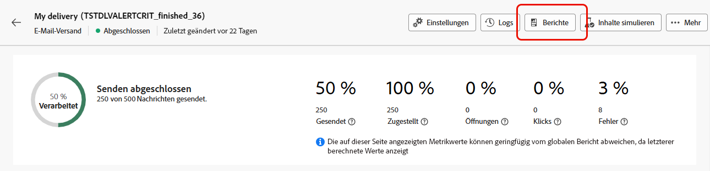

# Erste Schritte mit dynamischen Berichten {#about-dynamic-reports}

Die dynamische Berichterstellung ermöglicht vollständig anpassbare und in Echtzeit aktualisierte Berichte. Durch sie kann auf Profildaten zugegriffen werden, was die demografische Analyse nach Profildimensionen wie Geschlecht, Stadt und Alter sowie nach Daten von E-Mail-Kampagnen wie Öffnungen und Klicks ermöglicht. Mit der Drag &amp; Drop-Funktion können Sie Daten analysieren sowie feststellen, wie Ihre E-Mail-Kampagnen bei Ihren wichtigsten Kundensegmenten angekommen sind, und ihre Wirkung auf die Empfänger messen.

## Zugriff auf dynamische Berichte {#accessing-dynamic-reports}

Der Zugriff auf Berichte erfolgt in jeder Kampagne und jedem Versand durch Klicken auf **Berichte**. Ein Popup-Fenster wird angezeigt, das Sie darüber informiert, dass Sie auf **neuen Browser-Registerkarte** Seite „Dynamischer Bericht“ weitergeleitet werden.

Gewisse Berichte stehen mitunter nicht unmittelbar nach einem Versand zur Verfügung, was von der Dauer der Datenerhebung und Informationsverarbeitung abhängt.

Es gibt zwei Kategorien von dynamischen Berichten:

* **Vorlagen** können geändert werden, indem sie ausgehend von der Vorlage mit der Option **Speichern als** (**Projekt > Speichern als…**) kopiert werden.
* **Benutzerdefinierte Berichte** (blau) können direkt durch die Auswahl der Schaltfläche **Neues Projekt erstellen** auf der **Berichte**-Startseite erstellt werden.

