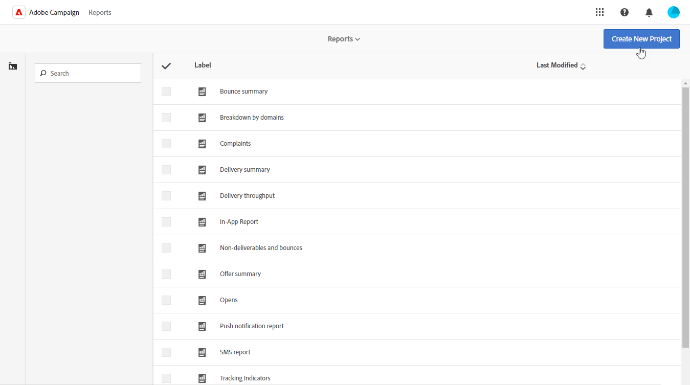

# Erstellen einer benutzerdefinierten Profildimension{#creating-a-custom-profile-dimension}

Berichte können auch basierend auf Profildaten erstellt und verwaltet werden, die während der Erweiterung des Empfängerschemas erzeugt werden.

* [Schritt 1: Erweiterung Ihres Empfängerschemas](##extend-schema)
* [Schritt 2: Verknüpfen Ihres neuen benutzerdefinierten Feldes](#link-custom)
* [Schritt 3: Erstellen eines dynamischen Berichts zum Filtern von Empfangenden mithilfe der Profildimension](#create-report)

## Schritt 1: Erweiterung Ihres Empfängerschemas {#extend-schema}

Um ein neues Profilfeld hinzuzufügen, müssen Sie Ihr Schema erweitern. Gehen Sie dazu wie folgt vor:

1. Navigieren Sie im Explorer zum Ordner **[!UICONTROL Administration]** > **[!UICONTROL Konfiguration]** > **[!UICONTROL Datenschemata]**.

   

1. Identifizieren Sie Ihr benutzerdefiniertes Empfängerschema und wählen Sie es aus. Wenn Sie das integrierte Schema nms:recipient noch nicht erweitert haben, lesen Sie [dieses Verfahren](https://experienceleague.adobe.com/de/docs/campaign/campaign-v8/developer/shemas-forms/extend-schema).

1. Fügen Sie dem Schema-Editor das benutzerdefinierte Feld hinzu.

   So fügen Sie beispielsweise das benutzerdefinierte Feld „Treue“ in Ihrem Empfängerschema hinzu:

   ```
   <attribute label="Loyalty" name="loyalty" type="string"/>
   ```

   

1. Klicken Sie auf **[!UICONTROL Speichern]**.

1. Identifizieren Sie dann Ihr benutzerdefiniertes Schema „broadLogRcp“ und wählen Sie es aus. Wenn Sie das integrierte Versandlog-Schema noch nicht erweitert haben, machen Sie sich mit [diesem Verfahren](https://experienceleague.adobe.com/de/docs/campaign/campaign-v8/developer/shemas-forms/extend-schema) vertraut.

1. Fügen Sie dem Schema-Editor dasselbe benutzerdefinierte Feld wie Ihrem Empfängerschema hinzu.

   

1. Klicken Sie auf **[!UICONTROL Speichern]**.

1. Um die an den Schemata vorgenommenen Änderungen anzuwenden, starten Sie den Datenbankaktualisierungs-Assistenten über **[!UICONTROL Werkzeuge]** > **[!UICONTROL Erweitert]** > **[!UICONTROL Datenbankstruktur aktualisieren]** und führen Sie das Update der Datenbankstruktur aus. [Weitere Informationen](https://experienceleague.adobe.com/de/docs/campaign/campaign-v8/developer/shemas-forms/update-database-structure)

   

Ihr neues Profilfeld kann jetzt verwendet und von Empfangenden ausgewählt werden.

## Schritt 2: Verknüpfen Ihres neuen benutzerdefinierten Feldes {#link-custom}

>[!NOTE]
>
> Sie können nur bis zu 20 benutzerdefinierte Felder zu dynamischen Berichten hinzufügen.

Nachdem Ihr Profilfeld erstellt ist, müssen wir es jetzt mit der entsprechenden Dimension für dynamische Berichte verknüpfen.

Bevor das Protokoll mit unserem Profilfeld erweitert werden kann, muss das PII-Fenster akzeptiert werden, damit personenbezogene Daten an den dynamischen Bericht gesendet werden können. Weiterführende Informationen hierzu finden Sie auf [dieser Seite](pii-agreement.md).

1. Navigieren Sie im Explorer zum Ordner **[!UICONTROL Administration]** > **[!UICONTROL Konfiguration]** > **[!UICONTROL Datenschemata]** > **[!UICONTROL Zusätzliches Berichtsfeld]**.

   

1. Klicken Sie auf **[!UICONTROL Neu]**, um die entsprechende Dimension für dynamische Berichte zu erstellen.

1. Wählen Sie **[!UICONTROL Ausdruck bearbeiten]** aus und durchsuchen Sie das Empfängerschema, um Ihr zuvor erstelltes Profilfeld zu finden.

   

1. Klicken Sie auf **[!UICONTROL Beenden]**.

1. Geben Sie das **[!UICONTROL Label]** Ihrer Dimension ein, das in dynamischen Berichten angezeigt wird, und klicken Sie auf **[!UICONTROL Speichern]**.

   

Ihr Profilfeld ist jetzt als Profildimension in Ihren Berichten in Ihren Berichten verfügbar. Um Ihre Profildimension zu löschen, können Sie sie auswählen und auf das Symbol **[!UICONTROL Löschen]** klicken.

Nachdem das Empfängerschema nun um dieses Profilfeld erweitert und Ihre benutzerdefinierte Dimension erstellt wurde, können Sie mit dem Ansprechen von Empfangenden in Sendungen beginnen.

## Schritt 3: Erstellen eines dynamischen Berichts zum Filtern von Empfangenden mithilfe der Profildimension {#create-report}

Nach dem Versand Ihrer Nachricht können Sie die Berichte mithilfe Ihrer Profildimension aufschlüsseln.

1. Wählen Sie auf der Registerkarte **[!UICONTROL Berichte]** einen vordefinierten Bericht oder die Schaltfläche **[!UICONTROL Erstellen]**, um einen neuen Bericht zu erstellen.

   

1. Klicken Sie in der Kategorie **[!UICONTROL Dimensionen]** auf **[!UICONTROL Profil]** und verschieben Sie Ihre Profildimension per Drag-and-Drop in Ihre Freiformtabelle.

   

1. Verschieben Sie Metriken per Drag-and-Drop, um mit dem Filtern Ihrer Daten zu beginnen.

1. Ziehen Sie bei Bedarf ein Visualisierungselement in den Arbeitsbereich.

