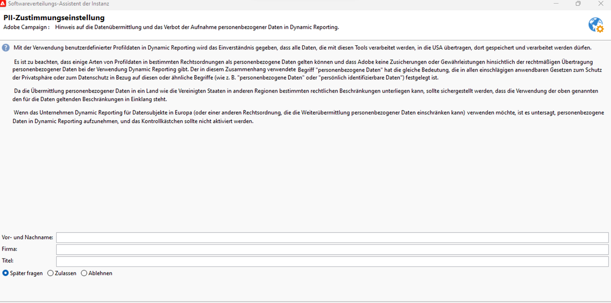

# Nutzungsvereinbarung zu dynamischem Reporting {#pii-agreement}

Die Nutzungsvereinbarung zur dynamischen Berichterstattung wird als Popup angezeigt und ermöglicht die Zustimmung zur Datenverarbeitung. Standardmäßig ist diese Vereinbarung nur für Benutzer mit Administratorrechten sichtbar und kann auch nur durch diese akzeptiert oder abgelehnt werden.

Um auf die Nutzungsvereinbarung zu dynamischen Berichten zuzugreifen, wählen Sie **[!UICONTROL Werkzeuge]** > **[!UICONTROL Erweitert]** > **[!UICONTROL Bereitstellungsassistent]** aus.

Drei Optionen stehen zur Wahl:

* **[!UICONTROL Später fragen]**: Bis Sie der Vereinbarung zustimmen oder diese ablehnen, werden die Profildimensionen nicht in Ihren Berichten angezeigt und die personenbezogenen Daten Ihrer Kundinnen und Kunden werden weder erfasst noch gesendet.
* **[!UICONTROL Annehmen]**: Wenn Sie die Nutzungsvereinbarung akzeptieren, gestatten Sie Adobe Campaign, personenbezogene Daten Ihrer Kunden zu erfassen und zum Reporting- oder Rechenzentrum zu übertragen.
* **[!UICONTROL Ablehnen]**: Wenn Sie die Nutzungsvereinbarung ablehnen, erscheinen die Profildimensionen nicht in Ihren Berichten und personenbezogene Daten Ihrer Kunden werden weder erfasst noch übertragen. Beachten Sie, dass in diesem Fall die externe Kennung dennoch erfasst und zur Identifizierung der Endbenutzer verwendet wird.

Die nachstehende Tabelle zeigt, was nach der Annahme dieser Vereinbarung je nach Region geschieht.

|  | Dynamisches Reporting | Microsoft Dynamics 365 Connector |
|---|---|---|
| Amerika und APAC (Asien/Pazifik) | **Funktion verfügbar**  Alle nativen Profildaten (d. h. Stadt, Land/Region, Bundesland, Geschlecht und Segmente auf der Grundlage des Alters) sowie benutzerdefinierten Profildaten werden an das US-Berichtszentrum gesendet. | **Funktion verfügbar**  Alle nativen und benutzerdefinierten Profilfelder sowie Ereignisfelder von Adobe Campaign werden im US-Rechenzentrum verarbeitet. |
| EMEA (Europa, Naher Osten und Afrika) | **Funktion verfügbar**  Alle nativen Profildaten (d. h. Stadt, Land/Region, Bundesland, Geschlecht und Segmente auf der Grundlage des Alters) sowie benutzerdefinierten Profildaten werden an das EMEA-Berichtszentrum gesendet. | **Funktion verfügbar**  Alle nativen und benutzerdefinierten Profilfelder sowie Ereignisfelder von Adobe Campaign werden im EMEA-Rechenzentrum verarbeitet.  **[!UICONTROL Kontrolldaten ]**, in denen Adobe I/O-Registrierungsdaten und Kennungen von Endbenutzerereignissen enthalten sind, werden zum US-Rechenzentrum gesendet und dort gespeichert. |

Die nachstehende Tabelle zeigt, was nach der Ablehnung dieser Vereinbarung je nach Region geschieht. Beachten Sie, dass auch dann Berichte zu Sendungen und der Microsoft Dynamics 365-Integration verfügbar sind, wenn Sie diese Vereinbarung ablehnen.

| Region | Dynamisches Reporting | Microsoft Dynamics 365 Connector |
|---|---|---|
| Amerika und APAC (Asien/Pazifik) | **Funktion verfügbar**  Es werden keine nativen und benutzerdefinierten Profildaten an das Reporting-Zentrum in den USA gesendet, mit Ausnahme der externen Kennung. | **Funktion verfügbar**  Es werden keine nativen und benutzerdefinierten Profilfelder an das US-Rechenzentrum gesendet, mit Ausnahme der externen Kennung und der Empfänger-ID.  Alle Ereignisfelder von Adobe Campaign werden im US-Rechenzentrum verarbeitet, mit Ausnahme der Mirrorseiten-ID. |
| EMEA (Europa, Naher Osten und Afrika) | **Funktion verfügbar**  Es werden keine nativen und benutzerdefinierten Profildaten an das Reporting-Zentrum in EMEA gesendet, mit Ausnahme der externen Kennung. | **Funktion verfügbar**  Es werden keine nativen und benutzerdefinierten Profilfelder an das EMEA-Rechenzentrum gesendet, mit Ausnahme der externen Kennung und der Empfänger-ID.  Alle Ereignisfelder von Adobe Campaign werden im EMEA-Rechenzentrum verarbeitet, mit Ausnahme der Mirrorseiten-ID. |

Diese Auswahl ist nicht endgültig. Sie können sie jederzeit ändern, indem Sie die Option **[!UICONTROL realtimeReporting_collectPII]** unter **[!UICONTROL Administration]** > **[!UICONTROL Plattform]** > **[!UICONTROL Optionen]** auswählen.

Der Wert kann jederzeit geändert werden. Der Wert 1 bedeutet **[!UICONTROL Später fragen]**, 2 bedeutet **[!UICONTROL Ablehnen]** und 3 bedeutet **[!UICONTROL Annehmen]**.
