# E-Mail-Versandbericht {#email-report}

Der **E-Mail-Versandbericht** bietet umfassende Einblicke und Daten, die speziell für den E-Mail-Kanal gelten. Er bietet detaillierte Informationen über Performance, Effektivität und Ergebnisse Ihrer einzelnen Sendungen und verschafft Ihnen einen umfassenden Überblick.

## Versandzusammenfassung {#delivery-summary-email}

>[!CONTEXTUALHELP]
>id="acw_delivery_reporting_sending_email"
>title="Versandberichte"
>abstract="Auf der Registerkarte **Senden** Ihres Berichts erhalten Sie einen umfassenden Einblick in die Interaktionen Ihrer Besucherinnen und Besucher mit Ihren Sendungen und in etwaige Fehler, die bei ihnen aufgetreten sind."

### Anfängliche Zielgruppenpopulation {#email-delivery-targeted-population}

>[!CONTEXTUALHELP]
>id="acw_delivery_reporting_initial_target"
>title="Anfängliche Zielgruppenpopulation"
>abstract="Der Graph **Anfängliche Zielgruppenpopulation** zeigt Daten zu Ihren Empfängerinnen und Empfängern sowie Nachrichten basierend auf den Ergebnissen der Versandvorbereitung an."

Der Graph **[!UICONTROL Anfängliche Zielgruppenpopulation]** zeigt Daten zu Ihren Empfängerinnen und Empfängern an. Die Metriken werden bei der Versandvorbereitung berechnet und zeigen: die ursprüngliche Zielgruppe, die Anzahl der zu sendenden Nachrichten und die Anzahl der ausgeschlossenen Empfängerinnen und Empfänger.

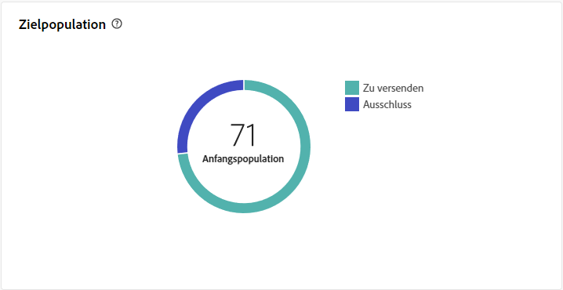{zoomable="yes"}

Bewegen Sie den Mauszeiger über einen Abschnitt des Graphen, um die genaue Zahl anzuzeigen.

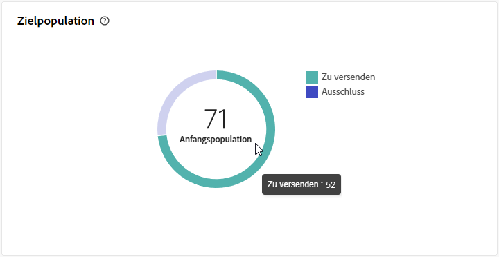{zoomable="yes"}

+++Erfahren Sie mehr über die Metriken des E-Mail-Versandberichts.

* **[!UICONTROL Ursprüngliche Zielgruppe]**: Gesamtzahl der Zielgruppenempfängerinnen und -empfänger.

* **[!UICONTROL Zu versenden]**: Gesamtzahl der nach erfolgter Versandanalyse zu versendenden Nachrichten.

* **[!UICONTROL Ausschluss]**: Gesamtzahl der vom Versand an die Zielgruppe ausgeschlossenen Nachrichten.
+++

### Versandstatistiken {#email-delivery-stats}

>[!CONTEXTUALHELP]
>id="acw_delivery_reporting_delivery_statistics_summary"
>title="Versandstatistiken"
>abstract="Der Graph **Versandstatistiken** zeigt den Erfolg Ihres Versands und die aufgetretenen Fehler an."

Der Graph **[!UICONTROL Versandstatistiken]** gibt Auskunft über den Erfolg Ihres Versands. Metriken werden nachfolgend beschrieben.

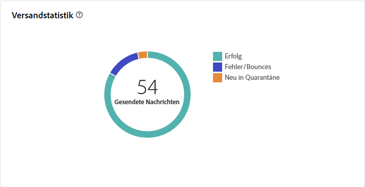{zoomable="yes"}

+++Erfahren Sie mehr über die Metriken des E-Mail-Kampagnen-Berichts.

* **[!UICONTROL Gesendete Nachricht]**: Gesamtzahl der nach erfolgter Versandvorbereitung zu versendenden Nachrichten.

* **[!UICONTROL Erfolg]**: Anzahl der erfolgreich verarbeiteten Nachrichten im Verhältnis zur Anzahl der zu versendenden Nachrichten.

* **[!UICONTROL Fehler]**: Gesamtzahl der über alle Sendungen hinweg kumulierten Fehler und der automatischen Bounce-Verarbeitungen im Verhältnis zur Anzahl der zu versendenden Nachrichten.

* **[!UICONTROL Neue Quarantänen]**: Gesamtzahl der Adressen, die infolge eines fehlgeschlagenen Versands unter Quarantäne gestellt wurden (unbekannter Nutzer, ungültige Domain), im Verhältnis zur Anzahl der zu versendenden Nachrichten.

+++

### Ausschlussgründe  {#email-delivery-exclusions}

>[!CONTEXTUALHELP]
>id="acw_delivery_reporting_exclusion"
>title="Versand – Ausschlussgründe"
>abstract="Der Graph und die Tabelle zu den **Ausschlussgründen** zeigen die Aufschlüsselung der im Zuge der Versandvorbereitung abgelehnten Nachrichten nach Regeln."

Der Graph und die Tabelle zu den **[!UICONTROL Ausschlussgründen]** zeigen die Aufschlüsselung der im Zuge der Versandvorbereitung abgelehnten Nachrichten nach Regeln. Ausschlussregeln werden in der[Dokumentation zu Campaign v8 (Konsole)](https://experienceleague.adobe.com/docs/campaign/campaign-v8/send/failures/delivery-failures.html?lang=de#email-error-types){_blank} detailliert beschrieben.

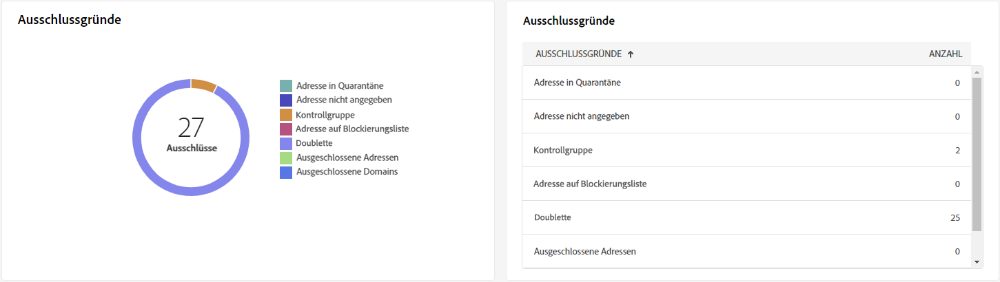{zoomable="yes"}{align="center" zoomable="yes"}

+++Erfahren Sie mehr über die Metriken des E-Mail-Versandberichts.

* **[!UICONTROL Unbekannter Nutzer]**: Fehlertyp, der während des Versands erzeugt wird, um anzuzeigen, dass die E-Mail-Adresse ungültig ist.

* **[!UICONTROL Ungültige Domain]**: Fehlertyp, der beim Senden eines Versands erzeugt wird, um anzuzeigen, dass die Domain der E-Mail-Adresse falsch ist oder nicht existiert.

* **[!UICONTROL Postfach voll]**: Fehlertyp, der nach fünf fehlgeschlagenen Versandversuchen erzeugt wird, wenn das Empfängerpostfach zu viele Nachrichten enthält.

* **[!UICONTROL Account deaktiviert]**: Fehlertyp, der beim Senden eines Versands erzeugt wird, um anzuzeigen, dass die Adresse nicht mehr existiert.

* **[!UICONTROL Verweigert]**: Fehlertyp, der erzeugt wird, wenn eine Adresse vom IAP (Internet Access Provider) abgelehnt wird, z. B. nach Anwendung einer Sicherheitsregel (Anti-Spam-Software).

* **[!UICONTROL Unerreichbar]**: Fehlertyp, der in der Nachrichtenverteilungs-Zeichenfolge auftritt: Vorfall im SMTP-Relais, Domain vorübergehend unerreichbar usw.

* **[!UICONTROL Nicht angemeldet]**: Fehlertyp, wenn das Mobiltelefon der Empfängerin bzw. des Empfängers zum Zeitpunkt des Versands ausgeschaltet war oder über keinen Netzempfang verfügte.

+++

## Versanddurchsatz {#delivery-throughtput}

>[!CONTEXTUALHELP]
>id="acw_delivery_reporting_throughput_email"
>title="Versanddurchsatz"
>abstract="Der Bericht **Versanddurchsatz** enthält detaillierte Informationen zum Versanddurchsatz der gesamten Plattform innerhalb eines bestimmten Zeitraums."

Dieser Bericht enthält detaillierte Informationen zum Versanddurchsatz der gesamten Plattform innerhalb eines bestimmten Zeitraums. Die wichtigste Kennzahl, mit der die Geschwindigkeit des Nachrichtenversands gemessen wird, ist die Anzahl der pro Stunde gesendeten Nachrichten.

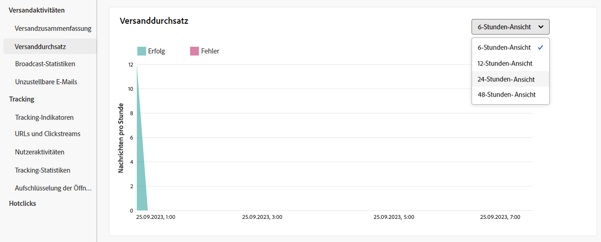{zoomable="yes"}{align="center" zoomable="yes"}

## Broadcast-Statistiken {#broadcast-statistics}

>[!CONTEXTUALHELP]
>id="acw_delivery_reporting_broadcast_statistics"
>title="Broadcast-Statistiken"
>abstract="Der Bericht **Broadcast-Statistiken** enthält die verfügbaren Daten zu möglichen Fehlern, die bei jeder einzelnen Domain aufgetreten sind."

Die Tabelle **[!UICONTROL Broadcast-Statistiken]** enthält die verfügbaren Daten zu Fehlern, die bei jeder Domain aufgetreten sind. Metriken werden nachfolgend beschrieben.

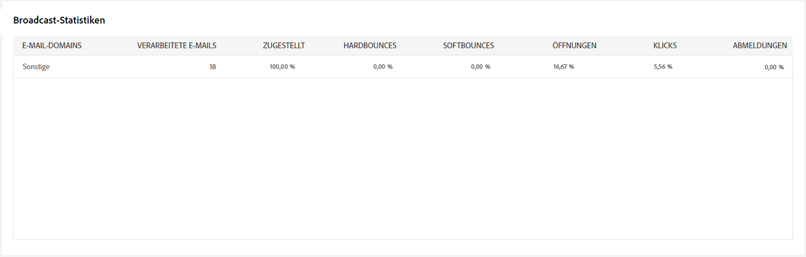{zoomable="yes"}{align="center" zoomable="yes"}

+++Erfahren Sie mehr über die Metriken des E-Mail-Versandberichts.

* **[!UICONTROL Verarbeitete E-Mails]**: Gesamtzahl der Nachrichten, die vom Versand-Server verarbeitet wurden.

* **[!UICONTROL Zugestellt]**: Prozentualer Anteil der erfolgreich verarbeiteten Nachrichten im Vergleich zur Gesamtzahl der verarbeiteten Nachrichten.

* **[!UICONTROL Hardbounces]**: Prozentualer Anteil der „Hardbounces“, d. h. permanente Fehler wie etwa eine falsche E-Mail-Adresse, im Vergleich zur Gesamtzahl der verarbeiteten Nachrichten.

* **[!UICONTROL Softbounces]**: Prozentualer Anteil der „Softbounces“, d. h. temporäre Fehler wie etwa ein voller Posteingang, im Vergleich zur Gesamtzahl der verarbeiteten Nachrichten

* **[!UICONTROL Öffnungen]**: Prozentualer Anteil der Zielgruppenempfängerinnen und -empfänger, die mindestens einmal eine Nachricht geöffnet haben, im Vergleich zur Gesamtzahl der erfolgreich verarbeiteten Nachrichten.

* **[!UICONTROL Klicks]**: Prozentsatz der Anzahl der Personen, die mindestens einmal auf einen Versand geklickt haben, im Vergleich zur Anzahl der erfolgreich verarbeiteten Nachrichten.

* **[!UICONTROL Abmeldungen]**: Prozentualer Anteil der Klicks auf einen Abmelde-Link in Bezug auf die Gesamtzahl der verarbeiteten Nachrichten.
+++

## Unzustellbare Nachrichten {#non-deliverables-email}

### Aufschlüsselung der Fehler nach Typen {#email-delivery-breakdown-type}

>[!CONTEXTUALHELP]
>id="acw_delivery_reporting_error_type"
>title="Aufschlüsselung der Fehler nach Typen"
>abstract="Der Graph zur **Aufschlüsselung der Fehler nach Typen** enthält die verfügbaren Daten für jeden aufgetretenen Fehlertyp: Benutzerin oder Benutzer unbekannt, Postfach voll, ungültige Domain und mehr."

>[!CONTEXTUALHELP]
>id="acw_delivery_reporting_error_type_table"
>title="Aufschlüsselung der Fehler nach Typen"
>abstract="Die **Aufschlüsselung der Fehler nach Typen** bietet eine umfassende Aufschlüsselung des Vorkommens der einzelnen Fehlertypen."

Die Tabelle und der Graph zur **[!UICONTROL Aufschlüsselung der Fehler nach Typen]** enthalten die verfügbaren Daten für jeden Fehlertyp. Metriken werden nachfolgend beschrieben.

Die in diesem Bericht angezeigten Fehler lösen einen Quarantäneprozess aus. Weitere Informationen zur Quarantäneverwaltung finden Sie in der [Dokumentation zu Campaign v8 (Client-Konsole)](https://experienceleague.adobe.com/docs/campaign/campaign-v8/campaigns/send/failures/delivery-failures.html?lang=de){target="_blank"}.

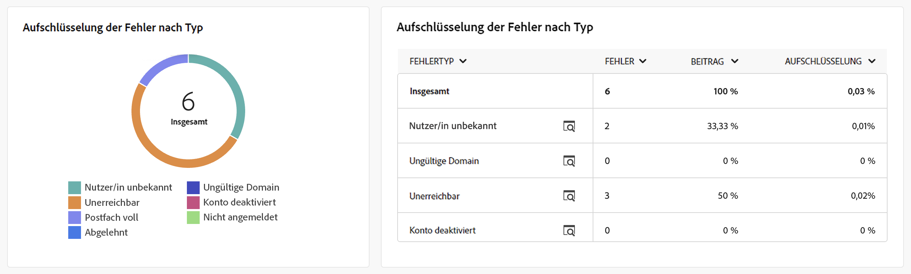{zoomable="yes"}{align="left" zoomable="yes"}

+++Erfahren Sie mehr über die Metriken des E-Mail-Versandberichts.

* **[!UICONTROL Unbekannter Nutzer]**: Fehlertyp, der während des Versands erzeugt wird, um anzuzeigen, dass die E-Mail-Adresse ungültig ist.

* **[!UICONTROL Ungültige Domain]**: Fehlertyp, der beim Senden eines Versands erzeugt wird, um anzuzeigen, dass die Domain der E-Mail-Adresse falsch ist oder nicht existiert.

* **[!UICONTROL Postfach voll]**: Fehlertyp, der nach fünf fehlgeschlagenen Versandversuchen erzeugt wird, wenn das Empfängerpostfach zu viele Nachrichten enthält.

* **[!UICONTROL Account deaktiviert]**: Fehlertyp, der beim Senden eines Versands erzeugt wird, um anzuzeigen, dass die Adresse nicht mehr existiert.

* **[!UICONTROL Verweigert]**: Fehlertyp, der erzeugt wird, wenn eine Adresse vom IAP (Internet Access Provider) abgelehnt wird, z. B. nach Anwendung einer Sicherheitsregel (Anti-Spam-Software).

* **[!UICONTROL Unerreichbar]**: Fehlertyp, der in der Nachrichtenverteilungs-Zeichenfolge auftritt: Vorfall im SMTP-Relais, Domain vorübergehend unerreichbar usw.

* **[!UICONTROL Nicht angemeldet]**: Fehlertyp, wenn das Mobiltelefon der Empfängerin bzw. des Empfängers zum Zeitpunkt des Versands ausgeschaltet war oder über keinen Netzempfang verfügte.

+++

### Aufschlüsselung der Fehler nach Domain {#email-delivery-breakdown-domain}

>[!CONTEXTUALHELP]
>id="acw_delivery_reporting_error_domain"
>title="Aufschlüsselung der Fehler nach Domain"
>abstract="Der Graph zur **Aufschlüsselung der Fehler nach Domain** zeigt die verfügbaren Daten für jeden aufgetretenen Fehlertyp: abhängig von jeder Domain an."

>[!CONTEXTUALHELP]
>id="acw_delivery_reporting_error_domain_table"
>title="Aufschlüsselung der Fehler nach Domain"
>abstract="Die **Aufschlüsselung der Fehler nach Domain** bietet eine umfassende Aufschlüsselung des Vorkommens der einzelnen Fehler entsprechend der verwendeten Domain."

Die Tabelle und der Graph zur **[!UICONTROL Aufschlüsselung der Fehler nach Domain]** zeigen die verfügbaren Daten zu Fehlern an, die bei den einzelnen Domains aufgetreten sind.

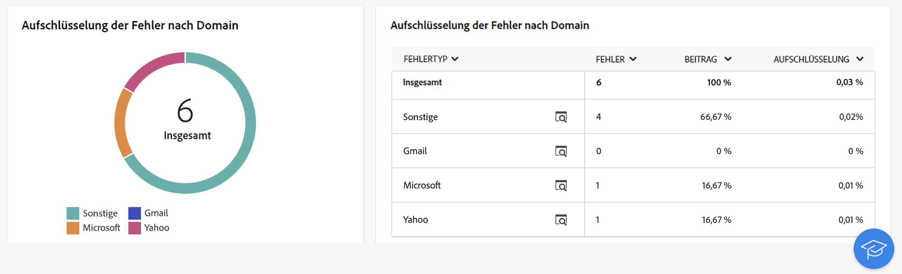{zoomable="yes"}{align="left" zoomable="yes"}

Klicken Sie auf das Symbol neben dem Namen der einzelnen Domains, um Details anzuzeigen.

{zoomable="yes"}{align="left" zoomable="yes"}

Die verfügbaren Metriken sind die gleichen wie die für die weiter oben beschriebene [Aufschlüsselung der Fehler nach Typen](#email-delivery-breakdown-type).

## Tracking-Indikatoren {#tracking-indicators-email}

>[!CONTEXTUALHELP]
>id="acw_delivery_reporting_tracking_email"
>title="Tracking-Berichte"
>abstract="Die Registerkarte **Tracking** Ihres Berichts enthält wertvolle Daten, darunter das Empfängerverhalten pro Link, die Aufschlüsselung von Öffnungen und Klicks sowie detaillierte Informationen zu den am häufigsten angeklickten URLs während eines Versands."

### Versandstatistiken  {#email-tracking-delivery-stats}

>[!CONTEXTUALHELP]
>id="acw_delivery_reporting_delivery_statistics_indicators"
>title=" Versandstatistiken"
>abstract="Der Bericht **Versandstatistiken** bietet wichtige Performance-Indikatoren (KPIs), die detaillierte Informationen zu den Daten liefern, die für gesendete E-Mails verfügbar sind: Erfolg, Öffnungen, Klicks und mehr."

Der Bericht **[!UICONTROL Versandstatistiken]** bietet wichtige Performance-Indikatoren (KPIs), die detaillierte Informationen zu den Daten liefern, die für gesendete E-Mails verfügbar sind. Metriken werden nachfolgend beschrieben.

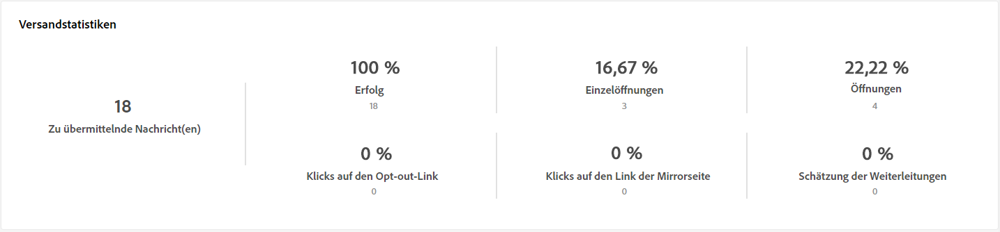{zoomable="yes"}{align="center"}

+++Erfahren Sie mehr über die Metriken des E-Mail-Versandberichts.

* **[!UICONTROL Erfolg]**: Anzahl der erfolgreich verarbeiteten Nachrichten im Verhältnis zur Anzahl der zu versendenden Nachrichten.

* **[!UICONTROL Unterschiedliche Öffnungen (Unique Opens)]**: Gesamtzahl der Zielgruppenempfängerinnen und -empfänger, die mindestens einmal eine Nachricht geöffnet haben.

* **[!UICONTROL Öffnungen]**: Anzahl der unterschiedlichen Zielgruppenempfängerinnen und -empfänger dieser Domain, die mindestens einmal eine Nachricht geöffnet haben.

* **[!UICONTROL Klicks auf den Abmelde-Link]**: Anzahl der Klicks auf den Abmelde-Link.

* **[!UICONTROL Klicks auf den Mirror-Link]**: Anzahl der Klicks auf den Link der Mirrorseite.

* **[!UICONTROL Schätzung der Weiterleitungen]**: Schätzung der Anzahl der E-Mails, die von den Zielgruppenempfängerinnen und -empfängern weitergeleitet werden.
+++

### Öffnungs- und Clickthrough-Rate {#email-tracking-click-through}

>[!CONTEXTUALHELP]
>id="acw_delivery_reporting_open_clickthrough"
>title="Öffnungs- und Clickthrough-Rate"
>abstract="Die Tabelle **Öffnungs- und Clickthrough-Rate** zeigt Daten bezüglich der Interaktionen Ihrer Empfängerinnen und Empfänger mit dem Versand an."

Die Tabelle **[!UICONTROL Öffnungs- und Clickthrough-Rate]** zeigt Daten zu Ihren Empfängerinnen und Empfängern an. Metriken werden nachfolgend beschrieben.

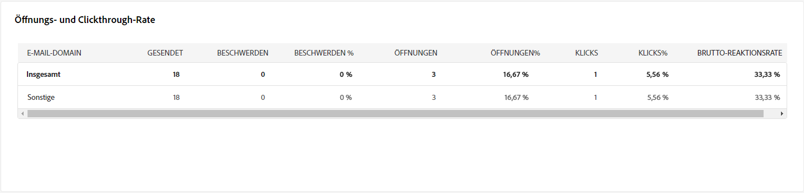{zoomable="yes"}{align="center"}

+++Erfahren Sie mehr über die Metriken des E-Mail-Versandberichts.

* **[!UICONTROL Gesendet]**: Gesamtzahl der gesendeten Nachrichten.

* **[!UICONTROL Beschwerden]**: Anzahl der Nachrichten für diese Domain, die von der Empfängerin oder vom Empfänger als unerwünscht gemeldet wurden.

* **[!UICONTROL Öffnungen]**: Anzahl der unterschiedlichen Zielgruppenempfängerinnen und -empfänger dieser Domain, die mindestens einmal eine Nachricht geöffnet haben.

* **[!UICONTROL Klicks]**: Anzahl der unterschiedlichen Zielgruppenempfängerinnen und -empfänger, die mindestens einmal in einem Versand geklickt haben.

* **[!UICONTROL Brutto-Reaktionsrate]**: Prozentualer Anteil der Empfängerinnen und Empfänger, die mindestens einmal in einem Versand geklickt haben, in Bezug auf die Empfängerinnen und Empfänger, die mindestens einmal einen Versand geöffnet haben.
+++

## URLs und Clickstreams {#url-email}

>[!CONTEXTUALHELP]
>id="acw_delivery_reporting_urls_clickstreams"
>title="URLs und Clickstreams"
>abstract="Der Bericht **URLs und Clickstreams** bietet wichtige Performance-Indikatoren (KPIs), die detaillierte Informationen zu den URLs enthalten, auf die während eines Versands am häufigsten geklickt wurde."

Der Bericht **[!UICONTROL URLs und Clickstreams]** bietet wichtige Performance-Indikatoren (KPIs), die detaillierte Informationen zu den URLs enthalten, auf die während eines Versands am häufigsten geklickt wurde.

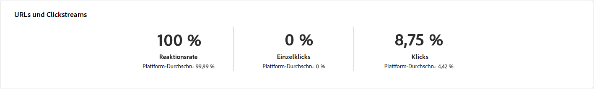{zoomable="yes"}{align="center"}

+++Erfahren Sie mehr über die Metriken des E-Mail-Versandberichts.

* **[!UICONTROL Reaktionsrate]**: Verhältnis der Anzahl an Zielgruppenempfängerinnen und -empfängern, die auf einen Versand geklickt haben, in Bezug zur geschätzten Anzahl der Zielgruppenempfängerinnen und -empfänger, die einen Versand geöffnet haben.

* **[!UICONTROL Unterschiedliche Klicks (Unique Clicks)]**: Gesamtzahl der unterschiedlichen Empfängerinnen und Empfänger, die einen Versand mindestens einmal angeklickt haben.

* **[!UICONTROL Klicks]**: Gesamtzahl der Klicks auf Links in Sendungen.

* **[!UICONTROL Plattform-Durchschnitt]**: Dieser Durchschnittswert, der unter jeder Rate (Reaktivität, Unique Clicks und Klicks insgesamt) angezeigt wird, bezieht sich auf die in den letzten sechs Monaten verschickten Sendungen. Es werden nur Sendungen mit derselben Typologie und mit demselben Kanal berücksichtigt. Testsendungen sind ausgeschlossen.

+++

### Die 10 meistbesuchten Links {#email-tracking-top10}

>[!CONTEXTUALHELP]
>id="acw_delivery_reporting_urls_clickstreams_top10"
>title="Die 10 meistbesuchten Links"
>abstract="Der Graph und die Tabelle zu den **10 meistbesuchten Links** enthalten die verfügbaren Daten für das Empfängerverhalten für die einzelnen Links."

Der Graph und die Tabelle zu den **[!UICONTROL 10 meistbesuchten Links]** enthalten die verfügbaren Daten für das Empfängerverhalten für die einzelnen Links.

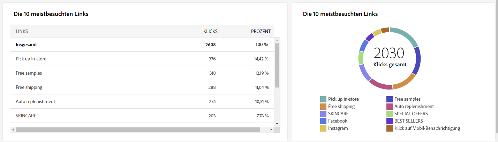{zoomable="yes"}{align="center"}

+++Erfahren Sie mehr über die Metriken des E-Mail-Versandberichts.

* **[!UICONTROL Klicks]**: Gesamtzahl der Klicks auf Links in Sendungen.

* **[!UICONTROL Prozentsatz]**: Prozentsatz der Benutzerinnen und Benutzer, die mit dem Versand interagiert haben

+++

### Aufschlüsselung der Klicks im Zeitverlauf {#email-tracking-breakdown-over-time}

>[!CONTEXTUALHELP]
>id="acw_delivery_reporting_urls_click_breakdown"
>title="Aufschlüsselung der Klicks im Zeitverlauf"
>abstract="Der Graph zur **Aufschlüsselung der Klicks im Zeitverlauf** zeigt die verfügbaren Daten zum Empfängerverhalten für jeden Link."

Der Graph zur **[!UICONTROL Aufschlüsselung der Klicks im Zeitverlauf]** enthält die verfügbaren Daten zum Empfängerverhalten für jeden Link.

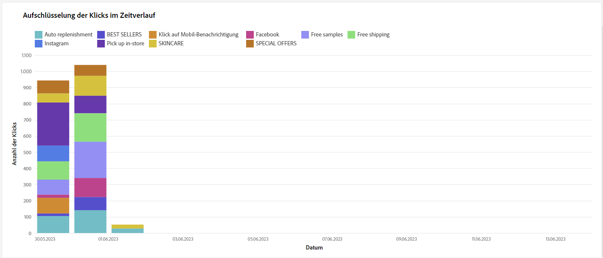{zoomable="yes"}{align="center"}

## Benutzeraktivitäten {#user-activities-email}

>[!CONTEXTUALHELP]
>id="acw_delivery_reporting_user_activities"
>title="Benutzeraktivitäten"
>abstract="Das Diagramm **Benutzeraktivitäten** zeigt die Aufschlüsselung der Öffnungen und Klicks in Form eines Diagramms. Sie können den Zeitraum der Zielgruppendaten auswählen: letzter Tag, letzte Stunde oder letzte 30 Minuten."

Der Bericht **[!UICONTROL Benutzeraktivitäten]** zeigt die Aufschlüsselung der Öffnungen und Klicks in Form eines Diagramms. Sie können den Zeitraum der Zielgruppendaten auswählen: letzter Tag, letzte Stunde oder letzte 30 Minuten.

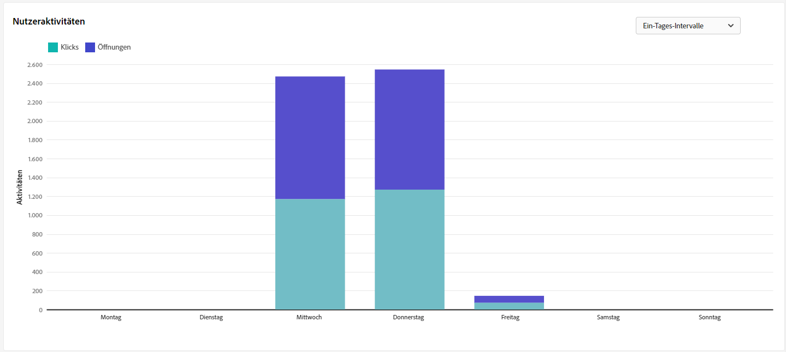{zoomable="yes"}{align="center"}

+++Erfahren Sie mehr über die Metriken des E-Mail-Versandberichts.

* **[!UICONTROL Klicks]**: Gesamtzahl der Klicks auf Links in Sendungen.

* **[!UICONTROL Öffnungen]**: Anzahl der unterschiedlichen Zielgruppenempfängerinnen und -empfänger dieser Domain, die mindestens einmal eine Nachricht geöffnet haben.

+++

## Tracking-Statistiken {#tracking-statistics}

>[!CONTEXTUALHELP]
>id="acw_delivery_reporting_statistics"
>title="Tracking-Statistiken"
>abstract="Das Diagramm **Tracking-Statistiken** liefert Statistiken über Öffnungen und Klicks. Sie haben die Möglichkeit, den spezifischen Zeitrahmen für die Zielgruppendaten auszuwählen."

Das Diagramm **[!UICONTROL Tracking-Statistiken]** liefert Statistiken über Öffnungen und Klicks. Sie haben die Möglichkeit, den spezifischen Zeitrahmen für die Zielgruppendaten auszuwählen.

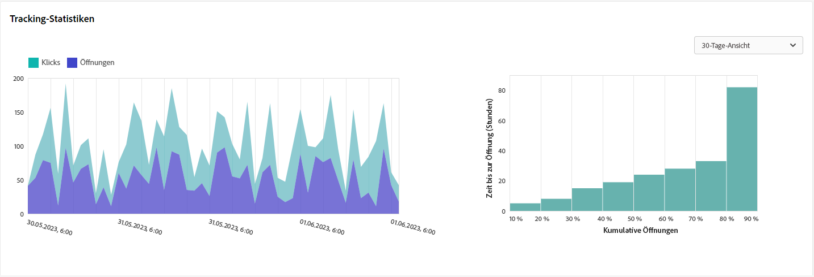{zoomable="yes"}{align="center"}

+++Erfahren Sie mehr über die Metriken des E-Mail-Versandberichts.

* **[!UICONTROL Klicks]**: Gesamtzahl der Klicks auf Links in Sendungen.

* **[!UICONTROL Öffnungen]**: Anzahl der unterschiedlichen Zielgruppenempfängerinnen und -empfänger dieser Domain, die mindestens einmal eine Nachricht geöffnet haben.

+++

## Aufschlüsselung der Öffnungen {#breakdown-opens}

### Aufschlüsselung der Öffnungen nach Gerät {#breakdown-opens-devices}

>[!CONTEXTUALHELP]
>id="acw_delivery_reporting_breakdown_device"
>title="Aufschlüsselung nach Gerät"
>abstract="Der Bericht **Aufschlüsselung nach Gerät** zeigt die Aufschlüsselung der Öffnungen nach Gerät für den betreffenden Zeitraum an. Für jede Kategorie werden zwei Diagramme verwendet. Das erste zeigt Statistiken zu Öffnungen auf Computern und Mobilgeräten. Das zweite zeigt die genaue Anzahl und den genauen Prozentsatz für jeden Gerätetyp an."

Der Bericht **Aufschlüsselung nach Gerät** zeigt die Aufschlüsselung der Öffnungen nach Gerät für den jeweiligen Zeitraum an: Android-Geräte, Apple-Geräte usw.

Für jede Kategorie werden zwei Diagramme verwendet. Das erste zeigt Statistiken zu Öffnungen auf Computern und Mobilgeräten. Das zweite zeigt die genaue Anzahl und den genauen Prozentsatz für jeden Gerätetyp an.

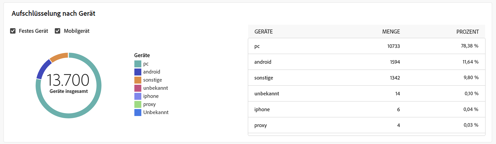{zoomable="yes"}{align="center"}

### Aufschlüsselung der Öffnungen nach Betriebssystem {#breakdown-opens-os}

>[!CONTEXTUALHELP]
>id="acw_delivery_reporting_breakdown_os"
>title="Aufschlüsselung nach Betriebssystem"
>abstract="Die **Aufschlüsselung nach Betriebssystem** zeigt die Aufschlüsselung der Öffnungen nach Betriebssystem für den betreffenden Zeitraum an. Das erste Diagramm zeigt Statistiken zu Öffnungen auf Computern und Mobilgeräten. Das zweite zeigt die genaue Anzahl und den genauen Prozentsatz für jedes Betriebssystem an."

Der Bericht **Aufschlüsselung nach Betriebssystem** zeigt die Aufschlüsselung der Öffnungen nach Betriebssystem für den jeweiligen Zeitraum an: Windows-Systeme, Android-Systeme, iOS-Systeme usw.

Für jede Kategorie werden zwei Diagramme verwendet. Das erste zeigt Statistiken zu Öffnungen auf Betriebssystemen von Computern und Mobilgeräten. Das zweite zeigt die genaue Anzahl und den genauen Prozentsatz für jedes Betriebssystem an.

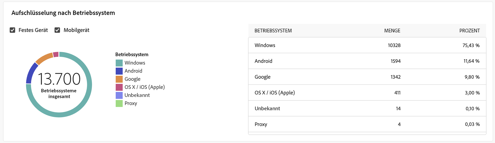{zoomable="yes"}{align="center"}

### Aufschlüsselung der Öffnungen nach Browser {#breakdown-opens-browser}

>[!CONTEXTUALHELP]
>id="acw_delivery_reporting_breakdown_browser"
>title="Aufschlüsselung nach Browser"
>abstract="Der Bericht **Aufschlüsselung nach Browser** zeigt die Aufschlüsselung der Öffnungen nach Browser für den betreffenden Zeitraum an. Das erste Diagramm zeigt Statistiken zu Öffnungen auf Computern und Mobilgeräten. Das zweite zeigt die genaue Anzahl und den genauen Prozentsatz für jeden Browser an."

Der Bericht **Aufschlüsselung nach Browser** zeigt die Aufschlüsselung der Öffnungen nach Browser an: Chrome, Safari, Internet Explorer usw.

Für jede Kategorie werden zwei Diagramme verwendet. Das erste zeigt Statistiken zu Öffnungen auf Betriebssystemen von Computern und Mobilgeräten. Das zweite zeigt die genaue Anzahl und den genauen Prozentsatz für jeden Browser an.

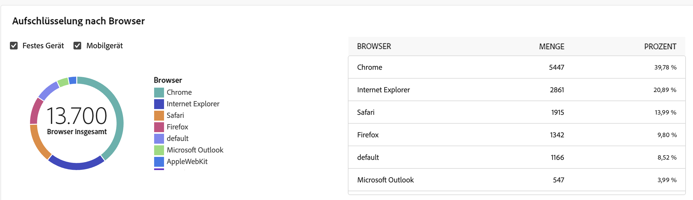{zoomable="yes"}{align="center"}

## Hotclicks {#hotclicks}

>[!CONTEXTUALHELP]
>id="acw_delivery_reporting_hotclicks"
>title="Hotclicks-Bericht"
>abstract="Der Bericht **Hotclicks** zeigt den E-Mail-Inhalt (HTML und/oder Text) mit dem prozentualen Klickanteil für jeden Link. Gestaltungsbausteine, Abmelde-Links, Mirrorseiten-Links und Angebots-Links werden bei der Gesamtanzahl der Klicks berücksichtigt, jedoch nicht im Bericht angezeigt."

Dieser Bericht zeigt den Nachrichteninhalt (HTML und/oder Text) mit dem prozentualen Klickanteil für jeden Link. Gestaltungsbausteine, Abmelde-Links, Mirrorseiten-Links und Angebots-Links werden bei der Gesamtanzahl der Klicks berücksichtigt, jedoch nicht im Bericht angezeigt.

{zoomable="yes"}