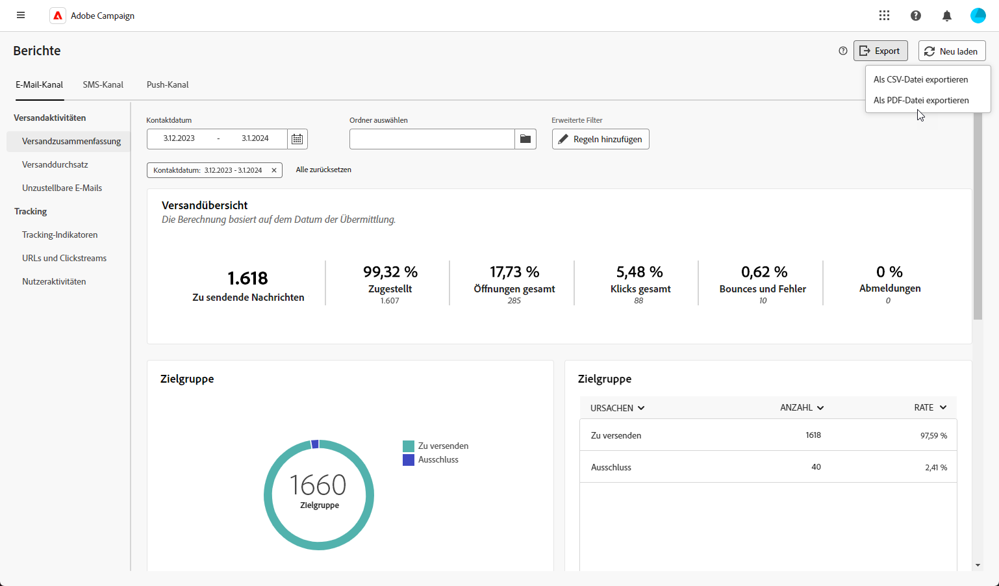

# Exportieren der Berichte {#export-reports}

>[!CONTEXTUALHELP]
>id="acw_reporting_email_exportation"
>title="Exportieren der Berichte"
>abstract="Klicken Sie auf die Schaltfläche **Exportieren**, um diese Metriken im PDF- oder CSV-Format zu exportieren, sodass sie freigegeben oder gedruckt werden können."

Sie können Ihre verschiedenen Berichte einfach in das PDF- oder CSV-Format exportieren, sodass Sie sie freigeben, bearbeiten oder drucken können.

1. Klicken Sie in Ihrem Bericht auf **[!UICONTROL Exportieren]** und wählen Sie **[!UICONTROL Als PDF-Datei exportieren]** bzw. **[!UICONTROL Als CSV-Datei exportieren]**.

   {zoomable=&quot;yes&quot;}

1. Suchen Sie den Ordner, in dem Sie die Datei speichern möchten, benennen Sie ihn bei Bedarf um und klicken Sie auf **[!UICONTROL Speichern]**.

Ihr Bericht kann jetzt in einer PDF- oder CSV-Datei angezeigt oder freigegeben werden.
