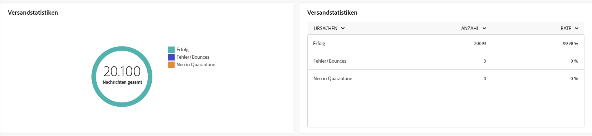

# Globale Berichte für den Briefpost-Kanal {#global-report-direct}

Die globalen Berichte bieten einen umfassenden Überblick über Traffic- und Interaktionsmetriken auf Kanalebene.

Navigieren Sie zum Menü **[!UICONTROL Berichte]** im Abschnitt **[!UICONTROL Berichterstellung]**. Sie können Ihre Daten nach Berichtsdatum, -ordner oder -regeln filtern. [Weitere Informationen](global-reports.md)

## Versandzusammenfassung {#delivery-summary-direct}

### Versandübersicht {#delivery-overview-direct}

Die **[!UICONTROL Versandübersicht]** bietet wichtige Leistungsmetriken (KPIs) mit umfassenden Einblicken in die Interaktion Ihrer Besucherinnen und Besucher mit jedem E-Mail-Versand. Die Metriken sind unten dargestellt.

{zoomable=&quot;yes&quot;}{align="center"}

+++Erfahren Sie mehr über Versandübersichtsmetriken.

* **[!UICONTROL Zu sendende Nachrichten]**: Gesamtzahl der während der Versandvorbereitung verarbeiteten Nachrichten.

* **[!UICONTROL Zugestellt]**: Anzahl der erfolgreich gesendeten Nachrichten im Verhältnis zur Gesamtzahl der gesendeten Nachrichten.

* **[!UICONTROL Fehler]**: Summe der Fehler, die beim Versand und bei der automatischen Rücksendung kumuliert wurden, bezogen auf die Gesamtzahl der gesendeten Nachrichten.

* **[!UICONTROL Abmeldungen]**: Anzahl der Empfänger, die auf „Abmelden“ geklickt haben.
+++

### Zielgruppe {#delivery-summary-direct-initial-target}

Die Tabelle und der Graph **[!UICONTROL Zielgruppe]** zeigen Daten zu Ihren Empfängerinnen und Empfängern, mit detaillierten Metriken unten.

{zoomable=&quot;yes&quot;}{align="center"}

+++Erfahren Sie mehr über Zielgruppen-Metriken.

* **[!UICONTROL Zielgruppe]**: Gesamtzahl der angesprochenen Empfängerinnen und Empfänger.

* **[!UICONTROL Zu versendende Nachricht]**: Gesamtzahl der nach erfolgter Versandvorbereitung zu versendenden Nachrichten.

* **[!UICONTROL Ausschluss]**: Gesamtzahl der Adressen, die bei der Anwendung von Regeln in der Analyse ignoriert werden: fehlende Adresse, in Quarantäne, auf der Blockierungsliste, usw.

+++

### Versandstatistiken {#delivery-summary-direct-exec-stats}

Die Tabelle **[!UICONTROL Versandstatistiken]** bietet eine Aufschlüsselung des Erfolgs jedes Briefpost-Versands mit folgenden detaillierten Metriken.

{zoomable=&quot;yes&quot;}{align="center"}

+++Erfahren Sie mehr über Versandstatistik-Metriken.

* **[!UICONTROL Zu versendende Nachricht]**: Gesamtzahl der nach erfolgter Versandvorbereitung zu versendenden Nachrichten.

* **[!UICONTROL Erfolg]**: Anzahl der erfolgreich verarbeiteten Nachrichten im Verhältnis zur Anzahl der zu versendenden Nachrichten.

* **[!UICONTROL Fehler/Bounces]**: Gesamtzahl der über alle Sendungen hinweg kumulierten Fehler und der automatischen Bounce-Verarbeitungen im Verhältnis zur Anzahl der zu versendenden Nachrichten.

* **[!UICONTROL Neue Quarantänen]**: Gesamtzahl der Adressen, die infolge eines fehlgeschlagenen Versands unter Quarantäne gestellt wurden (unbekannter Nutzer, ungültige Domain), im Verhältnis zur Anzahl der zu versendenden Nachrichten.

+++

### Ausschlussgründe {#causes-exclusion}

{zoomable=&quot;yes&quot;}{align="center"}

Der Graph und die Tabelle „Ausschlüsse“ zeigen die Gründe, aus denen Benutzerprofile, die aus den Zielprofilen ausgeschlossen sind, die Benachrichtigung nicht erhalten haben.

## Versanddurchsatz {#delivery-throughput}

Dieser Bericht liefert umfangreiche Details zum Versanddurchsatz in einem bestimmten Zeitraum. Die zur Messung der Versandgeschwindigkeit verwendete Hauptmetrik ist die Anzahl der pro Stunde gesendeten Nachrichten.

## Unzustellbare Nachrichten {#non-deliverables-direct}

### Aufschlüsselung der Fehler nach Typen {#delivery-summary-direct-breakdown-per-type}

Die Tabelle und der Graph **[!UICONTROL Verteilung der Fehler nach Typ]** enthalten die Daten zu potenziellen Fehlern in verschiedenen Domains, deren spezifische Metriken unten angegeben sind.

Die in diesem Bericht angezeigten Fehler lösen einen Quarantäneprozess aus. Weitere Informationen zur Quarantäneverwaltung finden Sie in der [Dokumentation zu Campaign v8 (Client-Konsole)](https://experienceleague.adobe.com/docs/campaign/campaign-v8/campaigns/send/failures/delivery-failures.html?lang=de){target="_blank"}.

+++Erfahren Sie mehr über die Metriken zur Fehleraufschlüsselung nach Typ.

* **[!UICONTROL Unbekannter Nutzer]**: Während des Versands ausgegebener Fehlertyp bei einer ungültigern E-Mail-Adresse.

* **[!UICONTROL Ungültige Domain]**: Während des Versands ausgegebener Fehlertyp bei einer falschen oder nicht existierenden Adressen-Domain.

* **[!UICONTROL Postfach voll]**: Fehlertyp, der nach fünf fehlgeschlagenen Versandversuchen erzeugt wird, wenn das Empfängerpostfach zu viele Nachrichten enthält.

* **[!UICONTROL Account deaktiviert]**: Fehlertyp, der beim Senden eines Versands erzeugt wird, um anzuzeigen, dass die Adresse nicht mehr existiert.

* **[!UICONTROL Verweigert]**: Fehlertyp, der erzeugt wird, wenn eine Adresse vom IAP (Internet Access Provider) abgelehnt wird, z. B. nach Anwendung einer Sicherheitsregel (Anti-Spam-Software).

* **[!UICONTROL Unerreichbar]**: Fehlertyp, der in der Nachrichtenverteilungs-Zeichenfolge der Nachricht auftritt: Vorfall im SMTP-Relais, Domain vorübergehend unerreichbar, usw.

* **[!UICONTROL Nicht angemeldet]**: Fehlertyp, wenn das Mobiltelefon der Empfängerin bzw. des Empfängers zum Zeitpunkt des Versands ausgeschaltet war oder über keinen Netzempfang verfügte.

+++

### Aufschlüsselung der Fehler nach Domain {#delivery-summary-email-breakdown-per-domain}

Die Tabelle und der Graph **[!UICONTROL Aufschlüsselung der Fehler nach Domain]** enthalten die Daten zu möglichen Fehlern in den einzelnen Domains. Die Metriken sind dieselben wie die der Tabelle und des Graphen **[!UICONTROL Aufschlüsselung der Fehler nach Typ]** weiter oben.

