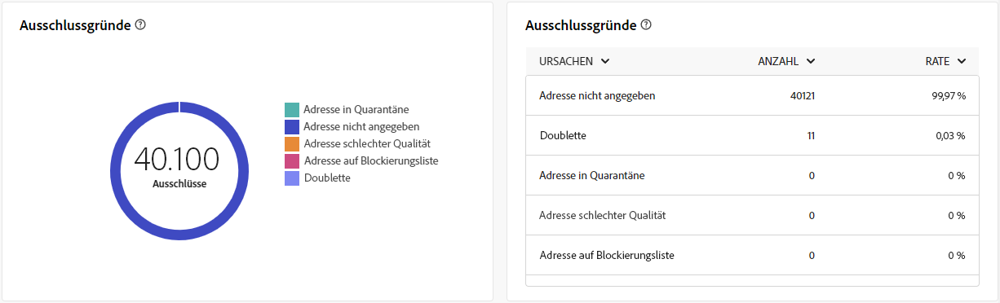

# Globale Berichte für den Briefpost-Kanal {#global-report-direct}

Die globalen Briefpost-Berichte bieten Benutzern einen umfassenden Überblick über Traffic- und Interaktionsmetriken auf Kanalebene.

Navigieren Sie zum Menü **[!UICONTROL Berichte]** im Abschnitt **[!UICONTROL Berichterstellung]**. Sie können Ihre Daten nach Berichtsdatum, -ordner oder -regeln filtern. [Weitere Informationen](global-reports.md)

## Versandzusammenfassung {#delivery-summary-direct}

### Versandübersicht {#delivery-overview-direct}

>[!CONTEXTUALHELP]
>id="acw_global_reporting_delivery_overview_direct_mail"
>title="Versandübersicht"
>abstract="Die **Versandübersicht** bietet wichtige Leistungsmetriken (KPIs) mit umfassenden Erkenntnissen über die Interaktion Ihrer Besucherinnen und Besucher mit jedem Briefpostversand. Die Metriken sind unten dargestellt."

Die **[!UICONTROL Versandübersicht]** bietet wichtige Leistungsmetriken (KPIs) mit umfassenden Erkenntnissen über die Interaktion Ihrer Besucherinnen und Besucher mit jedem Briefpostversand. Die Metriken sind unten dargestellt.

{zoomable=&quot;yes&quot;}{align="center"}

+++Erfahren Sie mehr über Versandübersichtsmetriken.

* **[!UICONTROL Zu sendende Nachrichten]**: Gesamtzahl der während der Versandvorbereitung verarbeiteten Nachrichten.

* **[!UICONTROL Zugestellt]**: Anzahl der erfolgreich gesendeten Nachrichten im Verhältnis zur Gesamtzahl der gesendeten Nachrichten.

* **[!UICONTROL Fehler]**: Summe der Fehler, die beim Versand und bei der automatischen Rücksendung kumuliert wurden, bezogen auf die Gesamtzahl der gesendeten Nachrichten.

* **[!UICONTROL Abmeldungen]**: Anzahl der Empfänger, die auf „Abmelden“ geklickt haben.
+++

### Zielgruppe {#delivery-summary-direct-initial-target}

>[!CONTEXTUALHELP]
>id="acw_global_reporting_target_audience_direct_mail_graph"
>title="Zielgruppe"
>abstract="Empfängerdaten und Nachrichteninformationen werden im Graph **Zielgruppe** angezeigt, der die Analyse der Versandvorbereitung widerspiegelt."

>[!CONTEXTUALHELP]
>id="acw_global_reporting_target_audience_direct_mail_table"
>title="Zielgruppe"
>abstract="Die Tabelle **Zielgruppe** enthält eine detaillierte Aufschlüsselung Ihrer Empfängerinnen und Empfänger sowie der entsprechenden Nachrichten, und zwar basierend auf den Ergebnissen der Versandvorbereitung."

Die Tabelle und der Graph **[!UICONTROL Zielgruppe]** zeigen Daten zu Ihren Empfängerinnen und Empfängern, mit detaillierten Metriken unten.

{zoomable=&quot;yes&quot;}{align="center"}

+++Erfahren Sie mehr über Zielgruppen-Metriken.

* **[!UICONTROL Zielgruppe]**: Gesamtzahl der angesprochenen Empfängerinnen und Empfänger.

* **[!UICONTROL Zu versendende Nachricht]**: Gesamtzahl der nach erfolgter Versandvorbereitung zu versendenden Nachrichten.

* **[!UICONTROL Ausschluss]**: Gesamtzahl der Adressen, die bei der Anwendung von Regeln in der Analyse ignoriert werden: fehlende Adresse, in Quarantäne, auf der Blockierungsliste, usw.

+++

### Versandstatistiken {#delivery-summary-direct-exec-stats}

>[!CONTEXTUALHELP]
>id="acw_global_reporting_delivery_statistics_summary_direct_mail_graph"
>title="Versandstatistiken"
>abstract="Der Graph **Versandstatistiken** bietet Erkenntnisse über die Effektivität Ihrer Briefpostsendungen, einschließlich erfolgreicher Sendungen und aufgetretener Fehler."

>[!CONTEXTUALHELP]
>id="acw_global_reporting_delivery_statistics_summary_direct_mail_table"
>title="Versandstatistiken"
>abstract="Der Graph **Versandstatistiken** zeigt den Erfolg Ihres Briefpostversands und die aufgetretenen Fehler an."

Die **[!UICONTROL Versandstatistiken]** Diagramm und Tabelle enthalten eine Aufschlüsselung des Erfolgs jedes Briefpost-Versands mit detaillierten Metriken, die unten beschrieben werden.

+++Erfahren Sie mehr über Versandstatistik-Metriken.

* **[!UICONTROL Zu versendende Nachricht]**: Gesamtzahl der nach erfolgter Versandvorbereitung zu versendenden Nachrichten.

* **[!UICONTROL Erfolg]**: Anzahl der erfolgreich verarbeiteten Nachrichten im Verhältnis zur Anzahl der zu versendenden Nachrichten.

* **[!UICONTROL Fehler/Bounces]**: Gesamtzahl der über alle Sendungen hinweg kumulierten Fehler und der automatischen Bounce-Verarbeitungen im Verhältnis zur Anzahl der zu versendenden Nachrichten.

* **[!UICONTROL Neue Quarantänen]**: Gesamtzahl der Adressen, die infolge eines fehlgeschlagenen Versands unter Quarantäne gestellt wurden (unbekannter Nutzer, ungültige Domain), im Verhältnis zur Anzahl der zu versendenden Nachrichten.

+++

### Ausschlussgründe {#causes-exclusion}

>[!CONTEXTUALHELP]
>id="acw_global_reporting_exclusions_direct_mail_table"
>title="Ausschlüsse"
>abstract="Die Tabelle **Ausschlussgründe** zeigt eine detaillierte Aufschlüsselung der während der Versandvorbereitung zurückgewiesenen Nachrichten nach Regeln an."

>[!CONTEXTUALHELP]
>id="acw_global_reporting_causes_exclusion_direct_mail_graph"
>title="Versand – Ausschlussgründe"
>abstract="Der Graph **Ausschlussgründe** zeigt die Verteilung der zurückgewiesenen Nachrichten während der Versandvorbereitung, kategorisiert nach der jeweiligen Regel."

{zoomable=&quot;yes&quot;}{align="center"}

Der Graph und die Tabelle „Ausschlüsse“ zeigen die Gründe, aus denen Benutzerprofile, die aus den Zielprofilen ausgeschlossen sind, die Benachrichtigung nicht erhalten haben.

+++ Erfahren Sie mehr über Ursachen für Ausschlussmetriken.

* **[!UICONTROL Adresse in Quarantäne]**: Fehler, der erzeugt wird, wenn eine Adresse unter Quarantäne gestellt wird.

* **[!UICONTROL Adresse nicht angegeben]**: Fehler, der beim Versand erzeugt wird, um anzugeben, dass die Adresse nicht vorhanden ist.

* **[!UICONTROL Adresse schlechter Qualität]**: Fehler, der erzeugt wird, wenn die Qualität der Postanschrift zu niedrig ist.

* **[!UICONTROL Auf die Blockierungsliste gesetzt Adresse]**: Fehler, der erzeugt wurde, wenn der Empfänger zum Zeitpunkt der Versanddurchführung auf die Blockierungsliste gesetzt wurde.

* **[!UICONTROL Double]**: Fehler, der erzeugt wurde, wenn der Empfänger ausgeschlossen wurde, da seine Schlüsselwerte nicht eindeutig waren.

* **[!UICONTROL Kontrollgruppe]**: Die Adresse des Empfängers ist Teil der Kontrollgruppe.

* **[!UICONTROL Größe der Zielgruppe begrenzt]**: Die maximale Versandgröße wurde für den Empfänger erreicht.

+++
