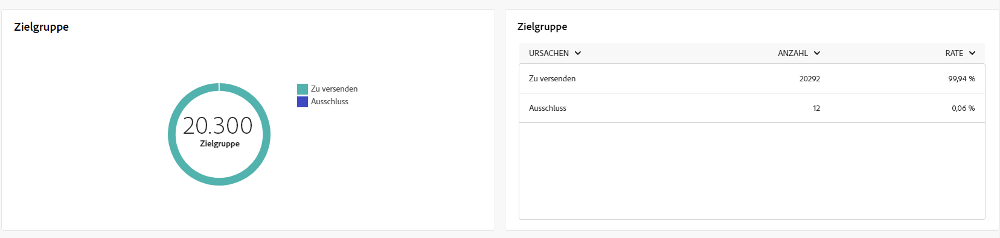
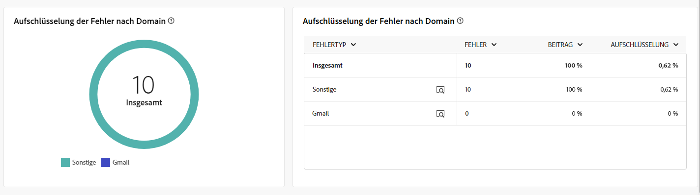
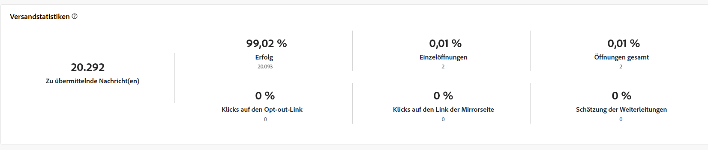
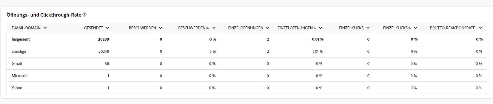
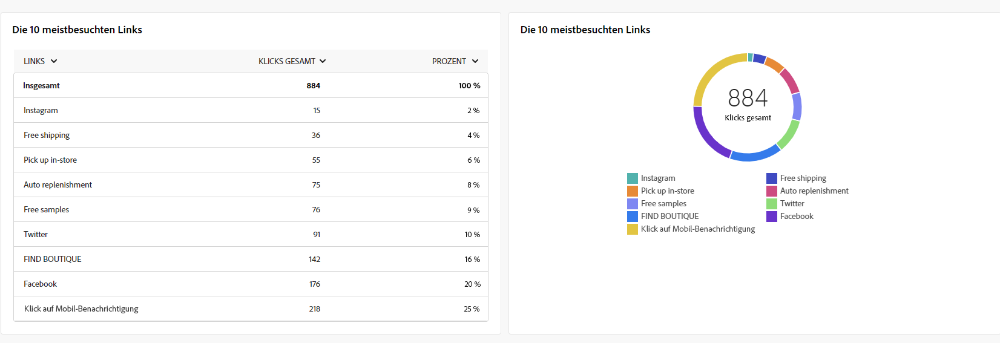

# Globale Berichte für den E-Mail-Kanal {#global-report-direct}

Die globalen Berichte bieten einen umfassenden Überblick über Traffic- und Interaktionsmetriken auf Kanalebene.

Navigieren Sie zum Menü **[!UICONTROL Berichte]** im Abschnitt **[!UICONTROL Berichterstellung]**. Sie können Ihre Daten nach Berichtsdatum, -ordner oder -regeln filtern. [Weitere Informationen](global-reports.md)

## Versandzusammenfassung {#delivery-summary-email}

### Versandübersicht {#delivery-overview-email}

>[!CONTEXTUALHELP]
>id="acw_global_reporting_deliveries_overview_email"
>title="Versandübersicht"
>abstract="Die **Versandübersicht** enthält wichtige Leistungsindikatoren (KPI), die einen umfassenden Einblick in die Interaktion Ihrer Zielgruppe mit Ihren E-Mail-Sendungen und Kampagnen bieten."

Die **[!UICONTROL Versandübersicht]** präsentiert wichtige Leistungsmetriken (KPI) mit umfassenden Einblicken in die Interaktion Ihrer Besuchenden mit jedem E-Mail-Versand. Die Metriken sind unten dargestellt.

{zoomable="yes"}{align="center"}

+++Erfahren Sie mehr über Versandübersichtsmetriken.

* **[!UICONTROL Zu sendende Nachrichten]**: Gesamtzahl der während der Versandvorbereitung verarbeiteten Nachrichten.

* **[!UICONTROL Zugestellt]**: Anzahl der erfolgreich gesendeten Nachrichten im Verhältnis zur Gesamtzahl der gesendeten Nachrichten.

* **[!UICONTROL Öffnungen insgesamt]**: Gesamtzahl der angesprochenen Empfängerinnen und Empfänger, die mindestens einmal eine Nachricht geöffnet haben.

* **[!UICONTROL Klicks gesamt]**: Gesamtzahl der Empfängerinnen und Empfänger, die einen Versand mindestens einmal angeklickt haben.

* **[!UICONTROL Bounces und Fehler]**: Gesamtzahl der über alle Sendungen hinweg kumulierten Fehler und der automatischen Bounce-Verarbeitung in Bezug auf die Gesamtzahl der gesendeten Nachrichten.

* **[!UICONTROL Abmeldungen]**: Anzahl der Empfängerinnen und Empfänger, die auf „Abmelden“ geklickt haben.
+++

### Zielgruppe {#delivery-summary-email-initial-target}

>[!CONTEXTUALHELP]
>id="acw_global_reporting_target_audience_email"
>title="Statistiken der ursprünglichen Zielgruppe"
>abstract="Die Tabelle und der Graph **Zielgruppe** bieten Einblicke in die Interaktion der Empfängerinnen und Empfänger, sodass Sie die Effektivität Ihrer Kampagnen und Sendungen bewerten können."

Die Tabelle und der Graph **[!UICONTROL Zielgruppe]** zeigen Daten zu Ihren Empfängerinnen und Empfängern, mit detaillierten Metriken unten.

{zoomable="yes"}{align="center"}

+++Erfahren Sie mehr über Zielgruppen-Metriken.

* **[!UICONTROL Zielgruppe]**: Gesamtzahl der angesprochenen Empfängerinnen und Empfänger.

* **[!UICONTROL Zu versendende Nachricht]**: Gesamtzahl der nach erfolgter Versandvorbereitung zu versendenden Nachrichten.

* **[!UICONTROL Ausschluss]**: Gesamtzahl der Adressen, die bei der Anwendung von Regeln in der Analyse ignoriert werden: fehlende Adresse, in Quarantäne, auf der Blockierungsliste, usw.

+++

### Versandstatistiken {#delivery-summary-email-delivery-stats}

>[!CONTEXTUALHELP]
>id="acw_global_reporting_email_delivery_stats"
>title="Versandstatistiken"
>abstract="Der Graph und die Tabelle **Versandstatistiken** enthalten wichtige Metriken, wie erfolgreiche Sendungen, Fehler und neue Quarantänen, und bieten einen kurzen Überblick zur Beurteilung der Versandleistung."

Die Tabelle **[!UICONTROL Versandstatistiken]** bietet eine Aufschlüsselung des Erfolgs jedes E-Mail-Versands mit detaillierten Metriken, die unten beschrieben werden.

{zoomable="yes"}{align="center"}

+++Erfahren Sie mehr über Versandstatistik-Metriken.

* **[!UICONTROL Zu versendende Nachricht]**: Gesamtzahl der nach erfolgter Versandvorbereitung zu versendenden Nachrichten.

* **[!UICONTROL Erfolg]**: Anzahl der erfolgreich verarbeiteten Nachrichten im Verhältnis zur Anzahl der zu versendenden Nachrichten.

* **[!UICONTROL Fehler/Bounces]**: Gesamtzahl der über alle Sendungen hinweg kumulierten Fehler und der automatischen Bounce-Verarbeitungen im Verhältnis zur Anzahl der zu versendenden Nachrichten.

* **[!UICONTROL Neue Quarantänen]**: Gesamtzahl der Adressen, die infolge eines fehlgeschlagenen Versands unter Quarantäne gestellt wurden (unbekannter Nutzer, ungültige Domain), im Verhältnis zur Anzahl der zu versendenden Nachrichten.

+++

### Ausschlussgründe {#causes-exclusion}

>[!CONTEXTUALHELP]
>id="acw_global_reporting_exclusion_email"
>title="Ausschlussgründe"
>abstract="Der Graph und die Tabelle **Ausschlussgründe** veranschaulichen die spezifischen Gründe für die Zurückweisung von Nachrichten während der Versandvorbereitung und bieten eine detaillierte Aufschlüsselung nach Regel."

{zoomable="yes"}{align="center"}

Der Graph und die Tabelle „Ausschlüsse“ zeigen die Gründe, aus denen Benutzerprofile, die aus den Zielprofilen ausgeschlossen sind, die Benachrichtigung nicht erhalten haben.

Die E-Mail-Fehlertypen werden in der [Dokumentation zu Adobe Campaign v8 (Client-Konsole)](https://experienceleague.adobe.com/docs/campaign/campaign-v8/send/failures/delivery-failures.html?lang=de#email-error-types){target="_blank"} aufgelistet.

## Versanddurchsatz {#delivery-throughput}

>[!CONTEXTUALHELP]
>id="acw_global_reporting_throughput_email"
>title="Versanddurchsatz"
>abstract="Dieser **Versanddurchsatz** liefert umfassende Einblicke in den Versanddurchsatz und hebt die Erfolgs- und Fehlerquoten innerhalb eines bestimmten Zeitraums hervor."

{zoomable="yes"}{align="center"}

Der Versanddurchsatz-Bericht bietet einen umfassenden Einblick in die Effizienz des Versandprozesses und einen detaillierten Überblick über Erfolgs- und Fehlerquoten innerhalb eines bestimmten Zeitraums.

+++Erfahren Sie mehr über Versanddurchsatzmetriken.

* **[!UICONTROL Erfolg]**: Anzahl der erfolgreich verarbeiteten Nachrichten im Verhältnis zur Anzahl der zu versendenden Nachrichten.

* **[!UICONTROL Fehler]**: Gesamtzahl der über alle Sendungen hinweg kumulierten Fehler und der automatischen Bounce-Verarbeitungen im Verhältnis zur Anzahl der zu versendenden Nachrichten.

+++

## Unzustellbare Nachrichten {#non-deliverables-email}

### Aufschlüsselung der Fehler nach Typen {#delivery-summary-email-breakdown-per-type}

>[!CONTEXTUALHELP]
>id="acw_global_reporting_error_type_email"
>title="Aufschlüsselung der Fehler nach Typen"
>abstract="Die Tabelle und der Graph mit Details zur **Verteilung der Fehler nach Typ** liefern Informationen zu verschiedenen Fehlertypen, die während des Prozesses aufgetreten sind, einschließlich unbekannter Nutzer, Postfach voll, ungültige Domain und anderer."

{zoomable="yes"}{align="center"}

Die Tabelle und der Graph **[!UICONTROL Verteilung der Fehler nach Typ]** enthalten die Daten zu potenziellen Fehlern in verschiedenen Domains, deren spezifische Metriken unten angegeben sind.

Die in diesem Bericht angezeigten Fehler lösen einen Quarantäneprozess aus. Weitere Informationen zur Quarantäneverwaltung finden Sie in der [Dokumentation zu Campaign v8 (Client-Konsole)](https://experienceleague.adobe.com/docs/campaign/campaign-v8/campaigns/send/failures/delivery-failures.html?lang=de){target="_blank"}.

+++Erfahren Sie mehr über die Metriken zur Fehleraufschlüsselung nach Typ.

* **[!UICONTROL Unbekannter Nutzer]**: Fehlertyp, der während des Versands erzeugt wird, um anzuzeigen, dass die E-Mail-Adresse ungültig ist.

* **[!UICONTROL Ungültige Domain]**: Fehlertyp, der beim Senden eines Versands erzeugt wird, um anzuzeigen, dass die Domain der E-Mail-Adresse falsch ist oder nicht existiert.

* **[!UICONTROL Postfach voll]**: Fehlertyp, der nach fünf fehlgeschlagenen Versandversuchen erzeugt wird, wenn das Empfängerpostfach zu viele Nachrichten enthält.

* **[!UICONTROL Account deaktiviert]**: Fehlertyp, der beim Senden eines Versands erzeugt wird, um anzuzeigen, dass die Adresse nicht mehr existiert.

* **[!UICONTROL Verweigert]**: Fehlertyp, der erzeugt wird, wenn eine Adresse vom IAP (Internet Access Provider) abgelehnt wird, z. B. nach Anwendung einer Sicherheitsregel (Anti-Spam-Software).

* **[!UICONTROL Unerreichbar]**: Fehlertyp, der in der Nachrichtenverteilungs-Zeichenfolge auftritt: Vorfall im SMTP-Relais, Domain vorübergehend unerreichbar usw.

* **[!UICONTROL Nicht angemeldet]**: Fehlertyp, wenn das Mobiltelefon der Empfängerin bzw. des Empfängers zum Zeitpunkt des Versands ausgeschaltet war oder über keinen Netzempfang verfügte.

+++

### Aufschlüsselung der Fehler nach Domain {#delivery-summary-email-breakdown-per-domain}

>[!CONTEXTUALHELP]
>id="acw_global_reporting_error_domain_email"
>title="Aufschlüsselung der Fehler nach Domain"
>abstract="Die Tabelle und der Graph zur Darstellung der **Verteilung der Fehler nach Domain** enthalten die Daten jedes aufgetretenen Fehlertyps, kategorisiert nach bestimmten Domains."

{zoomable="yes"}{align="center"}

Die Tabelle und der Graph **[!UICONTROL Verteilung der Fehler nach Domain]** enthalten die Daten zu potenziellen Fehlern innerhalb der einzelnen Domains. Die Metriken sind dieselben wie die der Tabelle und des Graphen **[!UICONTROL Aufschlüsselung der Fehler nach Typ]** weiter oben.

## Tracking-Indikatoren {#tracking-indicators-email}

### Versandstatistiken {#delivery-summary-email-statistics}

>[!CONTEXTUALHELP]
>id="acw_global_delivery_statistics_summary_email"
>title="Versandstatistiken"
>abstract="Die Leistungskennzahlen (KPI) zu **Versandstatistiken** bieten einen umfassenden Überblick über die Leistung Ihrer Sendungen und Kampagnen und bieten Einblicke sowohl zu erfolgreichen Sendungen als auch zu aufgetretenen Fehlern und Benutzerinteraktionen."

Die Metriken zu **[!UICONTROL Versandstatistiken]** bieten wichtige Leistungskennzahlen (KPI) mit detaillierten Informationen zu den mit jedem E-Mail-Versand verbundenen Daten. Weitere Details zu diesen Metriken finden Sie unten.

{zoomable="yes"}{align="center"}

+++Erfahren Sie mehr über Versandstatistik-Metriken.

* **[!UICONTROL Zu sendende Nachrichten]**: Gesamtzahl der während der Versandvorbereitung verarbeiteten Nachrichten.

* **[!UICONTROL Erfolg]**: Anzahl der erfolgreich verarbeiteten Nachrichten im Verhältnis zur Anzahl der zu versendenden Nachrichten.

* **[!UICONTROL Einzelöffnungen]**: Gesamtzahl der Zielgruppenempfängerinnen und -empfänger, die mindestens einmal eine Nachricht geöffnet haben.

* **[!UICONTROL Öffnungen insgesamt]**: Anzahl der unterschiedlichen Zielgruppenempfängerinnen und -empfänger dieser Domain, die mindestens einmal eine Nachricht geöffnet haben.

* **[!UICONTROL Klicks auf den Abmelde-Link]**: Anzahl der Klicks auf den Abmelde-Link.

* **[!UICONTROL Klicks auf den Mirror-Link]**: Anzahl der Klicks auf den Link der Mirrorseite.

* **[!UICONTROL Schätzung der Weiterleitungen]**: Schätzung der Anzahl der E-Mails, die von den Zielgruppenempfängerinnen und -empfängern weitergeleitet werden.
+++

### Öffnungs- und Clickthrough-Rate {#delivery-summary-open-rate}

>[!CONTEXTUALHELP]
>id="acw_global_reporting_open_clickthrough_email"
>title="Öffnungs- und Clickthrough-Rate"
>abstract="Die Tabelle **Öffnungs- und Klickraten** zeigt die Interaktion der Empfängerinnen und Empfänger mit Ihrem Versand sowie Daten zu Öffnungs- und Klickraten, um einen schnellen und aufschlussreichen Überblick zu erhalten."

Die Tabelle **[!UICONTROL Öffnungs- und Clickthrough-Rate]** zeigt Daten zu Ihren Empfängerinnen und Empfängern an. Metriken werden nachfolgend beschrieben.

{zoomable="yes"}{align="center"}

+++Erfahren Sie mehr über die Metriken zu Öffnungs- und Klickraten.

* **[!UICONTROL Gesendet]**: Gesamtzahl der gesendeten Nachrichten.

* **[!UICONTROL Beschwerden]**: Anzahl und Prozentsatz der Nachrichten für diese Domain, die von der Empfängerin oder vom Empfänger als unerwünscht gemeldet wurden.

* **[!UICONTROL Einzelöffnungen]**: Anzahl und Prozentsatz der unterschiedlichen Zielgruppenempfängerinnen und -empfänger dieser Domain, die mindestens einmal eine Nachricht geöffnet haben.

* **[!UICONTROL Einzelklicks]**: Anzahl und Prozentsatz der unterschiedlichen Zielgruppenempfängerinnen und -empfänger, die mindestens einmal im betreffenden Versand geklickt haben.

* **[!UICONTROL Brutto-Reaktionsrate]**: Prozentualer Anteil der Empfängerinnen und Empfänger, die mindestens einmal in einem Versand geklickt haben, in Bezug auf die Empfängerinnen und Empfänger, die mindestens einmal einen Versand geöffnet haben.
+++

## URLs und Clickstreams {#url-email}

### KPIs zu URLs und Clickstreams {#url-email-kpis}

>[!CONTEXTUALHELP]
>id="acw_global_reporting_urls_clickstreams_email"
>title="URLs und Clickstreams"
>abstract="Der Bericht **URL und Clickstreams** liefert wichtige Leistungskennzahlen (KPI) und bietet detaillierte Einblicke in die während eines Versands am häufigsten angeklickten URLs."

Der Bericht **[!UICONTROL URLs und Clickstreams]** bietet durch die enthaltenen Leistungskennzahlen (KPIs) einen detaillierten Einblick in die URLs, die während eines Versands am häufigsten angeklickt wurden. Metriken werden nachfolgend beschrieben.

{zoomable="yes"}{align="center"}

+++Weitere Informationen zu Metriken zu URL und Clickstreams.

* **[!UICONTROL Reaktionsrate]**: Verhältnis der Anzahl an Zielgruppenempfängerinnen und -empfängern, die auf einen Versand geklickt haben, im Verhältnis zur geschätzten Anzahl der Zielgruppenempfängerinnen und -empfänger, die einen Versand geöffnet haben.

* **[!UICONTROL Einzelklicks]**: Gesamtzahl der unterschiedlichen Empfängerinnen und Empfänger, die einen Versand mindestens einmal angeklickt haben.

* **[!UICONTROL Klicks insgesamt]**: Gesamtzahl der Klicks auf Links in Sendungen.

* **[!UICONTROL Plattform-Durchschnitt]**: Dieser Durchschnittswert, der unter jeder Rate (Reaktivität, Unique Clicks und Klicks insgesamt) angezeigt wird, bezieht sich auf die in den letzten sechs Monaten verschickten Sendungen. Es werden nur Sendungen mit derselben Typologie und mit demselben Kanal berücksichtigt. Testsendungen sind ausgeschlossen.
+++

### Die 10 meistbesuchten Links {#top10-global-report-email}

>[!CONTEXTUALHELP]
>id="acw_global_reporting_top10_email"
>title="Die 10 meistbesuchten Links"
>abstract="Der Graph und die Tabelle zu den **10 meistbesuchten Links** enthalten umfassende Daten zur Empfängerinteraktion mit jedem Link."

Der Graph und die Tabelle zu den **[!UICONTROL 10 meistbesuchten Links]** enthalten die verfügbaren Daten zum Empfängerverhalten für die einzelnen Links. Metriken werden nachfolgend beschrieben.

{zoomable="yes"}{align="center"}

+++Erfahren Sie mehr über die Metriken zu den 10 meistbesuchten Links.

* **[!UICONTROL Klicks insgesamt]**: Gesamtzahl der Klicks auf Links in Sendungen.

* **[!UICONTROL Prozentsatz]**: Prozentsatz der Benutzerinnen und Benutzer, die mit dem Versand interagiert haben

+++

### Aufschlüsselung der Klicks im Zeitverlauf {#global-report-email-breakdown-clicks}

>[!CONTEXTUALHELP]
>id="acw_global_reporting_urls_click_breakdown_email"
>title="Aufschlüsselung der Klicks im Zeitverlauf"
>abstract="Der Graph **Zeitliche Klickverteilung** bietet einen umfassenden Überblick darüber, wie Empfängerinnen und Empfänger während des festgelegten Zeitraums mit Links interagieren."

Der Graph zur **[!UICONTROL Aufschlüsselung der Klicks im Zeitverlauf]** enthält die verfügbaren Daten zum Empfängerverhalten für jeden Link.

{zoomable="yes"}{align="center"}

## Benutzeraktivitäten {#user-activities-email}

>[!CONTEXTUALHELP]
>id="acw_global_reporting_user_activities_email"
>title="Benutzeraktivitäten"
>abstract="Die grafische Darstellung der **Benutzeraktivitäten** bietet eine detaillierte Aufschlüsselung der Empfängerinteraktionen und zeigt die Öffnungen und Klicks in einem informativen Tabellenformat an."

Der Bericht **[!UICONTROL Benutzeraktivitäten]** zeigt die Aufschlüsselung der Öffnungen und Klicks in Form eines Diagramms. Die Metriken für diesen Bericht werden nachfolgend beschrieben.

{zoomable="yes"}{align="center"}

+++Erfahren Sie mehr über die Metriken zu Benutzeraktivitäten.

* **[!UICONTROL Klicks insgesamt]**: Gesamtzahl der Klicks auf Links in Sendungen.

* **[!UICONTROL Öffnungen insgesamt]**: Gesamtzahl der direkt angesprochenen Empfängerinnen und Empfänger dieser Domain, die eine Nachricht mindestens einmal geöffnet haben.

+++
