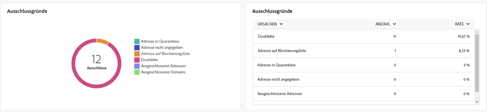
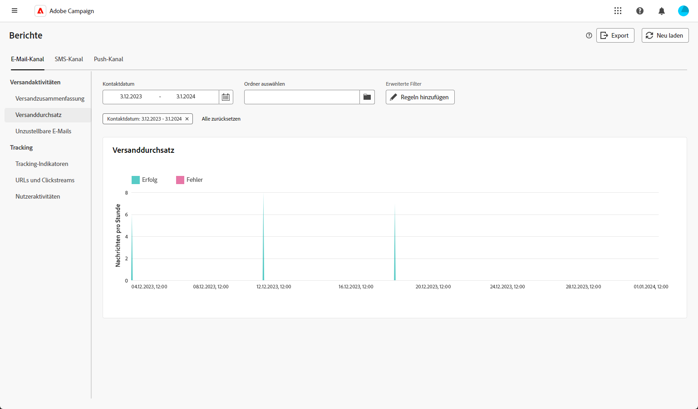
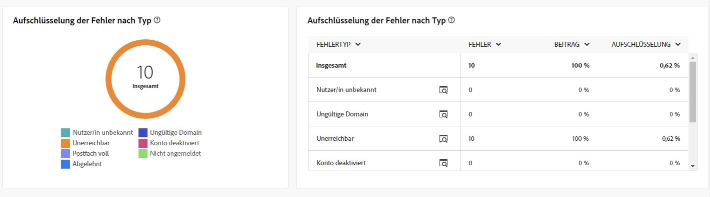
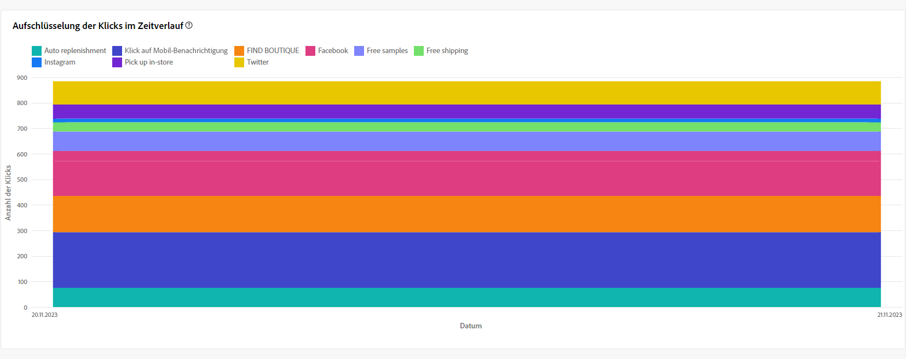
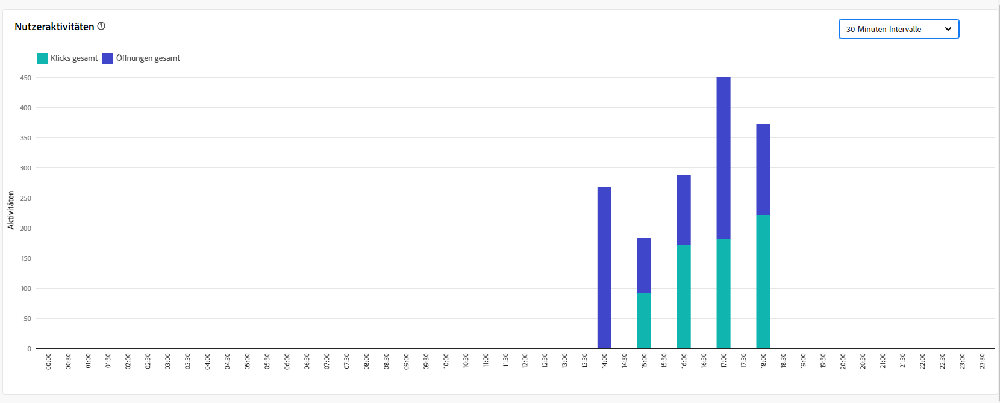

# Globale Berichte für den E-Mail-Kanal {#global-report-direct}

Die globalen Berichte bieten Benutzern einen umfassenden Überblick über Traffic- und Interaktionsmetriken auf Kanalebene.

Navigieren Sie zum **[!UICONTROL Berichte]** innerhalb des **[!UICONTROL Berichterstellung]** Abschnitt. Sie können Ihre Daten nach Berichtsdatum, -ordner oder -regeln filtern. [Weitere Informationen](global-reports.md)

## Versandzusammenfassung {#delivery-summary-email}

### Versandübersicht {#delivery-overview-email}

>[!CONTEXTUALHELP]
>id="acw_global_reporting_deliveries_overview_email"
>title="Versandübersicht"
>abstract="Die **Versandübersicht** enthält wichtige Leistungsindikatoren (KPIs), die einen umfassenden Einblick in die Interaktion Ihrer Audience mit den von Ihnen gesendeten E-Mail-Sendungen und Kampagnen bieten."

Die **[!UICONTROL Versandübersicht]** präsentiert wichtige Leistungsmetriken (KPIs) mit umfassenden Einblicken in die Interaktion Ihrer Besucher mit jedem E-Mail-Versand. Die Metriken sind unten dargestellt.

{align="center"}

+++ Erfahren Sie mehr über Versandübersichtsmetriken.

* **[!UICONTROL Zu sendende Nachrichten]**: Gesamtzahl der während der Versandvorbereitung verarbeiteten Nachrichten.

* **[!UICONTROL Zugestellt]**: Anzahl der erfolgreich gesendeten Nachrichten im Verhältnis zur Gesamtzahl der gesendeten Nachrichten.

* **[!UICONTROL Öffnungen insgesamt]**: Gesamtzahl der Zielgruppenempfängerinnen und -empfänger, die mindestens einmal eine Nachricht geöffnet haben.

* **[!UICONTROL Klicks insgesamt]**: Gesamtzahl der Empfänger, die mindestens einmal im betreffenden Versand geklickt haben.

* **[!UICONTROL Bounces und Fehler]**: Gesamtzahl der über alle Sendungen hinweg kumulierten Fehler und der automatischen Bounce-Verarbeitung in Bezug auf die Gesamtzahl der gesendeten Nachrichten.

* **[!UICONTROL Abmeldungen]**: Anzahl der Empfänger, die auf Abmeldungen geklickt haben.
+++

### Zielgruppe {#delivery-summary-email-initial-target}

>[!CONTEXTUALHELP]
>id="acw_global_reporting_target_audience_email"
>title="Statistiken der ursprünglichen Zielgruppe"
>abstract="Die **Zielgruppe** Tabelle und Diagramm bieten Einblicke in die Interaktion der Empfänger, sodass Sie die Effektivität Ihrer Kampagnen und Sendungen bewerten können."

Tabelle und Diagramm für **[!UICONTROL Zielgruppe]** zeigt Daten zu Ihren Empfängern mit detaillierten Metriken an, die unten bereitgestellt werden.

{align="center"}

+++ Erfahren Sie mehr über Zielgruppen-Metriken.

* **[!UICONTROL Zielgruppe]**: Gesamtzahl der Zielgruppenempfänger.

* **[!UICONTROL Zu versendende Nachricht]**: Gesamtzahl der nach erfolgter Versandvorbereitung zu versendenden Nachrichten.

* **[!UICONTROL Ausschluss]**: Gesamtzahl der Adressen, die bei Anwendung der Regeln während der Analyse ignoriert wurden: fehlende Adresse, in Quarantäne, Blockierungsliste usw.

+++

### Versandstatistiken {#delivery-summary-email-delivery-stats}

>[!CONTEXTUALHELP]
>id="acw_global_reporting_email_delivery_stats"
>title="Versandstatistiken"
>abstract="Die **Versandstatistiken** Diagramme und Tabellen enthalten wichtige Metriken, einschließlich erfolgreicher Sendungen, Fehler und neuer Quarantänen, und bieten einen kurzen Überblick zur Beurteilung der Versandleistung."

Die **[!UICONTROL Versandstatistiken]** bietet eine Aufschlüsselung des Erfolgs jedes E-Mail-Versands mit detaillierten Metriken, die unten beschrieben werden.

{align="center"}

+++ Erfahren Sie mehr über Versandstatistiken-Metriken.

* **[!UICONTROL Zu versendende Nachricht]**: Gesamtzahl der nach erfolgter Versandvorbereitung zu versendenden Nachrichten.

* **[!UICONTROL Erfolg]**: Anzahl der erfolgreich verarbeiteten Nachrichten im Verhältnis zur Anzahl der zu versendenden Nachrichten.

* **[!UICONTROL Fehler/Bounces]**: Gesamtzahl der über alle Sendungen hinweg kumulierten Fehler und der automatischen Bounce-Verarbeitung in Bezug auf die Zahl der zu sendenden Nachrichten.

* **[!UICONTROL Neue Quarantänen]**: Gesamtzahl der Adressen, die infolge eines fehlgeschlagenen Versands unter Quarantäne gestellt wurden (unbekannter Nutzer, ungültige Domain), im Verhältnis zur Anzahl der zu versendenden Nachrichten.

+++

### Ausschlussgründe {#causes-exclusion}

>[!CONTEXTUALHELP]
>id="acw_global_reporting_exclusion_email"
>title="Ausschlussgründe"
>abstract="Die **Ausschlussgründe** Diagramm und Tabelle veranschaulichen die spezifischen Gründe für die Zurückweisung von Nachrichten während der Versandvorbereitung und bieten eine detaillierte Aufschlüsselung nach Regel."

{align="center"}

Das Diagramm und die Tabelle Ausschlüsse veranschaulichen die Gründe, aus denen verhindert wurde, dass aus den Zielgruppenprofilen ausgeschlossene Benutzerprofile die Nachricht empfangen.

Die E-Mail-Fehlertypen werden in der [Dokumentation zu Adobe Campaign v8 (Client-Konsole)](https://experienceleague.adobe.com/docs/campaign/campaign-v8/send/failures/delivery-failures.html?lang=de#email-error-types){target="_blank"} aufgelistet.

## Versanddurchsatz {#delivery-throughput}

>[!CONTEXTUALHELP]
>id="acw_global_reporting_throughput_email"
>title="Versanddurchsatz"
>abstract="Diese **Versanddurchsatz** liefert umfassende Einblicke in den Versanddurchsatz und hebt die Erfolgs- und Fehlerquoten innerhalb eines bestimmten Zeitraums hervor."

{align="center"}

Der Bericht Versanddurchsatz bietet einen umfassenden Einblick in die Effizienz des Versandprozesses und bietet einen detaillierten Überblick über Erfolgs- und Fehlerquoten innerhalb eines bestimmten Zeitraums.

+++ Erfahren Sie mehr über Versanddurchsatzmetriken.

* **[!UICONTROL Erfolg]**: Anzahl der erfolgreich verarbeiteten Nachrichten im Verhältnis zur Anzahl der zu versendenden Nachrichten.

* **[!UICONTROL Fehler]**: Gesamtzahl der über alle Sendungen hinweg kumulierten Fehler und der automatischen Bounce-Verarbeitungen im Verhältnis zur Anzahl der zu versendenden Nachrichten.

+++

## Unzustellbare Nachrichten {#non-deliverables-email}

### Aufschlüsselung der Fehler nach Typen {#delivery-summary-email-breakdown-per-type}

>[!CONTEXTUALHELP]
>id="acw_global_reporting_error_type_email"
>title="Aufschlüsselung der Fehler nach Typen"
>abstract="Die Tabelle und das Diagramm mit Details zu **Verteilung der Fehler nach Typ** umfasst Informationen zu verschiedenen Fehlertypen, die während des Prozesses aufgetreten sind, einschließlich unbekannter Nutzer, Postfach voll, ungültiger Domain und anderer."

{align="center"}

Die **[!UICONTROL Verteilung der Fehler nach Typ]** -Tabelle und -diagramm enthält die Daten zu potenziellen Fehlern in verschiedenen Domänen, wobei spezifische Metriken unten bereitgestellt werden.

Die in diesem Bericht angezeigten Fehler lösen einen Quarantäneprozess aus. Weitere Informationen zur Quarantäneverwaltung finden Sie in der [Dokumentation zu Campaign v8 (Client-Konsole)](https://experienceleague.adobe.com/docs/campaign/campaign-v8/campaigns/send/failures/delivery-failures.html?lang=de){target="_blank"}.

+++ Erfahren Sie mehr über die Verteilung der Fehler nach Typmetriken.

* **[!UICONTROL Unbekannter Nutzer]**: Fehlertyp, der während des Versands erzeugt wird, um anzuzeigen, dass die E-Mail-Adresse ungültig ist.

* **[!UICONTROL Ungültige Domain]**: Fehlertyp, der beim Senden eines Versands erzeugt wird, um anzuzeigen, dass die Domain der E-Mail-Adresse falsch ist oder nicht existiert.

* **[!UICONTROL Postfach voll]**: Fehlertyp, der nach fünf fehlgeschlagenen Versandversuchen erzeugt wird, wenn das Empfängerpostfach zu viele Nachrichten enthält.

* **[!UICONTROL Account deaktiviert]**: Fehlertyp, der beim Senden eines Versands erzeugt wird, um anzuzeigen, dass die Adresse nicht mehr existiert.

* **[!UICONTROL Verweigert]**: Fehlertyp, der erzeugt wird, wenn eine Adresse vom IAP (Internet Access Provider) abgelehnt wird, z. B. nach Anwendung einer Sicherheitsregel (Anti-Spam-Software).

* **[!UICONTROL Unerreichbar]**: Fehlertyp, der in der Verteilungskette der Nachricht auftritt: Vorfall im SMTP-Relais, Domain vorübergehend unerreichbar, usw.

* **[!UICONTROL Nicht angemeldet]**: Fehlertyp, wenn das Mobiltelefon der Empfängerin bzw. des Empfängers zum Zeitpunkt des Versands ausgeschaltet war oder über keinen Netzempfang verfügte.

+++

### Aufschlüsselung der Fehler nach Domain {#delivery-summary-email-breakdown-per-domain}

>[!CONTEXTUALHELP]
>id="acw_global_reporting_error_domain_email"
>title="Aufschlüsselung der Fehler nach Domain"
>abstract="Die Tabelle und das Diagramm zur Darstellung der **Verteilung der Fehler nach Domain** die Daten jedes aufgetretenen Fehlertyps darstellen, die nach bestimmten Domains kategorisiert sind."

{align="center"}

Die **[!UICONTROL Verteilung der Fehler nach Domain]** -Tabelle und -Diagramm zeigen die Daten zu potenziellen Fehlern in den einzelnen Domänen. Die Metriken sind dieselben wie die der Tabelle und des Graphen **[!UICONTROL Aufschlüsselung der Fehler nach Typen]** weiter oben.

## Tracking-Indikatoren {#tracking-indicators-email}

### Versandstatistiken {#delivery-summary-email-statistics}

>[!CONTEXTUALHELP]
>id="acw_global_delivery_statistics_summary_email"
>title="Versandstatistiken"
>abstract="Die **Versandstatistiken** Key Performance Indicators (KPIs) bieten einen umfassenden Überblick über die Leistung Ihrer Sendungen und Kampagnen und bieten Einblicke in erfolgreiche Sendungen, aufgetretene Fehler und Benutzerinteraktionen."

Die **[!UICONTROL Versandstatistiken]** Metriken bieten wichtige Leistungsindikatoren (KPIs) mit detaillierten Informationen zu den mit jedem E-Mail-Versand verbundenen Daten. Weitere Details zu diesen Metriken finden Sie unten.

{align="center"}

+++ Erfahren Sie mehr über Versandstatistiken-Metriken.

* **[!UICONTROL Zu sendende Nachrichten]**: Gesamtzahl der während der Versandvorbereitung verarbeiteten Nachrichten.

* **[!UICONTROL Erfolg]**: Anzahl der erfolgreich verarbeiteten Nachrichten im Verhältnis zur Anzahl der zu versendenden Nachrichten.

* **[!UICONTROL Einzelöffnungen]**: Gesamtzahl der Zielgruppenempfängerinnen und -empfänger, die mindestens einmal eine Nachricht geöffnet haben.

* **[!UICONTROL Öffnungen insgesamt]**: Anzahl der unterschiedlichen Zielgruppenempfängerinnen und -empfänger dieser Domain, die mindestens einmal eine Nachricht geöffnet haben.

* **[!UICONTROL Klicks auf den Abmelde-Link]**: Anzahl der Klicks auf den Abmelde-Link.

* **[!UICONTROL Klicks auf den Mirror-Link]**: Anzahl der Klicks auf den Link der Mirrorseite.

* **[!UICONTROL Schätzung der Weiterleitungen]**: Schätzung der Anzahl der E-Mails, die von den Zielgruppenempfängerinnen und -empfängern weitergeleitet werden.
+++

### Öffnungs- und Clickthrough-Rate {#delivery-summary-open-rate}

>[!CONTEXTUALHELP]
>id="acw_global_reporting_open_clickthrough_email"
>title="Öffnungs- und Clickthrough-Rate"
>abstract="Die Tabelle für **Öffnungs- und Klickraten** zeigt die Interaktion der Empfänger mit Ihrem Versand, zeigt Daten zu Öffnungsraten und Clickthrough-Raten an, um einen schnellen und einblickigen Überblick zu erhalten."

Die Tabelle **[!UICONTROL Öffnungs- und Clickthrough-Rate]** zeigt Daten zu Ihren Empfängerinnen und Empfängern an. Metriken werden nachfolgend beschrieben.

{align="center"}

+++ Erfahren Sie mehr über die Metriken zur Öffnungs- und Klickrate.

* **[!UICONTROL Gesendet]**: Gesamtzahl der gesendeten Nachrichten.

* **[!UICONTROL Beschwerden]**: Anzahl und Prozentsatz der Nachrichten für diese Domain, die von der Empfängerin oder vom Empfänger als unerwünscht gemeldet wurden.

* **[!UICONTROL Einzelöffnungen]**: Anzahl und Prozentsatz der unterschiedlichen Zielgruppenempfängerinnen und -empfänger dieser Domain, die mindestens einmal eine Nachricht geöffnet haben.

* **[!UICONTROL Einzelklicks]**: Anzahl und Prozentsatz der unterschiedlichen Zielgruppenempfängerinnen und -empfänger, die mindestens einmal im betreffenden Versand geklickt haben.

* **[!UICONTROL Brutto-Reaktionsrate]**: Prozentualer Anteil der Empfängerinnen und Empfänger, die mindestens einmal in einem Versand geklickt haben, in Bezug auf die Empfängerinnen und Empfänger, die mindestens einmal einen Versand geöffnet haben.
+++

## URLs und Clickstreams {#url-email}

### URLs und Clickstreams KPIs {#url-email-kpis}

>[!CONTEXTUALHELP]
>id="acw_global_reporting_urls_clickstreams_email"
>title="URLs und Clickstreams"
>abstract="Die **URLs und Clickstreams** liefert wichtige KPIs (Key Performance Indicators) und bietet detaillierte Einblicke in die am häufigsten angeklickten URLs während eines Versands."

Die **[!UICONTROL URLs und Clickstreams]** bietet wichtige Leistungsindikatoren (KPIs), die detaillierte Einblicke in die URLs bieten, die während eines Versands die höchste Anzahl an Klicks erhalten haben. Metriken werden nachfolgend beschrieben.

{align="center"}

+++ Weitere Informationen zu URLs und Clickstreams-Metriken.

* **[!UICONTROL Reaktionsrate]**: Verhältnis der Anzahl an Zielgruppenempfängerinnen und -empfängern, die auf einen Versand geklickt haben, im Verhältnis zur geschätzten Anzahl der Zielgruppenempfängerinnen und -empfänger, die einen Versand geöffnet haben.

* **[!UICONTROL Einzelklicks]**: Gesamtzahl der unterschiedlichen Empfängerinnen und Empfänger, die einen Versand mindestens einmal angeklickt haben.

* **[!UICONTROL Klicks insgesamt]**: Gesamtzahl der Klicks auf Links in Sendungen.

* **[!UICONTROL Plattform-Durchschnitt]**: Dieser unter jeder Rate (Reaktivität, unterschiedliche Klicks und Klicks insgesamt) angezeigte Durchschnittswert bezieht sich auf die Gesamtheit der in den letzten sechs Monaten gesendeten Sendungen. Nur Sendungen, die dieselbe Typologie aufweisen und die auf demselben Kanal gesendet wurden, werden berücksichtigt. Testsendungen sind von der Statistik ausgenommen.
+++

### Die 10 meistbesuchten Links {#top10-global-report-email}

>[!CONTEXTUALHELP]
>id="acw_global_reporting_top10_email"
>title="Die 10 meistbesuchten Links"
>abstract="Die **Die 10 am häufigsten besuchten Links**  Diagramm und Tabelle enthalten umfassende Daten zur Empfängerinteraktion mit jedem Link."

Der Graph und die Tabelle zu den **[!UICONTROL 10 meistbesuchten Links]** enthalten die verfügbaren Daten zum Empfängerverhalten für die einzelnen Links. Metriken werden nachfolgend beschrieben.

{align="center"}

+++ Erfahren Sie mehr über die Metriken zu den 10 am häufigsten besuchten Links .

* **[!UICONTROL Klicks insgesamt]**: Gesamtzahl der Klicks auf Links in Sendungen.

* **[!UICONTROL Prozentsatz]**: Prozentsatz der Benutzerinnen und Benutzer, die mit dem Versand interagiert haben

+++

### Aufschlüsselung der Klicks im Zeitverlauf {#global-report-email-breakdown-clicks}

>[!CONTEXTUALHELP]
>id="acw_global_reporting_urls_click_breakdown_email"
>title="Aufschlüsselung der Klicks im Zeitverlauf"
>abstract="Die **Zeitliche Klickverteilung** -Diagramm bietet einen umfassenden Überblick darüber, wie Empfänger während des festgelegten Zeitraums mit Links interagieren."

Der Graph zur **[!UICONTROL Aufschlüsselung der Klicks im Zeitverlauf]** enthält die verfügbaren Daten zum Empfängerverhalten für jeden Link.

{align="center"}

## Benutzeraktivitäten {#user-activities-email}

>[!CONTEXTUALHELP]
>id="acw_global_reporting_user_activities_email"
>title="Benutzeraktivitäten"
>abstract="Die grafische Darstellung von **Benutzeraktivitäten** bietet eine detaillierte Aufschlüsselung der Interaktionen der Empfänger, das Porträtieren von Öffnungen und Klicks durch ein informatives Grafikformat."

Der Bericht **[!UICONTROL Benutzeraktivitäten]** zeigt die Aufschlüsselung der Öffnungen und Klicks in Form eines Diagramms. Die Metriken für diesen Bericht werden nachfolgend beschrieben.

{align="center"}

+++ Erfahren Sie mehr über die Metriken zu Benutzeraktivitäten .

* **[!UICONTROL Klicks insgesamt]**: Gesamtzahl der Klicks auf Links in Sendungen.

* **[!UICONTROL Öffnungen insgesamt]**: Gesamtzahl der unterschiedlichen Zielgruppenempfänger dieser Domain, die mindestens einmal die betreffende Nachricht geöffnet haben.

+++
