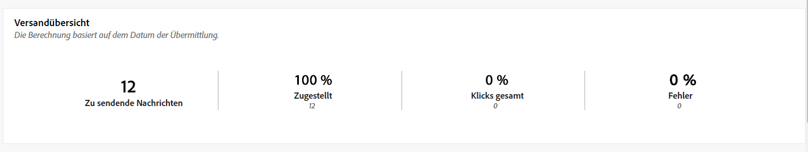
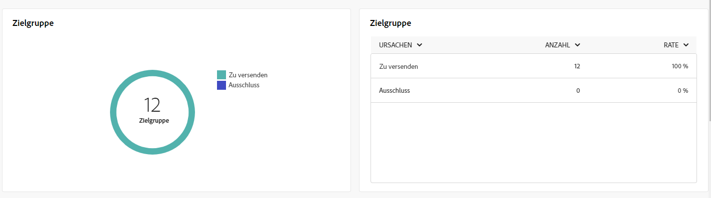
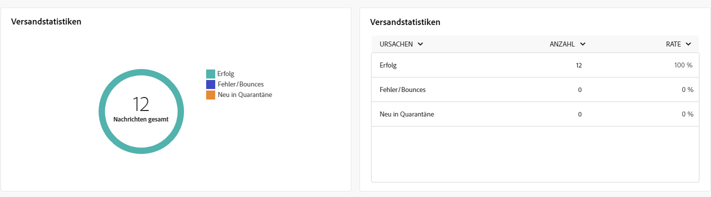
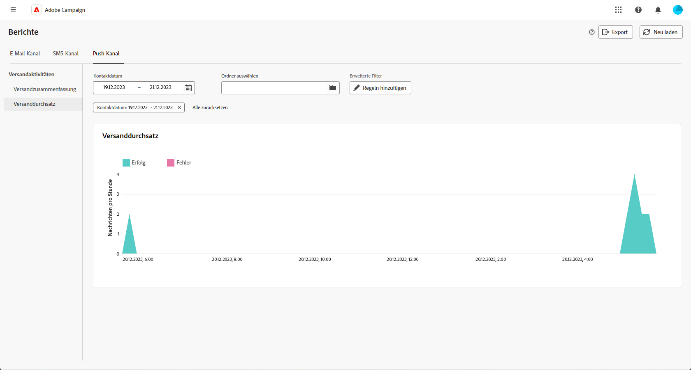

# Globale Berichte für den Push-Kanal {#campaign-reports-push}

Die globalen Berichte bieten den Benutzenden einen umfassenden Überblick über Traffic- und Interaktionsmetriken auf Kanalebene.

Navigieren Sie zum Menü **[!UICONTROL Berichte]** im Abschnitt **[!UICONTROL Berichterstellung]**. Sie können Ihre Daten nach Berichtsdatum, Ordner oder Regeln filtern. [Weitere Informationen](global-reports.md)

## Versandzusammenfassung {#delivery-summary-push}

### Versandübersicht {#delivery-overview-push}

>[!CONTEXTUALHELP]
>id="acw_push_global_report_overview"
>title="Push-Versand – Übersicht"
>abstract="Die KPIs der **Push-Versandübersicht** bieten eine gründliche Übersicht über Ihre Push-Sendungen und liefern detaillierte Einblicke sowie spezifische Daten. Sie bieten umfassende Details zu Leistung, Effektivität und Ergebnissen der Sendungen."

Der Bericht zur **[!UICONTROL Versandübersicht]** liefert Leistungskennzahlen (KPIs) mit detaillierten Informationen darüber, wie Ihre Besucherinnen und Besucher mit Ihren Push-Nachrichten interagieren. Metriken werden nachfolgend beschrieben.

{zoomable="yes"}

+++Erfahren Sie mehr über Versandübersichtsmetriken.

* **[!UICONTROL Zu sendende Nachrichten]**: Gesamtzahl der während der Versandvorbereitung verarbeiteten Nachrichten.

* **[!UICONTROL Zugestellt]**: Anzahl der erfolgreich gesendeten Nachrichten im Verhältnis zur Gesamtzahl der gesendeten Nachrichten.

* **[!UICONTROL Klicks gesamt]**: Gesamtzahl der unterschiedlichen Empfängerinnen und Empfänger, die einen Versand mindestens einmal angeklickt haben.

* **[!UICONTROL Fehler]**: Summe der Fehler, die beim Versand und bei der automatischen Rücksendung kumuliert wurden, bezogen auf die Gesamtzahl der gesendeten Nachrichten.

+++

### Zielgruppe {#delivery-summary-push-initial-target}

>[!CONTEXTUALHELP]
>id="acw_global_reporting_push_targeted_audience"
>title="Push-Zielpopulation"
>abstract="Der Graph und die Tabelle **Zielpopulation** zeigen Daten in Bezug auf die Zielgruppe Ihrer Push-Nachrichte mit Informationen zu den zu sendenden Nachrichten und Ausschlüssen an."

Die Tabelle und der Graph **[!UICONTROL Zielgruppe]** enthalten Daten zu den Empfängerinnen und Empfängern für den Versand jeder gesendeten Push-Benachrichtigung. Metriken werden nachfolgend beschrieben.

{zoomable="yes"}

+++Erfahren Sie mehr über Zielgruppen-Metriken.

* **[!UICONTROL Zielgruppe]**: Gesamtzahl der angesprochenen Empfängerinnen und Empfänger.

* **[!UICONTROL Zu versendende Nachricht]**: Gesamtzahl der nach erfolgter Versandvorbereitung zu versendenden Nachrichten.

* auf die Blockierungsliste setzen **[!UICONTROL Ausschluss]**: Gesamtzahl der Adressen, die während der Analyse beim Anwenden von Regeln ignoriert wurden: fehlende Adresse, in Quarantäne, Fehler und ähnliche Gründe.

+++

### Versandstatistiken {#delivery-summary-push-exec-stats}

>[!CONTEXTUALHELP]
>id="acw_global_reporting_push_delivery_stats"
>title="Push-Versandstatistiken"
>abstract="Der Bericht zur **Gesamtstatistik** liefert Informationen zu gesendeten Push-Nachrichten, einschließlich Erfolgsraten, Fehler und Quarantänen."

Die Tabelle **[!UICONTROL Versandstatistik]** zeigt den Erfolg jedes einzelnen Push-Nachrichtenversands auf. Metriken werden nachfolgend beschrieben.

{zoomable="yes"}

+++Erfahren Sie mehr über Versandstatistik-Metriken.

* **[!UICONTROL Nachrichten gesamt]**: Gesamtzahl der nach erfolgter Versandvorbereitung zu versendenden Nachrichten.

* **[!UICONTROL Erfolg]**: Anzahl der erfolgreich verarbeiteten Nachrichten im Verhältnis zur Anzahl der zu versendenden Nachrichten.

* **[!UICONTROL Fehler/Bounces]**: Gesamtzahl der bei Sendungen akkumulierten Fehler und der automatischen Bounce-Verarbeitungen im Verhältnis zur Anzahl der zu versendenden Nachrichten.

* **[!UICONTROL Neue Quarantänen]**: Gesamtzahl der Adressen, die infolge eines fehlgeschlagenen Versands unter Quarantäne gestellt wurden (ungültige Registrierung, Nachrichtenablehnung, Payload-Fehler und ähnliche Gründe), im Verhältnis zur Anzahl der zu versendenden Nachrichten.

  Die Fehlertypen von Push-Benachrichtigungen werden im Abschnitt [Dokumentation zu Adobe Campaign v8 (Client-Konsole)](https://experienceleague.adobe.com/docs/campaign/campaign-v8/send/failures/delivery-failures.html?lang=de#push-error-types){target="_blank"} aufgelistet.

+++

### Ausschlussgründe {#causes-exclusion}

>[!CONTEXTUALHELP]
>id="acw_global_reporting_push_exclusion"
>title="Push-Ausschlussgründe"
>abstract="Der Graph und die Tabelle **Ausschlussgründe** veranschaulichen die verschiedenen Gründe, aus denen Benutzerprofile keine Push-Benachrichtigungen erhalten konnten."

Der Graph und die Tabelle **[!UICONTROL Ausschlussgründe]** zeigen die Gründe, aus denen Benutzerprofile, die aus den Zielgruppenprofilen ausgeschlossen wurden, die Nachricht nicht erhalten haben.

Die Fehlertypen von Push-Benachrichtigungen werden im Abschnitt [Dokumentation zu Adobe Campaign v8 (Client-Konsole)](https://experienceleague.adobe.com/docs/campaign/campaign-v8/send/failures/delivery-failures.html?lang=de#push-error-types){target="_blank"} aufgelistet.

## Versanddurchsatz {#delivery-throughput-sms}

>[!CONTEXTUALHELP]
>id="acw_global_reporting_throughput_push"
>title="Bericht zum Versanddurchsatz"
>abstract="Der Bericht zum **Versanddurchsatz** enthält detaillierte Informationen zum Durchsatz des Push-Versands über die gesamte Plattform innerhalb eines bestimmten Zeitraums."

{zoomable="yes"}

Der Bericht zum **[!UICONTROL Versanddurchsatz]** bietet umfassende Einblicke in die Effektivität des Push-Nachrichtenversandsystems und eine detaillierte Zusammenfassung der Erfolgs- und Fehlerquoten über einen bestimmten Zeitraum hinweg.