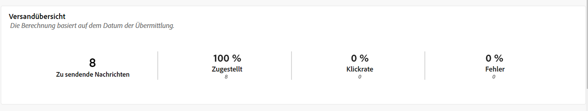
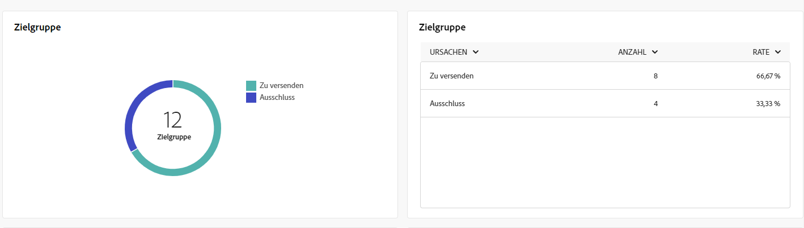
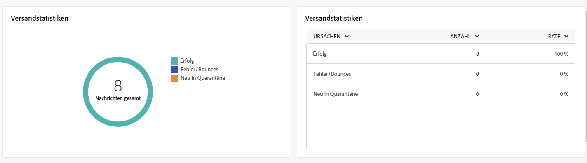
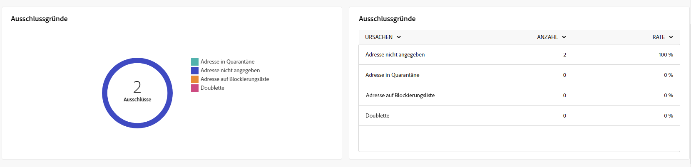
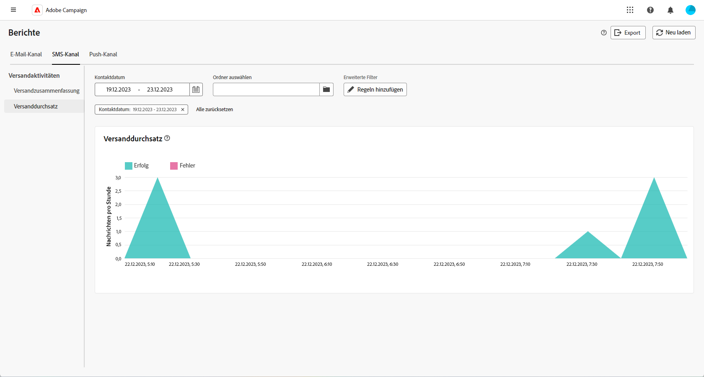

# Globale Berichte für den SMS-Kanal {#campaign-reports-sms}

Die globalen Berichte bieten Benutzern einen umfassenden Überblick über Traffic- und Interaktionsmetriken auf Kanalebene.

Navigieren Sie zum Menü **[!UICONTROL Berichte]** im Abschnitt **[!UICONTROL Berichterstellung]**. Sie können Ihre Daten nach Berichtsdatum, -ordner oder -regeln filtern. [Weitere Informationen](global-reports.md)

## Versandzusammenfassung {#delivery-summary-sms}

### Versandübersicht {#delivery-overview-sms}

>[!CONTEXTUALHELP]
>id="acw_sms_global_report_overview"
>title="SMS-Versand – Überblick"
>abstract="Die KPIs zur **SMS-Versandübersicht** bieten einen guten Überblick über Ihren SMS-Versand und detaillierte Informationen zu bestimmten Daten. Sie bieten umfassende Informationen über Leistung, Effektivität und Ergebnisse Ihres Versands."

Der Bericht zur **[!UICONTROL Versandübersicht]** bietet anhand umfassender Leistungskennzahlen (KPI) einen umfassenden Einblick in die Interaktionsmuster Ihrer Besucherinnen und Besucher bei jedem SMS-Versand. Folgende Metriken sind nachfolgend beschrieben.

+++Erfahren Sie mehr über Versandübersichtsmetriken.

* **[!UICONTROL Zu sendende Nachrichten]**: Gesamtzahl der während der Versandvorbereitung verarbeiteten Nachrichten.

* **[!UICONTROL Zugestellt]**: Anteil der erfolgreich gesendeten Nachrichten in Bezug auf die Gesamtzahl der gesendeten Nachrichten.

* **[!UICONTROL Clickthrough-Rate]**: Anteil der unterschiedlichen Empfängerinnen und Empfänger, die einen Versand mindestens einmal angeklickt haben.

* **[!UICONTROL Fehler]**: Anteil der beim Versand und der automatischen Rücksendung akkumulierten Fehler, bezogen auf die Gesamtzahl der gesendeten Nachrichten.

+++

### Zielgruppe {#delivery-summary-sms-initial-target}

>[!CONTEXTUALHELP]
>id="acw_global_reporting_sms_targeted_audience"
>title="SMS-Zielpopulation"
>abstract="Der Graph und die Tabelle **Zielpopulation** enthalten Daten zu Ihrer SMS-Zielgruppe, einschließlich Informationen zu den zu sendenden Nachrichten und Ausschlüssen."

Die Tabelle und der Graph **[!UICONTROL Zielgruppe]** enthalten Daten zu den Empfängerinnen und Empfängern jedes gesendeten SMS-Versands. Metriken werden nachfolgend beschrieben.

+++Erfahren Sie mehr über Zielgruppen-Metriken.

* **[!UICONTROL Zielgruppe]**: Gesamtzahl der angesprochenen Empfängerinnen und Empfänger.

* **[!UICONTROL Zu versendende Nachricht]**: Gesamtzahl der nach erfolgter Versandvorbereitung zu versendenden Nachrichten.

* **[!UICONTROL Ausschluss]**: Gesamtzahl der Adressen, die bei der Anwendung von Regeln in der Analyse ignoriert werden: fehlende Adresse, in Quarantäne, auf der Blockierungsliste, usw.

+++

### Versandstatistiken {#delivery-summary-sms-exec-stats}

>[!CONTEXTUALHELP]
>id="acw_global_reporting_sms_delivery_stats"
>title="SMS-Versandstatistiken"
>abstract="Der Bericht zu **Versandstatistiken** bietet umfassende Einblicke in die gesendete SMS und eine Aufschlüsselung verschiedener Metriken wie Erfolgsraten, Fehlerereignisse und in Quarantäne gestellte Zielgruppen. Diese detaillierte Darstellung ermöglicht eine gründliche Untersuchung der Gesamtleistung und der Ergebnisse des SMS-Versandprozesses."

Die Tabelle **[!UICONTROL Versandstatistiken]** gibt Auskunft über den Erfolg jedes SMS-Versands. Metriken werden nachfolgend beschrieben.

+++Erfahren Sie mehr über Versandstatistik-Metriken.

* **[!UICONTROL Nachrichten gesamt]**: Gesamtzahl der nach erfolgter Versandvorbereitung zu versendenden Nachrichten.

* **[!UICONTROL Erfolg]**: Anzahl der erfolgreich verarbeiteten Nachrichten im Verhältnis zur Anzahl der zu versendenden Nachrichten.

* **[!UICONTROL Fehler/Bounces]**: Gesamtzahl der über alle Sendungen hinweg kumulierten Fehler und der automatischen Bounce-Verarbeitungen im Verhältnis zur Anzahl der zu versendenden Nachrichten.

* **[!UICONTROL Neue Quarantänen]**: Gesamtzahl der Adressen, die infolge eines fehlgeschlagenen Versands unter Quarantäne gestellt wurden (unbekannter Nutzer, ungültige Domain), im Verhältnis zur Anzahl der zu versendenden Nachrichten.

  Die SMS-Fehlertypen werden im Abschnitt [Dokumentation zu Adobe Campaign v8 (Client-Konsole)](https://experienceleague.adobe.com/docs/campaign/campaign-v8/send/failures/delivery-failures.html?lang=de#sms-quarantines){target="_blank"} aufgelistet.

+++

### Ausschlussgründe {#causes-exclusion}

>[!CONTEXTUALHELP]
>id="acw_global_reporting_sms_exclusions"
>title="SMS-Ausschlussgründe"
>abstract="Der Graph und die Tabelle **Ausschlussgründe** veranschaulichen die unterschiedlichen Gründe, aus denen Benutzerprofile keine SMS-Nachrichten erhalten haben."

Der Graph und die Tabelle **[!UICONTROL Ausschlussgründe]** veranschaulichen die Gründe, aus denen Benutzerprofile, die von den Zielprofilen ausgeschlossen wurden, Ihre SMS-Sendungen nicht erhalten haben.

Die E-Mail-Fehlertypen werden in der [Dokumentation zu Adobe Campaign v8 (Client-Konsole)](https://experienceleague.adobe.com/docs/campaign/campaign-v8/send/failures/delivery-failures.html?lang=de#email-error-types){target="_blank"} aufgelistet.

## Versanddurchsatz {#delivery-throughput-sms}

>[!CONTEXTUALHELP]
>id="acw_global_reporting_throughput_sms"
>title="SMS-Versanddurchsatz"
>abstract="Der Bericht zum **Versanddurchsatz** bietet umfassende Einblicke in die Effizienz des Versandsystems für SMS-Nachrichten und einen detaillierten Überblick über Erfolgs- und Fehlerquoten innerhalb eines bestimmten Zeitraums."

Der Bericht zum **[!UICONTROL Versanddurchsatz]** bietet umfassende Einblicke in die Effektivität des Versandsystems für SMS-Nachrichten und eine detaillierte Zusammenfassung der Erfolgs- und Fehlerquoten über einen bestimmten Zeitraum.
