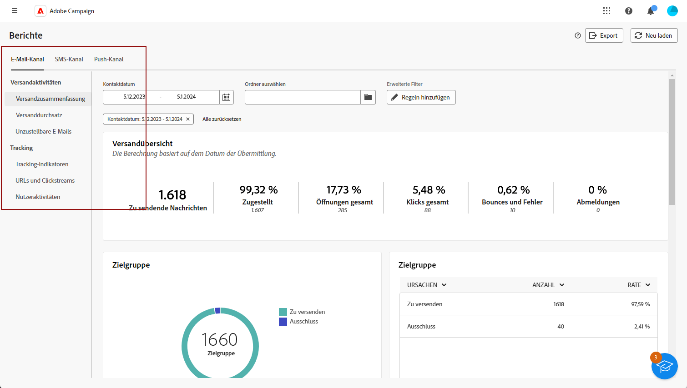
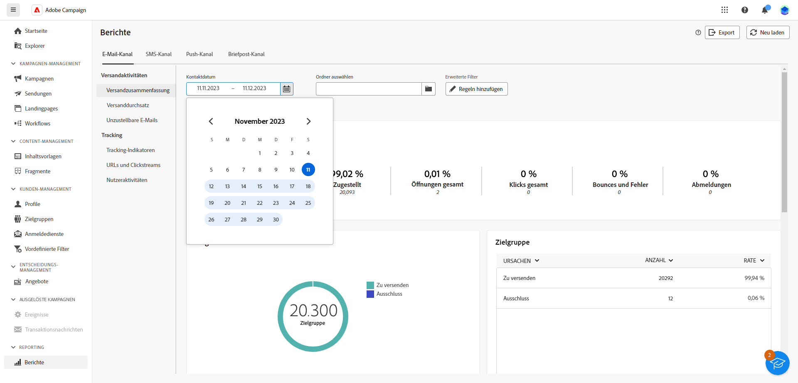
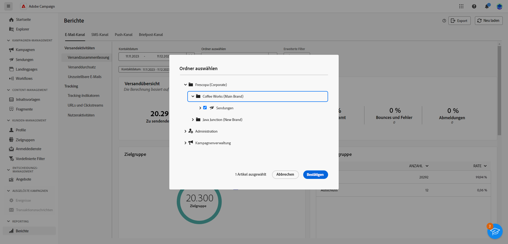

# Erste Schritte mit globalen Berichten {#global-report-gs}

**Globale Berichte** sind ein effektives Tool und bieten eine konsolidierte Zusammenfassung der Traffic- und der Interaktionsmetriken für jeden Kanal in Ihrer Campaign-Instanz. Diese Berichte bestehen aus verschiedenen Widgets, von denen jedes einen bestimmten Blickwinkel auf Ihre Kampagnen- oder Versandleistung bietet.

Die vollständige Liste der Berichte und zugehörigen Metriken für jeden Kanal finden Sie auf den folgenden Seiten:

* [Globale E-Mail-Berichte](global-report-email.md)
* [Globale SMS-Berichte](global-report-sms.md)
* [Globale Push-Berichte](global-report-push.md)

## Verwalten Ihres Bericht-Dashboards {#manage-reports}

Gehen Sie wie folgt vor, um auf Ihre globalen Berichte zuzugreifen und sie zu verwalten:

1. Navigieren Sie zum Menü **[!UICONTROL Berichte]** im Abschnitt **[!UICONTROL Berichterstellung]**.

1. Wählen Sie im linken Menü einen Bericht aus der Liste aus und durchsuchen Sie die Registerkarte nach Daten aus den einzelnen Kanälen.

   {zoomable=&quot;yes&quot;}

1. Wählen Sie im Dashboard eine **Startzeit** und eine **[!UICONTROL Endzeit]** aus, um bestimmte Daten einzuschließen.

   {zoomable=&quot;yes&quot;}

1. Geben Sie im Feld **[!UICONTROL Ordner auswählen]** an, ob Sie Sendungen oder Kampagnen aus einem bestimmten Ordner als Ziel verwenden möchten.

   {zoomable=&quot;yes&quot;}

1. Klicken Sie auf **[!UICONTROL Regeln hinzufügen]**, um Abfragen zu erstellen und Berichtsdaten besser zu filtern. [Erfahren Sie, wie Sie den Abfrage-Modeler verwenden](../query/query-modeler-overview.md)

1. Unter **[!UICONTROL URLs und Clickstreams]** können Sie auch die Option **[!UICONTROL Am häufigsten besuchte Links]** oder **[!UICONTROL Zeitraum]** auswählen.

   Mit der Option **[!UICONTROL Anzeigen nach]** können Sie nach URLs, Bezeichnungen oder Kategorien filtern.
