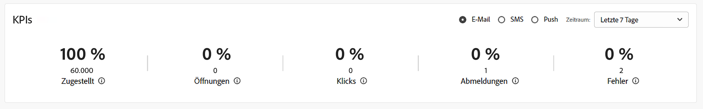

# Wichtige Leistungsindikatoren {#kpis}

>[!CONTEXTUALHELP]
>id="acw_homepage_kpi"
>title="Wichtige Performance-Indikatoren"
>abstract="Mit dem Abschnitt **Wichtige Performance-Indikatoren** können Sie die Effektivität Ihrer Plattform anhand gängiger KPIs überprüfen."

>[!CONTEXTUALHELP]
>id="acw_keyindicators_spam"
>title="Spam"
>abstract="Spam-KPI"

Navigieren Sie zur Startseite, um die wichtigsten Performance-Indikatoren für Ihre Plattform zu überprüfen. Diese Indikatoren zeigen die Anzahl und den Prozentsatz der zugestellten, geöffneten und angeklickten Nachrichten, Abmeldungen und Fehlerraten an.

Die Metriken werden standardmäßig für die Sendungen der letzten sieben Tage berechnet. Sie können den Zeitraum in der Dropdown-Liste oben rechts auf der Karte ändern. Nachrichten, die an Testprofile gesendet werden, sind ausgeschlossen.

Sie können den anzuzeigenden Kanal auswählen. Standardmäßig beziehen sich diese Indikatoren auf Metriken für den E-Mail-Kanal.

{zoomable=&quot;yes&quot;}

## Nachricht zugestellt {#ui-delivered-kpi}

>[!CONTEXTUALHELP]
>id="acw_keyindicators_delivered"
>title="Zugestellt"
>abstract="Diese Metrik zeigt für den ausgewählten Kanal die Summe aller erfolgreich verarbeiteten Nachrichten und den Prozentsatz der erfolgreich zugestellten Nachrichten in Bezug auf die Gesamtzahl der gesendeten Nachrichten an."

Die Anzahl der zugestellten Nachrichten spiegelt Ihre Zustellbarkeit wider. Aus folgenden Gründen kann es nie zu 100 % kommen: Manche Adressen oder Telefonnummern können fehlerhaft sein, durch Spam-Blocker von E-Mail-Anbietern können Ihre Nachrichten abgelehnt werden oder es können Zustellbarkeitsprobleme auftreten.

Der Indikator **Zugestellt** zeigt die folgenden KPIs für jeden Kanal an:

* Prozentualer Anteil der erfolgreich zugestellten Nachrichten in Bezug auf die Gesamtzahl der gesendeten Nachrichten.

* Summe aller erfolgreich verarbeiteten Nachrichten.

In Adobe Campaign lautet die Regel, nach der eine Nachricht als „zugestellt“ gilt, wie folgt:

Anzahl der Nachrichten mit Feld „Testadresse“ gleich „Nein“ und Status „Vom Dienstleister berücksichtigt“ (für SMS) oder „Auf Mobilgerät erhalten“ (für Push-Benachrichtigungen).

## Öffnungen insgesamt {#ui-open-kpi}

>[!CONTEXTUALHELP]
>id="acw_keyindicators_opens"
>title="Öffnungen"
>abstract="Diese Metrik zeigt für den ausgewählten Kanal die Summe aller geöffneten Nachrichten und den Prozentsatz der geöffneten Nachrichten im Vergleich zur Gesamtzahl der erfolgreich zugestellten Nachrichten an."

Die Gesamtzahl der Öffnungen wird berechnet, indem die Gesamtzahl der Öffnungen einer Nachricht verfolgt wird, unabhängig davon, von wie vielen einzelnen Kontakten diese Öffnungen generiert wurden. Dieser Indikator ist nur für E-Mails verfügbar.

Der Indikator **Öffnungen** zeigt die folgenden KPIs für jeden Kanal an:

* Prozentualer Anteil der geöffneten Nachrichten in Bezug auf die Gesamtzahl der erfolgreich zugestellten Nachrichten.

* Summe aller geöffneten Nachrichten pro Kanal.

Adobe Campaign erkennt das Öffnen einer Nachricht, wenn die Empfängerin bzw. der Empfänger die Bilder in der E-Mail herunterlädt. HTML- und Multipart/Alternative-E-Mails enthalten ein 0-Pixel-Bild, mit dem Sie geöffnete Nachrichten erkennen können. Da Nachrichten im Textformat keine Bilder enthalten, ist es hier nicht möglich festzustellen, ob sie geöffnet wurden oder nicht. Bei den auf der Grundlage der geöffneten Nachrichten berechneten Werten handelt es sich aufgrund der mit der Bildanzeige verbundenen Fehlerspanne immer um Schätzungen.

## Clickthrough-Rate {#ui-click-kpi}

>[!CONTEXTUALHELP]
>id="acw_keyindicators_clicks"
>title="Klicks"
>abstract="Diese Metrik zeigt für den ausgewählten Kanal die Summe aller in Nachrichten angeklickten URLs und den Prozentsatz der Klicks in Bezug auf die Gesamtzahl der erfolgreich zugestellten Nachrichten an."

Sie können Ihrem Nachrichteninhalt URLs hinzufügen, die Empfängerinnen und Empfänger zu einer bestimmten Seite umleiten. Die Clickthrough-Rate misst die Anzahl und den Prozentsatz der Empfängerinnen und Empfänger, die auf einen Link in der Nachricht geklickt haben.

Der Indikator **Klicks** zeigt für jeden Kanal die folgenden KPIs an:

* Prozentualer Anteil der Klicks in Bezug auf die Gesamtzahl der erfolgreich zugestellten Nachrichten.

* Die Anzahl unterschiedlicher Personen, die bei einem jeweiligen Versand mindestens einmal geklickt haben. Abmelde-Links und Links zur E-Mail-Mirrorseite werden ausgeschlossen.

Diese Metriken basieren auf der konsolidierten Tracking-Tabelle (`nms:trackingStats`). Diese Aggregattabelle wird aus Performance-Gründen bei der Anzeige von Berichten anstelle der Tabelle „Trackinglogs der Empfänger“ (`nms:trackingLogRcp`) verwendet und wird nicht in Echtzeit berechnet. Die Tabelle wird einige Minuten nach dem Abrufen der Trackinglogs generiert.

## Abo-Raten {#ui-sub-kpi}

>[!CONTEXTUALHELP]
>id="acw_keyindicators_subscriptions"
>title="Abonnements    "
>abstract="Diese Metrik zeigt für den ausgewählten Kanal die Summe aller Abonnements für einen Dienst und den Prozentsatz der Abonnements im Vergleich zur Gesamtzahl der erfolgreich zugestellten Nachrichten an."

Empfängerinnen und Empfänger können sich für E-Mail- und SMS-Nachrichten anmelden.

Der **Abonnements**-Indikator zeigt die folgenden KPIs für jeden Kanal an: Den Prozentsatz der Anzahl der Abonnements im Vergleich zur Gesamtzahl der erfolgreich zugestellten Nachrichten.

>[!NOTE]
>
> Die KPIs für An- und Abmeldung variieren je nach Diensttyp. E-Mail-Abonnements und -Abmeldungen umfassen beispielsweise alle E-Mail-bezogenen Dienste, unabhängig davon, ob sie aus manuellen Aktionen oder Web-Formularen resultieren. Es ist wichtig, diesen Ansatz von der Abmeldemetrik auf Versandebene zu unterscheiden, die Klicks auf Abmelde-Links statt tatsächlich abgemeldeten Benutzenden verfolgt.

## Abmelderaten {#ui-unsub-kpi}

>[!CONTEXTUALHELP]
>id="acw_keyindicators_unsubscriptions"
>title="Abmeldungen"
>abstract="Diese Metrik zeigt für den ausgewählten Kanal die Summe aller Abmeldungen von einem Dienst und den Prozentsatz der Abmeldungen im Vergleich zur Gesamtzahl der erfolgreich zugestellten Nachrichten an."

Empfängerinnen und Empfänger müssen die Möglichkeit haben, sich von E-Mails und SMS über einen dedizierten Abmelde-Link im E-Mail-Inhalt abzumelden oder STOPP auf eine SMS zu antworten.

Der Indikator **Abmeldungen** zeigt die folgenden KPIs für jeden Kanal an:

* Prozentualer Anteil der Abmeldungen in Bezug auf die Gesamtzahl der erfolgreich zugestellten Nachrichten.

* Die Summe aller Klicks auf einen Abmelde-Link, d. h. mit der entsprechenden URL-Kategorie für „Abmeldung“.

>[!NOTE]
>
> Die KPIs für An- und Abmeldung variieren je nach Diensttyp. E-Mail-Abonnements und -Abmeldungen umfassen beispielsweise alle E-Mail-bezogenen Dienste, unabhängig davon, ob sie aus manuellen Aktionen oder Web-Formularen resultieren. Es ist wichtig, diesen Ansatz von der Abmeldemetrik auf Versandebene zu unterscheiden, die Klicks auf Abmelde-Links statt tatsächlich abgemeldeten Benutzenden verfolgt.

## Fehlerquoten {#ui-error-kpi}

>[!CONTEXTUALHELP]
>id="acw_keyindicators_errors"
>title="Fehler"
>abstract="Gesamtzahl an Fehlern in Sendungen und der automatischen Bounce-Verarbeitung. Die zugehörige Rate wird in Bezug auf die Anzahl der zu versendenden Nachrichten berechnet."

Einige von Ihrer Adobe Campaign-Plattform gesendete Nachrichten erreichen möglicherweise nicht ihr Ziel. Es kann vorkommen, wenn die Benutzeradresse oder die Telefonnummer Tippfehler aufweist, die Empfängerin oder der Empfänger ihre bzw. seine E-Mail-Adresse geändert hat oder das Postfach voll ist. Wenn eine Nachricht nicht an ein Profil gesendet werden kann, sendet der Remote-Server automatisch eine Fehlermeldung an Adobe Campaign. Dieser Fehler wird qualifiziert, um festzustellen, ob die E-Mail-Adresse, die Telefonnummer oder das Gerät unter Quarantäne gestellt werden soll.

Daher sollten Sie Ihre Datenbank immer überprüfen und aktualisieren und sicherstellen, dass alle Profile aktiv und real sind. Versandfehler können vorübergehend oder dauerhaft sein – Softbounce oder Hardbounce –, je nachdem, warum die Nachricht nicht zugestellt wurde.

Der Indikator **Fehler** zeigt für jeden Kanal die folgenden KPIs an:

* Prozentualer Anteil der fehlerhaften Nachrichten in Bezug auf die Gesamtzahl der zu sendenden Nachrichten.

* Gesamtzahl an Fehlern in Sendungen und der automatischen Bounce-Verarbeitung.

## Nachricht gesendet {#ui-sent-kpi}

<!--DRAFT - This section requires a validation-->

>[!CONTEXTUALHELP]
>id="acw_keyindicators_sent"
>title="Gesendet"
>abstract="Diese Metrik zeigt für den Briefpost-Kanal die Summe aller gesendeten Nachrichten und den Prozentsatz der an den Anbieter gesendeten Nachrichten im Vergleich zur Gesamtzahl der in der Versandvorbereitungsphase vorbereiteten Nachrichten an."

Während der Vorbereitungsphase wird die Extraktionsdatei der Briefpost erzeugt, die Empfängerinformationen (d. h. die Versandlogs) werden jedoch nicht aktualisiert. Der Status eines Versands wird von „Versand ausstehend“ auf „Versendet“ geändert, wenn der oder die Campaign-Benutzende den Versand bestätigt. Dann wird der Status des Versands in „Abgeschlossen“ geändert.

Dabei wird es nie 100 % gesendete Nachrichten im Vergleich zur Gesamtzahl der vorbereiteten Nachrichten geben, da einige Adressen möglicherweise fehlen oder unvollständig sind.

Der Indikator **Gesendet** zeigt die folgenden KPIs für den Briefpost-Kanal an:

* Prozentualer Anteil der gesendeten Nachrichten im Vergleich zur Gesamtzahl der vorbereiteten Nachrichten.

* Summe aller gesendeten Nachrichten.

