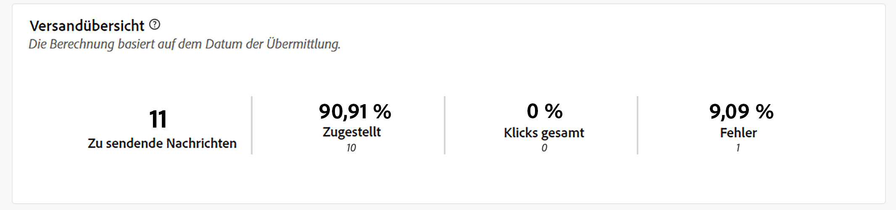
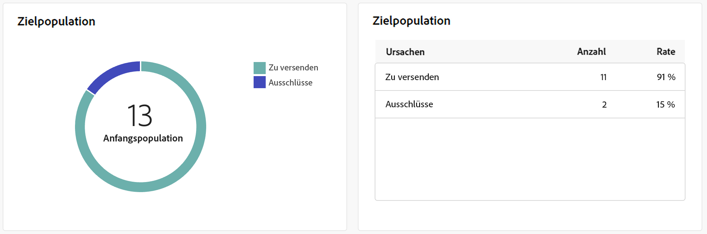
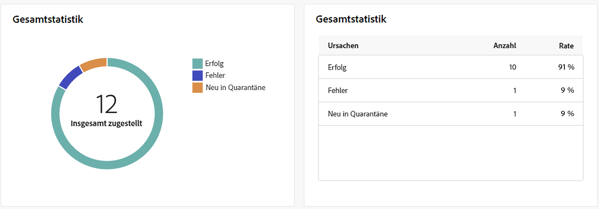
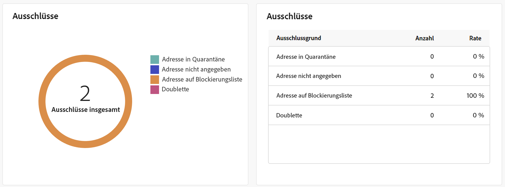
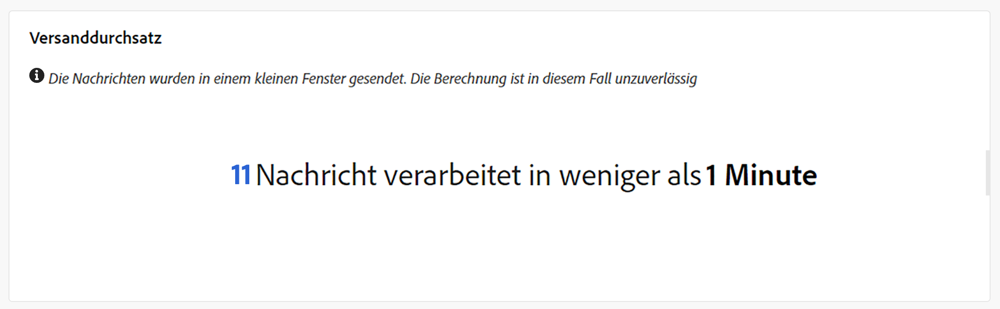

# Push-Versandberichte {#push-report}

>[!CONTEXTUALHELP]
>id="acw_delivery_reporting_sending_push"
>title="Versandberichte"
>abstract="Auf der Registerkarte **Senden** Ihres Berichts erhalten Sie einen umfassenden Einblick in die Interaktionen Ihrer Besucherinnen und Besucher mit Ihren Sendungen sowie in etwaige Fehler, die bei ihnen aufgetreten sind."

Der **Push-Versandbericht** bietet einen umfassenden Überblick über den Push-Kanal mit umfangreichen Einblicken und spezifischen Daten. Er bietet umfassende Informationen über Leistung, Effektivität und Ergebnisse jedes Versands.

## Push-Zusammenfassung {#push-summary}

### Versandübersicht {#push-delivery-overview}

>[!CONTEXTUALHELP]
>id="acw_push_report_overview"
>title="Übersicht über den Push-Versand"
>abstract="Die **Übersicht über den Push-Versand** bietet einen umfassenden Überblick über Ihren Push-Versand, mit umfassenden Einblicken und spezifischen Daten. Sie bietet umfassende Informationen über Leistung, Effektivität und Ergebnisse Ihres Versands."

Der **[!UICONTROL Versandübersichtsbericht]** bietet wichtige Leistungsindikatoren (KPIs), die detaillierte Informationen darüber enthalten, wie Ihre Besucherinnen und Besucher mit Ihren Push-Nachrichten interagieren.

+++Erfahren Sie mehr über die Metriken des Push-Versandberichts.

* **[!UICONTROL Insgesamt gesendet]**: Gesamtzahl der während der Versandvorbereitung verarbeiteten Nachrichten.

* **[!UICONTROL Zugestellt]**: Anzahl der erfolgreich gesendeten Nachrichten im Verhältnis zur Gesamtzahl der gesendeten Nachrichten.

* **[!UICONTROL Klicks]**: Gesamtzahl der Empfängerinnen und Empfänger, die mit der Push-Nachricht interagiert haben.

* **[!UICONTROL Fehler]**: Gesamtzahl der bei einem Versand aufgetretenen Fehler, die den Versand an Profile verhindert haben.

+++

### Zielpopulation {#push-delivery-targeted-population}

>[!CONTEXTUALHELP]
>id="acw_delivery_reporting_push_targeted_population"
>title="Push-Zielpopulation"
>abstract="Der Graph und die Tabelle zur **Zielpopulation** zeigen Daten in Bezug auf Ihre Push-Nachrichten-Zielgruppe an: zu sendende Nachrichten und Ausschlüsse."

Der Graph und die Tabelle zur **Zielpopulation** zeigen Daten in Bezug auf Ihre Zielgruppe an: zu sendende Nachrichten und Ausschlüsse. Metriken werden nachfolgend beschrieben.

+++Erfahren Sie mehr über die Metriken des Push-Versandberichts.

* **[!UICONTROL Zu versenden]**: Gesamtzahl der während der Versandvorbereitung verarbeiteten Nachrichten.

* **[!UICONTROL Ausnahmen]**: Anzahl der Profile, die aus der Analyse ausgeschlossen wurden.

+++

### Gesamtstatistik {#push-delivery-overall}

>[!CONTEXTUALHELP]
>id="acw_delivery_reporting_push_overall_stats"
>title="Push-Gesamtstatistik"
>abstract="Der **Gesamtstatistikbericht** enthält Daten zu den gesendeten Push-Benachrichtigungen: Erfolge, Fehler und Quarantänen."

Der **Gesamtstatistikbericht** enthält Daten zu den gesendeten Push-Benachrichtigungen: Erfolge, Fehler und Quarantänen. Metriken werden nachfolgend beschrieben.

+++Erfahren Sie mehr über die Metriken des Push-Versandberichts.

* **[!UICONTROL Erfolg]**: Anzahl der erfolgreich verarbeiteten Nachrichten.

* **[!UICONTROL Fehler]**: Gesamtzahl der beim Versand aufgetretenen Fehler, die den Versand der Nachrichten an bestimmte Profile verhindert haben.

* **[!UICONTROL Neue Quarantäne]**: Anzahl der Profile, die ausgeschlossen und der Quarantäne hinzugefügt wurden.

+++

### Ausschlüsse {#push-delivery-exclusions}

>[!CONTEXTUALHELP]
>id="acw_delivery_reporting_push_exclusions"
>title="Push-Ausschlüsse"
>abstract="Der Graph und die Tabelle **Ausschlüsse** zeigen die verschiedenen Gründe an, die verhindert haben, dass Benutzerprofile, die von den Zielgruppenprofilen ausgeschlossen wurden, die Nachricht erhalten haben."

Der Graph und die Tabelle **[!UICONTROL Ausschlüsse]** zeigen die verschiedenen Gründe an, die verhindert haben, dass Benutzerprofile, die von den Zielgruppenprofilen ausgeschlossen wurden, die Nachricht erhalten haben. Ausschlussregeln werden in der[Dokumentation zu Campaign v8 (Konsole)](https://experienceleague.adobe.com/docs/campaign/campaign-v8/send/failures/delivery-failures.html?lang=de#push-error-types){_blank} detailliert beschrieben.

## Versanddurchsatz {#delivery-throughput}

>[!CONTEXTUALHELP]
>id="acw_delivery_reporting_throughput_push"
>title="Versanddurchsatz Bericht"
>abstract="Der Bericht „Versanddurchsatz“ enthält detaillierte Informationen zum Versanddurchsatz der gesamten Plattform innerhalb eines bestimmten Zeitraums."

Der Bericht **Versanddurchsatz** enthält detaillierte Informationen zum Versanddurchsatz der gesamten Plattform innerhalb eines bestimmten Zeitraums. Die wichtigste Kennzahl, mit der die Geschwindigkeit des Nachrichtenversands gemessen wird, ist die Anzahl der pro Stunde gesendeten Nachrichten.

