# Versandberichte {#reports}

Adobe Campaign bietet verschiedene Berichtstypen für jeden Versand. Mit diesen Berichten können Sie die Wirkung und Leistung Ihrer Nachrichten in einem integrierten Dashboard messen und visualisieren.

Führen Sie folgende Schritte aus, um Berichte anzuzeigen:

1. Greifen Sie auf Ihren E-Mail-Versand zu und klicken Sie auf die Schaltfläche **Bericht**.

   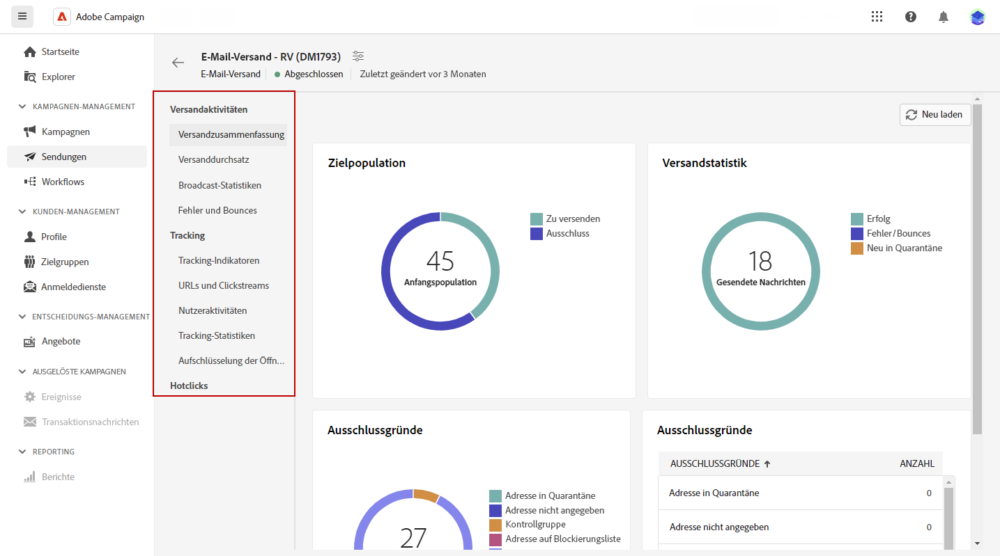

1. Wählen Sie im linken Menü einen Bericht aus der Liste aus.

   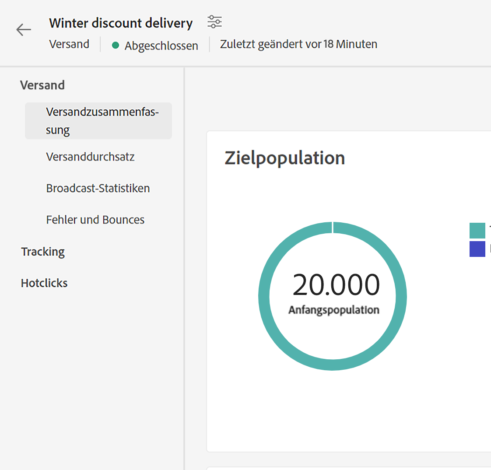{width="70%" align="left"}

## Versand

* **Versandzusammenfassung** Dieser Bericht enthält die wichtigsten Informationen zu einem Versand. Zielgruppen-Population, Ausschlussgründe, Versandstatistiken.

   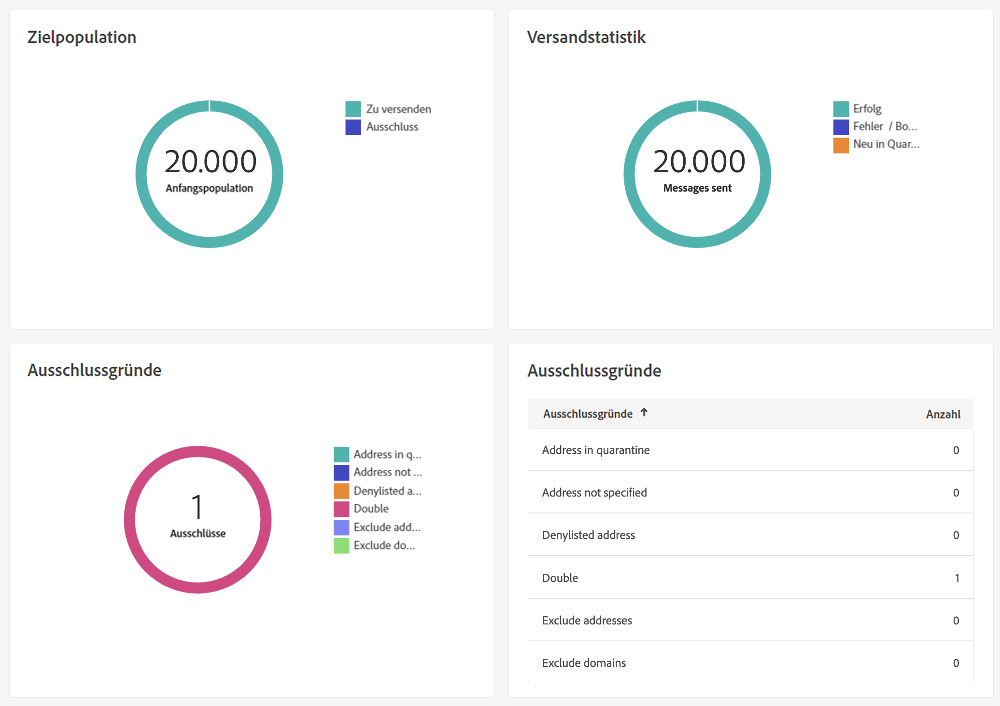

* **Versanddurchsatz**: Dieser Bericht enthält Informationen zum Versanddurchsatz in einem bestimmten Zeitraum. Zur Messung der Versandgeschwindigkeit von Nachrichten werden als Kriterien die Anzahl der pro Stunde gesendeten Nachrichten und die gesendete Nachrichtengröße in Bits pro Sekunde herangezogen. Im folgenden Beispiel zeigt das erste Diagramm die erfolgreichen Sendungen in Blau und die Anzahl der fehlerhaften Sendungen in Orange an.

   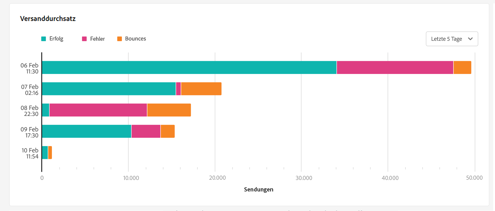

* **Broadcast-Statistiken**: Dieser Bericht enthält die Anzahl der verarbeiteten E-Mails sowie den prozentualen Anteil an zugestellten Nachrichten, Hard- und Softbounces, Öffnungen, Klicks und Abmeldungen aufgeschlüsselt nach Internet-Domain.

   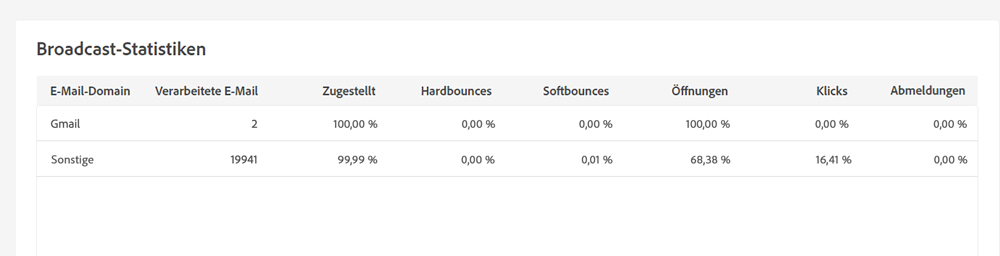

* **Fehler und Bounces**: Dieser Bericht zeigt die Aufschlüsselung der nicht zustellbaren E-Mails sowie eine Aufschlüsselung der Bounces pro Internet-Domain.

   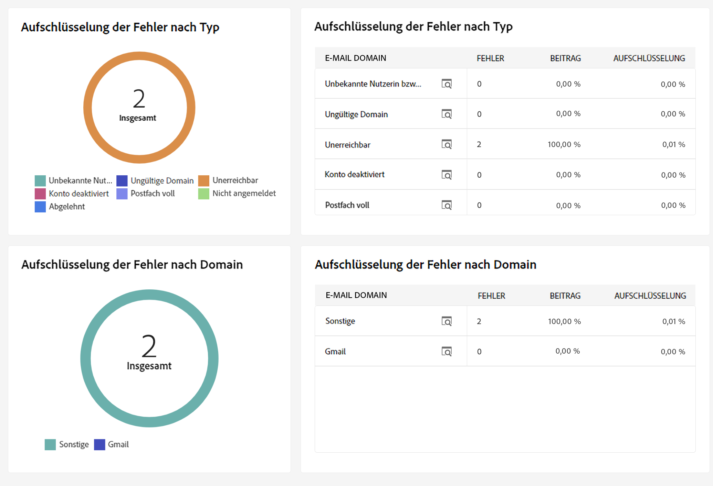

## Tracking

* **Tracking-Indikatoren**: Dieser Bericht kombiniert die wichtigsten Indikatoren zur Verfolgung des Empfängerverhaltens beim Erhalt des Versands. Er bietet Zugriff auf Versand- und Empfangsstatistiken, Öffnungs- und Klickraten, generierte Clickstreams, Webtracking sowie Teilungsaktivitäten in sozialen Netzwerken.

   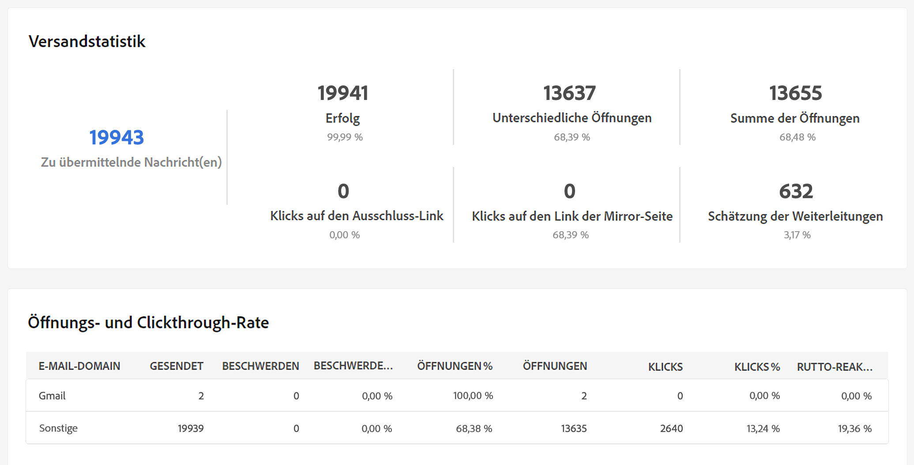

* **URLs und Clickstreams**: Dieser Bericht zeigt die nach einem Versand besuchten Seiten an.

   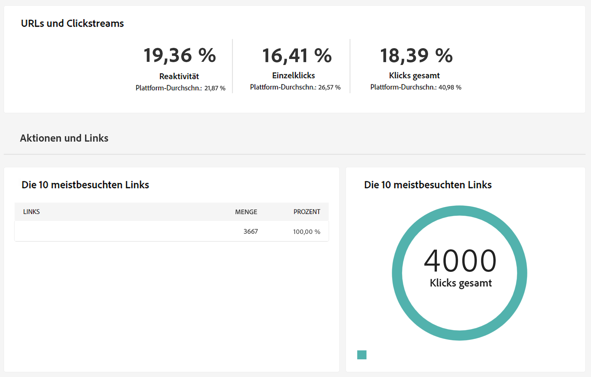

* **Nutzeraktivitäten**: Dieser Bericht zeigt die Aufschlüsselung der Öffnungen und Klicks pro halbe Stunde, Stunde oder Tag in Form eines Diagramms.

   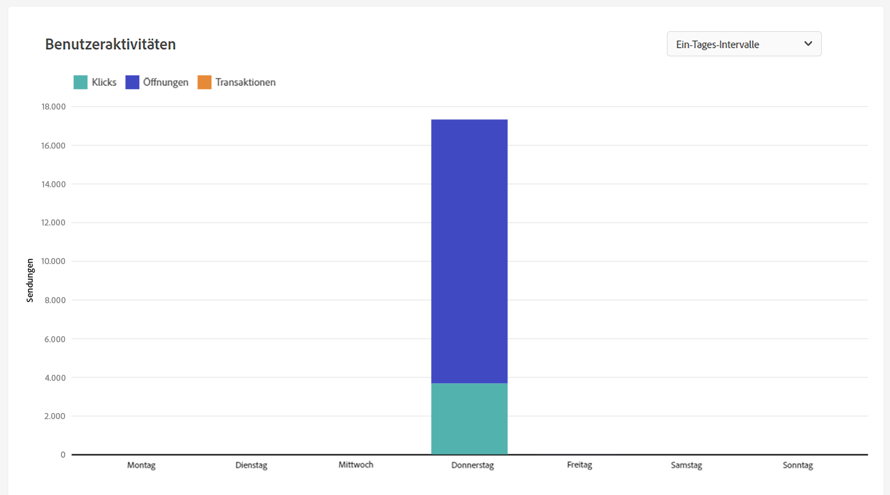

* **Tracking-Statistiken**: Dieser Bericht enthält Statistiken über Öffnungen und Klicks.

   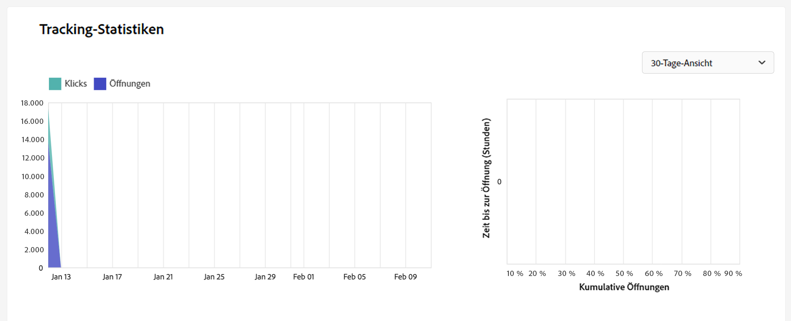

* **Öffnungsverteilung**: Dieser Bericht zeigt die Verteilung der Öffnungen nach Betriebssystem, Gerät und Browser im betreffenden Zeitraum. Für jede Kategorie werden zwei Diagramme verwendet. Das erste zeigt Statistiken zu Öffnungen auf Computern und Mobilgeräten. Das zweite stellt Statistiken dar, die sich nur auf Öffnungen auf Mobilgeräten beziehen.

   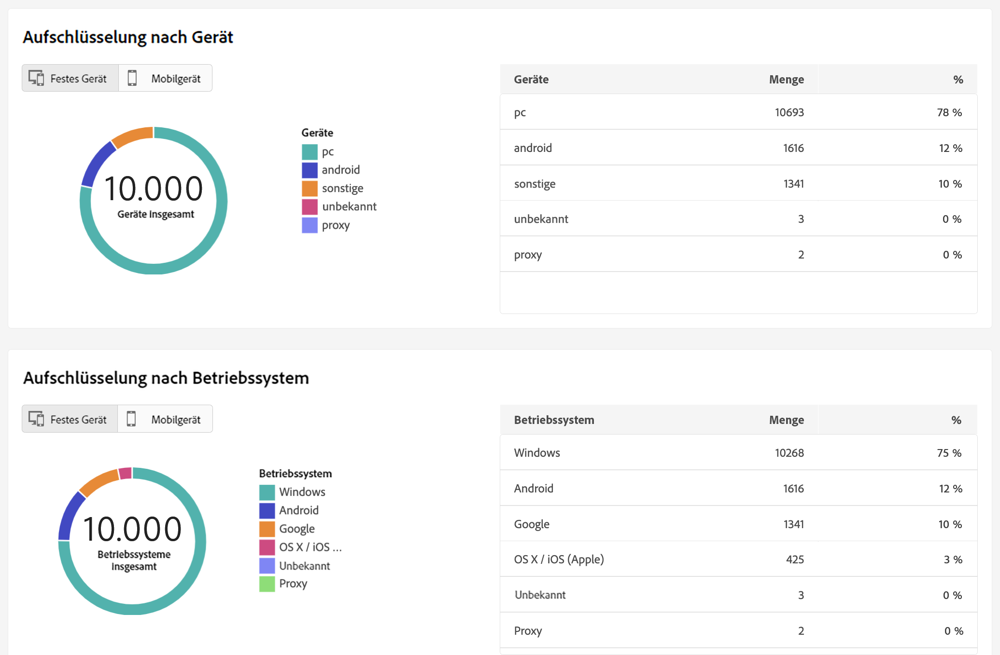

## Hotclicks

Dieser Bericht zeigt den Nachrichteninhalt (HTML und/oder Text) mit dem prozentualen Klickanteil für jeden Link. Abmelde-Links in Gestaltungsbausteinen sowie Mirror-Seiten-Links und Angebots-Links werden in der Gesamtklickzahl berücksichtigt, in diesem Bericht jedoch nicht angezeigt.

