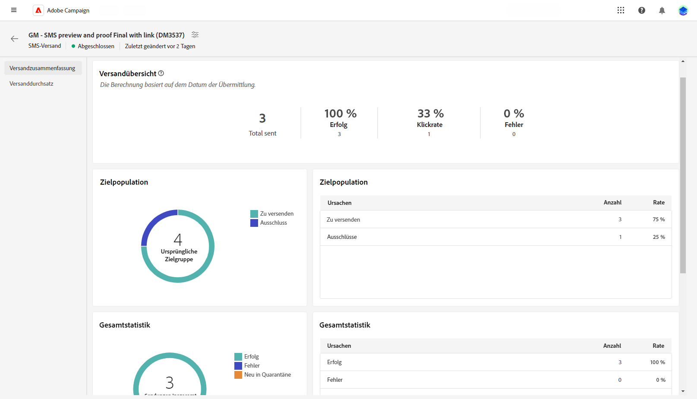

# SMS-Versandbericht {#report}

>[!CONTEXTUALHELP]
>id="acw_sms_report_overview"
>title="Zusammenfassung des SMS-Berichts"
>abstract="Entdecken Sie die Reporting-Metriken für Ihren SMS-Versand."

## Versandzusammenfassung {#delivery-summary}

* **[!UICONTROL Versandübersicht]** bietet wichtige Leistungsindikatoren (Key Performance Indicators, KPIs), die detaillierte Informationen darüber enthalten, wie Ihre Besucher mit Ihren SMS-Nachrichten interagieren. Zu diesen KPIs gehören:

   * **[!UICONTROL Gesendete Summe]**: Gesamtzahl der bei der Versandanalyse verarbeiteten Nachrichten.

   * **[!UICONTROL Erfolg]**: Anzahl der erfolgreich gesendeten Nachrichten in Bezug auf die Gesamtzahl der gesendeten Nachrichten

   * **[!UICONTROL Clickthrough-Rate]**: Prozentsatz der Benutzer, die mit Links in Ihrem SMS-Versand interagiert haben

   * **[!UICONTROL Fehler]**: Gesamtzahl der bei einem Versand aufgetretenen Fehler, die den Versand an Profile verhinderten.

* **Zielgruppe** Diagramme und Tabellen zeigen Daten in Bezug auf Ihre Zielgruppe an:

   * **[!UICONTROL Zu liefern]**: Gesamtzahl der bei der Versandanalyse verarbeiteten Nachrichten.

   * **[!UICONTROL Ausnahmen]**: Anzahl der Profile, die aus der Analyse ausgeschlossen wurden.

* **Gesamtstatistik** enthält Daten zu den gesendeten SMS-Nachrichten, einschließlich:

   * **[!UICONTROL Erfolg]**: Anzahl erfolgreich verarbeiteter Nachrichten.

   * **[!UICONTROL Fehler]**: Gesamtzahl der beim Versand aufgetretenen Fehler, die den Versand der Nachrichten an bestimmte Profile verhinderten.

   * **[!UICONTROL Neue Quarantäne]**: Anzahl der Profile, die ausgeschlossen und der Quarantäne hinzugefügt wurden.

* **[!UICONTROL Ausnahmen]** Diagramm und Tabelle zeigen die verschiedenen Gründe an, die verhindert haben, dass aus den Zielgruppenprofilen ausgeschlossene Benutzerprofile die Nachricht empfangen.
