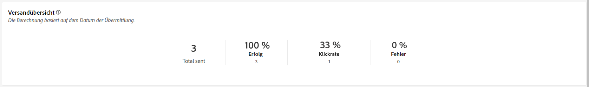
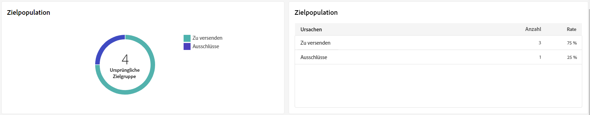
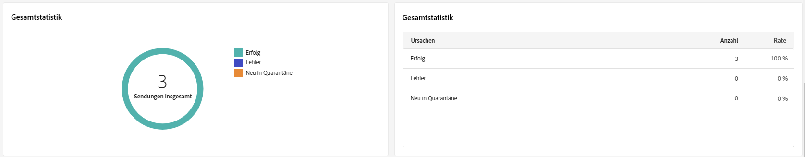
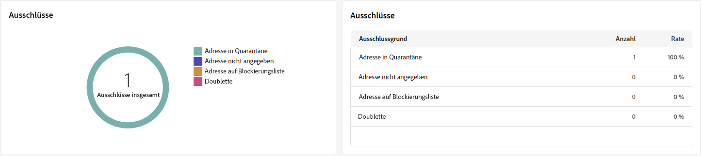
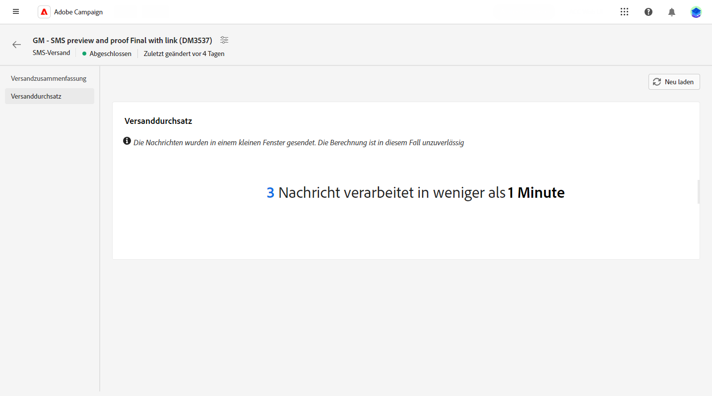

# SMS-Versandberichte {#sms-report}

>[!CONTEXTUALHELP]
>id="acw_sms_report_overview"
>title="Übersicht über den SMS-Versand"
>abstract="Die **Übersicht über den SMS-Versand** bietet einen umfassenden Überblick über Ihren SMS-Versand mit umfassenden Einblicken und spezifischen Daten. Es bietet umfassende Informationen über Leistung, Effektivität und Ergebnisse Ihres Versands."

>[!CONTEXTUALHELP]
>id="acw_delivery_reporting_sending_sms"
>title="Berichterstellung"
>abstract="Die **Senden** -Tab Ihres Berichts erhalten Sie einen umfassenden Einblick in die Interaktionen Ihrer Besucher mit Ihren Sendungen und in etwaige Fehler, die bei ihnen aufgetreten sind."

Die **Übersicht über den SMS-Versand** bietet einen umfassenden Überblick über Ihren SMS-Versand mit umfassenden Einblicken und spezifischen Daten. Es bietet umfassende Informationen über Leistung, Effektivität und Ergebnisse Ihres Versands.

## Versandzusammenfassung {#delivery-summary}

### Versandübersicht {#sms-delivery-overview}

Die **[!UICONTROL Versandübersicht]** bietet wichtige Leistungsindikatoren (KPIs), die detaillierte Informationen zu Erfolgs- und Fehlerraten sowie zur Interaktion Ihrer Besucher mit Ihren SMS-Nachrichten enthalten.

+++ Erfahren Sie mehr über die Metriken des SMS-Versandberichts.

* **[!UICONTROL Gesendete Summe]**: Prozentsatz und Gesamtzahl der bei der Versandvorbereitung verarbeiteten Nachrichten.

* **[!UICONTROL Erfolg]**: Prozentsatz und Anzahl der erfolgreich gesendeten Nachrichten in Bezug auf die Gesamtzahl der gesendeten Nachrichten

* **[!UICONTROL Clickthrough-Rate]**: Prozentsatz und Anzahl der Benutzer, die mit Links in Ihrem SMS-Versand interagiert haben.

* **[!UICONTROL Fehler]**: Prozentsatz und Gesamtzahl der Fehler, die während eines Versands aufgetreten sind und die den Versand an Profile verhinderten.

+++

### Zielpopulation {#sms-delivery-targeted-population}

>[!CONTEXTUALHELP]
>id="acw_delivery_reporting_sms_targeted_population"
>title="SMS-Zielpopulation"
>abstract="Die **Zielgruppe** Diagramm und Tabelle zeigen Daten in Bezug auf Ihre SMS-Zielgruppe an: Zu sendende Nachrichten und Ausschlüsse."

Die **Zielgruppe** Diagramm und Tabelle zeigen Daten in Bezug auf Ihre Zielgruppe an. Die Metriken werden nachfolgend beschrieben.

+++ Erfahren Sie mehr über die Metriken des SMS-Versandberichts.

* **[!UICONTROL Zu liefern]**: Gesamtzahl und Prozentsatz der bei der Versandvorbereitung verarbeiteten Nachrichten.

* **[!UICONTROL Ausnahmen]**: Anzahl und Prozentsatz der Profile, die von der Analyse ausgeschlossen wurden.
+++

### Gesamtstatistik {#sms-delivery-overall}

>[!CONTEXTUALHELP]
>id="acw_delivery_reporting_sms_overall_stats"
>title="Push-Gesamtstatistik"
>abstract="Die **Gesamtstatistik** zeigt Daten für die gesendete SMS an: Erfolg, Fehler und Quarantänen."

Die **Gesamtstatistik** zeigt Daten für die gesendeten SMS-Nachrichten an. Die Metriken werden nachfolgend beschrieben.

+++ Erfahren Sie mehr über die Metriken des SMS-Versandberichts.

* **[!UICONTROL Erfolg]**: Anzahl und Prozentsatz der erfolgreich verarbeiteten Nachrichten.

* **[!UICONTROL Fehler]**: Gesamtzahl und prozentuale Fehlerrate, die beim Versand aufgetreten sind, was den Versand von Nachrichten an bestimmte Profile verhindert hat.

* **[!UICONTROL Neue Quarantäne]**: Anzahl und Prozentsatz der Profile, die ausgeschlossen und zur Quarantäne hinzugefügt wurden.
+++

### Ausschlüsse {#sms-delivery-exclusions}

>[!CONTEXTUALHELP]
>id="acw_delivery_reporting_sms_exclusions"
>title="Gesamtstatistik für SMS"
>abstract="Die **Ausnahmen** Diagramm und Tabelle zeigen die verschiedenen Gründe an, die verhindert haben, dass aus den Zielgruppenprofilen ausgeschlossene Benutzerprofile die Nachricht empfangen."

* **[!UICONTROL Ausnahmen]** Diagramm und Tabelle zeigen die Gründe an, aus denen verhindert wurde, dass aus den Zielgruppenprofilen ausgeschlossene Benutzerprofile die Nachricht empfangen.

## Versanddurchsatz {#delivery-throughput}

>[!CONTEXTUALHELP]
>id="acw_delivery_reporting_throughput_sms"
>title="Versanddurchsatz Menü"
>abstract="Der Bericht zum Versanddurchsatz enthält detaillierte Informationen zum Versanddurchsatz der gesamten Plattform innerhalb eines bestimmten Zeitraums."

Dieser Bericht enthält detaillierte Informationen zum Versanddurchsatz der gesamten Plattform innerhalb eines bestimmten Zeitraums. Die wichtigste Kennzahl, mit der die Geschwindigkeit des Nachrichtenversands gemessen wird, ist die Anzahl der pro Stunde gesendeten Nachrichten.

