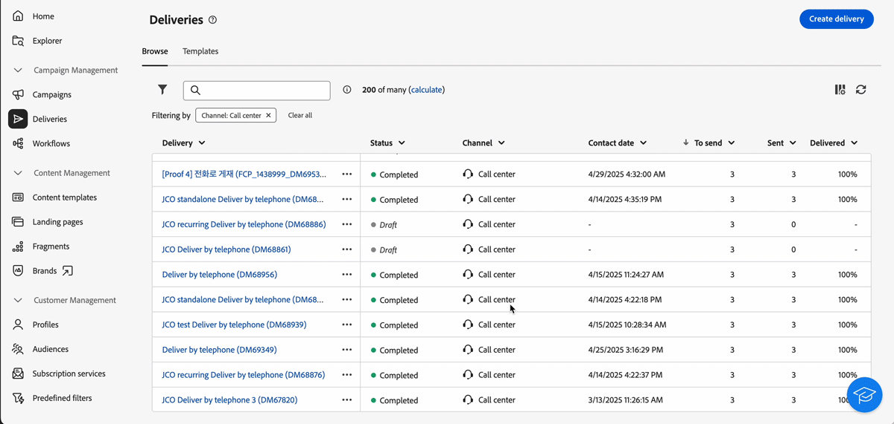

# Versionshinweise 2025 {#2025-release}

Auf dieser Seite werden alle Änderungen und Verbesserungen aufgelistet, die in **Versionen von 2025** verfügbar sind. Die neuesten Versionshinweise finden Sie auf [dieser Seite](release-notes.md).

## Version Juli 2025 {#25-7-release}

### Neue Funktionen {#25-7-features}

Die folgenden Funktionen sind ab der Version Juli verfügbar.

<!--table>
<thead>
<tr>
<th><strong>Multilingual email and SMS</strong> </th>
</tr>
</thead>
<tbody>
<tr>
<td>

You can now send multiple email and SMS deliveries in different languages in Adobe Campaign Web UI. The multilingual delivery feature allows you to choose the default language of your delivery as well as the different languages in which the delivery can be sent. You can also preview these deliveries in the languages you have chosen.

For Multilingual email, your server must be upgraded to 8.8.1 minimum. Refer to the Client Console <a href="https://experienceleague.adobe.com/docs/campaign/campaign-v8/releases/release-notes.html" target="_blank">release notes</a>.

For more information, refer to the <a href="../email/edit-content.md#multilingual-delivery">detailed documentation</a>.

</td>
</tr>
</tbody>
</table-->

<!--table>
<thead>
<tr>
<th><strong>Custom channel for API deliveries</strong> </th>
</tr>
</thead>
<tbody>
<tr>
<td>

You can now, directly from Adobe Campaign Web UI, orchestrate and execute deliveries based on custom API channels. These deliveries can be standalone or part of a workflow. The configuration of the custom API channel is performed in the console.

For more information, refer to the detailed documentation.

</td>
</tr>
</tbody>
</table-->

<table>
<thead>
<tr>
<th><strong>Unterstützung von benutzerdefiniertem CSS im E-Mail-Designer</strong> </th>
</tr>
</thead>
<tbody>
<tr>
<td>

Beim Erstellen Ihrer E-Mails können Sie nun Ihr eigenes benutzerdefiniertes CSS direkt im E-Mail-Designer hinzufügen. Mit dieser Funktion können Sie erweiterte und spezifische Stile anwenden, um die Flexibilität und Kontrolle über das Erscheinungsbild Ihrer Inhalte zu erhöhen.

Weitere Informationen finden Sie in der <a href="../email/custom-css.md">entsprechenden Dokumentation</a>.

</td>
</tr>
</tbody>
</table>

<table>
<thead>
<tr>
<th><strong>Marken</strong> </th>
</tr>
</thead>
<tbody>
<tr>
<td>

Sie können nun Ihre eigenen Marken erstellen und anpassen, um Ihre visuelle und verbale Identität in der gesamten Kommunikation klar zu definieren. Über den Markenausrichtungswert erhalten Sie Echtzeit-Feedback dazu, wie gut Ihr Inhalt den Ton, den Stil und die Richtlinien Ihrer Marke widerspiegelt. So können Sie sicherstellen, dass jede gesendete Nachricht markenkonform ist.

Weitere Informationen finden Sie in der <a href="../content/brands.md">entsprechenden Dokumentation</a>.

</td>
</tr>
</tbody>
</table>

<table>
<thead>
<tr>
<th><strong>Versandwarnung</strong> </th>
</tr>
</thead>
<tbody>
<tr>
<td>

Bei der Funktion „Versandwarnungen“ handelt es sich um ein System zum Warnungs-Management, über das eine Benutzergruppe automatisch Benachrichtigungen zu ihren Sendungen erhält. 

Weitere Informationen finden Sie in der <a href="../msg/delivery-alerting.md">entsprechenden Dokumentation</a>.

</td>
</tr>
</tbody>
</table>

<!--table>
<thead>
<tr>
<th><strong>Landing pages improvements</strong> </th>
</tr>
</thead>
<tbody>
<tr>
<td>

The following improvements to landing pages are now available:

<ul>
    <li>You can now reference a default subscription/unsubscription landing page when configuring a service. When designing an email, if you define a link to that landing page, users submitting the landing page form are automatically subscribed to or unsubscribed from this service. <a href="../audience/manage-services.md#create-service">Read more</a></li>
    <li>A new option in the landing page configuration allows anonymous visitors to access the landing page. If you unselect this option, only identified users can access and submit the form. <a href="../landing-pages/create-lp.md#create-landing-page">Read more</a></li>
    <li>A new option in the landing page configuration allows to store additional internal data when the landing page is being submitted. <a href="../landing-pages/create-lp.md#create-landing-page">Read more</a></li>
    <li>A new option enables to use a landing page for several services, making it dynamic. When adding a link to an email, if you select a dynamic landing page, you can select any service. If you select a landing page that has a specific service associated, this service will be automatically used (you cannot select another one). <a href="../landing-pages/create-lp.md#define-actions-on-form-submission">Read more</a></li>
    <li>Conditional content is now supported in landing pages. <a href="../landing-pages/lp-content.md">Read more</a></li>
    <li>You can link a landing page to a service, and send a confirmation message when users validate it. <a href="../landing-pages/lp-content.md#lp-message">Read more</a></li>
    <li>You can add captcha to protect your landing page from spam and abuse caused by bots. This is non-intrusive for your customers since it does not require any interaction from them and is based on interactions with your site. <a href="../landing-pages/create-lp.md#captcha">Read more</a></li>
</ul>
</td>
</tr>
</tbody>
</table-->

<table>
<thead>
<tr>
<th><strong>Dynamisches Reporting</strong> </th>
</tr>
</thead>
<tbody>
<tr>
<td>

Sie können nun auf dynamisches Reporting zugreifen, das vollständig anpassbare Berichte und Echtzeitberichte zum Messen der Wirkung Ihrer Marketing-Aktivitäten bietet. Dadurch kann auf Profildaten zugegriffen werden, was die demografische Analyse nach Profildimensionen wie Geschlecht, Ort und Alter ermöglicht, zusätzlich zur Analyse basierend auf Daten von E-Mail-Kampagnen wie Öffnungen und Klicks. Dynamische Berichte sind auch für mehrsprachige E-Mail-Sendungen und Transaktionsnachrichten verfügbar.

Diese Funktion ist nur auf Anfrage verfügbar. Wenden Sie sich für Zugriff an den Adobe-Support. Ihr Server muss mindestens auf 8.8.1 aktualisiert sein. Weitere Informationen finden Sie in den <a href="https://experienceleague.adobe.com/docs/campaign/campaign-v8/releases/release-notes.html?lang=de" target="_blank">Versionshinweisen</a> zur Client-Konsole.

Weitere Informationen finden Sie in der <a href="../reporting/dynamic-reporting/get-started-reporting.md">entsprechenden Dokumentation</a>.

</td>
</tr>
</tbody>
</table>

<table>
<thead>
<tr>
<th><strong>Zentralisiertes Branding</strong> </th>
</tr>
</thead>
<tbody>
<tr>
<td>

Ihre technischen Admins können nun eine oder mehrere Marken definieren, um die Parameter zu zentralisieren, die sich auf die Markenidentität auswirken. das Logo der Marke, die Domain der Zugangs-URL zu den Landingpages, Einstellungen zum Nachrichten-Tracking. Sie können diese Marken erstellen und mit verschiedenen Nachrichten oder Landingpages verknüpfen. Diese Konfiguration wird in Vorlagen verwaltet. Branding-Optionen sind für alle Kanäle verfügbar, einschließlich SMS und Briefpost.

Diese Funktion ist nur auf Anfrage und nur für neue Implementierungen verfügbar. Wenden Sie sich für Zugriff an den Adobe-Support. Ihr Server muss mindestens auf 8.8.1 aktualisiert sein. Weitere Informationen finden Sie in den <a href="https://experienceleague.adobe.com/docs/campaign/campaign-v8/releases/release-notes.html?lang=de" target="_blank">Versionshinweisen</a> zur Client-Konsole.

Weitere Informationen finden Sie in der <a href="../administration/branding/branding-gs.md">entsprechenden Dokumentation</a>.

</td>
</tr>
</tbody>
</table>

Zusätzlich zu den oben aufgeführten Funktionen bietet diese Version auch eine Reihe von Funktionen, die in der Client-Konsole verfügbar sind:

* [Neuer Connector für den SMS-Versand](https://experienceleague.adobe.com/docs/campaign/campaign-v8/send/sms/sms.html?lang=de) (FDA-Umgebungen)
* [Rest-APIs](https://experienceleague.adobe.com/docs/campaign/campaign-v8/developer/apis/get-started-apis.html?lang=de) (nach Bedarf, FDA-Umgebungen)

Weitere Informationen finden Sie in den [Versionshinweisen](https://experienceleague.adobe.com/docs/campaign/campaign-v8/releases/release-notes.html?lang=de){target="_blank"} zur Client-Konsole.

<!--

### Features previously in Limited Availability {#25-7-limited} 

>[!AVAILABILITY]
>
>To benefit from these updates, your server must be upgrated to 8.8.1 mininum. Refer to the Client Console [release notes](https://experienceleague.adobe.com/docs/campaign/campaign-v8/releases/release-notes.html){target="_blank"}.

Previously released in Limited Availability, the following capabilities are now available to all environments (General Availability):

* **Multilingual delivery creation** - You can now send multiple email deliveries in different languages in Adobe Campaign Web User Interface. The Multilingual delivery feature allows you to choose the default language of your delivery as well as the different languages in which the delivery can be sent. You can also preview these deliveries in the languages you have chosen. [Read more](../email/edit-content.md#multilingual-delivery).

* **Visual fragments** - You can now create, use and archive content fragments. Visual fragments are pre-defined visual blocks that you can reuse across multiple email deliveries, or in content templates. [Learn more](https://experienceleague.adobe.com/docs/campaign-web/v8/content/manage-reusable-content/fragments/fragments.html){target="_blank"}

* **Delivery alerting** - The Delivery alerting feature is an alert management system that enables a group of users to automatically receive notifications containing information on the execution of their deliveries. [Read more](../msg/delivery-alerting.md)

* **Landing pages improvements** - The following improvements to landing pages are now available:

    * You can now reference a default subscription/unsubscription landing page when configuring a service. When designing an email, if you define a link to that landing page, users submitting the landing page form are automatically subscribed to or unsubscribed from this service. [Read more](../audience/manage-services.md#create-service)
    * A new option in the landing page configuration allows anonymous visitors to access the landing page. If you unselect this option, only identified users can access and submit the form. [Read more](../landing-pages/create-lp.md#create-landing-page)
    * A new option in the landing page configuration allows to store additional internal data when the landing page is being submitted. [Read more](../landing-pages/create-lp.md#create-landing-page)
    * A new option enables to use a landing page for several services, making it dynamic. When adding a link to an email, if you select a dynamic landing page, you can select any service. If you select a landing page that has a specific service associated, this service will be automatically used (you cannot select another one). [Read more](../landing-pages/create-lp.md#define-actions-on-form-submission)
    * Conditional content is now supported in landing pages. [Read more](../landing-pages/lp-content.md)
    * You can link a landing page to a service, and send a confirmation message when users validate it. [Learn more](../landing-pages/lp-content.md#lp-message)
    * You can add captcha to protect your landing page from spam and abuse caused by bots. This is non-intrusive for your customers since it does not require any interaction from them and is based on interactions with your site. [Learn more](../landing-pages/create-lp.md#captcha)

Previously released in Limited Availability, the following capabilities are now available **on demand**:

* **Dynamic Reporting** - You can now access Dynamic Reporting which provides fully customizable and real-time reports to measure the impact of your marketing activities. It adds access to profile data, enabling demographic analysis by profile dimensions such as gender, city and age in addition to functional email campaign data like opens and clicks. Dynamic reporting is also available for multilingual email deliveries and transactional messages. [Read more](../reporting/dynamic-reporting/get-started-reporting.md)

* **Centralized Branding** -  Your technical administrators can now define one or several brands to centralize the parameters that affect a brand's identity. This includes the brand logo, the domain of the landing pages' access URL, or message tracking settings. You can create these brands and link them to messages or landing pages. This configuration is managed in templates. Branding options are available for all channels, including SMS and Direct mail. [Read more](../administration/branding/branding-gs.md){target="_blank"}

    >[!NOTE]
    >
    >This feature is only available for new implementations.

In addition to the features listed above, this release also comes with a set of functionalities available in the Client Console:

* [New SMS sending connector](https://experienceleague.adobe.com/docs/campaign/campaign-v8/send/sms/sms.html) (FDA environments)
* [Rest APIs](https://experienceleague.adobe.com/docs/campaign/campaign-v8/developer/apis/get-started-apis.html) (on demand, FDA environments)

Refer to the Client Console [release notes](https://experienceleague.adobe.com/docs/campaign/campaign-v8/releases/release-notes.html){target="_blank"}.

-->

### Verbesserungen {#25-7-improvements}

* Sie können jetzt die Zielpopulation direkt für jede Bedingung und Gruppe im Regel-Builder berechnen. Klicken Sie auf die Ergebnisnummer, um die detaillierte Liste der Einträge anzuzeigen. [Weitere Informationen](../query/build-query.md#validate-query)

* Sie können jetzt einen vordefinierten Filter direkt im Regel-Builder bearbeiten oder löschen. [Weitere Informationen](../get-started/predefined-filters.md#manage-predefined-filter)

* Beim Konfigurieren eines SMS-Versands haben Sie jetzt im Abschnitt **SMS** Zugriff auf die **optionalen SMPP-Parameter (TLV)**. Dieser Parameter entspricht dem Parameter in der Client-Konsole. [Weitere Informationen](../advanced-settings/delivery-settings.md#sms-tab)

* Sie können jetzt Hintergrundbenachrichtigungen für iOS mit der neuen Option **Inhalt verfügbar** aktivieren, die im Abschnitt **Erweiterte Einstellungen** des Bildschirms zur iOS-Inhaltsbearbeitung verfügbar ist. Dadurch wird die Markierung `content-available:1` in der `aps`-Payload hinzugefügt. Weitere Informationen finden Sie [auf dieser Seite](../push/content-push.md). Siehe auch [diese Seite](../push/rich-push-ios.md)

* Die folgenden Verbesserungen für Landingpages sind jetzt verfügbar:

   * Sie können nun beim Konfigurieren eines Dienstes auf eine standardmäßige Landingpage zur An-/Abmeldung verweisen. Wenn Sie bei der Erstellung einer E-Mail einen Link zu dieser Landingpage definieren, werden die Benutzenden, die das Landingpage-Formular senden, automatisch für diesen Dienst angemeldet bzw. von ihm abgemeldet. [Weitere Informationen](../audience/manage-services.md#create-service)
   * Eine neue Option in der Landingpage-Konfiguration ermöglicht anonymen Besuchenden, auf die Landingpage zuzugreifen. Wenn Sie diese Option deaktivieren, können nur identifizierte Benutzende auf das Formular zugreifen und dieses absenden. [Weitere Informationen](../landing-pages/create-lp.md#create-landing-page)
   * Eine neue Option in der Landingpage-Konfiguration ermöglicht, zusätzliche interne Daten bei der Landingpage-Übermittlung zu speichern. [Weitere Informationen](../landing-pages/create-lp.md#create-landing-page)
   * Eine neue Option ermöglicht Ihnen die Verwendung einer Landingpage für mehrere Dienste, wodurch sie dynamisch wird. Wenn Sie einen Link zu einer E-Mail hinzufügen und eine dynamische Landingpage auswählen, können Sie einen beliebigen Dienst auswählen. Wenn Sie eine Landingpage auswählen, der ein bestimmter Dienst zugeordnet ist, wird dieser Dienst automatisch verwendet. Sie können keinen anderen Dienst auswählen. [Weitere Informationen](../landing-pages/create-lp.md#define-actions-on-form-submission)
   * Bedingte Inhalte werden nun auf Landingpages unterstützt. [Weitere Informationen](../landing-pages/lp-content.md)
   * Es ist jetzt möglich, eine Landingpage mit einem Dienst zu verknüpfen und eine Bestätigungsnachricht zu versenden, wenn Benutzende dies validieren. [Weitere Informationen](../landing-pages/lp-content.md#lp-message)
   * Sie können Captcha zum Schutz Ihrer Landingpage vor Spam und Missbrauch durch Bots hinzufügen. Dies erfordert nur wenig Einsatz aufseiten Ihrer Kundschaft, da nur eine Interaktion mit Ihrer Website erforderlich ist. [Weitere Informationen](../landing-pages/create-lp.md#captcha)

## Version Juni 2025 {#25-6-release}

### Verbesserungen {#25-6-improvements}

* Der Bericht „Versandzusammenfassung“ ist jetzt sowohl für Callcenter-Kanäle als auch für benutzerdefinierte Kanäle verfügbar. [Weitere Informationen](../reporting/direct-mail.md)

* Beim Konfigurieren eines SMS-Versands haben Sie jetzt Zugriff auf die spezifischen SMS-Parameter. Hierbei handelt es sich um die gleichen Parameter, die auch in der Client-Konsole verfügbar sind. [Weitere Informationen](../advanced-settings/delivery-settings.md#sms-tab)

* Ihre Favoritenordner werden jetzt oben im linken Panel auf der Explorer-Seite angezeigt, wodurch leichter auf sie zugegriffen werden kann. [Weitere Informationen](../get-started/work-with-folders.md#favorite-folders)

* Der Regel-Builder unterstützt jetzt Drag-and-Drop, sodass Sie Komponenten Ihrer Abfrage effizienter neu anordnen können. [Weitere Informationen](../query/build-query.md#drag-and-drop)

* Die „menschliche Bedingung“ im Regel-Builder wurde verbessert. Hierbei handelt es sich um die geschriebene, übersetzte Version Ihrer Regeln, die unten auf dem Bildschirm angezeigt wird:

   * Attribute werden jetzt hervorgehoben und das zugehörige Schema wird angezeigt.
   * Sie können auf diese Elemente klicken, um detailliertere Informationen anzuzeigen.
   * Sie können die menschliche Bedingung nun mithilfe der entsprechenden Schaltfläche kopieren.

* Der Zugriff auf die Ordner „Technische Workflows“ und „Automatisch erstellte Objekte“ ist jetzt eingeschränkt, um deren Anzeige zu verhindern. [Weitere Informationen](../get-started/work-with-folders.md#about-folders)

## Version Mai 2025 {#25-5-release}

Die folgenden Funktionen stehen allen Benutzenden ab der Version Mai zur Verfügung.

<table>
<thead>
<tr>
<th><strong>Markenausrichtungswert (Beta)</strong> </th>
</tr>
</thead>
<tbody>
<tr>
<td>

Die Funktion zur Bewertung der Markenausrichtung bietet klares Feedback direkt im E-Mail-Designer, sodass Sie sehen können, ob der Inhalt mit dem Ton, dem Stil und den Richtlinien Ihrer Marke übereinstimmt. Diese Funktion ist in der Beta-Version verfügbar.

Weitere Informationen finden Sie in der <a href="../content/brands-score.md">entsprechenden Dokumentation</a>.

</td>
</tr>
</tbody>
</table>

<table>
<thead>
<tr>
<th><strong>Benutzerdefinierter Kanal für externe Sendungen</strong> </th>
</tr>
</thead>
<tbody>
<tr>
<td>

Sie können nun Sendungen direkt über die Adobe Campaign Web-Benutzeroberfläche orchestrieren und auf Grundlage benutzerdefinierter externer Kanäle ausführen. Diese Sendungen können eigenständig oder Teil eines Workflows sein. Die Erstellung des benutzerdefinierten, mit einem Drittanbieter integrierten externen Kanals erfolgt in der Konsole.

Hinweis: Die Reporting-Funktion ist in der Web-Benutzeroberfläche für den benutzerdefinierten Kanal nicht verfügbar. Sie müssen zur Client-Konsole wechseln, um auf Berichte zuzugreifen.

Weitere Informationen finden Sie in der <a href="../call-center/gs-custom-channel.md">entsprechenden Dokumentation</a>.

</td>
</tr>
</tbody>
</table>

### Verbesserungen {#25-5-improvements}

Der Bildschirm zur Erstellung von Typologieregeln wurde aktualisiert, um die Auswahl des Regeltyps zu erleichtern.

## Version April 2025 {#25-4-release}

**Veröffentlichungsdatum**: 29. April 2025

### Neue Funktionen {#25-4-features}

Die folgenden Funktionen stehen allen Benutzenden ab der April-Version zur Verfügung.

<table>
<thead>
<tr>
<th><strong>Callcenter-Kanal</strong> </th>
</tr>
</thead>
<tbody>
<tr>
<td>

Der Callcenter-Kanal ist jetzt in der Campaign Web-Benutzeroberfläche verfügbar. Dieser Kanal bezieht sich auf eine Kommunikationsmethode, mit der über ein Callcenter abgewickelte Mitteilungen oder Interaktionen verwalten und verfolgt werden. In der Regel handelt es sich dabei um Telefonanrufe, die von Callcenter-Mitarbeitenden an bestehende oder potenzielle Kundinnen und Kunden erfolgen.

Hinweis: Die Reporting-Funktion ist in der Web-Benutzeroberfläche für den Callcenter-Kanal nicht verfügbar. Sie müssen zur Client-Konsole wechseln, um auf Berichte zuzugreifen.

Weitere Informationen finden Sie in der <a href="../call-center/gs-call-center.md">entsprechenden Dokumentation</a>.

</td>
</tr>
</tbody>
</table>

<table>
<thead>
<tr>
<th><strong>Neuer Regel-Builder</strong> </th>
</tr>
</thead>
<tbody>
<tr>
<td>

Es ist nun ein neuer Regel-Builder verfügbar, der Sie bei der Definition komplexer Bedingungen in einer verbesserten Benutzeroberfläche unterstützt. Sie können bei Bedarf vom alten zum neuen Regel-Builder wechseln.

Weitere Informationen finden Sie in der <a href="../query/query-modeler-overview.md">entsprechenden Dokumentation</a>.

</td>
</tr>
</tbody>
</table>

<table>
<thead>
<tr>
<th><strong>Erstellen externer Konten</strong> </th>
</tr>
</thead>
<tbody>
<tr>
<td>

Als Campaign-Admin können Sie nun über die Campaign Web-Benutzeroberfläche neue Verbindungen mit externen Systemen einrichten.
Sie haben zudem die Möglichkeit, vorhandene externe Konten anzuzeigen, zu aktualisieren und zu verwalten.

Weitere Informationen finden Sie in der <a href="../administration/external-account.md">entsprechenden Dokumentation</a>.

</td>
</tr>
</tbody>
</table>

### Verbesserungen {#25-4-improvements}

**Allgemeine Verbesserungen an der Benutzeroberfläche**

* Das Feld „Beschreibung“ sowie die Optionen „Zu Favoriten hinzufügen“ und „Werteverteilung“ für Schemaattribute sind jetzt auf der Benutzeroberfläche besser sichtbar. Weitere Informationen finden Sie in der [entsprechenden Dokumentation](../get-started/attributes.md).
* Auf der Benutzeroberfläche werden nun Datum und Uhrzeit entsprechend der in den Experience League-Voreinstellungen festgelegten Primärsprache angezeigt. Diese Verbesserung ist nur für einige Sprachen verfügbar. Die vollständige Liste der unterstützten Sprachen finden Sie in der [entsprechenden Dokumentation](https://experienceleague.adobe.com/de/docs/core-services/interface/features/browser-language){target=_blank}.

<!--
ko * Built-in options are now only visible in the list of options if the **Show advanced options** toggle is activated.
ko * The typology rules creation screen has been updated to facilitate the selection of the type of rule.
-->

**E-Mail-Editor**: Um die Barrierefreiheit in der Campaign Web-Benutzeroberfläche zu verbessern, sind im E-Mail-Designer nun zwei neue Felder verfügbar. Sie entsprechen dem Element `title` und dem lang-Attribut im Element `html` Ihres E-Mail-Inhalts. Sie können diese Einstellungen zusätzlich zum Feld „Preheader“ im Abschnitt für den E-Mail-Text definieren. Weitere Informationen finden Sie in der [entsprechenden Dokumentation](../email/metadata.md).

<!--
**Workflow**: You can now select an existing Javascript code in workflow properties or in a Javascript activity.    
-->

**Schemata**

* Sie können nun das temporäre Schema einer Liste über die Campaign Web-Benutzeroberfläche bearbeiten. Weitere Informationen finden Sie in der [entsprechenden Dokumentation](../audience/manage-audience.md).
* Sie können nun die benutzerdefinierten Felder eines Schemas in einem Beispielbildschirm in der Vorschau anzeigen. Weitere Informationen finden Sie in der [entsprechenden Dokumentation](../administration/custom-fields.md#add).
* Sie können nun benutzerdefinierte Felder per Drag-and-Drop in der Liste verschieben. Weitere Informationen finden Sie in der [entsprechenden Dokumentation](../administration/custom-fields.md#add).

### Neue Funktionen in eingeschränkter Verfügbarkeit {#25-4-features-la}

>[!AVAILABILITY]
>
>Die folgenden Funktionen sind nur eingeschränkt verfügbar. Sie sind Kundinnen und Kunden vorbehalten, die **von Adobe Campaign Standard zu Adobe Campaign v8** migrieren, und können nicht in anderen Umgebungen bereitgestellt werden. Dazu ist ein Upgrade des Campaign-Servers auf die Version 8.7.4 erforderlich.
>
>Weitere Informationen finden Sie auf den folgenden Seiten der Dokumentation: [Wechsel von Campaign Standard zu Campaign v8](../rn/acs-migration.md) und [Funktionen für Campaign Standard-Benutzende](https://experienceleague.adobe.com/docs/experience-cloud/campaign/campaign-standard-migration-home.html?lang=de).

* **Erstellung eines mehrsprachigen Versands**: In der Adobe Campaign Web-Benutzeroberfläche ist nun die Durchführung mehrerer E-Mail-Sendungen in verschiedenen Sprachen möglich. Mit der Funktion „Mehrsprachiger Versand“ können Sie die Standardsprache Ihres Versands sowie die verschiedenen Sprachen festlegen, in denen der Versand durchgeführt werden kann. Sie können diese Sendungen auch in einer Vorschau in den von Ihnen ausgewählten Sprachen anzeigen. Weitere Informationen finden Sie in der [entsprechenden Dokumentation](../email/edit-content.md).

* **Dynamische Berichte für mehrsprachige Sendungen**: Dynamische Berichte sind jetzt für mehrsprachige E-Mail-Sendungen verfügbar. Weitere Informationen finden Sie in der [entsprechenden Dokumentation](../reporting/global-reports.md).

* **SMS REST API-Unterstützung (LA)**: Das REST-API für Transaktionsnachrichten ist nun für den SMS-Kanal verfügbar. Wenn sowohl „email“ als auch „mobilePhone“ in der Payload vorhanden sind, können Sie den Kanal über das Feld „wishedChannel“ angeben. Ohne Angabe wird standardmäßig „email“ verwendet, es sei denn, „wishedChannel“ fordert explizit SMS an. Weitere Informationen finden Sie in der [entsprechenden Dokumentation](https://experienceleague.adobe.com/docs/campaign/campaign-v8/developer/apis/get-started-apis.html?lang=de){target=_blank}.

## Version Februar &#39;25 {#25-2-release}

**Veröffentlichungsdatum**: 18. Februar 2025

Die folgenden Funktionen und Verbesserungen sind ab der Version Februar verfügbar.

### Funktionen {#25-2-features}

<table>
<thead>
<tr>
<th><strong>Erstellen von Geschäftsregeln (Typologieregeln)</strong> </th>
</tr>
</thead>
<tbody>
<tr>
<td>

Sie können jetzt Typologien und Typologieregeln in der Adobe Campaign Web-Benutzeroberfläche erstellen. Mit Typologien können Sie die Durchführung von Sendungen steuern, filtern und priorisieren. Mithilfe von Typologien können Sie überprüfen, ob Ihre Sendungen immer bestimmte Pflichtkomponenten enthalten (z. B. einen Abmelde-Link oder eine Betreffzeile), oder Filterregeln verwenden, um bestimmte Zielgruppen auszuschließen. Dazu zählen z. B. Abonnentinnen und Abonnenten, Mitbewerberinnen und Mitbewerber oder Kundinnen und Kunden, die nicht am Treueprogramm teilnehmen.

Weitere Informationen finden Sie in der <a href="../administration/typologies.md">entsprechenden Dokumentation</a>.

</td>
</tr>
</tbody>
</table>

<table>
<thead>
<tr>
<th><strong>Zielgruppen-Mappings</strong> </th>
</tr>
</thead>
<tbody>
<tr>
<td>

Sie können jetzt Zielgruppen-Mappings in der Campaign Web-Benutzeroberfläche erstellen. Zielgruppen-Mappings definieren, wie verschiedene Versandkanäle (E-Mail, SMS, Push-Benachrichtigungen) mit den Datenfeldern eines Schemas verknüpft werden. Hier können Sie die Zielgruppen festlegen: Profile, Vertragsbegünstigte, Benutzerinnen und Benutzer, Abonnierende, Interessentinnen und Interessenten usw.

Weitere Informationen finden Sie in der <a href="../administration/target-mappings.md">entsprechenden Dokumentation</a>.

</td>
</tr>
</tbody>
</table>

<table>
<thead>
<tr>
<th><strong>Schemadetails</strong> </th>
</tr>
</thead>
<tbody>
<tr>
<td>

Sie können jetzt auf die Details eines Schemas zugreifen, indem Sie dessen Namen in der Liste auswählen. Die Bearbeitung benutzerdefinierter Felder ist jetzt über die Schaltfläche <b>Benutzerdefinierte Felder bearbeiten</b> in den Schemadetails verfügbar.

Weitere Informationen finden Sie in der <a href="../administration/schemas.md">entsprechenden Dokumentation</a>.

</td>
</tr>
</tbody>
</table>

## Version Januar 2025 {#25-1-release}

**Veröffentlichungsdatum**: 5. Februar 2025

Die folgenden Funktionen und Verbesserungen sind ab der Version Januar verfügbar.

### Funktionen {#25-1-features}

<table>
<thead>
<tr>
<th><strong>Erstellen und Verwenden visueller Fragmente</strong> </th>
</tr>
</thead>
<tbody>
<tr>
<td>

Visuelle Fragmente sind vordefinierte visuelle Bausteine, die Sie in mehreren E-Mail-Sendungen oder in Inhaltsvorlagen wiederverwenden können. Diese Funktion steht nun allen Kundinnen und Kunden mit Serverbuild 8.6.4 und höher zur Verfügung.

Weitere Informationen finden Sie in der <a href="../content/use-visual-fragments.md">entsprechenden Dokumentation</a>.

</td>
</tr>
</tbody>
</table>

<table>
<thead>
<tr>
<th><strong>Verwenden eines Drittanbietersystems für Sendungen</strong> </th>
</tr>
</thead>
<tbody>
<tr>
<td>

In der Campaign Web-Benutzeroberfläche können nun externe Sendungen und Versandvorlagen definiert werden. In diesem Modus werden Nachrichten in einer Ausgabedatei zusammengefasst, die für einen externen Anbieter freigegeben werden kann. Standardmäßig wird der externe Versandmodus für den Briefpostkanal verwendet.

Weitere Informationen finden Sie in der <a href="../msg/send-external-deliveries.md">entsprechenden Dokumentation</a>.

</td>
</tr>
</tbody>
</table>

<table>
<thead>
<tr>
<th><strong>Verwalten von Aufzählungen</strong> </th>
</tr>
</thead>
<tbody>
<tr>
<td>

Sie können Aufzählungen nun direkt über die Adobe Campaign Web-Benutzeroberfläche erstellen. Eine Aufzählung ist eine Liste von Werten, die vom System zum Auffüllen von Feldern vorgeschlagen werden. Verwenden Sie Aufzählungen, um die Werte dieser Felder zu standardisieren, die Dateneingabe zu unterstützen oder sie in Abfragen zu verwenden.

Weitere Informationen finden Sie in der <a href="../administration/enumerations.md">entsprechenden Dokumentation</a>.

</td>
</tr>
</tbody>
</table>

<table>
<thead>
<tr>
<th><strong>Erstellen benutzerdefinierter Optionen</strong> </th>
</tr>
</thead>
<tbody>
<tr>
<td>

Sie können nun in der Adobe Campaign Web-Benutzeroberfläche auf technische Optionen zugreifen und eigene benutzerdefinierte Optionen entsprechend Ihren Anforderungen erstellen. Dies ist besonders nützlich, wenn Sie mit JavaScript-Code-Workflow-Aktivitäten arbeiten, um Zwischenergebnisse zu speichern.

Weitere Informationen finden Sie in der <a href="../administration/options.md">entsprechenden Dokumentation</a>.

</td>
</tr>
</tbody>
</table>

<table>
<thead>
<tr>
<th><strong>Definieren und Aufrufen von JavaScript-Code</strong> </th>
</tr>
</thead>
<tbody>
<tr>
<td>

Sie können nun JavaScript-Code in der Adobe Campaign Web-Benutzeroberfläche erstellen. Auf diese Weise können Sie wiederverwendbare Funktionen erstellen, die in Workflows genutzt werden können, ähnlich wie bei einer Bibliothek.

Weitere Informationen finden Sie in der <a href="../administration/javascript-codes.md">entsprechenden Dokumentation</a>.

</td>
</tr>
</tbody>
</table>

<table>
<thead>
<tr>
<th><strong>Generieren von Landingpages mit dem KI-Assistenten</strong> </th>
</tr>
</thead>
<tbody>
<tr>
<td>

Der KI-Assistent ist nun für den Versand von Landingpages verfügbar, sodass Sie Text, Bilder oder vollständige Seiten-Layouts generieren können.

Weiterführende Informationen zum KI-Assistenten finden Sie im <a href="../email/generative-lp.md">entsprechenden Handbuch</a>.

</td>
</tr>
</tbody>
</table>

### Verbesserungen {#25-1-improvements}

* Anpassen der Anzeige benutzerdefinierter Felder in der Benutzeroberfläche:

   * Sie können nun zusätzliche benutzerdefinierte Felder auswählen, die in der Benutzeroberfläche angezeigt werden sollen.
   * Sie können nun Regeln zum Anzeigen benutzerdefinierter Felder vom Typ „Link“ festlegen, z. B. Listenwerte basierend auf der Eingabe eines anderen Felds beschränken.
   * Flexiblere Anordnung von Feldern in der Benutzeroberfläche: Felder können sich nun über eine einzelne Spalte erstrecken oder zur besseren Organisation in Unterabschnitten gruppiert werden.
   * Sie können nun bestimmte Felder als schreibgeschützt festlegen.

* Filter „Zuletzt verwendet“ und „Favoriten“: Um häufig verwendete Attribute schnell wiederzuverwenden, können Sie sie nun zu Favoriten hinzufügen. Dadurch wird sichergestellt, dass sie für zukünftige Aufgaben problemlos zugänglich sind. Zusätzlich zu den Favoriten können Sie auch die zuletzt ausgewählten Attribute anzeigen und verwenden.

* Externe Konten: Der neue **[!UICONTROL Routing]**-Typ steht beim Erstellen eines neuen externen Kontos zur Auswahl. Damit können Sie ein bestimmtes externes Konto für Ihre externen Sendungen konfigurieren. [Weitere Informationen](../administration/external-account.md#routing)
