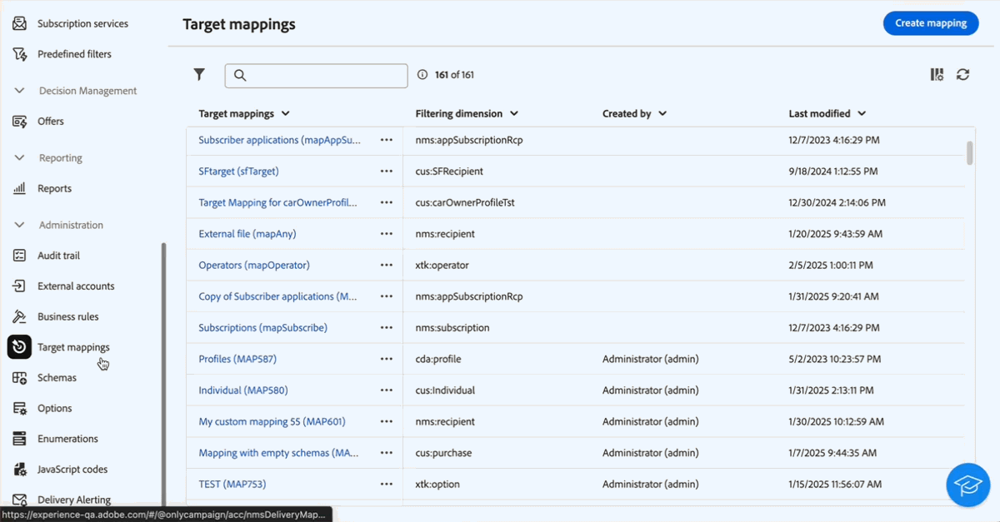
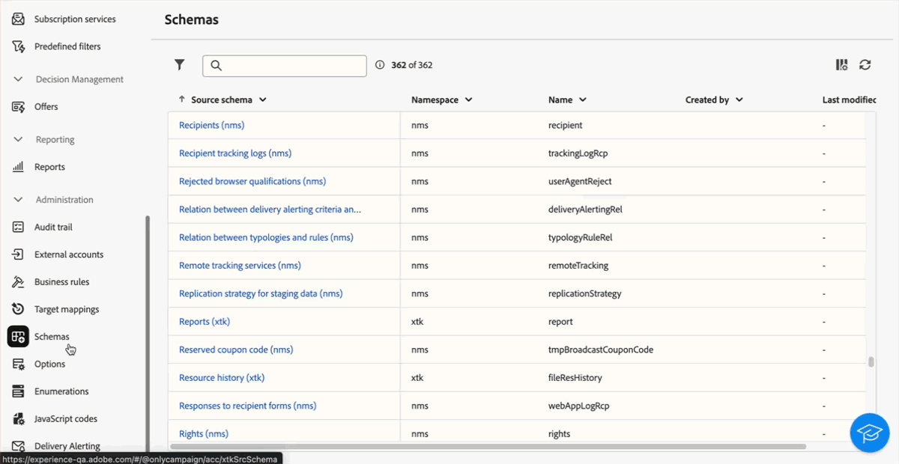

# Versionshinweise 2025 {#2025-release}

Auf dieser Seite werden alle Änderungen und Verbesserungen aufgelistet, die in **Versionen von 2025** verfügbar sind. Die neuesten Versionshinweise finden Sie auf [dieser Seite](release-notes.md).

## Version Februar &#39;25 {#25-2-release}

**Veröffentlichungsdatum**: 18. Februar 2025

Die folgenden Funktionen und Verbesserungen sind ab der Version Februar verfügbar.

### Funktionen {#25-2-features}

<table>
<thead>
<tr>
<th><strong>Erstellen von Geschäftsregeln (Typologieregeln)</strong> </th>
</tr>
</thead>
<tbody>
<tr>
<td>

Sie können jetzt Typologien und Typologieregeln in der Adobe Campaign Web-Benutzeroberfläche erstellen. Mit Typologien können Sie die Durchführung von Sendungen steuern, filtern und priorisieren. Mithilfe von Typologien können Sie überprüfen, ob Ihre Sendungen immer bestimmte Pflichtkomponenten enthalten (z. B. einen Abmelde-Link oder eine Betreffzeile), oder Filterregeln verwenden, um bestimmte Zielgruppen auszuschließen. Dazu zählen z. B. Abonnentinnen und Abonnenten, Mitbewerberinnen und Mitbewerber oder Kundinnen und Kunden, die nicht am Treueprogramm teilnehmen.

Weitere Informationen finden Sie in der <a href="../administration/typologies.md">entsprechenden Dokumentation</a>.

</td>
</tr>
</tbody>
</table>

<table>
<thead>
<tr>
<th><strong>Zielgruppen-Mappings</strong> </th>
</tr>
</thead>
<tbody>
<tr>
<td>

Sie können jetzt Zielgruppen-Mappings in der Campaign Web-Benutzeroberfläche erstellen. Zielgruppen-Mappings definieren, wie verschiedene Versandkanäle (E-Mail, SMS, Push-Benachrichtigungen) mit den Datenfeldern eines Schemas verknüpft werden. Hier können Sie die Zielgruppen festlegen: Profile, Vertragsbegünstigte, Benutzerinnen und Benutzer, Abonnierende, Interessentinnen und Interessenten usw.

Weitere Informationen finden Sie in der <a href="../administration/target-mappings.md">entsprechenden Dokumentation</a>.

</td>
</tr>
</tbody>
</table>

<table>
<thead>
<tr>
<th><strong>Schemadetails</strong> </th>
</tr>
</thead>
<tbody>
<tr>
<td>

Sie können jetzt auf die Details eines Schemas zugreifen, indem Sie dessen Namen in der Liste auswählen. Die Bearbeitung benutzerdefinierter Felder ist jetzt über die Schaltfläche <b>Benutzerdefinierte Felder bearbeiten</b> in den Schemadetails verfügbar.

Weitere Informationen finden Sie in der <a href="../administration/schemas.md">entsprechenden Dokumentation</a>.

</td>
</tr>
</tbody>
</table>

## Version Januar 2025 {#25-1-release}

**Veröffentlichungsdatum**: 5. Februar 2025

Die folgenden Funktionen und Verbesserungen sind ab der Version Januar verfügbar.

### Funktionen {#25-1-features}

<table>
<thead>
<tr>
<th><strong>Erstellen und Verwenden visueller Fragmente</strong> </th>
</tr>
</thead>
<tbody>
<tr>
<td>

Visuelle Fragmente sind vordefinierte visuelle Bausteine, die Sie in mehreren E-Mail-Sendungen oder in Inhaltsvorlagen wiederverwenden können. Diese Funktion steht nun allen Kundinnen und Kunden mit Serverbuild 8.6.4 und höher zur Verfügung.

Weitere Informationen finden Sie in der <a href="../content/use-visual-fragments.md">entsprechenden Dokumentation</a>.

</td>
</tr>
</tbody>
</table>

<table>
<thead>
<tr>
<th><strong>Verwenden eines Drittanbietersystems für Sendungen</strong> </th>
</tr>
</thead>
<tbody>
<tr>
<td>

In der Campaign Web-Benutzeroberfläche können nun externe Sendungen und Versandvorlagen definiert werden. In diesem Modus werden Nachrichten in einer Ausgabedatei zusammengefasst, die für einen externen Anbieter freigegeben werden kann. Standardmäßig wird der externe Versandmodus für den Briefpostkanal verwendet.

Weitere Informationen finden Sie in der <a href="../msg/send-external-deliveries.md">entsprechenden Dokumentation</a>.

</td>
</tr>
</tbody>
</table>

<table>
<thead>
<tr>
<th><strong>Verwalten von Auflistungen</strong> </th>
</tr>
</thead>
<tbody>
<tr>
<td>

Sie können Auflistungen nun direkt über die Adobe Campaign Web-Benutzeroberfläche erstellen. Eine Auflistung ist eine Liste von Werten, die vom System zum Auffüllen von Feldern vorgeschlagen werden. Verwenden Sie Auflistungen, um die Werte dieser Felder zu standardisieren, die Dateneingabe zu unterstützen oder sie in Abfragen zu verwenden.

Weitere Informationen finden Sie in der <a href="../administration/enumerations.md">entsprechenden Dokumentation</a>.

</td>
</tr>
</tbody>
</table>

<table>
<thead>
<tr>
<th><strong>Erstellen benutzerdefinierter Optionen</strong> </th>
</tr>
</thead>
<tbody>
<tr>
<td>

Sie können nun in der Adobe Campaign Web-Benutzeroberfläche auf technische Optionen zugreifen und eigene benutzerdefinierte Optionen entsprechend Ihren Anforderungen erstellen. Dies ist besonders nützlich, wenn Sie mit JavaScript-Code-Workflow-Aktivitäten arbeiten, um Zwischenergebnisse zu speichern.

Weitere Informationen finden Sie in der <a href="../administration/options.md">entsprechenden Dokumentation</a>.

</td>
</tr>
</tbody>
</table>

<table>
<thead>
<tr>
<th><strong>Definieren und Aufrufen von JavaScript-Code</strong> </th>
</tr>
</thead>
<tbody>
<tr>
<td>

Sie können nun JavaScript-Code in der Adobe Campaign Web-Benutzeroberfläche erstellen. Auf diese Weise können Sie wiederverwendbare Funktionen erstellen, die in Workflows genutzt werden können, ähnlich wie bei einer Bibliothek.

Weitere Informationen finden Sie in der <a href="../administration/javascript-codes.md">entsprechenden Dokumentation</a>.

</td>
</tr>
</tbody>
</table>

<table>
<thead>
<tr>
<th><strong>Generieren von Landingpages mit dem KI-Assistenten</strong> </th>
</tr>
</thead>
<tbody>
<tr>
<td>

Der KI-Assistent ist nun für den Versand von Landingpages verfügbar, sodass Sie Text, Bilder oder vollständige Seiten-Layouts generieren können.

Weiterführende Informationen zum KI-Assistenten finden Sie im <a href="../email/generative-lp.md">entsprechenden Handbuch</a>.

</td>
</tr>
</tbody>
</table>

### Verbesserungen {#25-1-improvements}

* Anpassen der Anzeige benutzerdefinierter Felder in der Benutzeroberfläche:

   * Sie können nun zusätzliche benutzerdefinierte Felder auswählen, die in der Benutzeroberfläche angezeigt werden sollen.
   * Sie können nun Regeln zum Anzeigen benutzerdefinierter Felder vom Typ „Link“ festlegen, z. B. Listenwerte basierend auf der Eingabe eines anderen Felds beschränken.
   * Flexiblere Anordnung von Feldern in der Benutzeroberfläche: Felder können sich nun über eine einzelne Spalte erstrecken oder zur besseren Organisation in Unterabschnitten gruppiert werden.
   * Sie können nun bestimmte Felder als schreibgeschützt festlegen.

* Filter „Zuletzt verwendet“ und „Favoriten“: Um häufig verwendete Attribute schnell wiederzuverwenden, können Sie sie nun zu Favoriten hinzufügen. Dadurch wird sichergestellt, dass sie für zukünftige Aufgaben problemlos zugänglich sind. Zusätzlich zu den Favoriten können Sie auch die zuletzt ausgewählten Attribute anzeigen und verwenden.

* Externe Konten: Der neue **[!UICONTROL Routing]**-Typ steht beim Erstellen eines neuen externen Kontos zur Auswahl. Damit können Sie ein bestimmtes externes Konto für Ihre externen Sendungen konfigurieren. [Weitere Informationen](../administration/external-account.md#routing)
