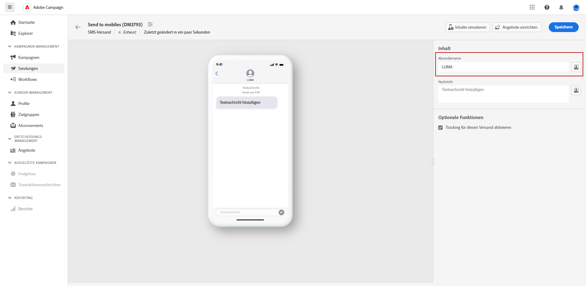
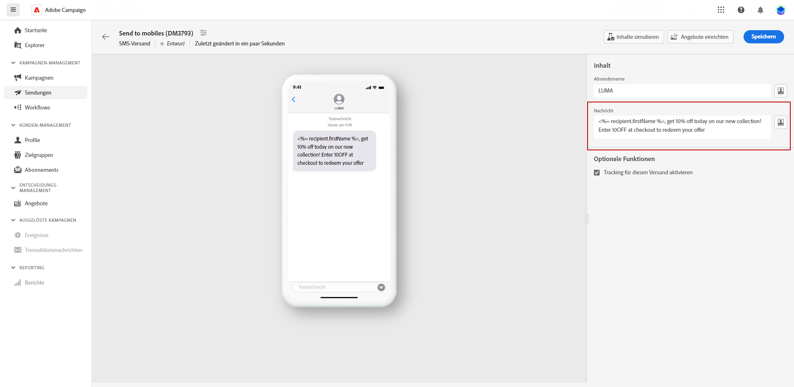

# Gestalten eines SMS-Versands {#design-sms}

>[!CONTEXTUALHELP]
>id="acw_deliveries_sms_content"
>title="SMS-Inhalte"
>abstract="Erstellen Sie die Inhalte Ihrer SMS-Sendungen und personalisieren Sie sie mit Personalisierungsfeldern, Inhaltsbausteinen und dynamischen Inhalten."

>[!CONTEXTUALHELP]
>id="acw_sms_preview_option_app_target"
>title="App-Abonnentinnen und -Abonnenten"
>abstract="Erstellen Sie eine Vorschau und testen Sie die Nachricht, indem Sie Abonnentinnen und Abonnenten der App zur Hauptzielgruppe hinzufügen."

1. Klicken Sie auf Ihrer Versandseite auf die Schaltfläche **[!UICONTROL Inhalt bearbeiten]**, um den SMS-Inhalt zu entwerfen.

1. Auf der Seite **[!UICONTROL Inhalt bearbeiten]** können Sie den Absendernamen anpassen, indem Sie auf das Feld **[!UICONTROL Absender]** zugreifen und den bevorzugten Namen eingeben.

   Durch Klicken auf **[!UICONTROL Personalisierungsdialog öffnen]** können Sie außerdem Personalisierungsfelder, Inhaltsbausteine und dynamische Inhalte in Ihre Nachricht einfügen.

   

1. Geben Sie Ihre Textnachricht im Feld **[!UICONTROL Nachricht]** ein oder klicken Sie auf die Option **[!UICONTROL Personalisierungsdialog öffnen]**, um Inhalte zu definieren und dynamische Inhalte hinzuzufügen. [Weitere Informationen](../personalization/gs-personalization.md)

   

1. Standardmäßig ist für Sendungen das Tracking aktiviert. Sie können diese Option im **[!UICONTROL Abschnitt „Optionale Funktionen“]** deaktivieren.

1. Greifen Sie auf das Menü **[!UICONTROL Inhalt simulieren]** zu, um eine Vorschau Ihres personalisierten Inhalts anzuzeigen. [Weitere Informationen](send-sms.md#preview-sms)

1. Klicken Sie auf **[!UICONTROL Speichern]** und überprüfen Sie Ihre Nachricht in der Vorschau.

Jetzt können Sie Ihre SMS-Nachricht überprüfen und an Ihre Zielgruppe senden.
