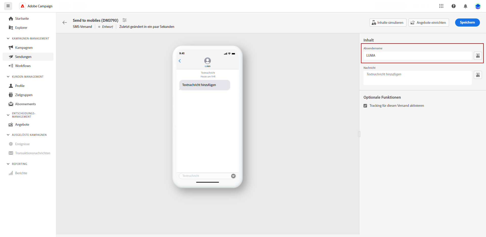
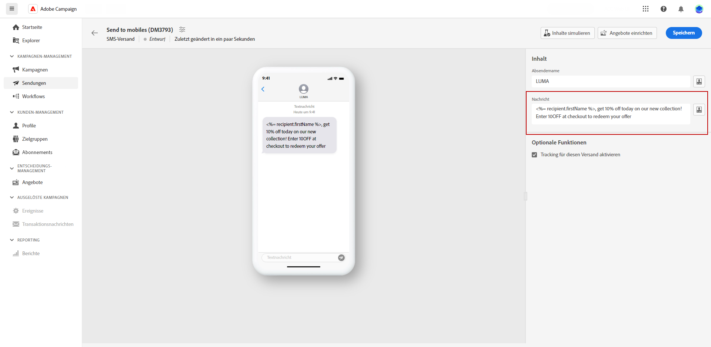

<?xml version="1.0" encoding="UTF-8"?>
<xliff xmlns="urn:oasis:names:tc:xliff:document:1.2" xmlns:okp="okapi-framework:xliff-extensions" xmlns:its="http://www.w3.org/2005/11/its" xmlns:itsxlf="http://www.w3.org/ns/its-xliff/" version="1.2" its:version="2.0">
<file original="help/v8/sms/content-sms.md.mdsc" source-language="en-US" target-language="en-XX" datatype="x-text/markdown">
<body>
<trans-unit id="tu1" restype="x-YAML_METADATA_HEADER_VALUE" xml:space="preserve">
<source xml:lang="en-US">Design a SMS delivery</source>
<target xml:lang="en-XX">Entwerfen eines SMS-Versands</target>
</trans-unit>
<trans-unit id="tu2" restype="x-YAML_METADATA_HEADER_VALUE" xml:space="preserve">
<source xml:lang="en-US">Learn how to design your SMS delivery</source>
<target xml:lang="en-XX">Erfahren Sie, wie Sie einen SMS-Versand entwerfen.</target>
</trans-unit>
<trans-unit id="tu3" xml:space="preserve">
<source xml:lang="en-US">Design an SMS delivery</source>
<target xml:lang="en-XX">Gestalten eines SMS-Versands</target>
</trans-unit>
<trans-unit id="tu4" xml:space="preserve">
<source xml:lang="en-US">SMS Content</source>
<target xml:lang="en-XX">SMS-Inhalte</target>
</trans-unit>
<trans-unit id="tu5" xml:space="preserve">
<source xml:lang="en-US">Create the content of your SMS deliveries, and personalize it with personalization fields, expression fragments, and dynamic content. To start composing your message, click the <ph id="1" ctype="x-STRONG_EMPHASIS">**</ph>Edit content<ph id="2" ctype="x-STRONG_EMPHASIS">**</ph> button.</source>
<target xml:lang="en-XX">Erstellen Sie die Inhalte Ihrer SMS-Sendungen und personalisieren Sie sie mit Personalisierungsfeldern, Ausdrucksfragmenten und dynamischen Inhalten. Um mit der Erstellung Ihrer Nachricht zu beginnen, klicken Sie auf die Schaltfläche <ph id="1" ctype="x-STRONG_EMPHASIS">**</ph>Inhalt bearbeiten<ph id="2" ctype="x-STRONG_EMPHASIS">**</ph>.</target>
</trans-unit>
<trans-unit id="tu6" xml:space="preserve">
<source xml:lang="en-US">SMS message content</source>
<target xml:lang="en-XX">SMS-Nachrichtinhalt</target>
</trans-unit>
<trans-unit id="tu7" xml:space="preserve">
<source xml:lang="en-US">Define the content of your SMS. To compose your message, click the <ph id="1" ctype="x-STRONG_EMPHASIS">**</ph>Message<ph id="2" ctype="x-STRONG_EMPHASIS">**</ph> field and enter the message content. Use the Expression editor to add personalized data and dynamic content. You can also customize the sender name. By default, tracking is enabled for all SMS deliveries, allowing you to measure when recipients click on links.</source>
<target xml:lang="en-XX">Definieren Sie den Inhalt Ihrer SMS. Um Ihre Nachricht zu erstellen, klicken Sie auf das Feld <ph id="1" ctype="x-STRONG_EMPHASIS">**</ph>Nachricht<ph id="2" ctype="x-STRONG_EMPHASIS">**</ph> und geben Sie den Nachrichteninhalt ein. Verwenden Sie den Ausdruckseditor, um personalisierte Daten und dynamische Inhalte hinzuzufügen. Sie können auch den Absendernamen anpassen. Standardmäßig ist das Tracking für alle SMS-Sendungen aktiviert, damit Sie verfolgen können, wann Empfängerinnen und Empfänger auf Links klicken.</target>
</trans-unit>
<trans-unit id="tu8" xml:space="preserve">
<source xml:lang="en-US">To design the content of an SMS delivery, follow these steps:</source>
<target xml:lang="en-XX">Gehen Sie wie folgt vor, um den Inhalt eines SMS-Versands zu erstellen:</target>
</trans-unit>
<trans-unit id="tu9" xml:space="preserve">
<source xml:lang="en-US">From your delivery page, click the <ph id="1" ctype="x-STRONG_EMPHASIS">**[!UICONTROL </ph>Edit content<ph id="3" ctype="x-LINK_REF">]**</ph> button to design your SMS content.</source>
<target xml:lang="en-XX">Klicken Sie auf Ihrer Versandseite auf die Schaltfläche <ph id="1" ctype="x-STRONG_EMPHASIS">**[!UICONTROL </ph>Inhalt bearbeiten<ph id="3" ctype="x-LINK_REF">]**</ph>, um den SMS-Inhalt zu entwerfen.</target>
</trans-unit>
<trans-unit id="tu10" xml:space="preserve">
<source xml:lang="en-US">On the <ph id="1" ctype="x-STRONG_EMPHASIS">**[!UICONTROL </ph>Edit content<ph id="3" ctype="x-LINK_REF">]**</ph> page, customize the sender name by accessing the <ph id="5" ctype="x-STRONG_EMPHASIS">**[!UICONTROL </ph>Sender field<ph id="7" ctype="x-LINK_REF">]**</ph> and entering the preferred name.</source>
<target xml:lang="en-XX">Passen Sie auf der Seite <ph id="1" ctype="x-STRONG_EMPHASIS">**[!UICONTROL </ph>Inhalt bearbeiten<ph id="3" ctype="x-LINK_REF">]**</ph> den Absendernamen an, indem Sie ihn wie gewünscht im Feld <ph id="5" ctype="x-STRONG_EMPHASIS">**[!UICONTROL </ph>Absender<ph id="7" ctype="x-LINK_REF">]**</ph> eingeben.</target>
</trans-unit>
<trans-unit id="tu11" xml:space="preserve">
<source xml:lang="en-US">Additionally, click <ph id="1" ctype="x-STRONG_EMPHASIS">**[!UICONTROL </ph>Open personalization dialog<ph id="3" ctype="x-LINK_REF">]**</ph> to include personalization fields, expression fragments, and dynamic content in your message.</source>
<target xml:lang="en-XX">Klicken Sie außerdem auf <ph id="1" ctype="x-STRONG_EMPHASIS">**[!UICONTROL </ph>Personalisierungsdialog öffnen<ph id="3" ctype="x-LINK_REF">]**</ph>, um Personalisierungsfelder, Ausdrucksfragmente und dynamische Inhalte in Ihre Nachricht einzuschließen.</target>
</trans-unit>
<trans-unit id="tu12" xml:space="preserve">
<source xml:lang="en-US"><ph id="1" ctype="x-IMAGE">{zoomable="yes"}</ph></source>
<target xml:lang="en-XX"><ph id="1" ctype="x-IMAGE">{zoomable="yes"}</ph></target>
</trans-unit>
<trans-unit id="tu13" xml:space="preserve">
<source xml:lang="en-US">Type your text message in the <ph id="1" ctype="x-STRONG_EMPHASIS">**[!UICONTROL </ph>Message<ph id="3" ctype="x-LINK_REF">]**</ph> field, or click the <ph id="5" ctype="x-STRONG_EMPHASIS">**[!UICONTROL </ph>Open personalization dialog<ph id="7" ctype="x-LINK_REF">]**</ph> option to define content and add dynamic content. <ph id="9" ctype="x-LINK">[</ph>Learn more<ph id="10" ctype="x-LINK">](../personalization/gs-personalization.md)</ph></source>
<target xml:lang="en-XX">Geben Sie Ihre Textnachricht in das Feld <ph id="1" ctype="x-STRONG_EMPHASIS">**[!UICONTROL </ph>Nachricht<ph id="3" ctype="x-LINK_REF">]**</ph> ein oder klicken Sie auf die Option <ph id="5" ctype="x-STRONG_EMPHASIS">**[!UICONTROL </ph>Personalisierungsdialog öffnen<ph id="7" ctype="x-LINK_REF">]**</ph>, um Inhalte zu definieren und dynamische Inhalte hinzuzufügen. <ph id="9" ctype="x-LINK">[</ph>Weitere Informationen<ph id="10" ctype="x-LINK">](../personalization/gs-personalization.md)</ph></target>
</trans-unit>
<trans-unit id="tu14" xml:space="preserve">
<source xml:lang="en-US"><ph id="1" ctype="x-IMAGE">{zoomable="yes"}</ph></source>
<target xml:lang="en-XX"><ph id="1" ctype="x-IMAGE">{zoomable="yes"}</ph></target>
</trans-unit>
<trans-unit id="tu15" xml:space="preserve">
<source xml:lang="en-US">By default, tracking is enabled for deliveries. Disable this option from the delivery's <ph id="1" ctype="x-STRONG_EMPHASIS">**[!UICONTROL </ph>Settings<ph id="3" ctype="x-LINK_REF">]**</ph> > <ph id="5" ctype="x-STRONG_EMPHASIS">**[!UICONTROL </ph>Tracking<ph id="7" ctype="x-LINK_REF">]**</ph> tab if needed. <ph id="9" ctype="x-LINK">[</ph>Learn more<ph id="10" ctype="x-LINK">](../advanced-settings/delivery-settings.md#tracking-tab)</ph></source>
<target xml:lang="en-XX">Standardmäßig ist für Sendungen das Tracking aktiviert. Deaktivieren Sie diese Option bei Bedarf auf der Registerkarte <ph id="1" ctype="x-STRONG_EMPHASIS">**[!UICONTROL </ph>Einstellungen<ph id="3" ctype="x-LINK_REF">]**</ph> > <ph id="5" ctype="x-STRONG_EMPHASIS">**[!UICONTROL </ph>Tracking<ph id="7" ctype="x-LINK_REF">]**</ph> des Versands. <ph id="9" ctype="x-LINK">[</ph>Weitere Informationen<ph id="10" ctype="x-LINK">](../advanced-settings/delivery-settings.md#tracking-tab)</ph></target>
</trans-unit>
<trans-unit id="tu16" xml:space="preserve">
<source xml:lang="en-US">Click <ph id="1" ctype="x-STRONG_EMPHASIS">**[!UICONTROL </ph>Settings<ph id="3" ctype="x-LINK_REF">]**</ph> to access advanced options related to your delivery template. <ph id="5" ctype="x-LINK">[</ph>Learn more<ph id="6" ctype="x-LINK">](../advanced-settings/delivery-settings.md)</ph></source>
<target xml:lang="en-XX">Klicken Sie auf <ph id="1" ctype="x-STRONG_EMPHASIS">**[!UICONTROL </ph>Einstellungen<ph id="3" ctype="x-LINK_REF">]**</ph>, um auf die erweiterten Optionen für Ihre Versandvorlage zuzugreifen. <ph id="5" ctype="x-LINK">[</ph>Weitere Informationen<ph id="6" ctype="x-LINK">](../advanced-settings/delivery-settings.md)</ph></target>
</trans-unit>
<trans-unit id="tu17" xml:space="preserve">
<source xml:lang="en-US">Access the <ph id="1" ctype="x-STRONG_EMPHASIS">**[!UICONTROL </ph>Simulate content<ph id="3" ctype="x-LINK_REF">]**</ph> menu to preview your personalized content. <ph id="5" ctype="x-LINK">[</ph>Learn more<ph id="6" ctype="x-LINK">](send-sms.md#preview-sms)</ph></source>
<target xml:lang="en-XX">Greifen Sie auf das Menü <ph id="1" ctype="x-STRONG_EMPHASIS">**[!UICONTROL </ph>Inhalt simulieren<ph id="3" ctype="x-LINK_REF">]**</ph> zu, um eine Vorschau Ihres personalisierten Inhalts anzuzeigen. <ph id="5" ctype="x-LINK">[</ph>Weitere Informationen<ph id="6" ctype="x-LINK">](send-sms.md#preview-sms)</ph></target>
</trans-unit>
<trans-unit id="tu18" xml:space="preserve">
<source xml:lang="en-US">Click <ph id="1" ctype="x-STRONG_EMPHASIS">**[!UICONTROL </ph>Save<ph id="3" ctype="x-LINK_REF">]**</ph> and check your message in the preview.</source>
<target xml:lang="en-XX">Klicken Sie auf <ph id="1" ctype="x-STRONG_EMPHASIS">**[!UICONTROL </ph>Speichern<ph id="3" ctype="x-LINK_REF">]**</ph> und überprüfen Sie Ihre Nachricht in der Vorschau.</target>
</trans-unit>
<trans-unit id="tu19" xml:space="preserve">
<source xml:lang="en-US">Review and send your SMS message to your audience.</source>
<target xml:lang="en-XX">Überprüfen Sie Ihre SMS-Nachricht und senden Sie sie Ihrer Zielgruppe.</target>
</trans-unit>
</body>
</file>
</xliff>