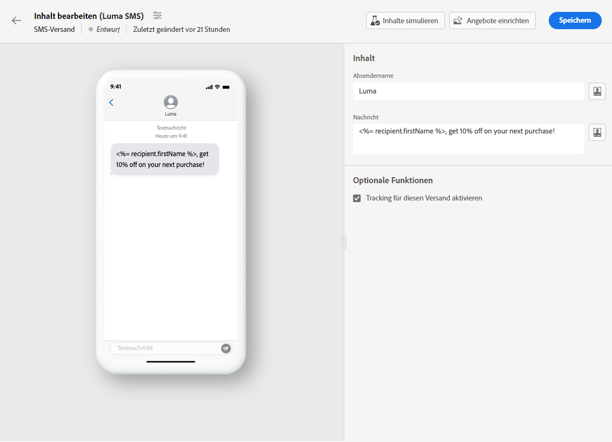
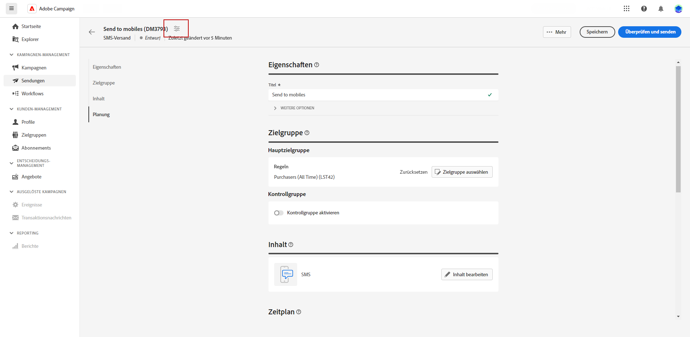

# Erstellen eines SMS-Versands {#create-sms}

>[!CONTEXTUALHELP]
>id="acw_deliveries_sms_properties"
>title="Eigenschaften des SMS-Versands"
>abstract="Die Eigenschaften umfassen die üblichen Versandparameter, nach denen Sie Ihren Versand benennen und klassifizieren können. Wenn Ihr Versand auf einem erweiterten Schema basiert, stehen spezifische Felder für benutzerdefinierte Optionen zur Verfügung."

>[!CONTEXTUALHELP]
>id="acw_deliveries_sms_audience"
>title="Definieren der SMS-Zielgruppe"
>abstract="Wählen Sie die beste Zielgruppe für Ihre SMS-Nachricht aus."

>[!CONTEXTUALHELP]
>id="acw_deliveries_sms_template_selection"
>title="Auswahl von SMS-Vorlagen"
>abstract="Wählen Sie eine vordefinierte Vorlage aus, um Ihren SMS-Versand zu starten."

Sie können einen eigenständigen SMS-Versand erstellen oder eine SMS im Kontext eines Kampagnen-Workflows erstellen. Die folgenden Schritte beschreiben die Vorgehensweise für einen eigenständigen (einmaligen) SMS-Versand. Wenn Sie im Kontext eines Kampagnen-Workflows arbeiten, finden Sie in [diesem Abschnitt](../workflows/activities/channels.md#create-a-delivery-in-a-campaign-workflow) detaillierte Schritte, um einen solchen Versand zu erstellen.

Gehen Sie wie folgt vor, um einen eigenständigen SMS-Versand zu erstellen:

1. Gehen Sie zum Menü **[!UICONTROL Sendungen]** in der linken Leiste, und klicken Sie auf die Schaltfläche **[!UICONTROL Versand erstellen]**.

1. Wählen Sie im Abschnitt **[!UICONTROL Kanal]** als Kanal SMS aus und wählen Sie eine Vorlage aus. [Weitere Informationen zu Vorlagen](../msg/delivery-template.md)

1. Klicken Sie zur Bestätigung auf **[!UICONTROL Versand erstellen]**.

   

1. Geben Sie eine **[!UICONTROL Kennzeichnung]** für den Versand ein und greifen Sie auf die Dropdown-Liste **[!UICONTROL Zusätzliche Optionen]** zu.

   +++Konfigurieren Sie die folgenden Einstellungen entsprechend Ihren Anforderungen.
   * **[!UICONTROL Interner Name]**: Weisen Sie dem Versand eine eindeutige Kennung zu.
   * **[!UICONTROL Ordner]**: Speichern Sie den Versand in einem bestimmten Ordner.
   * **[!UICONTROL Versand-Code]**: Verwenden Sie dieses Feld, um Ihre Sendungen basierend auf Ihrer eigenen Namenskonvention zu organisieren.
   * **[!UICONTROL Beschreibung]**: Geben Sie eine Beschreibung für den Versand an.
   * **[!UICONTROL Art]**: Geben Sie die Art der E-Mail zu Klassifizierungszwecken an.
+++

1. Klicken Sie auf die Schaltfläche **[!UICONTROL Zielgruppe auswählen]**, um eine vorhandene Zielgruppe anzusprechen oder eine eigene zu erstellen. [Weitere Informationen](../audience/about-recipients.md).

   

1. Schalten Sie die Gruppenoption **[!UICONTROL Kontrollgruppe aktivieren]** ein, um zur Messung der Wirkung Ihres Versands eine Kontrollgruppe einzurichten, durch die Sie das Verhalten der Population, die die Nachricht erhalten hat, mit dem Verhalten der Kontakte vergleichen können, die sie nicht erhalten haben. [Weitere Informationen](../audience/control-group.md)

1. Klicken Sie auf **[!UICONTROL Inhalt bearbeiten]**, um mit der Erstellung des Inhalts Ihrer SMS-Nachricht zu beginnen. [Weitere Informationen](content-sms.md)

   

   Auf diesem Bildschirm können Sie auch [Inhalte simulieren](../preview-test/preview-test.md) und [Angebote einrichten](../content/offers.md).

1. Um den Versand für ein bestimmtes Datum und eine bestimmte Uhrzeit zu planen, aktivieren Sie die Option **[!UICONTROL Zeitplan aktivieren]**. Nachdem der Versand initiiert wurde, wird die Nachricht automatisch an dem Datum und zu der Uhrzeit gesendet, die Sie für die Empfängerin bzw. den Empfänger festgelegt haben. Weitere Informationen zur Versandplanung finden Sie in [diesem Abschnitt](../msg/gs-messages.md#gs-schedule).

1. Klicken Sie auf **[!UICONTROL Versandeinstellungen konfigurieren]**, um auf erweiterte Optionen in Bezug auf Ihre Versandvorlage zuzugreifen. [Weitere Informationen](../advanced-settings/delivery-settings.md)

   
