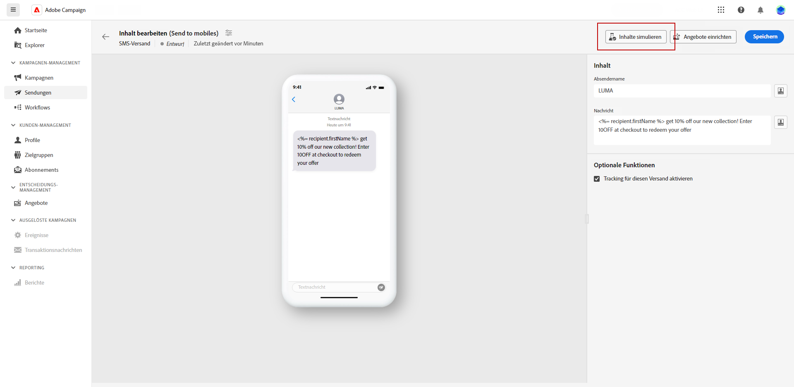
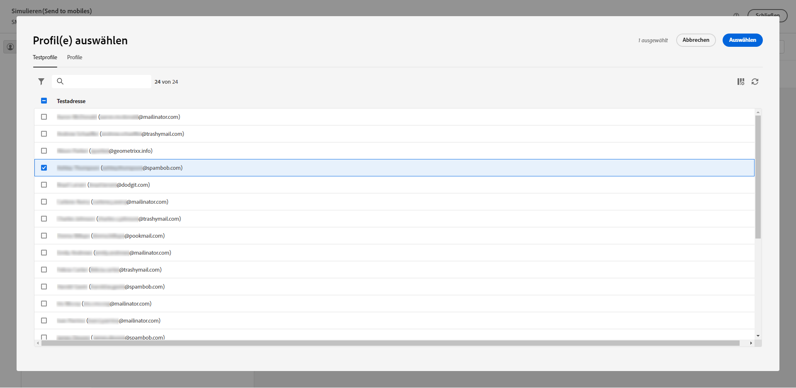
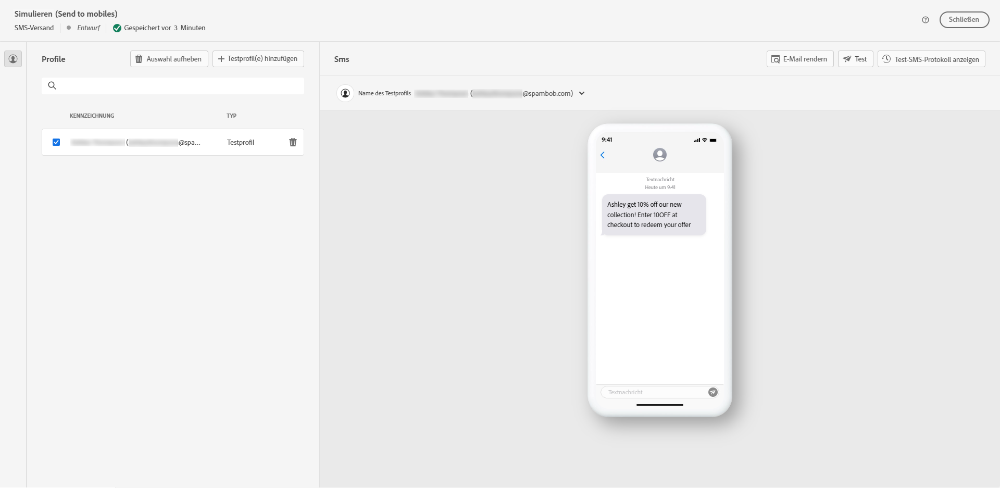
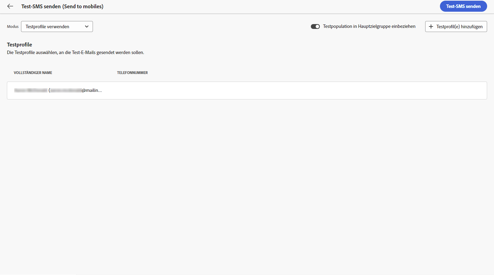
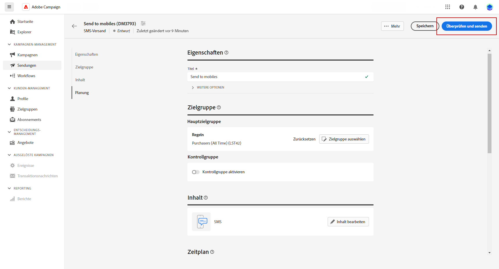
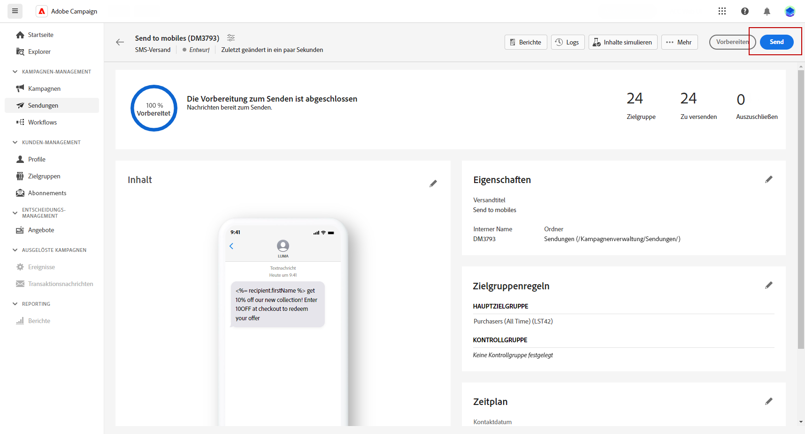

# Vorschau und Senden eines SMS-Versands {#send-sms-delivery}

>[!CONTEXTUALHELP]
>id="acw_deliveries_metrics_newquarantines"
>title="Metrik „Neu in Quarantäne“"
>abstract="Gesamtzahl der Adressen, die infolge eines fehlgeschlagenen Versands unter Quarantäne gestellt wurden (unbekannte Benutzende, ungültige Domain), im Verhältnis zur Anzahl der zu versendenden Nachrichten."

## Vorschau Ihres SMS-Versands{#preview-sms}

Nachdem Sie den Nachrichteninhalt definiert haben, können Sie mithilfe von Testprofilen eine Vorschau anzeigen und einen Testversand durchführen. Wenn Sie personalisierten Inhalt eingefügt haben, können Sie mithilfe von Testprofildaten prüfen, wie dieser Inhalt in der Nachricht angezeigt wird. Auf diese Weise können Sie sicherstellen, dass die Nachricht wie beabsichtigt erscheint und alle personalisierten Informationen korrekt dargestellt werden.

Die wichtigsten Schritte zum Anzeigen eines SMS-Versands in einer Vorschau sind: Weitere Informationen über die Vorschau von Sendungen finden Sie in [diesem Abschnitt](../preview-test/preview-content.md).

1. Auf der Seite für den Versandinhalt können Sie über die Option **[!UICONTROL Inhalt simulieren]** personalisierten Inhalt in einer Vorschau anzeigen.

   

1. Klicken Sie auf **[!UICONTROL Testprofil(e) hinzufügen]**, um ein oder mehrere Testprofile auszuwählen.

   <!--
    Once your test profiles are selected, click **[!UICONTROL Select]**.
    
    -->

1. Im rechten Bereich sehen Sie eine Vorschau des SMS-Versands, in der personalisierte Elemente dynamisch durch Daten aus dem ausgewählten Profil ersetzt werden.

   

Jetzt können Sie Ihre SMS-Nachricht überprüfen und an Ihre Zielgruppe senden.

## Testen Ihres SMS-Versands {#test-sms}

Mit **Adobe Campaign** können Sie eine Nachricht testen, bevor Sie sie an die Hauptzielgruppe senden. Dies ist ein wichtiger Schritt beim Validieren Ihrer E-Mail-Kampagne und beim Identifizieren potenzieller Probleme.

Der Versand von Test-SMS ist ein wichtiger Schritt, um die Qualität und Effektivität Ihres Versands sicherzustellen. Empfängerinnen und Empfänger von Testsendungen können verschiedene Elemente wie Links, Opt-out-Links und Bilder überprüfen sowie Fehler bei Rendering, Inhalt, Personalisierungseinstellungen und SMS-Konfiguration identifizieren. Dieser Prozess hilft Ihnen, Ihre SMS gründlich auszuwerten und zu optimieren, bevor sie Ihre Hauptzielgruppe erreichen.

 In [diesem Abschnitt](../preview-test/test-deliveries.md) erfahren Sie, wie Sie Test-SMS versenden können.

## Senden Ihres SMS-Versands {#send-sms}

1. Nachdem Sie den Inhalt Ihrer SMS personalisiert haben, klicken Sie auf der Seite **[!UICONTROL Versand]** auf **[!UICONTROL Überprüfen und versenden]**.

   

1. Klicken Sie auf **[!UICONTROL Vorbereiten]** und überwachen Sie den Fortschritt und die bereitgestellten Statistiken.

   Wenn Fehler auftreten, finden Sie im Menü „Protokolle“ detaillierte Informationen zum Fehler.

1. Senden Sie die Nachrichten, indem Sie auf **[!UICONTROL Senden]** klicken, um mit dem endgültigen Versandprozess fortzufahren.

   

   Wenn der SMS-Versand geplant wurde, klicken Sie auf die Schaltfläche **[!UICONTROL Nach Zeitplan senden]**. Weitere Informationen zur Versandplanung finden Sie in [diesem Abschnitt](../msg/gs-messages.md#schedule-the-delivery-sending).

1. Bestätigen Sie den Sendevorgang durch Auswahl der Schaltfläche **[!UICONTROL Senden]**.

Nach dem Versand können Sie Ihre KPI(Key Performance Indicator)-Daten über Ihre Versandseite und weitere Daten über das Menü **[!UICONTROL Protokolle]** verfolgen.

Nun können Sie beginnen, mit integrierten Berichten die Wirkung Ihrer Nachricht zu messen. [Weitere Informationen](../reporting/sms-report.md)

