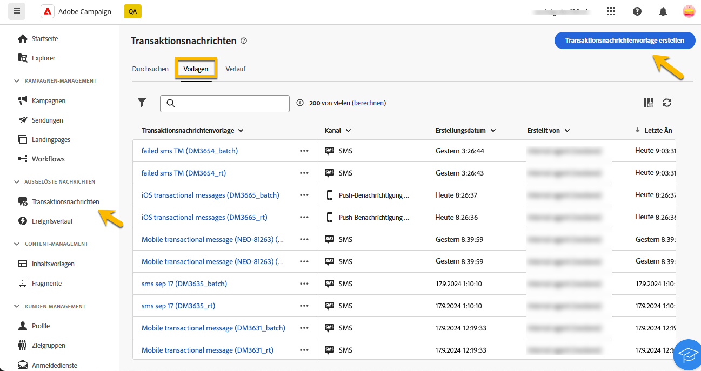
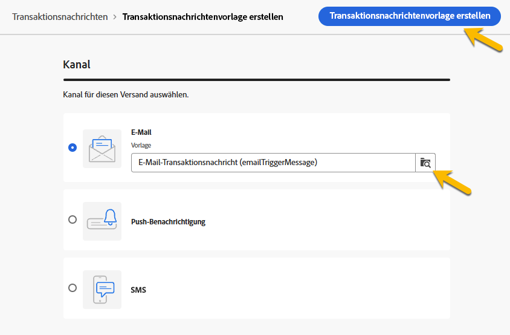

# Erstellen von Transaktionsnachrichten

Beim Transaktionsnachrichtenversand Trigger ein Ereignis den Versand einer personalisierten Nachricht. Erstellen Sie dazu für jeden Ereignistyp eine Nachrichtenvorlage. Diese Vorlagen enthalten alle notwendigen Informationen zur Personalisierung der Transaktionsnachricht.

## Erstellen einer Transaktionsnachrichtenvorlage {#transactional-template}

In der Campaign Web-Benutzeroberfläche besteht der erste Schritt in der Konfiguration der Transaktionsnachrichten aus der Erstellung der Vorlage oder der direkten Erstellung der Nachricht. Dies unterscheidet sich von [der Konfiguration von Transaktionsnachrichten auf der Client-Konsole](https://experienceleague.adobe.com/de/docs/campaign/campaign-v8/send/real-time/transactional).

Eine Transaktionsnachrichtenvorlage kann verwendet werden, um den vom Profil empfangenen Versandinhalt in der Vorschau anzuzeigen, bevor er die endgültige Zielgruppe erreicht. Beispielsweise kann eine Administratorin bzw. ein Administrator die Vorlagen einrichten und konfigurieren, damit sie für Marketing-Fachleute nutzbar sind.

Gehen Sie wie folgt vor, um eine Transaktionsnachrichtenvorlage zu erstellen:

* Navigieren Sie im Abschnitt **[!UICONTROL Ausgelöste Nachrichten]** zu **[!UICONTROL Transaktionsnachrichten]**. Auf der Registerkarte **[!UICONTROL Vorlagen]** werden alle Versandvorlagen für Transaktionsnachrichten angezeigt. Klicken Sie auf die Schaltfläche **[!UICONTROL Transaktionsnachrichtenvorlage erstellen]**, um mit dem Erstellen Ihrer Vorlage zu beginnen.

  {zoomable="yes"}

* Wählen Sie auf der neuen angezeigten Seite den Kanal Ihrer Vorlage aus. Wählen Sie für dieses Beispiel den Kanal **[!UICONTROL E-Mail]** aus. Sie können auch eine andere Nachrichtenvorlage verwenden und diese in der Vorlagenliste auswählen.

  {zoomable="yes"}

  Klicken Sie erneut auf **[!UICONTROL Transaktionsnachricht erstellen]**, um die Erstellung Ihrer Vorlage im ausgewählten Kanal zu validieren.

* Rufen Sie die Konfiguration Ihrer Transaktionsnachrichtenvorlage auf.

  {zoomable="yes"}

### Eigenschaften der Transaktionsnachricht {#transactional-properties}

>[!CONTEXTUALHELP]
>id="acw_transacmessages_properties"
>title="Eigenschaften von Transaktionsnachrichten"
>abstract="Füllen Sie dieses Formular aus, um die Eigenschaften der Transaktionsnachricht zu konfigurieren."

>[!CONTEXTUALHELP]
>id="acw_transacmessages_email_properties"
>title="Eigenschaften von Transaktionsnachrichten per E-Mail"
>abstract="Füllen Sie dieses Formular aus, um die Eigenschaften der Transaktionsnachrichten-E-Mail zu konfigurieren."

>[!CONTEXTUALHELP]
>id="acw_transacmessages_sms_properties"
>title="Eigenschaften von Transaktionsnachrichten per SMS"
>abstract="Füllen Sie dieses Formular aus, um die Eigenschaften von Transaktionsnachrichten-SMS zu konfigurieren."

>[!CONTEXTUALHELP]
>id="acw_transacmessages_push_properties"
>title="Eigenschaften von Transaktionsnachrichten per Push"
>abstract="Füllen Sie dieses Formular aus, um die Push-Eigenschaften für Transaktionsnachrichten zu konfigurieren."

Im **[!UICONTROL Eigenschaften]** einer Transaktionsnachricht können Sie Folgendes einrichten:

* Die **[!UICONTROL label]** ist der in der Liste der Transaktionsnachrichten angezeigte Name. Verwenden Sie ein eindeutiges Label für Recherche- und zukünftige Verwendungszwecke.
* Der **[!UICONTROL Interne Name]** ist ein eindeutiger Name, der Ihre Nachricht von anderen erstellten Nachrichten unterscheidet.
* Der **[!UICONTROL Ordner]**, in dem die Transaktionsnachrichtenvorlage erstellt wird.
* Der **[!UICONTROL Ausführungsordner]** in dem die Nachricht nach der Ausführung gespeichert wird.
* Der **[!UICONTROL Versand-Code]** ist ein Code, mit dem die Nachricht bei Bedarf für das Reporting erkannt wird.
* Die **[!UICONTROL Beschreibung]**.
* Die **[!UICONTROL Natur]** entspricht der Art Ihres Versands, wie in der Auflistung *deliveryNature* aufgeführt. [Weitere Informationen zu Auflistungen](https://experienceleague.adobe.com/de/docs/campaign/campaign-v8/config/configuration/ui-settings#enumerations).

{zoomable="yes"}

### Mobile App {#mobile-app}

>[!CONTEXTUALHELP]
>id="acw_transacmessages_mobileapp"
>title="Transaktionsnachrichten per Mobile App"
>abstract="In diesem Abschnitt können Sie die App auswählen, in der Sie Ihre Push-Benachrichtigung senden möchten."

Wählen Sie in diesem Abschnitt die Anwendung aus, in die Sie Ihre Nachricht senden möchten.

Durch Klicken auf das Suchsymbol können Sie auf die Liste der Mobile Apps in Ihrer Adobe Campaign-Instanz zugreifen.

{zoomable="yes"}

### Kontextbeispiel {#context-sample}

>[!CONTEXTUALHELP]
>id="acw_transacmessages_context"
>title="Kontext von Transaktionsnachrichten"
>abstract="Im Kontextbeispiel können Sie ein Testereignis erstellen, um eine Vorschau der mit der Profilpersonalisierung empfangenen Transaktionsnachricht anzuzeigen."

>[!CONTEXTUALHELP]
>id="acw_transacmessages_addcontext"
>title="Kontext von Transaktionsnachrichten"
>abstract="Im Kontextbeispiel können Sie ein Testereignis erstellen, um eine Vorschau der mit der Profilpersonalisierung empfangenen Transaktionsnachricht anzuzeigen."

Im Kontextbeispiel können Sie ein Testereignis erstellen, um eine Vorschau der mit der Profilpersonalisierung empfangenen Transaktionsnachricht anzuzeigen.

Dieser Schritt ist optional. Sie können die Vorlage ohne das Kontextbeispiel verwenden. Der Nachteil: Sie können die personalisierten Inhalte nicht in einer Vorschau anzeigen.

In diesem Beispiel sendet das Ereignis den Vornamen, Nachnamen und einen personalisierten Link des Benutzers, um sein Kennwort zurückzusetzen. Der Kontext kann wie unten dargestellt konfiguriert werden.

Der Kontextinhalt hängt von der benötigten Personalisierung ab.

{zoomable="yes"}

### Inhalte für Transaktionsnachrichtenvorlagen {#transactional-content}

>[!CONTEXTUALHELP]
>id="acw_transacmessages_content"
>title="Inhalte für Transaktionsnachrichten"
>abstract="Erfahren Sie, wie Sie den Transaktionsnachrichten-Inhalt erstellen."

>[!CONTEXTUALHELP]
>id="acw_transacmessages_personalization"
>title="Personalisierung von Transaktionsnachrichten"
>abstract="Erfahren Sie, wie Sie den Inhalt von Transaktionsnachrichten personalisieren können."

>[!CONTEXTUALHELP]
>id="acw_personalization_editor_event_context"
>title="Ereigniskontext"
>abstract="Dieses Menü enthält Variablen aus dem Trigger-Ereignis, die Sie zur Personalisierung Ihres Transaktionsnachrichteninhalts nutzen können."

Die Arbeit am Inhalt einer Transaktionsnachricht ähnelt der Inhaltserstellung eines Versands. Klicken Sie auf **[!UICONTROL E-Mail]** Designer öffnen oder **[!UICONTROL E-Mail-Textkörper bearbeiten]** und wählen Sie einen Vorlageninhalt aus oder importieren Sie Ihren HTML-Code.

{zoomable="yes"}

Um dem Inhalt eine Personalisierung hinzuzufügen, klicken Sie auf den Abschnitt, in dem Sie ihn hinzufügen möchten, und wählen Sie das Symbol **[!UICONTROL Personalization hinzufügen]** aus.

{zoomable="yes"}

Rufen Sie das Fenster **[!UICONTROL Personalisierung bearbeiten]** auf. Um Variablen aus dem Trigger-Ereignis hinzuzufügen, klicken Sie auf das Symbol **[!UICONTROL Ereigniskontext]** . Navigieren Sie zu dem Kontext, den Sie für Ihre Vorlage definiert haben [weitere Informationen zum Kontext](#context-sample) und klicken Sie auf die Schaltfläche **[!UICONTROL +]** , um die erforderliche Variable einzufügen.

Die folgende Abbildung zeigt, wie Sie dem Vornamen eine Personalisierung hinzufügen.

{zoomable="yes"}

Fügen Sie in diesem Beispiel den Vornamen und Nachnamen hinzu und personalisieren Sie den Link **[!UICONTROL Kennwort zurücksetzen]**.

{zoomable="yes"}

### Anzeigen der Vorlage in einer Vorschau

In diesem Schritt der Vorlagenerstellung sollten Sie den Vorlageninhalt in der Vorschau anzeigen und die Personalisierung überprüfen.

Füllen Sie dazu das Feld [Kontextbeispiel](#context-sample) aus und klicken Sie auf die Schaltfläche **[!UICONTROL Inhalt simulieren]**.

{zoomable="yes"}

## Erstellen einer Transaktionsnachricht {#transactional-message}

Sie können eine Transaktionsnachricht direkt oder mithilfe einer Transaktionsnachrichtenvorlage erstellen. [Erfahren Sie, wie Sie eine Transaktionsnachrichtenvorlage erstellen](#transactional-template).

Gehen Sie wie folgt vor, um eine Transaktionsnachricht zu erstellen:

* Navigieren Sie im Abschnitt **[!UICONTROL Ausgelöste Nachrichten]** zu **[!UICONTROL Transaktionsnachrichten]**. Auf der Registerkarte **[!UICONTROL Durchsuchen]** werden alle erstellten Transaktionsnachrichten angezeigt. Klicken Sie auf die Schaltfläche **[!UICONTROL Transaktionsnachricht erstellen]**, um Ihre Nachricht zu erstellen.

  {zoomable="yes"}

* Wählen Sie auf der neu angezeigten Seite den Kanal Ihrer Nachricht und dann die Vorlage aus, mit der Sie arbeiten möchten. Wählen Sie in diesem Beispiel [die zuvor erstellte Vorlage](#transactional-template).

  {zoomable="yes"}

  Klicken Sie erneut auf **[!UICONTROL Transaktionsnachricht erstellen]**, um die Erstellung Ihrer Nachricht im ausgewählten Kanal zu validieren.

* Rufen Sie die Konfiguration Ihrer Transaktionsnachricht auf. Ihre Nachricht übernimmt die Konfiguration der Vorlage. Diese Seite ist nahezu identisch mit der Konfigurationsseite der Transaktionsnachrichtenvorlage, sie enthält aber auch die Konfiguration des Ereignistyps.

  {zoomable="yes"}

  Füllen Sie die Konfiguration Ihrer Nachricht wie für eine Vorlage aus:
   * [Eigenschaften der Transaktionsnachricht](#transactional-properties)
   * [Kontextbeispiel](#context-sample)
   * [Nachrichteninhalt](#transactional-content)
und [Konfigurieren Sie den Ereignistyp](#event-type) wie unten beschrieben.

* Nachdem [Transaktionsnachricht validiert wurde](validate-transactional.md) klicken Sie auf die Schaltfläche **[!UICONTROL Überprüfen und veröffentlichen]** um Ihre Nachricht zu erstellen und zu veröffentlichen. Die Trigger können jetzt den Versand Ihrer Transaktionsnachricht per Push durchführen.

### Über den Ereignistyp {#event-type}

>[!CONTEXTUALHELP]
>id="acw_transacmessages_event"
>title="Transaktionsnachrichtenereignis"
>abstract="Die Konfiguration des Ereignistyps verknüpft die Nachricht mit dem Trigger-Ereignis."

Die Konfiguration des Ereignistyps verknüpft die Nachricht mit dem Trigger-Ereignis.

Wählen Sie in der Web-Benutzeroberfläche von Campaign einen bereits erstellten Ereignistyp aus oder erstellen Sie Ihren Ereignistyp direkt auf dieser Konfigurationsseite.

{zoomable="yes"}

>[!CAUTION]
>
>Wenn Sie einen Ereignistyp auswählen, der derzeit von einer anderen Transaktionsnachricht verwendet wird, werden beide Nachrichten in Trigger gesetzt. Für Best Practices **Sie „EINEN Ereignistyp mit NUR EINER Transaktionsnachricht verknüpfen“**

## Hinzufügen von Angeboten zu Transaktionsnachrichten {#transactional-offers}

Sie können Angebote in Ihre Transaktionsnachrichten aufnehmen, sodass Sie Ihren Endbenutzern relevante Angebote unterbreiten können, auch wenn die Nachricht ereignisgesteuert ist.

Diese Funktion ist während der Inhaltsbearbeitung Ihrer Transaktionsnachricht verfügbar. Klicken Sie auf die Schaltfläche **[!UICONTROL Angebote einrichten]**, um sie zu konfigurieren.

Der Einrichtungsprozess entspricht dem Konfigurieren von Angeboten für Standardsendungen. [Erfahren Sie, wie Sie Angebote zu Ihrer Nachricht hinzufügen](../msg/offers.md).

{zoomable="yes"}