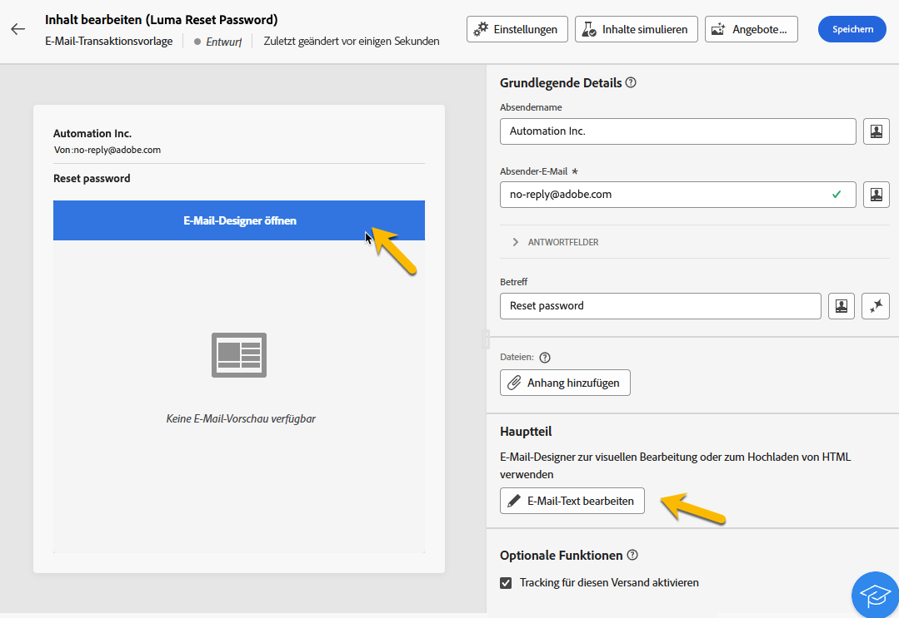
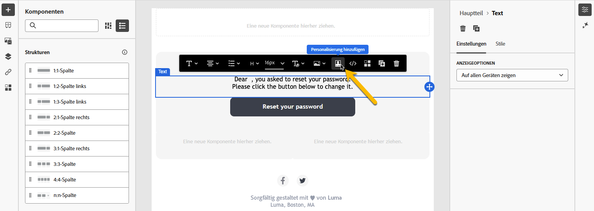
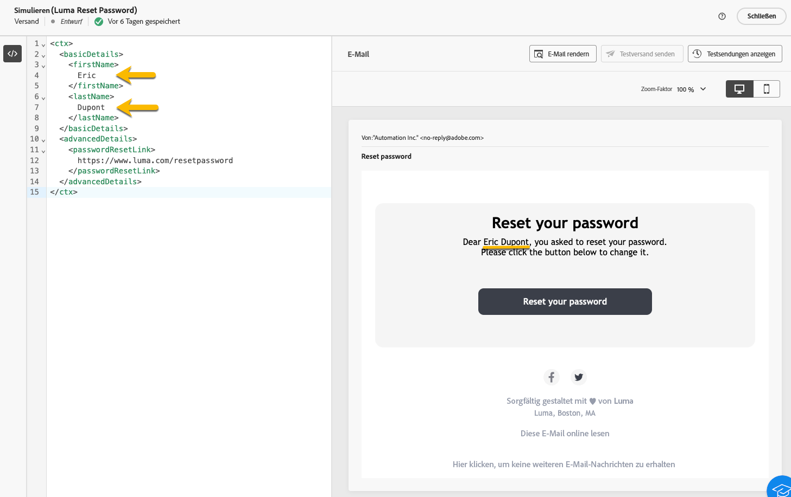

# Erstellen von Transaktionsnachrichten

In Transaktionsnachrichten wird der Versand einer personalisierten Nachricht durch ein Ereignis ausgelöst. Hierzu müssen Sie für jeden Ereignistyp eine Nachrichtenvorlage erstellen. Diese Vorlagen enthalten alle notwendigen Informationen zur Personalisierung der Transaktionsnachricht.

## Erstellen einer Transaktionsnachrichtenvorlage {#transactional-template}

In der Campaign Web-Benutzeroberfläche besteht der erste Schritt in der Konfiguration der Transaktionsnachrichten aus der Erstellung der Vorlage oder der direkten Erstellung der Nachricht. Dies unterscheidet sich von [der Konfiguration von Transaktionsnachrichten in der Client-Konsole](https://experienceleague.adobe.com/de/docs/campaign/campaign-v8/send/real-time/transactional).

Eine Transaktionsnachrichtenvorlage kann verwendet werden, um den vom Profil empfangenen Versandinhalt in der Vorschau anzuzeigen, bevor er die endgültige Zielgruppe erreicht. Beispielsweise kann eine Administratorin bzw. ein Administrator die Vorlagen einrichten und konfigurieren, damit sie für Marketing-Fachleute nutzbar sind.

Gehen Sie wie folgt vor, um eine Transaktionsnachrichtenvorlage zu erstellen:

* Navigieren Sie im Abschnitt **[!UICONTROL Ausgelöste Nachrichten]** zu **[!UICONTROL Transaktionsnachrichten]**. Auf der Registerkarte **[!UICONTROL Vorlagen]** werden alle Versandvorlagen für Transaktionsnachrichten angezeigt. Klicken Sie auf die Schaltfläche **[!UICONTROL Transaktionsnachrichtenvorlage erstellen]**, um mit dem Erstellen Ihrer Vorlage zu beginnen.

  {zoomable="yes"}

* Wählen Sie auf der neuen angezeigten Seite den Kanal Ihrer Vorlage aus. Wählen Sie für dieses Beispiel den Kanal **[!UICONTROL E-Mail]** aus. Sie können auch eine andere Nachrichtenvorlage verwenden und diese in der Vorlagenliste auswählen.

  {zoomable="yes"}

  Klicken Sie erneut auf die Schaltfläche **[!UICONTROL Transaktionsnachricht erstellen]**, um die Erstellung Ihrer Vorlage für den ausgewählten Kanal zu validieren.

* Greifen Sie auf die Konfiguration Ihrer Transaktionsnachrichtenvorlage zu.

  {zoomable="yes"}

### Eigenschaften der Transaktionsnachricht {#transactional-properties}

>[!CONTEXTUALHELP]
>id="acw_transacmessages_properties"
>title="Eigenschaften von Transaktionsnachrichten"
>abstract="Füllen Sie dieses Formular aus, um die Eigenschaften von Transaktionsnachrichten zu konfigurieren."

>[!CONTEXTUALHELP]
>id="acw_transacmessages_email_properties"
>title="Eigenschaften von Transaktionsnachrichten per E-Mail"
>abstract="Füllen Sie dieses Formular aus, um die Eigenschaften von per E-Mail versendeten Transaktionsnachrichten zu konfigurieren."

>[!CONTEXTUALHELP]
>id="acw_transacmessages_sms_properties"
>title="Eigenschaften von Transaktionsnachrichten per SMS"
>abstract="Füllen Sie dieses Formular aus, um die Eigenschaften von per SMS versendeten Transaktionsnachrichten zu konfigurieren."

>[!CONTEXTUALHELP]
>id="acw_transacmessages_push_properties"
>title="Eigenschaften von Transaktionsnachrichten per Push"
>abstract="Füllen Sie dieses Formular aus, um die Eigenschaften von per Push versendeten Transaktionsnachrichten zu konfigurieren."

Über den Abschnitt **[!UICONTROL Eigenschaften]** einer Transaktionsnachricht können Sie Folgendes einrichten:

* **[!UICONTROL Label]**: Dies ist der in der Liste der Transaktionsnachrichten angezeigte Name. Verwenden Sie ein eindeutiges Label für Recherche- und zukünftige Verwendungszwecke.
* **[!UICONTROL Interner Name]**: Dies ist ein eindeutiger Name, der Ihre Nachricht von den anderen erstellten Nachrichten unterscheidet.
* **[!UICONTROL Ordner]**: Darin wird die Transaktionsnachrichtenvorlage erstellt.
* **[!UICONTROL Ausführungsordner]**: Darin wird die Nachricht nach der Ausführung gespeichert.
* **[!UICONTROL Versandcode]**: Ein Code, der bei Bedarf dazu beiträgt, die Nachricht für das Reporting zu erkennen.
* **[!UICONTROL Beschreibung]**: Dieses Feld enthält Erläuterungen.
* **[!UICONTROL Art]**: Dies ist die Art Ihres Versands, wie in der Auflistung *deliveryNature* aufgeführt. [Erfahren Sie mehr über Auslistungen](https://experienceleague.adobe.com/de/docs/campaign/campaign-v8/config/configuration/ui-settings#enumerations).

{zoomable="yes"}

### Mobile App {#mobile-app}

>[!CONTEXTUALHELP]
>id="acw_transacmessages_mobileapp"
>title="Transaktionsnachrichten per Mobile App"
>abstract="In diesem Abschnitt können Sie die App auswählen, in der Sie Ihre Push-Benachrichtigung senden möchten."

In diesem Abschnitt wählen Sie die App aus, mit der Sie Ihre Push-Benachrichtigung senden möchten.

Durch Klicken auf das Suchsymbol können Sie auf die Liste der Apps in Ihrer Adobe Campaign-Instanz zugreifen.

{zoomable="yes"}

### Kontextbeispiel {#context-sample}

>[!CONTEXTUALHELP]
>id="acw_transacmessages_context"
>title="Kontext von Transaktionsnachrichten"
>abstract="Im Kontextbeispiel können Sie ein Testereignis erstellen, um eine Vorschau der mit der Profilpersonalisierung empfangenen Transaktionsnachricht anzuzeigen."

>[!CONTEXTUALHELP]
>id="acw_transacmessages_addcontext"
>title="Kontext von Transaktionsnachrichten"
>abstract="Im Kontextbeispiel können Sie ein Testereignis erstellen, um eine Vorschau der mit der Profilpersonalisierung empfangenen Transaktionsnachricht anzuzeigen."

Im Kontextbeispiel können Sie ein Testereignis erstellen, um eine Vorschau der mit der Profilpersonalisierung empfangenen Transaktionsnachricht anzuzeigen.

Dieser Schritt ist optional. Sie können die Vorlage ohne das Kontextbeispiel verwenden. Der Nachteil: Sie können die personalisierten Inhalte nicht in einer Vorschau anzeigen.

In dem Beispiel, bei dem es um das Festlegen des Passworts geht, sendet das Ereignis den Vornamen und Nachnamen der Person sowie einen personalisierten Link, um das Passwort zurückzusetzen. Der Kontext kann wie unten dargestellt konfiguriert werden.

Der Kontextinhalt hängt von der benötigten Personalisierung ab.

{zoomable="yes"}

### Inhalte für Transaktionsnachrichtenvorlagen {#transactional-content}

>[!CONTEXTUALHELP]
>id="acw_transacmessages_content"
>title="Inhalte für Transaktionsnachrichten"
>abstract="Erfahren Sie, wie Sie Inhalte für Transaktionsnachrichten erstellen."

>[!CONTEXTUALHELP]
>id="acw_transacmessages_personalization"
>title="Personalisierung von Transaktionsnachrichten"
>abstract="Erfahren Sie, wie Sie Inhalte für Transaktionsnachrichten personalisieren."

>[!CONTEXTUALHELP]
>id="acw_personalization_editor_event_context"
>title="Ereigniskontext"
>abstract="Dieses Menü enthält Variablen aus dem Trigger-Ereignis, die Sie zur Personalisierung Ihres Transaktionsnachrichteninhalts nutzen können."

Die Bearbeitung des Inhalts einer Transaktionsnachricht ist ähnlich wie die Inhaltserstellung für einen Versand. Klicken Sie auf **[!UICONTROL E-Mail-Designer öffnen]** oder **[!UICONTROL E-Mail-Text bearbeiten]** und wählen Sie einen Vorlageninhalt aus oder importieren Sie Ihren HTML-Code.

{zoomable="yes"}

Um den Inhalt zu personalisieren, klicken Sie auf den gewünschten Abschnitt und wählen Sie das Symbol **[!UICONTROL Personalisierung hinzufügen]** aus.

{zoomable="yes"}

Rufen Sie das Fenster **[!UICONTROL Personalisierung bearbeiten]** auf. Um die Variablen aus dem Trigger-Ereignis hinzuzufügen, klicken Sie auf das Symbol **[!UICONTROL Ereigniskontext]**. Navigieren Sie in dem für Ihre Vorlage definierten Kontext ([weitere Informationen zum Kontext](#context-sample)) und klicken Sie auf die Schaltfläche **[!UICONTROL +]**, um die erforderliche Variable einzufügen.

Die folgende Abbildung zeigt, wie zur Personalisierung der Vorname hinzugefügt wird.

{zoomable="yes"}

In diesem Beispiel fügen wir den Vornamen sowie den Nachnamen hinzu und personalisieren den Link für die Schaltfläche **[!UICONTROL Passwort zurücksetzen]**.

{zoomable="yes"}

### Anzeigen der Vorlage in einer Vorschau

In dieser Phase der Vorlagenerstellung zeigen Sie eine Vorschau des Vorlageninhalts an und überprüfen die Personalisierung.

Füllen Sie dazu das [Kontextbeispiel](#context-sample) aus und klicken Sie auf die Schaltfläche **[!UICONTROL Inhalte simulieren]**.

{zoomable="yes"}

## Erstellen einer Transaktionsnachricht {#transactional-message}

Sie können eine Transaktionsnachricht direkt oder mithilfe einer Transaktionsnachrichtenvorlage erstellen. [Erfahren Sie, wie Sie eine Transaktionsnachrichtenvorlage erstellen](#transactional-template).

Gehen Sie wie folgt vor, um eine Transaktionsnachricht zu erstellen:

* Navigieren Sie im Abschnitt **[!UICONTROL Ausgelöste Nachrichten]** zu **[!UICONTROL Transaktionsnachrichten]**. Auf der Registerkarte **[!UICONTROL Durchsuchen]** werden alle erstellten Transaktionsnachrichten angezeigt. Klicken Sie auf die Schaltfläche **[!UICONTROL Transaktionsnachricht erstellen]**, um Ihre Nachricht zu erstellen.

  {zoomable="yes"}

* Legen Sie auf der neu angezeigten Seite den Kanal Ihrer Nachricht fest und wählen Sie die gewünschte Vorlage aus. Wählen Sie in diesem Beispiel [die zuvor erstellte Vorlage](#transactional-template).

  {zoomable="yes"}

  Klicken Sie erneut auf die Schaltfläche **[!UICONTROL Transaktionsnachricht erstellen]**, um die Erstellung Ihrer Nachricht für den ausgewählten Kanal zu validieren.

* Rufen Sie die Konfiguration Ihrer Transaktionsnachricht auf. Ihre Nachricht übernimmt die Konfiguration der Vorlage. Diese Seite ist nahezu identisch mit der Konfigurationsseite der Transaktionsnachrichtenvorlage, sie enthält aber auch die Konfiguration des Ereignistyps.

  {zoomable="yes"}

  Füllen Sie die Konfiguration Ihrer Nachricht wie für eine Vorlage aus:
   * [Eigenschaften der Transaktionsnachricht](#transactional-properties)
   * [Kontextbeispiel](#context-sample)
   * [Nachrichteninhalt](#transactional-content)
[Konfigurieren Sie dann den Ereignistyp](#event-type), wie unten beschrieben.

* Klicken Sie nach der [Validierung Ihrer Transaktionsnachricht](validate-transactional.md) auf die Schaltfläche **[!UICONTROL Überprüfen und veröffentlichen]**, um Ihre Nachricht zu erstellen und zu veröffentlichen. Die Trigger können jetzt den Versand Ihrer Transaktionsnachricht per Push durchführen.

### Über den Ereignistyp {#event-type}

>[!CONTEXTUALHELP]
>id="acw_transacmessages_event"
>title="Transaktionsnachrichtenereignis"
>abstract="Die Konfiguration des Ereignistyps verknüpft die Nachricht mit dem Trigger-Ereignis."

Die Konfiguration des Ereignistyps verknüpft die Nachricht mit dem Trigger-Ereignis.

Wählen Sie in der Campaign Web-Benutzeroberfläche einen bereits erstellten Ereignistyp aus oder erstellen Sie Ihren Ereignistyp direkt auf dieser Konfigurationsseite.

{zoomable="yes"}

>[!CAUTION]
>
>Wenn Sie einen Ereignistyp auswählen, der derzeit von einer anderen Transaktionsnachricht verwendet wird, werden beide Nachrichten ausgelöst. Als Best Practice wird empfohlen, **EINEN Ereignistyp nur mit EINER Transaktionsnachricht zu verknüpfen**.

## Hinzufügen von Angeboten zu Transaktionsnachrichten {#transactional-offers}

Sie können Angebote in Ihre Transaktionsnachrichten aufnehmen, damit Sie Ihren Endbenutzenden relevante Vorschläge unterbreiten können, selbst wenn die Nachricht durch ein Ereignis ausgelöst wird.

Diese Funktion ist während der Inhaltsbearbeitung Ihrer Transaktionsnachricht verfügbar. Klicken Sie auf die Schaltfläche **[!UICONTROL Angebote einrichten]**, um sie zu konfigurieren.

Der Einrichtungsprozess ist identisch mit dem Konfigurieren von Angeboten für Standardsendungen.  [Erfahren Sie, wie Sie Angebote zu Ihrer Nachricht hinzufügen](../msg/offers.md).

{zoomable="yes"}