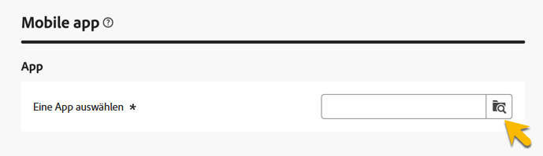
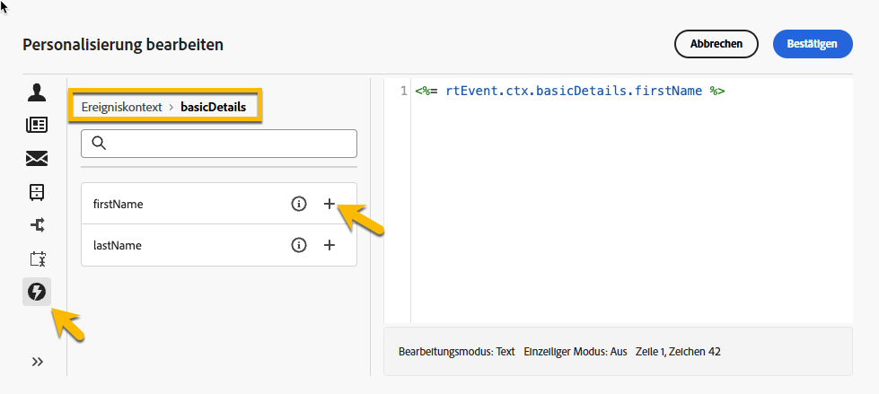
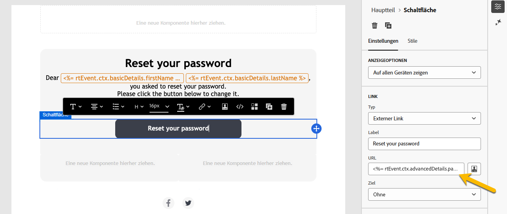
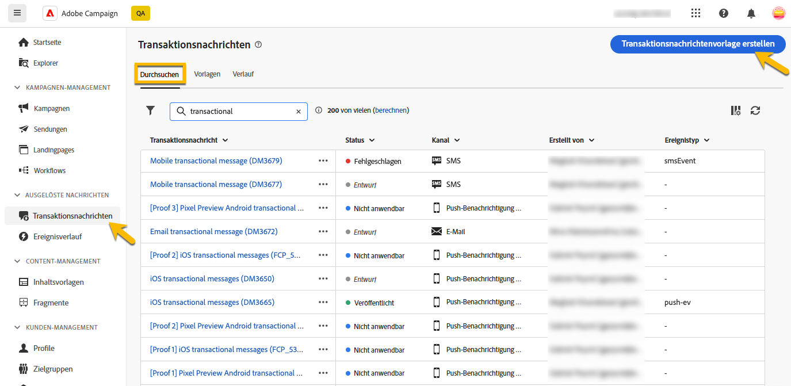
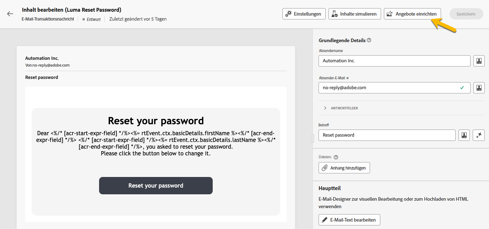

# Transaktionsnachrichten erstellen

In Transaktionsnachrichten wird der Versand einer personalisierten Nachricht durch ein Ereignis Trigger.
Dazu müssen Sie für jeden Ereignistyp eine Nachrichtenvorlage erstellen. Diese Vorlagen enthalten alle erforderlichen Informationen zur Personalisierung der Transaktionsnachricht.

## Transaktionsnachrichtenvorlage erstellen {#transactional-template}

In der Campaign-Webbenutzeroberfläche besteht der erste Schritt in der Konfiguration der Transaktionsnachrichten aus der Erstellung der Vorlage oder der direkten Erstellung der Nachricht. Dies unterscheidet sich von [der Konfiguration von Transaktionsnachrichten in der Clientkonsole](https://experienceleague.adobe.com/de/docs/campaign/campaign-v8/send/real-time/transactional).

Eine Transaktionsnachrichtenvorlage kann verwendet werden, um den vom Profil empfangenen Versandinhalt in der Vorschau anzuzeigen, bevor es die endgültige Audience erreicht. Beispielsweise kann ein Administrator die Vorlagen einrichten und konfigurieren, damit sie für Marketing-Benutzer nutzbar sind.

Gehen Sie wie folgt vor, um eine Transaktionsnachrichtenvorlage zu erstellen:

* Wechseln Sie im Abschnitt **[!UICONTROL Ausgelöste Nachrichten]** zu **[!UICONTROL Transaktionsnachrichten]**. Im Tab **[!UICONTROL Vorlagen]** werden alle Versandvorlagen für Transaktionsnachrichten angezeigt. Klicken Sie auf die Schaltfläche **[!UICONTROL Transaktionsnachrichtenvorlage erstellen]** , um mit der Erstellung Ihrer Vorlage zu beginnen.

  {zoomable="yes"}

* Wählen Sie auf der neuen angezeigten Seite den Kanal Ihrer Vorlage aus. Für unser Beispiel wählen wir den Kanal **[!UICONTROL E-Mail]** aus. Sie können auch eine andere Nachrichtenvorlage verwenden und diese in der Vorlagenliste auswählen.

  {zoomable="yes"}

  Klicken Sie erneut auf die Schaltfläche **[!UICONTROL Transaktionsnachricht erstellen]** , um die Erstellung Ihrer Vorlage für den ausgewählten Kanal zu validieren.

* Jetzt haben Sie Zugriff auf die Konfiguration Ihrer Transaktionsnachrichten-Vorlage.

  {zoomable="yes"}

### Eigenschaften von Transaktionsnachrichten {#transactional-properties}

>[!CONTEXTUALHELP]
>id="acw_transacmessages_properties"
>title="Eigenschaften von Transaktionsnachrichten"
>abstract="Füllen Sie dieses Formular aus, um die Eigenschaften von Transaktionsnachrichten zu konfigurieren"

>[!CONTEXTUALHELP]
>id="acw_transacmessages_email_properties"
>title="Eigenschaften von Transaktionsnachrichten per E-Mail"
>abstract="Füllen Sie dieses Formular aus, um die Eigenschaften von per E-Mail versendeten Transaktionsnachrichten zu konfigurieren"

>[!CONTEXTUALHELP]
>id="acw_transacmessages_sms_properties"
>title="Eigenschaften von Transaktionsnachrichten per SMS"
>abstract="Füllen Sie dieses Formular aus, um die Eigenschaften von per SMS versendeten Transaktionsnachrichten zu konfigurieren"

>[!CONTEXTUALHELP]
>id="acw_transacmessages_push_properties"
>title="Eigenschaften von Transaktionsnachrichten per Push"
>abstract="Füllen Sie dieses Formular aus, um die Eigenschaften von per Push versendeten Transaktionsnachrichten zu konfigurieren"

Der Abschnitt **[!UICONTROL Eigenschaften]** einer Transaktionsnachricht hilft Ihnen bei der Einrichtung:

* Der **[!UICONTROL Titel]** ist der Name, der in der Liste der Transaktionsnachrichten angezeigt wird. Machen Sie es für die Forschung und die künftige Nutzung klar.
* Der **[!UICONTROL Interne Name]** ist ein eindeutiger Name, der Ihre Nachricht von den anderen erstellten Nachrichten unterscheidet.
* Im Ordner **[!UICONTROL Ordner]** wird die Transaktionsnachrichtenvorlage erstellt.
* Der Ordner **[!UICONTROL Ausführung]** befindet sich dort, wo die Nachricht nach der Ausführung gespeichert wird.
* Der **[!UICONTROL Versandcode]**: Ein Code, der bei Bedarf dazu beiträgt, die Nachricht für die Berichterstellung zu erkennen.
* Die **[!UICONTROL Beschreibung]**
* Die **[!UICONTROL Natur]** ist die Art Ihres Versands, wie in der Auflistung *deliveryNature* aufgeführt. [Weitere Informationen zu Auflistungen](https://experienceleague.adobe.com/en/docs/campaign/campaign-v8/config/configuration/ui-settings#enumerations)

{zoomable="yes"}

### Mobile App {#mobile-app}

>[!CONTEXTUALHELP]
>id="acw_transacmessages_mobileapp"
>title="Transaktionsnachrichten per Mobile App"
>abstract="In diesem Abschnitt können Sie die App auswählen, in der Sie Ihre Push-Benachrichtigung senden möchten."

In diesem Abschnitt können Sie die App auswählen, in der Sie Ihre Push-Benachrichtigung senden möchten.

Durch Klicken auf das Forschungssymbol gelangen Sie zu einer in Ihrer Adobe Campaign-Instanz aufgelisteten Mobile App.

{zoomable="yes"}

### Kontextbeispiel {#context-sample}

>[!CONTEXTUALHELP]
>id="acw_transacmessages_context"
>title="Kontext von Transaktionsnachrichten"
>abstract="Im Kontextbeispiel können Sie ein Testereignis erstellen, um eine Vorschau der mit der Profilpersonalisierung empfangenen Transaktionsnachricht anzuzeigen."

>[!CONTEXTUALHELP]
>id="acw_transacmessages_addcontext"
>title="Kontext von Transaktionsnachrichten"
>abstract="Im Kontextbeispiel können Sie ein Testereignis erstellen, um eine Vorschau der mit der Profilpersonalisierung empfangenen Transaktionsnachricht anzuzeigen. "

Im Kontextbeispiel können Sie ein Testereignis erstellen, um eine Vorschau der mit der Profilpersonalisierung empfangenen Transaktionsnachricht anzuzeigen.

Dieser Schritt ist optional. Sie können die Vorlage ohne das Kontextbeispiel verwenden. Der Nachteil ist jedoch, dass Sie keine Vorschau des personalisierten Inhalts anzeigen können.

In unserem Beispiel zum Festlegen des Kennworts sendet das Ereignis den Vornamen, Nachnamen und einen personalisierten Link des Benutzers, um sein Kennwort zurückzusetzen. Der Kontext kann wie unten dargestellt konfiguriert werden.

Der Inhalt des Kontexts hängt von der benötigten Personalisierung ab.

{zoomable="yes"}

### Inhalt von Transaktionsnachrichtenvorlagen {#transactional-content}

>[!CONTEXTUALHELP]
>id="acw_transacmessages_content"
>title="Inhalt von Transaktionsnachrichten"
>abstract="Erfahren Sie, wie Sie den Inhalt von Transaktionsnachrichten erstellen"

>[!CONTEXTUALHELP]
>id="acw_transacmessages_personalization"
>title="Personalisierung von Transaktionsnachrichten"
>abstract="Erfahren Sie, wie Sie den Inhalt von Transaktionsnachrichten personalisieren"

Die Bearbeitung des Inhalts einer Transaktionsnachricht gleicht der Inhaltserstellung eines Versands. Klicken Sie auf **[!UICONTROL E-Mail-Designer öffnen]** oder **[!UICONTROL E-Mail-Textkörper bearbeiten]** und wählen Sie einen Vorlageninhalt aus oder importieren Sie Ihren HTML-Code.

{zoomable="yes"}

Um die Personalisierung zum Inhalt hinzuzufügen, klicken Sie auf den Bereich, in dem Sie sie hinzufügen möchten, und wählen Sie das Symbol **[!UICONTROL Personalization hinzufügen]** aus.

{zoomable="yes"}

Sie haben Zugriff auf das Fenster **[!UICONTROL Personalisierung bearbeiten]** .
Um die Variablen aus dem Trigger-Ereignis hinzuzufügen, klicken Sie auf das Symbol **[!UICONTROL Ereigniskontext]** . Sie können in dem für Ihre Vorlage definierten Kontext navigieren ([Weitere Informationen zum Kontext](#context-sample)) und auf die Schaltfläche **[!UICONTROL +]** klicken, um die benötigte Variable einzufügen.

In der Abbildung unten sehen Sie, wie Sie die Personalisierung des Vornamens hinzufügen können.

{zoomable="yes"}

In unserem Beispiel fügen wir den Vornamen, dann den Nachnamen hinzu und personalisieren den Link **[!UICONTROL Passwort zurücksetzen]** .

{zoomable="yes"}

### Vorschau der Vorlage anzeigen

In dieser Phase der Vorlagenerstellung können Sie eine Vorschau des Vorlageninhalts anzeigen und die Personalisierung überprüfen.

Füllen Sie dazu das [Kontextbeispiel](#context-sample) aus und klicken Sie auf die Schaltfläche **[!UICONTROL Inhalt simulieren]** .

{zoomable="yes"}

## Transaktionsnachricht erstellen {#transactional-message}

Sie können eine Transaktionsnachricht direkt oder mithilfe einer Transaktionsnachrichtenvorlage erstellen. [Erfahren Sie, wie Sie eine Transaktionsnachrichtenvorlage erstellen](#transactional-template).

Gehen Sie wie folgt vor, um eine Transaktionsnachricht zu erstellen:

* Wechseln Sie im Abschnitt **[!UICONTROL Ausgelöste Nachrichten]** zu **[!UICONTROL Transaktionsnachrichten]**. Auf der Registerkarte **[!UICONTROL Durchsuchen]** werden alle erstellten Transaktionsnachrichten angezeigt. Klicken Sie auf die Schaltfläche **[!UICONTROL Transaktionsnachricht erstellen]** , um mit der Erstellung Ihrer Nachricht zu beginnen.

  {zoomable="yes"}

* Wählen Sie auf der neuen angezeigten Seite den Kanal Ihrer Nachricht aus und wählen Sie die Vorlage aus, mit der Sie arbeiten möchten. In unserem Beispiel wählen wir [die hier erstellte Vorlage](#transactional-template).

  {zoomable="yes"}

  Klicken Sie erneut auf die Schaltfläche **[!UICONTROL Transaktionsnachricht erstellen]** , um die Erstellung Ihrer Nachricht im ausgewählten Kanal zu validieren.

* Jetzt haben Sie Zugriff auf die Konfiguration Ihrer Transaktionsnachricht. Ihre Nachricht übernimmt die Konfiguration der Vorlage. Diese Seite ist fast identisch mit der Konfigurationsseite der Transaktionsnachrichten-Vorlage , mit der Ausnahme, dass sie auch die Konfiguration des Ereignistyps enthält.

  {zoomable="yes"}

  Füllen Sie die Konfiguration Ihrer Nachricht wie für eine Vorlage aus:
   * [Die Eigenschaften der Transaktionsnachricht](#transactional-properties)
   * [Kontextbeispiel](#context-sample)
   * [Der Nachrichteninhalt](#transactional-content)
und [konfigurieren Sie den Ereignistyp ](#event-type) wie unten beschrieben.

* Klicken Sie nach [Validierung Ihrer Transaktionsnachricht](validate-transactional.md) auf die Schaltfläche **[!UICONTROL Überprüfen und veröffentlichen]** , um Ihre Nachricht zu erstellen und zu veröffentlichen.
Die Trigger können jetzt den Versand Ihrer Transaktionsnachricht per Push durchführen.

### Informationen zum Ereignistyp {#event-type}

>[!CONTEXTUALHELP]
>id="acw_transacmessages_event"
>title="Transaktionsnachrichten-Ereignis"
>abstract="Die Konfiguration des Ereignistyps verknüpft die Nachricht mit dem Trigger-Ereignis."

Die Konfiguration des Ereignistyps verknüpft die Nachricht mit dem Trigger-Ereignis.

In der Campaign-Webbenutzeroberfläche können Sie bereits erstellten Ereignistyp auswählen und direkt Ihren Ereignistyp auf dieser Konfigurationsseite erstellen.

{zoomable="yes"}

>[!CAUTION]
>
>Wenn Sie einen Ereignistyp auswählen, der derzeit von einer anderen Transaktionsnachricht verwendet wird, werden die beiden Nachrichten Trigger. Für Best Practices wird dringend empfohlen, **EINEN Ereignistyp nur mit EINER Transaktionsnachricht zu verknüpfen.**

## Hinzufügen von Angeboten zu Ihren Transaktionsnachrichten {#transactional-offers}

Sie können Ihren Transaktionsnachrichten Angebote hinzufügen, damit Sie Ihren Endbenutzern relevante Vorschläge unterbreiten können, selbst wenn die Nachricht ereignisausgelöst wird.

Diese Funktion ist während der Inhaltserstellung Ihrer Transaktionsnachricht verfügbar. Klicken Sie einfach auf die Schaltfläche **[!UICONTROL Angebote einrichten]** , um sie zu konfigurieren.

Der Einrichtungsprozess entspricht dem Konfigurieren von Angeboten für Standardlieferungen. [Erfahren Sie, wie Sie Ihrer Nachricht Angebote hinzufügen](../msg/offers.md).

{zoomable="yes"}
