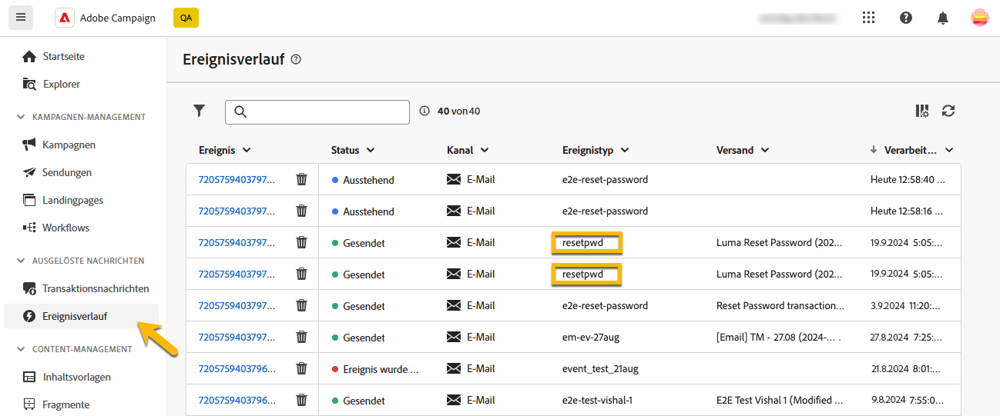
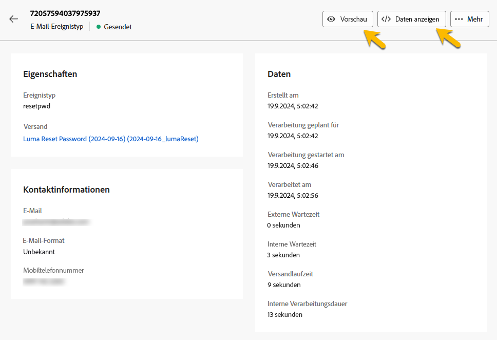

# Transaktionsnachrichten überwachen

Nach der Veröffentlichung und dem Versand Ihrer Transaktionsnachricht können Sie Berichte und Protokolle dazu haben.

## Transaktionsnachrichten-Protokolle {#transactional-logs}

Nachdem Ihre Nachricht veröffentlicht wurde, können Sie ihre Ausführung überprüfen, indem Sie auf die Schaltfläche **[!UICONTROL Protokolle]** klicken.

{zoomable="yes"}

Auf diese Weise erhalten Sie Zugriff auf detaillierte Protokolle über die Veröffentlichung der Nachricht auf der Registerkarte **[!UICONTROL Protokolle]** .

{zoomable="yes"}

Darüber hinaus können Sie die Liste der mit den Protokollen gesendeten **[!UICONTROL Testsendungen]** auf der entsprechenden Registerkarte anzeigen.

## Transaktionsnachrichten-Verlauf {#transactional-history}

Im Abschnitt **[!UICONTROL Ausgelöste Nachrichten]** können Sie Details zu allen ausgeführten Transaktionsnachrichten anzeigen. Um darauf zuzugreifen, navigieren Sie zu **[!UICONTROL Transaktionsnachrichten]**. Auf der Registerkarte **[!UICONTROL Verlauf]** können Sie die Liste der ausgeführten Transaktionsnachrichten mit ihrem Status und zusätzlichen Informationen anzeigen.

{zoomable="yes"}

Suchen Sie dort nach Ihrer Nachricht und klicken Sie darauf.
Sie können die Details dort anzeigen.

{zoomable="yes"}

## Ereignisverlauf {#event-history}

>[!CONTEXTUALHELP]
>id="acw_transacmessages_eventhistory"
>title="Ereignisverlauf für Transaktionsnachrichten"
>abstract="Sie können sich die Ereignisse ansehen, auf die Ihre Transaktionsnachricht Trigger wird."

>[!CONTEXTUALHELP]
>id="acw_transacmessages_eventhistory_preview"
>title="Vorschau des Ereignisverlaufs in Transaktionsnachrichten"
>abstract="Sie können sich die Ereignisse ansehen, auf die Ihre Transaktionsnachricht Trigger wird."

Sie können auch eine Ansicht der Ereignisse erhalten, die Ihre Transaktionsnachricht Trigger haben.
Um sie anzuzeigen, gehen Sie zum Abschnitt **[!UICONTROL Ereignisverlauf]** .

Sie können sie mit dem Namen des Ereignistyps sehen.

{zoomable="yes"}

Klicken Sie auf die **[!UICONTROL Ereignis]** -ID, um weitere Details zu erhalten:

* Kontaktdaten
* Alles über die Prozessoresendaten

Sie können sogar eine Vorschau der mit der Schaltfläche **[!UICONTROL Vorschau]** gesendeten Nachricht anzeigen und die erhaltenen Daten sehen, die die Nachricht mit der Schaltfläche **[!UICONTROL Daten anzeigen]** Trigger haben.

{zoomable="yes"}

Mit der Schaltfläche **[!UICONTROL Mehr]** können Sie den Ereignisverlauf löschen.
