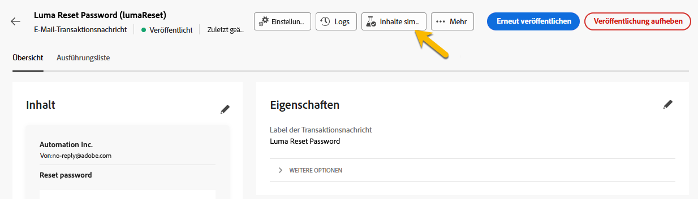

# Überwachen von Transaktionsnachrichten

Nach der Veröffentlichung und dem Versand der Transaktionsnachricht können Sie Berichte und Protokolle dazu abrufen.

## Protokolle von Transaktionsnachrichten {#transactional-logs}

Nachdem die Nachricht veröffentlicht wurde, können Sie ihre Ausführung überprüfen, indem Sie auf die Schaltfläche **[!UICONTROL Protokolle]** klicken.

{zoomable="yes"}

Auf diese Weise erhalten Sie auf der Registerkarte **[!UICONTROL Protokolle]** Zugriff auf detaillierte Protokolle über die Veröffentlichung der Nachricht.

{zoomable="yes"}

Darüber hinaus können Sie die Liste der mit den Protokollen gesendeten **[!UICONTROL Testsendungen]** auf der entsprechenden Registerkarte anzeigen.

## Transaktionsnachrichtenverlauf {#transactional-history}

Im Abschnitt **[!UICONTROL Ausgelöste Nachrichten]** können Sie Details zu allen ausgeführten Transaktionsnachrichten anzeigen. Um darauf zuzugreifen, navigieren Sie zu **[!UICONTROL Transaktionsnachrichten]**. Auf der Registerkarte **[!UICONTROL Verlauf]** können Sie die Liste der ausgeführten Transaktionsnachrichten mit ihrem Status und zusätzlichen Informationen anzeigen.

{zoomable="yes"}

Suchen Sie dort nach Ihrer Nachricht und klicken Sie darauf.
Dort können Sie die Details anzeigen.

{zoomable="yes"}

## Ereignisverlauf {#event-history}

>[!CONTEXTUALHELP]
>id="acw_transacmessages_eventhistory"
>title="Ereignisverlauf von Transaktionsnachrichten"
>abstract="Sie können die Ereignisse anzeigen, die Ihre Transaktionsnachricht auslösen."

>[!CONTEXTUALHELP]
>id="acw_transacmessages_eventhistory_preview"
>title="Vorschau des Ereignisverlaufs von Transaktionsnachrichten"
>abstract="Sie können die Ereignisse anzeigen, die Ihre Transaktionsnachricht auslösen."

Sie können sich auch die Ereignisse ansehen, die Ihre Transaktionsnachricht auslösen.
Um sie anzuzeigen, navigieren Sie zum Abschnitt **[!UICONTROL Ereignisverlauf]**.

Sie werden Ihnen mit dem Namen des Ereignistyps angezeigt.

{zoomable="yes"}

Klicken Sie auf die **[!UICONTROL Ereignis-ID]**, um weitere Details anzuzeigen:

* Kontaktinformationen
* Informationen zu Prozessdaten

Sie können sogar eine Vorschau der mit der Schaltfläche **[!UICONTROL Vorschau]** gesendeten Nachricht anzeigen und sich die erhaltenen Daten ansehen, die die Nachricht mit der Schaltfläche **[!UICONTROL Daten anzeigen]** auslösen.

{zoomable="yes"}

Mit der Schaltfläche **[!UICONTROL Mehr]** können Sie den Ereignisverlauf löschen.
