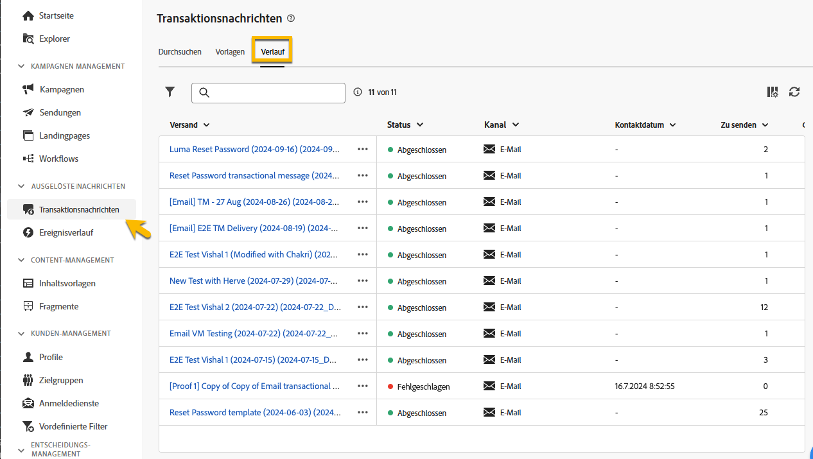

# Überwachen von Transaktionsnachrichten

Nach der Veröffentlichung und dem Versand der Transaktionsnachricht können Sie auf die entsprechenden Berichte und Protokolle zugreifen.

## Protokolle von Transaktionsnachrichten {#transactional-logs}

Nachdem die Nachricht veröffentlicht wurde, überprüfen Sie ihre Ausführung, indem Sie auf die Schaltfläche **[!UICONTROL Logs]** klicken.

{zoomable="yes"}

Auf diese Weise erhalten Sie auf der Registerkarte **[!UICONTROL Logs]** Zugriff auf detaillierte Protokolle zur Veröffentlichung der Nachricht.

{zoomable="yes"}

Darüber hinaus können Sie die Liste der mit den Protokollen gesendeten **[!UICONTROL Testsendungen]** auf der entsprechenden Registerkarte anzeigen.

## Transaktionsnachrichtenverlauf {#transactional-history}

Im Abschnitt **[!UICONTROL Ausgelöste Nachrichten]** werden Details zu allen ausgeführten Transaktionsnachrichten angezeigt. Um darauf zuzugreifen, navigieren Sie zu **[!UICONTROL Transaktionsnachrichten]**. Auf der Registerkarte **[!UICONTROL Verlauf]** wird die Liste der ausgeführten Transaktionsnachrichten mit ihrem Status und zusätzlichen Informationen angezeigt.

{zoomable="yes"}

Suchen Sie nach Ihrer Nachricht und klicken Sie darauf, um die zugehörigen Details anzuzeigen.

{zoomable="yes"}

## Ereignisverlauf {#event-history}

>[!CONTEXTUALHELP]
>id="acw_transacmessages_eventhistory"
>title="Ereignisverlauf von Transaktionsnachrichten"
>abstract="Sie können die Ereignisse anzeigen, die Ihre Transaktionsnachricht auslösen."

>[!CONTEXTUALHELP]
>id="acw_transacmessages_eventhistory_preview"
>title="Vorschau des Ereignisverlaufs von Transaktionsnachrichten"
>abstract="Sie können die Ereignisse anzeigen, die Ihre Transaktionsnachricht auslösen."

Sie können die Ereignisse anzeigen, die Ihre Transaktionsnachricht auslösen. Um auf sie zuzugreifen, navigieren Sie zum Abschnitt **[!UICONTROL Ereignisverlauf]**.

Ereignisse werden mit dem Namen des Ereignistyps angezeigt.

{zoomable="yes"}

Klicken Sie auf die **[!UICONTROL Ereignis-ID]**, um weitere Details anzuzeigen, darunter:

* Kontaktinformationen
* Informationen zu den Prozessdaten

Zeigen Sie mithilfe der Schaltfläche **[!UICONTROL Vorschau]** eine Vorschau der gesendeten Nachricht an und rufen Sie mit der Schaltfläche **[!UICONTROL Daten anzeigen]** die empfangenen Daten an, durch die die Nachricht ausgelöst wurde.

{zoomable="yes"}

Mit der Schaltfläche **[!UICONTROL Mehr]** können Sie den Ereignisverlauf löschen.