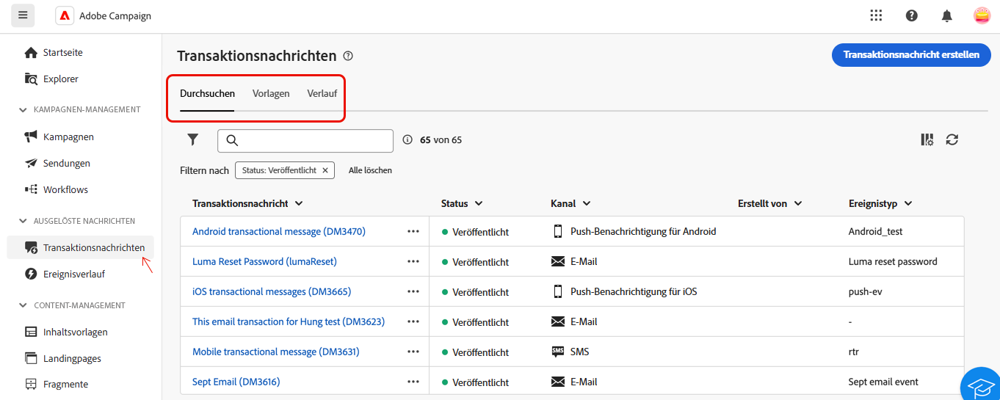

# Informationen zu Transaktionsnachrichten {#transactional-messaging}

>[!CONTEXTUALHELP]
>id="acw_transacmessages"
>title="Transaktionsnachrichtenversand"
>abstract="Transaktionsnachrichten sind ein spezielles Modul in Adobe Campaign, das für die Verarbeitung ausgelöster Nachrichten entwickelt wurde."

>[!CONTEXTUALHELP]
>id="acw_homepage_welcome_rn1"
>title="Transaktionsnachrichtenversand"
>abstract="Transaktionsnachrichten sind ein spezielles Modul in Adobe Campaign, das für die Verarbeitung ausgelöster Nachrichten entwickelt wurde. Diese Nachrichten werden automatisch als Reaktion auf Ereignisse aus Informationssystemen generiert."
>additional-url="https://experienceleague.adobe.com/docs/campaign-web/v8/release-notes/release-notes.html?lang=de" text="Siehe Versionshinweise"

<!-- >>[!CONTEXTUALHELP]
>id="acw_transacmessages_exclusionlogs"
>title="Transactional messaging exclusion logs"
>abstract="Transactional messaging exclusion logs" -->

Transaktionsnachrichten sind ein spezielles Modul in Adobe Campaign, das für die Verarbeitung ausgelöster Nachrichten entwickelt wurde. Diese Nachrichten werden automatisch als Reaktion auf Ereignisse aus Informationssystemen generiert. Häufige Beispiele für solche Ereignisse sind das Klicken auf Schaltflächen oder Links, das Abbrechen des Warenkorbs, das Anfordern von Warnungen zur Produktverfügbarkeit, das Erstellen oder Ändern von Konten usw.

Transaktionsnachrichten dienen zum Senden von:

* Wichtige Benachrichtigungen, wie z. B. Bestellbestätigungen oder Kennwortrücksätze,
* Echtzeit-Antworten auf Kundenaktionen (z. B. Kontoerstellung, Abschluss von Käufen),
* Inhalte ohne Werbeaktion, die für Kundeninteraktionen von entscheidender Bedeutung sind.

Das Transaktionsnachrichtenmodul lässt sich nahtlos in Ihre Informationssysteme integrieren. Die Ereignisse, z. B. Kundenaktionen, werden an Adobe Campaign gesendet, das die entsprechende personalisierte Nachricht sendet. Diese Nachrichten können einzeln oder stapelweise über verschiedene Kanäle wie E-Mail-, SMS- oder Push-Benachrichtigungen gesendet werden.

Sie finden das Modul **[!UICONTROL Transaktionsnachricht]** im Abschnitt **[!UICONTROL Ausgelöste Nachrichten]** .

{zoomable="yes"}

Auf der Seite **[!UICONTROL Transaktionsnachricht]** befinden sich drei Registerkarten:

* **[!UICONTROL Durchsuchen]** , wo Sie die Liste der Transaktionsnachrichten mit ihrem Status haben,
* **[!UICONTROL Vorlagen]**, in denen Sie Transaktionsnachrichten-Vorlagen finden und erstellen,
* **[!UICONTROL Verlauf]**: Dort finden Sie Details zu allen ausgeführten Transaktionsnachrichten.

In dieser Dokumentation erfahren Sie, wie Sie:

* [Erstellen Sie mithilfe einer Vorlage Transaktionsnachrichten](create-transactional.md) und lernen Sie die erforderlichen Einstellungen kennen.
* [Validieren des Inhalts Ihrer Transaktionsnachrichten](validate-transactional.md) und Simulieren einer Personalisierung,
* [Überwachen Sie Ihre Transaktionsnachrichten](monitor-transactional.md).
