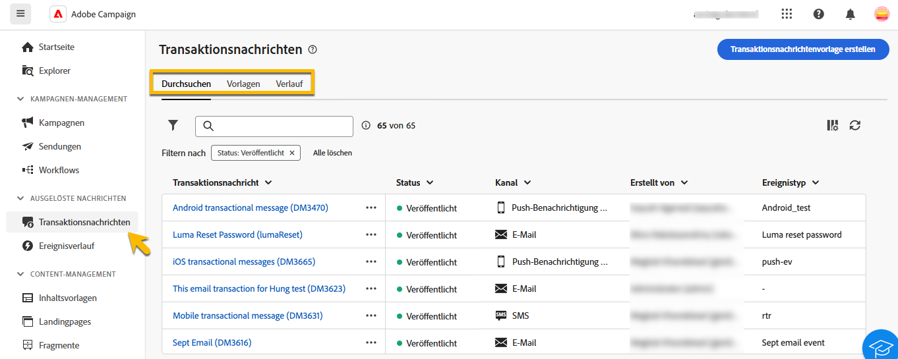

# Informationen zu Transaktionsnachrichten {#transactional-messaging}

>[!CONTEXTUALHELP]
>id="acw_transacmessages"
>title="Transaktionsnachrichten"
>abstract="Transaktionsnachrichten sind ein spezielles Modul in Adobe Campaign, das für die Verarbeitung ausgelöster Nachrichten entwickelt wurde."

<!-- >>[!CONTEXTUALHELP]
>id="acw_transacmessages_exclusionlogs"
>title="Transactional messaging exclusion logs"
>abstract="Transactional messaging exclusion logs" -->

Transaktionsnachrichten sind ein spezielles Modul in Adobe Campaign, das für die Verarbeitung ausgelöster Nachrichten entwickelt wurde. Diese Nachrichten werden automatisch als Reaktion auf Ereignisse generiert, die aus Informationssystemen stammen. Gängige Beispiele für solche Ereignisse sind Klicks auf Schaltflächen oder Links, Transaktionsabbrüche, die Anfrage von Benachrichtigungen zur Produktverfügbarkeit sowie die Erstellung oder Änderung von Konten.

Transaktionsnachrichten dienen zum Senden von:

* wichtigen Benachrichtigungen, z. B. Bestellbestätigungen oder Rücksetzungen von Passwörtern,
* Echtzeitreaktionen auf Kundenaktionen wie Kontoerstellung oder Kaufabschluss,
* Inhalten, bei denen es sich nicht um Werbung handelt und die für Kundeninteraktionen wichtig sind.

Das Modul für Transaktionsnachrichten lässt sich nahtlos mit Ihren Informationssystemen integrieren. Ereignisse wie Kundenaktionen werden per Push an Adobe Campaign übermittelt, worüber die entsprechende personalisierte Nachricht gesendet wird. Diese Nachrichten können einzeln oder in Batches über verschiedene Kanäle per E-Mail, SMS oder Push-Benachrichtigung gesendet werden.

Sie finden das Modul für **[!UICONTROL Transaktionsnachrichten]** im Abschnitt **[!UICONTROL Ausgelöste Nachrichten]**.

{zoomable="yes"}

Auf der Seite **[!UICONTROL Transaktionsnachricht]** gibt es drei Registerkarten:

* **[!UICONTROL Durchsuchen]**: Hier finden Sie eine Liste der Transaktionsnachrichten mit ihrem jeweiligen Status.
* **[!UICONTROL Vorlagen]**: Hier können Sie nach Transaktionsnachrichtenvorlagen suchen und neue erstellen.
* **[!UICONTROL Verlauf]**: Hier finden Sie Details zu allen ausgeführten Transaktionsnachrichten.

In dieser Dokumentation erhalten Sie weitere Informationen zu folgenden Themen:

* [Erstellen von Transaktionsnachrichten](create-transactional.md) mithilfe einer Vorlage und Kennenlernen der dafür erforderlichen Einstellungen,
* [Validieren der Inhalte von Transaktionsnachrichten](validate-transactional.md) und Simulieren einer Personalisierung,
* [Überwachen von Transaktionsnachrichten](monitor-transactional.md).