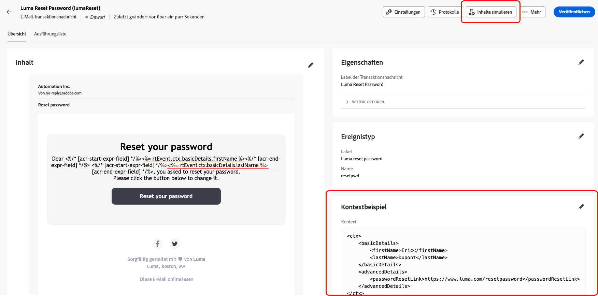
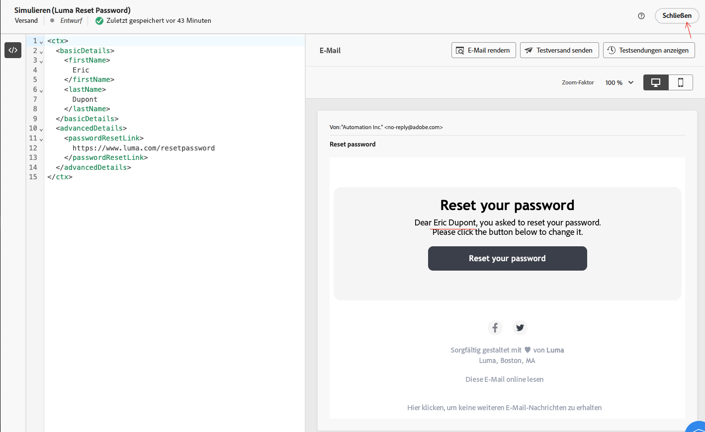
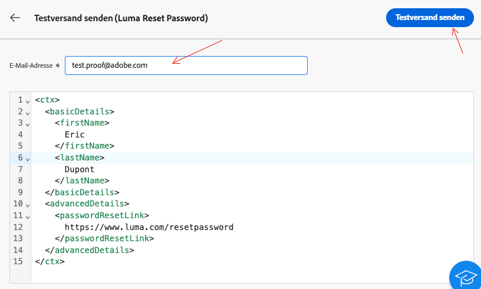

# Validieren von Transaktionsnachrichten

Während oder nach der Erstellung der Transaktionsnachricht können Sie den Inhalt mithilfe eines Datenbeispiels validieren.

## Simulieren von Inhalten {#simulate-content}

Führen Sie die folgenden Schritte aus, um den Inhalt Ihrer Nachricht zu simulieren:

* Stellen Sie sicher, dass der Personalisierungspfad in Ihrem Nachrichteninhalt mit Ihrem Kontextbeispiel übereinstimmt. Im folgenden Beispiel verwenden Sie zum Anzeigen des Vornamens des Testprofils den Pfad *rtEvent.ctx.basicDetails.firstName*.

  Sie können den Nachrichteninhalt oder das Kontextbeispiel ändern, damit sie aufeinander abgestimmt sind.

  {zoomable="yes"}

* Klicken Sie auf die **[!UICONTROL Inhalt simulieren]**, um eine Vorschau Ihrer Transaktionsnachricht mit den im Kontextbeispiel eingegebenen Daten anzuzeigen.

  {zoomable="yes"}

  Klicken Sie nach der Überprüfung Ihres Inhalts auf die Schaltfläche **[!UICONTROL Schließen]**.

* Klicken Sie auf die Schaltfläche **[!UICONTROL Neu veröffentlichen]**, wenn Sie Änderungen am Inhalt vorgenommen haben.

## Senden eines Testversands

Verwenden Sie die Testfunktion, um die Transaktionsnachricht so zu testen und anzusehen, wie sie über Ihren ausgewählten Kanal gesendet wird, z. B. per E-Mail, SMS oder Push-Benachrichtigung.

Klicken Sie im [Fenster mit dem Simulationsinhalt](#simulate-content) auf die Schaltfläche **[!UICONTROL Testversand durchführen]**.

{zoomable="yes"}

Geben Sie in dem neu erscheinenden Fenster die E-Mail-Adresse oder Telefonnummer ein, je nach Kanal, über den Sie den Testversand erhalten möchten. Nachdem Sie die gewünschte Adresse eingegeben haben, klicken Sie auf die Schaltflächen **[!UICONTROL Testversand durchführen]** und **[!UICONTROL Bestätigen]**. Diese Aktion sendet ein Beispiel für Ihre Transaktionsnachricht, um sicherzustellen, dass alle Personalisierungen, dynamischen Inhalte und Formatierungen korrekt angezeigt werden, wie es für Ihre Endbenutzenden der Fall wäre.

{zoomable="yes"}

Dieser Schritt ist wichtig, um potenzielle Probleme zu identifizieren, bevor Sie Ihre Transaktionsnachricht veröffentlichen.