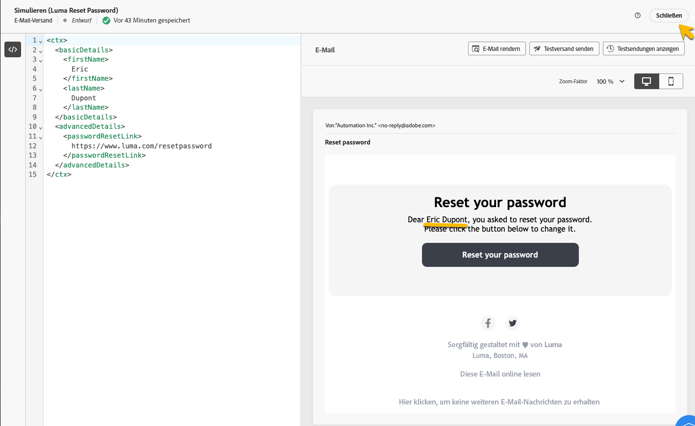

# Validieren von Transaktionsnachrichten

Während oder nach der Erstellung der Transaktionsnachricht können Sie den Inhalt mithilfe eines Datenbeispiels validieren.

## Simulieren von Inhalten {#simulate-content}

Führen Sie die folgenden Schritte aus, um den Inhalt Ihrer Nachricht zu simulieren:

* Stellen Sie sicher, dass der Personalisierungspfad in Ihrem Nachrichteninhalt mit Ihrem Kontextbeispiel übereinstimmt. Im folgenden Beispiel verwenden wir zum Anzeigen des Vornamens des Testprofils den Pfad *rtEvent.ctx.basicDetails.firstName*.

  Sie können den Nachrichteninhalt oder das Kontextbeispiel ändern, um sie anzugleichen.

  {zoomable="yes"}

* Klicken Sie auf die Schaltfläche **[!UICONTROL Inhalte simulieren]**, um Ihre Transaktionsnachricht mit den im Kontextbeispiel eingegebenen Daten in der Vorschau anzuzeigen.

  {zoomable="yes"}

  Klicken Sie nach Überprüfung des Inhalts auf die Schaltfläche **[!UICONTROL Schließen]**.

* Vergessen Sie nicht, auf die Schaltfläche **[!UICONTROL Erneut veröffentlichen]** zu klicken, wenn Sie Änderungen an Ihrem Inhalt vorgenommen haben.

## Senden eines Testversands

Wenn Sie die Transaktionsnachricht so testen und erleben möchten, wie sie über Ihren ausgewählten Kanal gesendet wird (z. B. E-Mail, SMS oder Push-Benachrichtigung), können Sie die Funktion „Testversand“ verwenden.

Klicken Sie im [Fenster mit dem Simulationsinhalt](#simulate-content) auf die Schaltfläche **[!UICONTROL Testversand durchführen]**.

{zoomable="yes"}

Geben Sie im sich öffnenden Fenster die E-Mail-Adresse (oder Telefonnummer, je nach Kanal) an, an die Sie den Testversand erhalten möchten. Nachdem Sie die gewünschte Adresse eingegeben haben, klicken Sie auf die Schaltflächen **[!UICONTROL Testversand durchführen]** und **[!UICONTROL Bestätigen]**. Mit dieser Aktion können Sie ein Beispiel Ihrer Transaktionsnachricht senden, um sicherzustellen, dass alle Personalisierungen, dynamischen Inhalte und Formatierungen für Ihre Endbenutzenden korrekt angezeigt werden.

{zoomable="yes"}

Dies ist ein wichtiger Schritt, um potenzielle Probleme vor der Veröffentlichung der Transaktionsnachricht zu identifizieren.
