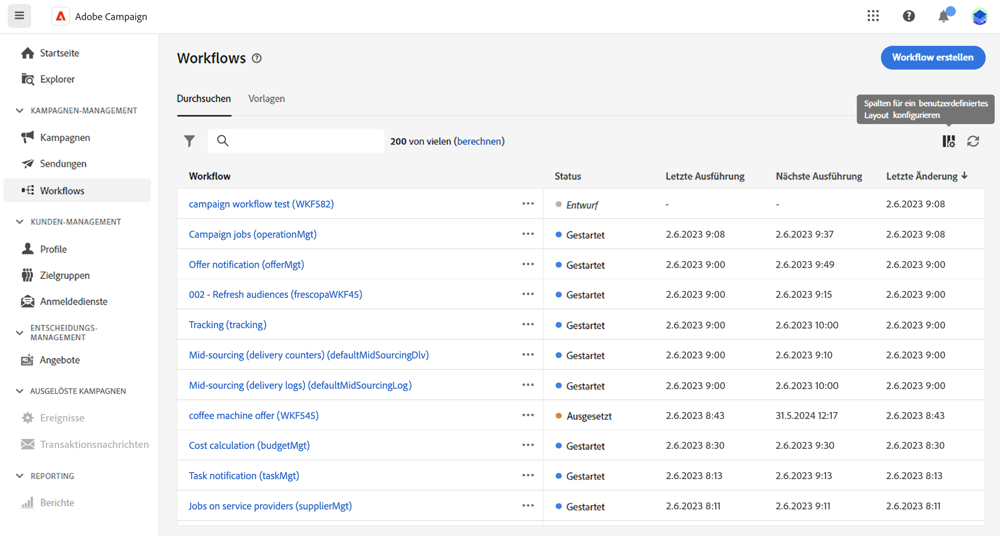

# Workflows aufrufen und überwachen {#access-monitor}

>[!CONTEXTUALHELP]
>id="acw_targeting_workflow_list"
>title="Workflows"
>abstract="In diesem Bildschirm können Sie die vollständige Liste der Workflows aufrufen, ihren Status sowie die letzten/nächsten Ausführungsdaten überprüfen und einen neuen Workflow erstellen. Navigieren Sie zum Tab &quot;Vorlage&quot;, um auf verfügbare Workflow-Vorlagen zuzugreifen."

## Workflows aufrufen und verwalten {#access}

Die **[!UICONTROL Workflows]** bietet Zugriff auf die vollständige Liste der Workflows. Diese Liste enthält beide **Standalone-Workflows** die auf diesem Bildschirm erstellt wurden und **Kampagnen-Workflows**, die in einer Kampagne erstellt wurden.

Jeder Workflow in der Liste zeigt Informationen zur aktuellen [status](#status), das letzte Mal, dass sie ausgeführt oder geändert wurde, sowie das nächste geplante Ausführungsdatum und die nächste geplante Ausführungszeit.

Sie können die angezeigten Spalten anpassen, indem Sie auf die **[!UICONTROL Spalte für ein benutzerdefiniertes Layout konfigurieren]** in der oberen rechten Ecke der Liste. Auf diese Weise können Sie zusätzliche Informationen zur Liste hinzufügen, z. B. die letzte fehlerhafte Aktivität eines Workflows oder die angewendete Zielgruppendimension.

Darüber hinaus stehen eine Suchleiste und Filter zur Verfügung, um die einfache Suche innerhalb der Liste zu erleichtern. Sie können beispielsweise die Workflows so filtern, dass nur die einer Kampagne angehörenden oder die in einem bestimmten Datumsbereich verarbeiteten Workflows angezeigt werden.

Um einen Workflow zu duplizieren oder zu löschen, klicken Sie auf die Suchschaltfläche und wählen Sie **[!UICONTROL Duplizieren]** oder **[!UICONTROL Löschen]**.

>[!NOTE]
>
>Sie können einen laufenden Workflow duplizieren, ihn jedoch nicht löschen.

## Status von Workflows {#status}

Workflows können mehrere Status aufweisen:

* **[!UICONTROL Entwurf]**: Der Workflow wurde erstellt und gespeichert.
* **[!UICONTROL In Bearbeitung]**: Der Workflow wird derzeit ausgeführt.
* **[!UICONTROL Abgeschlossen]**: Die Ausführung des Workflows ist abgeschlossen.
* **[!UICONTROL Angehalten]**: Der Workflow wurde angehalten.
* **[!UICONTROL Fehlerhaft]**: Beim Workflow ist ein Fehler aufgetreten. Öffnen Sie den Workflow und greifen Sie auf die Protokolle und Aufgaben zu, um den Fehler zu identifizieren und zu beheben. [Erfahren Sie, wie Sie Protokolle und Aufgaben überwachen.](start-monitor-workflows.md#logs-tasks)

Ausführliche Informationen zum Starten und Überwachen der Workflow-Ausführung finden Sie unter [diese Seite](start-monitor-workflows.md).

## Workflow-Vorlagen {#templates}

Die **[!UICONTROL Vorlagen]** enthält alle verfügbaren Workflow-Vorlagen.

Workflow-Vorlagen enthalten vorkonfigurierte Aktivitäten und allgemeine Eigenschaftskonfigurationen, die zur Erstellung neuer Workflows wiederverwendet werden können.

Sie werden über die Client-Konsole erstellt. [Erfahren Sie, wie Sie mit Vorlagen arbeiten.](https://experienceleague.adobe.com/docs/campaign/automation/workflows/introduction/build-a-workflow.html#workflow-templates)
