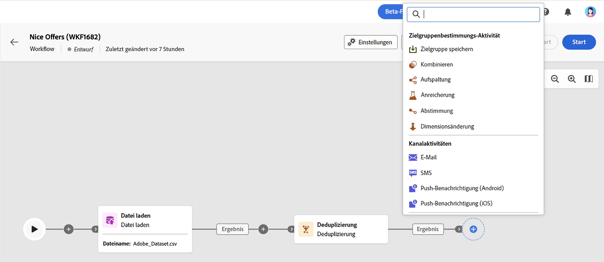

# Über Workflow-Aktivitäten {#workflow-activities}

Workflow-Aktivitäten sind in drei Kategorien unterteilt. Je nach Kontext können die verfügbaren Aktivitäten unterschiedlich sein.

Alle Aktivitäten werden in den folgenden Abschnitten beschrieben:

* [Zielgruppenbestimmungs-Aktivitäten](#targeting)
* [Kanalaktivitäten](#channel)
* [Aktivitäten zur Flusskontrolle](#flow-control)

## Zielgruppenbestimmungs-Aktivitäten {#targeting}

Diese Aktivitäten dienen der Zielgruppenbestimmung, Manipulation und Anreicherung von Populationsdaten. Sie ermöglichen es Ihnen, ein oder mehrere Ziele zu erstellen, indem Sie eine Zielgruppe definieren und diese Zielgruppen mithilfe von Schnittmenge, Vereinigung oder Ausschluss aufteilen oder kombinieren.

* Mithilfe der [Audience-Speicherung](save-audience.md) können existierende Audiences aktualisiert oder neue erstellt werden. Die hierfür erforderlichen Populationen werden im Vorfeld durch andere Workflow-Aktivitäten ermittelt.
* Mit der Aktivität [Zielgruppe erstellen](build-audience.md) können Sie Ihre Zielgruppenpopulation definieren. Sie können entweder eine vorhandene Zielgruppe auswählen oder den Regel-Builder verwenden, um Ihre eigene Abfrage zu definieren.
* Die Aktivität [Kombinieren](combine.md) ermöglicht die Segmentierung Ihrer eingehenden Population. Sie können eine Vereinigung, eine Schnittmenge oder einen Ausschluss verwenden.
* Die Aktivität [Aufspaltung](split.md) ermöglicht das Segmentieren der eingehenden Population in mehrere Teilmengen.
* Mit der Aktivität [Anreicherung](enrichment.md) können Sie zusätzliche Daten definieren, die in Ihrem Workflow verarbeitet werden sollen. Mit dieser Aktivität können Sie die eingehende Transition nutzen und entsprechend der Konfiguration der Aktivität die ausgehende Transition mit Zusatzdaten ergänzen.
* Mithilfe der Aktivität [Deduplizierung](deduplication.md) lassen sich Dubletten in Ergebnissen aus eingehenden Aktivitäten löschen.
* Die [Dimensionsänderung](change-dimension.md) ermöglicht es Ihnen, die Zielgruppendimension während der Workflow-Erstellung zu ändern.

## Kanalaktivitäten {#channel}

Mit Adobe Campaign Web können Sie Marketing-Kampagnen über mehrere Kanäle wie E-Mail, SMS oder Push automatisieren und durchführen. Sie können Kanalaktivitäten in der Arbeitsfläche kombinieren, um Cross-Channel-Workflows zu erstellen, mit denen basierend auf dem Kundenverhalten Aktionen ausgelöst werden können.

Die folgenden **Kanalaktivitäten** sind verfügbar:

* E-Mail
* Push
* SMS

Näheres dazu finden Sie in [diesem Abschnitt](channels.md).

## Aktivitäten zur Flusskontrolle {#flow-control}

>[!CONTEXTUALHELP]
>id="acw_orchestration_end"
>title="Endaktivität"
>abstract="Mit der Aktivität **Ende** können Sie das Ende eines Workflows grafisch markieren. Diese Aktivität hat keine funktionalen Auswirkungen und ist daher optional."

Die folgenden Aktivitäten dienen der Anordnung und Ausführung von Workflows. Ihre Hauptaufgabe ist es, die anderen Aktivitäten zu koordinieren:

* Die [Planung](scheduler.md) -Aktivität können Sie den Beginn des Workflows planen.
* Die Aktivität [Und-Verknüpfung](and-join.md) ermöglicht es, die Ausführung verschiedener Workflow-Verzweigungen zu synchronisieren.
* Mit der Aktivität **Ende** können Sie das Ende eines Workflows grafisch markieren. Diese Aktivität hat keine funktionalen Auswirkungen und ist daher optional.
* Eine [Verzweigung](fork.md) erzeugt ausgehende Transitionen, um mehrere Workflow-Aktivitäten parallel zu starten.
* Die Aktivität [Warten](wait.md) unterbricht vorübergehend die Ausführung eines Teils eines Workflows.

<!--
## Data management activities {#data-management}

overview: what they're used for
which use case you can perform with them

list available activites + short description + ref to section
-->

