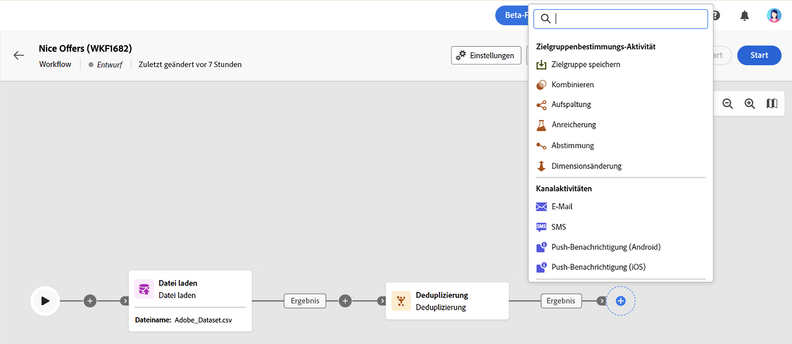

<?xml version="1.0" encoding="UTF-8"?>
<xliff xmlns="urn:oasis:names:tc:xliff:document:1.2" xmlns:okp="okapi-framework:xliff-extensions" xmlns:its="http://www.w3.org/2005/11/its" xmlns:itsxlf="http://www.w3.org/ns/its-xliff/" version="1.2" its:version="2.0">
<file original="help/v8/workflows/activities/about-activities.md.mdsc" source-language="en-US" target-language="en-XX" datatype="x-text/markdown">
<body>
<trans-unit id="tu1" restype="x-YAML_METADATA_HEADER_VALUE" xml:space="preserve">
<source xml:lang="en-US">Work with workflows activities</source>
<target xml:lang="en-XX">Arbeiten mit Workflow-Aktivitäten</target>
</trans-unit>
<trans-unit id="tu2" restype="x-YAML_METADATA_HEADER_VALUE" xml:space="preserve">
<source xml:lang="en-US">Learn how to workflow activities</source>
<target xml:lang="en-XX">Erfahren Sie, wie Sie Workflow-Aktivitäten durchführen.</target>
</trans-unit>
<trans-unit id="tu3" xml:space="preserve">
<source xml:lang="en-US">About workflow activities</source>
<target xml:lang="en-XX">Über Workflow-Aktivitäten</target>
</trans-unit>
<trans-unit id="tu4" xml:space="preserve">
<source xml:lang="en-US">Workflow activities are grouped into three categories. Depending on the context, available activities may differ.</source>
<target xml:lang="en-XX">Workflow-Aktivitäten sind in drei Kategorien unterteilt. Je nach Kontext können die verfügbaren Aktivitäten unterschiedlich sein.</target>
</trans-unit>
<trans-unit id="tu5" xml:space="preserve">
<source xml:lang="en-US">All activities are detailed in the sections below:</source>
<target xml:lang="en-XX">Alle Aktivitäten werden in den folgenden Abschnitten beschrieben:</target>
</trans-unit>
<trans-unit id="tu6" xml:space="preserve">
<source xml:lang="en-US">Targeting and data management activities</source>
<target xml:lang="en-XX">Zielgruppenbestimmungs- und Daten-Management-Aktivitäten</target>
</trans-unit>
<trans-unit id="tu7" xml:space="preserve">
<source xml:lang="en-US">Channel activities</source>
<target xml:lang="en-XX">Kanalaktivitäten</target>
</trans-unit>
<trans-unit id="tu8" xml:space="preserve">
<source xml:lang="en-US">Flow control activities</source>
<target xml:lang="en-XX">Flusssteuerungsaktivitäten</target>
</trans-unit>
<trans-unit id="tu9" xml:space="preserve">
<source xml:lang="en-US"><ph id="1" ctype="x-IMAGE"></ph></source>
<target xml:lang="en-XX"><ph id="1" ctype="x-IMAGE"></ph></target>
</trans-unit>
<trans-unit id="tu10" xml:space="preserve">
<source xml:lang="en-US">Targeting activities</source>
<target xml:lang="en-XX">Zielgruppenbestimmungsaktivitäten</target>
</trans-unit>
<trans-unit id="tu11" xml:space="preserve">
<source xml:lang="en-US">These activities are specific to targeting. They allow you to build one or more target audiences by defining an audience and splitting or combining these audiences using intersection, union, or exclusion operations.</source>
<target xml:lang="en-XX">Diese Aktivitäten sind spezifisch für die Zielgruppenbestimmung. Sie ermöglichen es Ihnen, eine oder mehrere Zielgruppen zu erstellen, indem Sie eine Zielgruppe definieren und diese Zielgruppen mithilfe von Schnittmenge, Vereinigung oder Ausschluss aufteilen oder kombinieren.</target>
</trans-unit>
<trans-unit id="tu12" xml:space="preserve">
<source xml:lang="en-US"><ph id="1" ctype="x-LINK">[</ph>Build audience<ph id="2" ctype="x-LINK">](build-audience.md)</ph>: Define your target population. Select an existing audience or use the query modeler to define your own query. You can also configure <ph id="3" ctype="x-STRONG_EMPHASIS">**</ph>Enrichment data<ph id="4" ctype="x-STRONG_EMPHASIS">**</ph> (available for queries).</source>
<target xml:lang="en-XX"><ph id="1" ctype="x-LINK">[</ph>Zielgruppe erstellen<ph id="2" ctype="x-LINK">](build-audience.md)</ph>: Mit dieser Aktivität definieren Sie Ihre Zielpopulation. Wählen Sie eine vorhandene Zielgruppe aus oder verwenden Sie den Abfrage-Modeler, um Ihre eigene Abfrage zu definieren. Sie können auch <ph id="3" ctype="x-STRONG_EMPHASIS">**</ph>Anreicherungsdaten<ph id="4" ctype="x-STRONG_EMPHASIS">**</ph> konfigurieren (für Abfragen verfügbar).</target>
</trans-unit>
<trans-unit id="tu13" xml:space="preserve">
<source xml:lang="en-US"><ph id="1" ctype="x-LINK">[</ph>Change data source<ph id="2" ctype="x-LINK">](change-data-source.md)</ph>: Change the data source for the working table of your workflow.</source>
<target xml:lang="en-XX"><ph id="1" ctype="x-LINK">[</ph>Datenquelle ändern<ph id="2" ctype="x-LINK">](change-data-source.md)</ph>: Mit dieser Aktivität ändern Sie die Datenquelle für die Arbeitstabelle Ihres Workflows.</target>
</trans-unit>
<trans-unit id="tu14" xml:space="preserve">
<source xml:lang="en-US"><ph id="1" ctype="x-LINK">[</ph>Change dimension<ph id="2" ctype="x-LINK">](change-dimension.md)</ph>: Change the targeting dimension while building your workflow.</source>
<target xml:lang="en-XX"><ph id="1" ctype="x-LINK">[</ph>Dimensionsänderung<ph id="2" ctype="x-LINK">](change-dimension.md)</ph>: Mit dieser Aktivität ändern Sie die Zielgruppendimension, während Sie Ihren Workflow erstellen.</target>
</trans-unit>
<trans-unit id="tu15" xml:space="preserve">
<source xml:lang="en-US"><ph id="1" ctype="x-LINK">[</ph>Combine<ph id="2" ctype="x-LINK">](combine.md)</ph>: Perform segmentation on your inbound population. Use a union, an intersection, or an exclusion.</source>
<target xml:lang="en-XX"><ph id="1" ctype="x-LINK">[</ph>Kombinieren<ph id="2" ctype="x-LINK">](combine.md)</ph>: Mit dieser Aktivität segmentieren Sie Ihre eingehende Population. Verwenden Sie eine Vereinigung, eine Schnittmenge oder einen Ausschluss.</target>
</trans-unit>
<trans-unit id="tu16" xml:space="preserve">
<source xml:lang="en-US"><ph id="1" ctype="x-LINK">[</ph>Deduplication<ph id="2" ctype="x-LINK">](deduplication.md)</ph>: Remove duplicates in the results of inbound activities.</source>
<target xml:lang="en-XX"><ph id="1" ctype="x-LINK">[</ph>Deduplizierung<ph id="2" ctype="x-LINK">](deduplication.md)</ph>: Mit dieser Aktivität löschen Sie Duplikate in Ergebnissen aus eingehenden Aktivitäten.</target>
</trans-unit>
<trans-unit id="tu17" xml:space="preserve">
<source xml:lang="en-US"><ph id="1" ctype="x-LINK">[</ph>Enrichment<ph id="2" ctype="x-LINK">](enrichment.md)</ph>: Define additional data to process in your workflow. Configure the activity to complete the output transition with additional data.</source>
<target xml:lang="en-XX"><ph id="1" ctype="x-LINK">[</ph>Anreicherung<ph id="2" ctype="x-LINK">](enrichment.md)</ph>: Mit dieser Aktivität definieren Sie zusätzliche Daten, die in Ihrem Workflow verarbeitet werden sollen. Konfigurieren Sie die Aktivität, um die ausgehende Transition mit Zusatzdaten zu ergänzen.</target>
</trans-unit>
<trans-unit id="tu18" xml:space="preserve">
<source xml:lang="en-US"><ph id="1" ctype="x-LINK">[</ph>Incremental query<ph id="2" ctype="x-LINK">](incremental-query.md)</ph>: Query the database on a scheduled basis. Each time this activity runs, it excludes results from previous executions, targeting only new elements.</source>
<target xml:lang="en-XX"><ph id="1" ctype="x-LINK">[</ph>Inkrementelle Abfrage<ph id="2" ctype="x-LINK">](incremental-query.md)</ph>: Mit dieser Aktivität fragen Sie die Datenbank nach einem Plan ab. Bei jeder Ausführung dieser Aktivität werden die Ergebnisse vorangehenden Ausführungen ausgeschlossen, sodass nur neue Elemente berücksichtigt werden.</target>
</trans-unit>
<trans-unit id="tu19" xml:space="preserve">
<source xml:lang="en-US"><ph id="1" ctype="x-LINK">[</ph>Reconciliation<ph id="2" ctype="x-LINK">](reconciliation.md)</ph>: Define the link between the data in the Adobe Campaign database and the data in a work table, such as data loaded from an external file.</source>
<target xml:lang="en-XX"><ph id="1" ctype="x-LINK">[</ph>Abstimmung<ph id="2" ctype="x-LINK">](reconciliation.md)</ph>: Mit dieser Aktivität definieren Sie die Verknüpfung zwischen den Daten in der Adobe Campaign-Datenbank und den Daten in einer Arbeitstabelle, z. B. Daten, die aus einer externen Datei geladen werden.</target>
</trans-unit>
<trans-unit id="tu20" xml:space="preserve">
<source xml:lang="en-US"><ph id="1" ctype="x-LINK">[</ph>Save audience<ph id="2" ctype="x-LINK">](save-audience.md)</ph>: Update an existing audience or create a new audience from the population computed upstream in a workflow.</source>
<target xml:lang="en-XX"><ph id="1" ctype="x-LINK">[</ph>Zielgruppe speichern<ph id="2" ctype="x-LINK">](save-audience.md)</ph>: Mit dieser Aktivität aktualisieren Sie vorhandene Zielgruppen oder erstellen neue. Die hierfür erforderlichen Populationen werden im Vorfeld durch andere Workflow-Aktivitäten ermittelt.</target>
</trans-unit>
<trans-unit id="tu21" xml:space="preserve">
<source xml:lang="en-US"><ph id="1" ctype="x-LINK">[</ph>Split<ph id="2" ctype="x-LINK">](split.md)</ph>: Segment the incoming population into several subsets.</source>
<target xml:lang="en-XX"><ph id="1" ctype="x-LINK">[</ph>Aufspaltung<ph id="2" ctype="x-LINK">](split.md)</ph>: Mit dieser Aktivität unterteilen Sie die eingehende Population in mehrere Teilmengen.</target>
</trans-unit>
<trans-unit id="tu22" xml:space="preserve">
<source xml:lang="en-US">Data management activities</source>
<target xml:lang="en-XX">Daten-Management-Aktivitäten</target>
</trans-unit>
<trans-unit id="tu23" xml:space="preserve">
<source xml:lang="en-US">These activities are specific to manipulating and enriching population data.</source>
<target xml:lang="en-XX">Diese Aktivitäten dienen der Manipulation und Anreicherung von Populationsdaten.</target>
</trans-unit>
<trans-unit id="tu24" xml:space="preserve">
<source xml:lang="en-US"><ph id="1" ctype="x-LINK">[</ph>Data loading (RDBMS)<ph id="2" ctype="x-LINK">](data-loading-rdbms.md)</ph>: Load data directly from an external relational database into your workflow.</source>
<target xml:lang="en-XX"><ph id="1" ctype="x-LINK">[</ph>Laden (RDBMS)<ph id="2" ctype="x-LINK">](data-loading-rdbms.md)</ph>: Laden Sie Daten direkt aus einer externen relationalen Datenbank in Ihren Workflow.</target>
</trans-unit>
<trans-unit id="tu25" xml:space="preserve">
<source xml:lang="en-US"><ph id="1" ctype="x-LINK">[</ph>Extract file<ph id="2" ctype="x-LINK">](extract-file.md)</ph>: Export data from Adobe Campaign to another system as an external file.</source>
<target xml:lang="en-XX"><ph id="1" ctype="x-LINK">[</ph>Dateiextraktion<ph id="2" ctype="x-LINK">](extract-file.md)</ph>: Mit dieser Aktivität exportieren Sie in Adobe Campaign enthaltene Daten in Form von externen Dateien.</target>
</trans-unit>
<trans-unit id="tu26" xml:space="preserve">
<source xml:lang="en-US"><ph id="1" ctype="x-LINK">[</ph>Load file<ph id="2" ctype="x-LINK">](load-file.md)</ph>: Work with profiles and data stored in an external file.</source>
<target xml:lang="en-XX"><ph id="1" ctype="x-LINK">[</ph>Datei laden<ph id="2" ctype="x-LINK">](load-file.md)</ph>: Mit dieser Aktivität können Sie mit Profilen und Daten arbeiten, die in einer externen Datei gespeichert sind.</target>
</trans-unit>
<trans-unit id="tu27" xml:space="preserve">
<source xml:lang="en-US"><ph id="1" ctype="x-LINK">[</ph>Transfer file<ph id="2" ctype="x-LINK">](transfer-file.md)</ph>: Receive or send files, test for file presence, or list files on a server. The protocol used can be either server-to-server protocol or HTTP protocol.</source>
<target xml:lang="en-XX"><ph id="1" ctype="x-LINK">[</ph>Datei übertragen<ph id="2" ctype="x-LINK">](transfer-file.md)</ph>: Mit dieser Aktivität können Sie Dateien senden oder empfangen, das Vorhandensein von Dateien prüfen oder Dateien auf einem Server auflisten. Das verwendete Protokoll kann entweder ein Server-zu-Server-Protokoll oder ein HTTP-Protokoll sein.</target>
</trans-unit>
<trans-unit id="tu28" xml:space="preserve">
<source xml:lang="en-US"><ph id="1" ctype="x-LINK">[</ph>JavaScript code<ph id="2" ctype="x-LINK">](javascript-code.md)</ph>: Execute a JavaScript code snippet within the context of a workflow.</source>
<target xml:lang="en-XX"><ph id="1" ctype="x-LINK">[</ph>JavaScript-Code<ph id="2" ctype="x-LINK">](javascript-code.md)</ph>: Mit dieser Aktivität führen Sie ein JavaScript-Code-Snippet im Kontext eines Workflows aus.</target>
</trans-unit>
<trans-unit id="tu29" xml:space="preserve">
<source xml:lang="en-US"><ph id="1" ctype="x-LINK">[</ph>Subscription services<ph id="2" ctype="x-LINK">](subscription-services.md)</ph>: Subscribe or unsubscribe multiple profiles to or from a service in a single action.</source>
<target xml:lang="en-XX"><ph id="1" ctype="x-LINK">[</ph>Anmeldedienste<ph id="2" ctype="x-LINK">](subscription-services.md)</ph>: Mit dieser Aktivität können Sie in einer einzigen Aktion mehrere Profile für einen Dienst abonnieren oder von ihm abmelden.</target>
</trans-unit>
<trans-unit id="tu30" xml:space="preserve">
<source xml:lang="en-US"><ph id="1" ctype="x-LINK">[</ph>Update data<ph id="2" ctype="x-LINK">](update-data.md)</ph>: Perform mass updates on fields in the database. Several options allow you to personalize the data update.</source>
<target xml:lang="en-XX"><ph id="1" ctype="x-LINK">[</ph>Daten aktualisieren<ph id="2" ctype="x-LINK">](update-data.md)</ph>: Mit dieser Aktivität führen Sie eine gebündelte Aktualisierung von Datenbankfeldern durch. Die Art der Datenbankaktualisierung kann über verschiedene Optionen definiert werden.</target>
</trans-unit>
<trans-unit id="tu31" xml:space="preserve">
<source xml:lang="en-US">Channel activities</source>
<target xml:lang="en-XX">Kanalaktivitäten</target>
</trans-unit>
<trans-unit id="tu32" xml:space="preserve">
<source xml:lang="en-US">Adobe Campaign Web allows you to automate and execute marketing campaigns across multiple channels. Combine channel activities into the canvas to create cross-channel workflows that trigger actions based on customer behavior. The following <ph id="1" ctype="x-STRONG_EMPHASIS">**</ph>Channel<ph id="2" ctype="x-STRONG_EMPHASIS">**</ph> activities are available: Email, SMS, Android, and iOS Push notifications. <ph id="3" ctype="x-LINK">[</ph>Learn how to set up a delivery in the context of a workflow<ph id="4" ctype="x-LINK">](channels.md)</ph>.</source>
<target xml:lang="en-XX">In Adobe Campaign Web können Sie Marketing-Kampagnen automatisieren und über mehrere Kanäle hinweg ausführen. Kombinieren Sie Kanalaktivitäten in den Arbeitsflächen, um Cross-Channel-Workflows zu erstellen, mit denen je nach Kundenverhalten Aktionen ausgelöst werden können. Es sind folgende <ph id="1" ctype="x-STRONG_EMPHASIS">**</ph>Kanalaktivitäten<ph id="2" ctype="x-STRONG_EMPHASIS">**</ph> verfügbar: E-Mail-, SMS-, Android- und iOS-Push-Benachrichtigungen. <ph id="3" ctype="x-LINK">[</ph>Erfahren Sie, wie Sie einen Versand im Rahmen eines Workflows einrichten.<ph id="4" ctype="x-LINK">](channels.md)</ph>.</target>
</trans-unit>
<trans-unit id="tu33" xml:space="preserve">
<source xml:lang="en-US">Flow control activities</source>
<target xml:lang="en-XX">Flusssteuerungsaktivitäten</target>
</trans-unit>
<trans-unit id="tu34" xml:space="preserve">
<source xml:lang="en-US">End activity</source>
<target xml:lang="en-XX">Endaktivität</target>
</trans-unit>
<trans-unit id="tu35" xml:space="preserve">
<source xml:lang="en-US">The <ph id="1" ctype="x-STRONG_EMPHASIS">**</ph>Start<ph id="2" ctype="x-STRONG_EMPHASIS">**</ph> activity allows you to graphically mark the start of a workflow. This activity has no functional impact and is therefore optional.</source>
<target xml:lang="en-XX">Mit der Aktivität <ph id="1" ctype="x-STRONG_EMPHASIS">**</ph>Start<ph id="2" ctype="x-STRONG_EMPHASIS">**</ph> können Sie den Start eines Workflows grafisch kennzeichnen. Diese Aktivität hat keine funktionalen Auswirkungen und ist daher optional.</target>
</trans-unit>
<trans-unit id="tu36" xml:space="preserve">
<source xml:lang="en-US">The following activities are specific to organizing and executing workflows. Their main task is to coordinate the other activities:</source>
<target xml:lang="en-XX">Die folgenden Aktivitäten dienen der Anordnung und Ausführung von Workflows. Ihre Hauptaufgabe ist es, die anderen Aktivitäten zu koordinieren:</target>
</trans-unit>
<trans-unit id="tu37" xml:space="preserve">
<source xml:lang="en-US"><ph id="1" ctype="x-LINK">[</ph>Approval<ph id="2" ctype="x-LINK">](approval.md)</ph>: Assign a task to a group or an individual operator, and route the workflow based on their answer.</source>
<target xml:lang="en-XX"><ph id="1" ctype="x-LINK">[</ph>Validierung<ph id="2" ctype="x-LINK">](approval.md)</ph>: Weisen Sie einer Gruppe oder einer einzelnen Benutzerin bzw. einem einzelnen Benutzer eine Aufgabe zu und leiten Sie den Workflow entsprechend der Antwort weiter.</target>
</trans-unit>
<trans-unit id="tu38" xml:space="preserve">
<source xml:lang="en-US"><ph id="1" ctype="x-LINK">[</ph>External signal<ph id="2" ctype="x-LINK">](external-signal.md)</ph>: Trigger the execution of a workflow from another workflow or an API call.</source>
<target xml:lang="en-XX"><ph id="1" ctype="x-LINK">[</ph>Externes Signal<ph id="2" ctype="x-LINK">](external-signal.md)</ph>: Mit dieser Aktivität lösen Sie die Ausführung eines Workflows über einen anderen Workflow oder einen API-Aufruf aus.</target>
</trans-unit>
<trans-unit id="tu39" xml:space="preserve">
<source xml:lang="en-US"><ph id="1" ctype="x-LINK">[</ph>Fork<ph id="2" ctype="x-LINK">](fork.md)</ph>: Create outbound transitions to start several activities simultaneously.</source>
<target xml:lang="en-XX"><ph id="1" ctype="x-LINK">[</ph>Verzweigung<ph id="2" ctype="x-LINK">](fork.md)</ph>: Mit dieser Aktivität erstellen Sie ausgehende Transitionen, um mehrere Aktivitäten gleichzeitig zu starten.</target>
</trans-unit>
<trans-unit id="tu40" xml:space="preserve">
<source xml:lang="en-US"><ph id="1" ctype="x-LINK">[</ph>Join<ph id="2" ctype="x-LINK">](join.md)</ph>: Synchronize multiple execution branches of a workflow.</source>
<target xml:lang="en-XX"><ph id="1" ctype="x-LINK">[</ph>Join<ph id="2" ctype="x-LINK">](join.md)</ph>: Mit dieser Aktivität synchronisieren Sie mehrere Ausführungszweige eines Workflows.</target>
</trans-unit>
<trans-unit id="tu41" xml:space="preserve">
<source xml:lang="en-US"><ph id="1" ctype="x-LINK">[</ph>Scheduler<ph id="2" ctype="x-LINK">](scheduler.md)</ph>: Schedule when the workflow starts.</source>
<target xml:lang="en-XX"><ph id="1" ctype="x-LINK">[</ph>Planung<ph id="2" ctype="x-LINK">](scheduler.md)</ph>: Mit dieser Aktivität planen Sie, wann der Workflow starten soll.</target>
</trans-unit>
<trans-unit id="tu42" xml:space="preserve">
<source xml:lang="en-US"><ph id="1" ctype="x-STRONG_EMPHASIS">**</ph>Start<ph id="2" ctype="x-STRONG_EMPHASIS">**</ph> and <ph id="3" ctype="x-LINK">[</ph>End<ph id="4" ctype="x-LINK">](end.md)</ph>: Graphically mark the beginning and end of a workflow. They are optional and have no functional impact on their own.</source>
<target xml:lang="en-XX"><ph id="1" ctype="x-STRONG_EMPHASIS">**</ph>Start<ph id="2" ctype="x-STRONG_EMPHASIS">**</ph> und <ph id="3" ctype="x-LINK">[</ph>Ende<ph id="4" ctype="x-LINK">](end.md)</ph>: Mit diesen Aktivitäten markieren Sie grafisch den Anfang und das Ende eines Workflows. Sie sind optional und haben selbst keine funktionalen Auswirkungen.</target>
</trans-unit>
<trans-unit id="tu43" xml:space="preserve">
<source xml:lang="en-US"><ph id="1" ctype="x-regxph" equiv-text="&lbrack;!NOTE">[!NOTE]</ph></source>
<target xml:lang="en-XX"><ph id="1" ctype="x-regxph" equiv-text="&lbrack;!NOTE">[!NOTE]</ph></target>
</trans-unit>
<trans-unit id="tu44" xml:space="preserve">
<source xml:lang="en-US">Note that the <ph id="1" ctype="x-STRONG_EMPHASIS">**</ph>Start<ph id="2" ctype="x-STRONG_EMPHASIS">**</ph> activity is automatically added to all workflows created before the 26.3 release. It is not inserted by default in new workflows.</source>
<target xml:lang="en-XX">Beachten Sie, dass die Aktivität <ph id="1" ctype="x-STRONG_EMPHASIS">**</ph>Start<ph id="2" ctype="x-STRONG_EMPHASIS">**</ph> automatisch zu allen Workflows hinzugefügt wird, die vor Version 26.3 erstellt wurden. Sie wird in neuen Workflows nicht standardmäßig eingefügt.</target>
</trans-unit>
<trans-unit id="tu45" xml:space="preserve">
<source xml:lang="en-US"><ph id="1" ctype="x-LINK">[</ph>Test<ph id="2" ctype="x-LINK">](test.md)</ph>: Enable transitions based on specified conditions.</source>
<target xml:lang="en-XX"><ph id="1" ctype="x-LINK">[</ph>Test<ph id="2" ctype="x-LINK">](test.md)</ph>: Mit dieser Aktivität aktivieren Sie Transitionen auf Grundlage der angegebenen Bedingungen.</target>
</trans-unit>
<trans-unit id="tu46" xml:space="preserve">
<source xml:lang="en-US"><ph id="1" ctype="x-LINK">[</ph>Wait<ph id="2" ctype="x-LINK">](wait.md)</ph>: Pause execution of a part of a workflow temporarily.</source>
<target xml:lang="en-XX"><ph id="1" ctype="x-LINK">[</ph>Warten<ph id="2" ctype="x-LINK">](wait.md)</ph>: Mit dieser Aktivität halten Sie die Ausführung eines Teils eines Workflows vorübergehend an.</target>
</trans-unit>
</body>
</file>
</xliff>