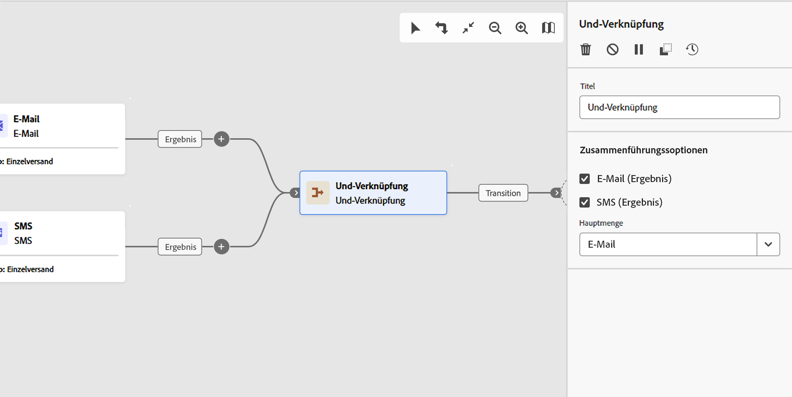
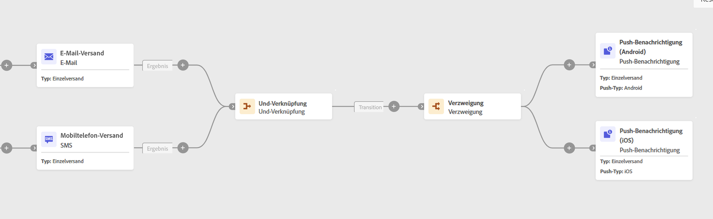

# Und-Verknüpfung {#join}

>[!CONTEXTUALHELP]
>id="acw_orchestration_and-join"
>title="Aktivität &quot;Und-Verknüpfung&quot;"
>abstract="Die Aktivität **Und-Verknüpfung** ermöglicht es, die Ausführung verschiedener Workflow-Verzweigungen zu synchronisieren. Sie wird ausgelöst, sobald alle vorangehenden Aktivitäten beendet sind. Dadurch wird sichergestellt, dass bestimmte Aktivitäten abgeschlossen sind, bevor der Workflow ausgeführt wird."

Die Aktivität **Und-Verknüpfung** ist eine Aktivität zur **Flusskontrolle**. Es synchronisiert mehrere Ausführungszweige eines Workflows.

Die ausgehende Transition wird erst Trigger, nachdem alle eingehenden Transitionen aktiviert wurden. Mit anderen Worten, sie wird aktiviert, sobald alle vorherigen Aktivitäten abgeschlossen sind. Dadurch wird sichergestellt, dass bestimmte Aktivitäten abgeschlossen sind, bevor der Workflow ausgeführt wird.

## Konfigurieren der Aktivität „Und-Verknüpfung“ {#and-join-configuration}

>[!CONTEXTUALHELP]
>id="acw_orchestration_and-join_merging"
>title="Zusammenführungssoptionen"
>abstract="Wählen Sie die Aktivitäten aus, die Sie verknüpfen möchten. Wählen Sie in der Dropdown-Liste **Hauptmenge** die Population der eingehenden Transition aus, die Sie beibehalten möchten."

Führen Sie die folgenden Schritte aus, um die Aktivität **Und-Verknüpfung** zu konfigurieren:

1. Fügen Sie mehrere Aktivitäten hinzu, z. B. Kanalaktivitäten, um mindestens zwei verschiedene Ausführungszweige zu bilden.
1. Fügen Sie die Aktivität **Und-Verknüpfung** zu einer der Verzweigungen hinzu.
1. Aktivieren Sie **Abschnitt „Zusammenführungsoptionen** alle vorherigen Aktivitäten, die Sie zusammenführen möchten.
1. Wählen Sie in der Dropdown-**** Primär die Population der eingehenden Transition aus, die beibehalten werden soll. Die ausgehende Transition darf nur eine der Populationen der eingehenden Transition enthalten.

## Beispiel {#and-join-example}

Das folgende Beispiel zeigt zwei Workflow-Verzweigungen mit einem E-Mail- und SMS-Versand. Die UND-Verknüpfungs-Trigger, wenn beide eingehenden Transitionen aktiviert sind. Push-Benachrichtigungen werden erst gesendet, nachdem beide Sendungen abgeschlossen sind.

{zoomable="yes"}