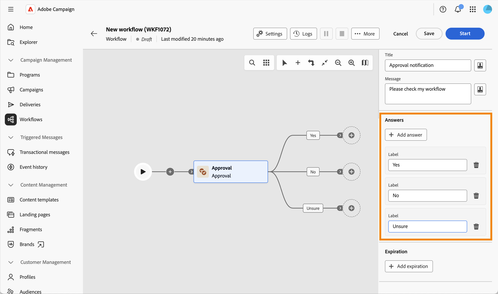

# Validierung {#approval}

>[!CONTEXTUALHELP]
>id="acw_orchestration_approval"
>title="Validierungsaktivität"
>abstract="Die **Validierung** erfordert die Teilnahme eines Benutzers. Weisen Sie die Aufgabe einer Gruppe oder einem einzelnen Benutzer zu, passen Sie den Titel und die Nachricht der Benachrichtigung an und definieren Sie die möglichen Antworten als Ausgabeverzweigungen."

Die **Validierung** Workflow-Aktivität ermöglicht es Ihnen, eine Aufgabe einer Gruppe oder einem einzelnen Benutzer zuzuweisen, den Titel und die Nachricht der Benachrichtigungs-E-Mail anzupassen und die möglichen Antworten (z. B. Ja/Nein) als Ausgabeverzweigungen zu definieren.

Verwenden Sie diese Aktivität, wenn ein Schritt in Ihrem Workflow eine menschliche Entscheidung erfordert, bevor Sie fortfahren, z. B. um ein Budget, eine Zielgruppe oder Inhalte genehmigen zu lassen, bevor der Workflow fortgesetzt wird.

## Funktionsweise des Validierungsprozesses {#process}

Sie erfordert die Beteiligung mindestens eines Betreibers. Diese Aktivität blockiert den Workflow nicht: Andere Aufgaben können ausgeführt werden, während der Workflow auf eine Antwort wartet.

Beim Warten auf eine Antwort wird die Aktivität auf der Arbeitsfläche als Ausstehend angezeigt. Der Verantwortliche antwortet mithilfe des in der Benachrichtigung enthaltenen Links.

Hier finden Sie den Genehmigungsprozess:

1. Erstellen Sie einen Workflow und konfigurieren Sie eine **Validierungs**-Aktivität.
1. Starten Sie den Workflow. Wenn die Aktivität **Validierung** erreicht ist, wird eine Aufgabe für den Verantwortlichen erstellt.
1. Der Verantwortliche erhält die Benachrichtigung, klickt auf den Link und wählt eine Antwort aus.
1. Sobald der Verantwortliche antwortet, fährt der Workflow mit der Transition fort, die seiner Antwort entspricht.

Gehen Sie wie folgt vor, um diese Aktivität zu konfigurieren:

1. Aufgabe zuweisen, [mehr dazu](#assignment)
1. Benachrichtigungsinhalt definieren, [mehr dazu](#message)
1. Definieren der möglichen Antworten [mehr dazu](#answers)
1. Definieren Sie optional einen Gültigkeitszeitraum ([ mehr dazu](#expiration)

## Aufgabe zuweisen {#assignment}

Die Zuweisung der Aufgabe zu einer Gruppe oder einem Benutzer ist obligatorisch: Bis dahin wird ein Warnhinweis angezeigt.

{zoomable="yes"}

Führen Sie folgende Schritte aus:

1. Wählen Sie **[!UICONTROL Feld]** Zuweisungstyp“ aus, ob die Aufgabe einer **[!UICONTROL Gruppe“ (]**) oder einem **[!UICONTROL zugewiesen]**.

1. Wählen Sie dann **[!UICONTROL Benutzergruppe]** (von Benutzern) oder einen **[!UICONTROL Benutzer]** (einzelner Benutzer) aus.

1. Aktivieren Sie **[!UICONTROL Mehrfache Genehmigung]** wenn jeder Verantwortliche antworten soll, bevor der Workflow fortgesetzt wird. Diese Option ist unabhängig vom Zuweisungstyp verfügbar. Wenn diese Option deaktiviert ist, wird der Workflow fortgesetzt, sobald ein Verantwortlicher antwortet. Diese Antwort wird berücksichtigt.

1. Klicken Sie **[!UICONTROL Erweiterte Parameter]**, um die für die Benachrichtigung verwendete Versandvorlage auszuwählen. Standardmäßig wird eine integrierte Vorlage verwendet, Sie können jedoch auch eine beliebige andere Versandvorlage auswählen.

   {zoomable="yes"}

## Definieren der Benachrichtigungsinhalte {#message}

Sie können jetzt die an den Verantwortlichen gesendete Benachrichtigungsmeldung definieren.

{zoomable="yes"}

Führen Sie folgende Schritte aus:

1. Definieren Sie **[!UICONTROL Titel]** der an den Verantwortlichen gesendeten Benachrichtigung.

1. Definieren Sie **[!UICONTROL Nachricht]** der an den Verantwortlichen gesendeten Benachrichtigung.

Beide Felder unterstützen Personalisierung: Klicken Sie auf das Personalisierungssymbol, um Ereignisvariablen einzufügen, z. B. den **[!UICONTROL Benutzer, der geantwortet hat]** und die **[!UICONTROL Antwort]**, die Sie an anderer Stelle in Ihrem Workflow wiederverwenden können.

{zoomable="yes"}

## Definieren der möglichen Antworten {#answers}

Die Aktivität enthält zwei Standardantworten: **[!UICONTROL Ja]** und **[!UICONTROL Nein]**. Jede Antwort entspricht einer ausgehenden Transition auf der Arbeitsfläche.

{zoomable="yes"}

Klicken Sie **[!UICONTROL Antwort hinzufügen]**, um zusätzliche Auswahlmöglichkeiten zu definieren.

Wenn der Verantwortliche antwortet, fährt der Workflow mit der Transition fort, die der Auswahl entspricht.

## Definieren einer Gültigkeit {#expiration}

Schließlich können Sie eine Gültigkeit für die Genehmigungsaufgabe definieren. Wie bei einer Antwort gibt eine Gültigkeit eine eigene Ausgabetransition an, wenn der Verantwortliche nicht fristgerecht geantwortet hat.

{zoomable="yes"}

1. Klicken Sie **[!UICONTROL Gültigkeit hinzufügen]**.

1. Definieren Sie **[!UICONTROL Beschriftung]** für die entsprechende Ausgabetransition.

1. Wählen Sie in **[!UICONTROL Dropdown]** Liste Gültigkeitstyp“ eine der folgenden Optionen aus:

   * **[!UICONTROL Verzögerung nach Aufgabenstart]**: Definieren Sie eine Verzögerung, die nach dem Start der Genehmigungsaufgabe gewartet werden soll.
   * **[!UICONTROL Verzögerung nach einem Datum]**: Definieren einer Verzögerung, die nach einem bestimmten Datum gewartet werden soll.
   * **[!UICONTROL Verzögerung vor einem Datum]** Definieren Sie eine Verzögerung, die vor einem bestimmten Datum gewartet werden soll.
   * **[!UICONTROL Gültigkeit durch Skript berechnet]**: Verwenden Sie ein Skript zur Berechnung der Gültigkeit.

1. Aktivieren Sie **[!UICONTROL Aufgabe nicht beenden]** wenn die Gültigkeitsübergabe aktiviert werden soll, ohne die Genehmigungsaufgabe zu beenden, sodass der Verantwortliche auch danach antworten kann.

Sie können für dieselbe Genehmigungsaufgabe mehrere Gültigkeiten definieren.

Anschließend können Sie den Workflow starten. Sobald der Verantwortliche antwortet, fährt der Workflow mit der Transition fort, die seiner Antwort entspricht. [Weitere Informationen](#process)

## Verwandte Themen {#related}

* [Über Workflow-Aktivitäten](about-activities.md)
* [Einrichten und Verwalten des Validierungsprozesses](../../campaigns/campaign-approvals.md)
