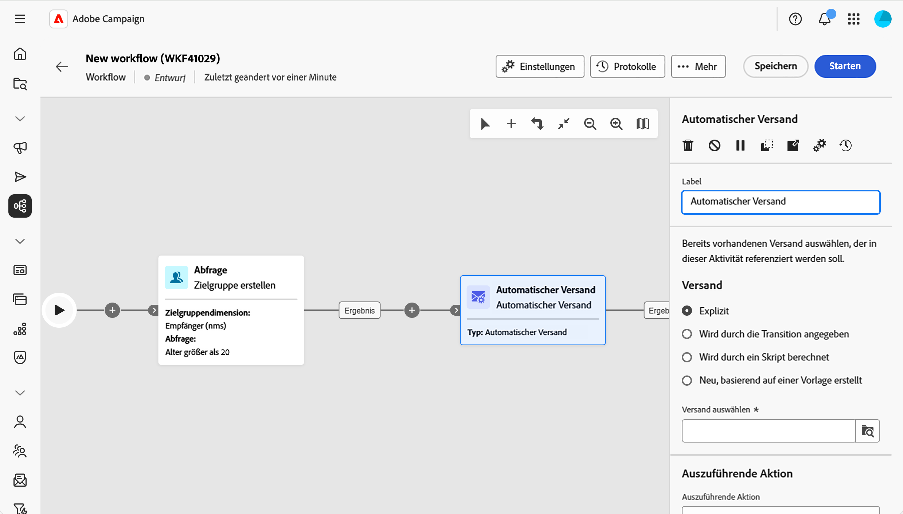
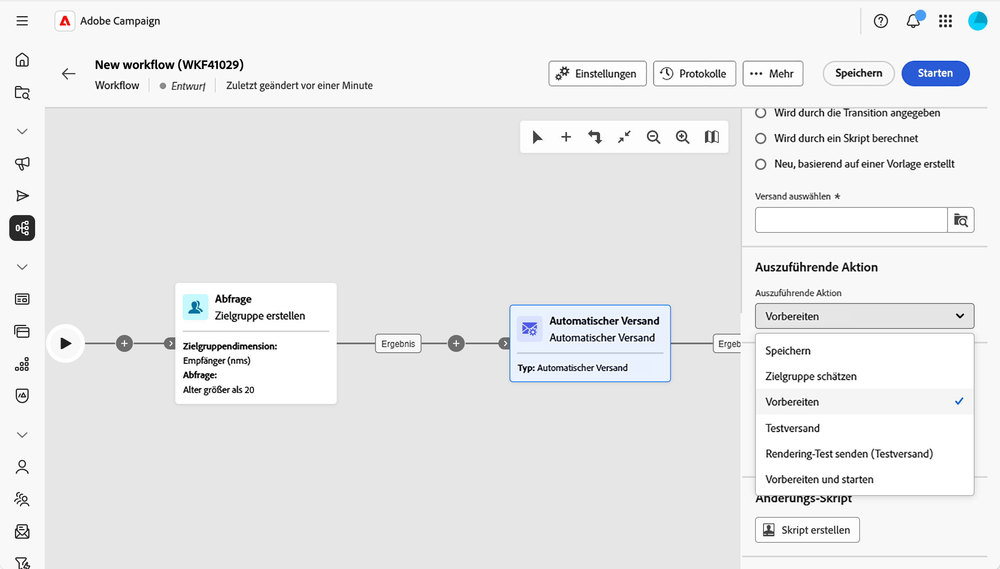
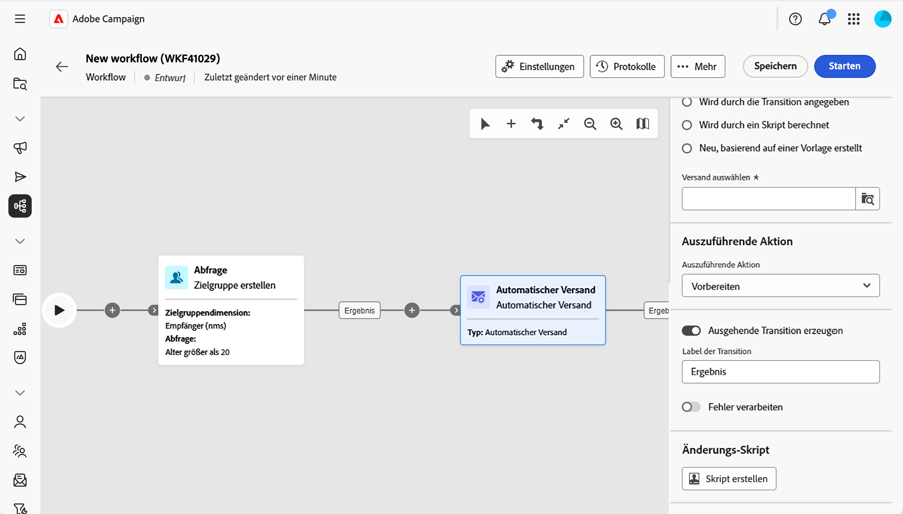

# Automatischer Versand {#automated-delivery}

>[!CONTEXTUALHELP]
>id="acw_homepage_welcome_rn4"
>title="Versandaktivität automatisieren"
>abstract="Die Workflow-Aktivität Automatisierter Versand ist jetzt in der Workflow-Palette verfügbar. Sie können damit Versandaktionen (Vorbereiten, Testversand durchführen, Vorbereiten und starten usw.) direkt in Ihrem Workflow erstellen oder ausführen."
>additional-url="https://experienceleague.adobe.com/docs/campaign-web/v8/release-notes/release-notes.html?lang=de" text="Siehe Versionshinweise"

>[!CONTEXTUALHELP]
>id="acw_orchestration_automated-delivery"
>title="Versandaktivität automatisieren"
>abstract="Die Aktivität **Automatisierter Versand** wird für die Automatisierung verwendet: Erstellen oder wiederverwenden Sie einen Versand in Ihrem Workflow und wählen Sie dann die auszuführende Aktion aus (vorbereiten, vorbereiten und starten, Testversand durchführen usw.). Sie können einen außerhalb des Workflows erstellten bestehenden expliziten Versand auswählen oder bei jeder Ausführung der Aktivität einen neuen Versand aus einer Vorlage erstellen."

Die Aktivität **Automatisierter Versand** ermöglicht die Erstellung, Konfiguration und Ausführung von Versandaktionen direkt in Ihrem Workflow. Verwenden Sie diese Option, wenn Sie einen vordefinierten Versand nach einem Zeitplan oder als Teil eines automatisierten Flusses ausführen möchten oder wenn Sie bei jeder Ausführung der Aktivität einen neuen Versand aus einer Vorlage generieren möchten.

<!--
**[Continuous delivery](continuous-delivery.md)** always uses a template. The first run creates one delivery; later runs send to new recipients through that same delivery. **Automated delivery** is different: you either reuse one existing delivery every run, or you create a new delivery from a template each time—so each run can be its own delivery if you want. -->

Gehen Sie wie folgt vor, um diese Aktivität zu konfigurieren:

1. Definieren der Versandeinstellungen [weitere Informationen](#delivery-settings)
1. auszuführende Aktion auswählen ([&#x200B; dazu](#action-to-execute)
1. Einrichten der Transition, [mehr dazu](#transition-to-execute)
1. Definieren eines Änderungsskripts, [mehr dazu](#script)

## Definieren der Versandeinstellungen {#delivery-settings}

Wenn Sie die Aktivität konfigurieren, wählen Sie aus, woher der Versand kommen soll. In diesem Abschnitt stehen zwei Optionen zur Verfügung:

{zoomable="yes"}

* Wählen Sie **Expliziter Versand** aus, wenn Sie einen vorhandenen Versand bearbeiten möchten, z. B. einen eigenständigen Versand oder einen Versand, der aus einer Kampagne erstellt wurde. Wählen Sie den Versand mithilfe der Schaltfläche **Versand auswählen** aus. Bei jeder Ausführung des Workflows und beim Erreichen dieser Aktivität erfolgt **Versand**. Pro Ausführung wird kein neuer Versand erstellt. Die Aktivität verwendet denselben Versand erneut. Dies ist nützlich, wenn Sie einen einzelnen Versand haben, den Sie vorbereiten oder wiederholt senden möchten, z. B. in einem Zeitplan oder nach einem Validierungsschritt.

<!-- by default, the list shows unfinished deliveries in the Deliveries folder. You can browse other folders to select a delivery from another campaign. You choose the action to perform (prepare, prepare and start, send a proof, and so on).-->

* Wählen Sie **Neu, basierend auf einer Vorlage** aus, wenn bei jeder Ausführung **Aktivität ein** neuer Versand erstellt werden soll. Wählen Sie mithilfe der Schaltfläche **Vorlage auswählen** die Versandvorlage aus. Jede Ausführung generiert einen neuen Versand basierend auf dieser Vorlage. Verwenden Sie dies, wenn jede Workflow-Ausführung zu einem eigenen Versand führen soll (z. B. eine E-Mail pro Ausführung).

<!-- Unlike the Continuous delivery activity, there is no “append” to a previous execution—each run produces a separate delivery. -->

>[!NOTE]
>
>Die **In der Transition angegeben** und **Durch Skript berechnet** Optionen, die für erweiterte Anwendungsfälle verwendet werden, können nur in der Client-Konsole konfiguriert werden. Weiterführende Informationen dazu finden Sie in der [Dokumentation zu Campaign v8](https://experienceleague.adobe.com/de/docs/campaign/automation/workflows/wf-activities/action-activities/delivery){target="_blank"}.

## Auszuführende Aktion auswählen {#action-to-execute}

Wählen Sie in diesem Abschnitt aus, wie die Aktivität mit dem Versand umgehen soll. Folgende Optionen stehen zur Verfügung:

{zoomable="yes"}

* **Speichern**: Erstellt und speichert den Versand, ohne ihn zu analysieren oder zu versenden.
* **Zielgruppe schätzen**: Berechnet die Zielgruppe des Versands, um sein Potenzial einzuschätzen (erste Analysephase).
* **Vorbereiten**: Führt die vollständige Analyse durch (Zielgruppenberechnung und Inhaltsvorbereitung). Der Versand wird nicht durchgeführt.
* **Testversand durchführen**: Sendet einen Testversand des Versands.
* **Vorbereiten und starten**: Führt die vollständige Analyse (Zielgruppenberechnung und Inhaltsvorbereitung) aus und sendet den Versand.

## Einrichten der Transition {#transition-to-execute}

In diesem Abschnitt können Sie auswählen, ob Sie nach der Aktivität Transitionen generieren möchten. Folgende Optionen stehen zur Verfügung:

{zoomable="yes"}

* **Ausgehende Transition erzeugen**: Erzeugt eine ausgehende Transition nach Abschluss der Aktivität.
* **Transition-Beschriftung**: Ermöglicht die Anpassung der Beschriftung, die auf der Transition auf der Arbeitsfläche angezeigt wird.
* **Fehler verarbeiten**: Fügt eine zusätzliche Transition für die Fehlerbehandlung hinzu.

## Definieren eines Änderungsskripts {#script}

Sie können ein Script verwenden, um das Verhalten der Aktivität zu ändern, z. B. Versandparameter wie den Aktivitätstitel. Verwenden Sie dies, wenn Sie benutzerdefinierte Logik für diese Aktivität benötigen.

Klicken Sie **Skript erstellen** und schreiben Sie Ihre Änderungslogik in den Editor.

## Verwandte Themen {#related}

* [Über Workflow-Aktivitäten](about-activities.md)
* [Versand (fortlaufend)](continuous-delivery.md)
* [E-Mail-, SMS-, Push- und Briefpost-Aktivitäten](channels.md)
* [Versandvorlagen](../../msg/delivery-template.md)
