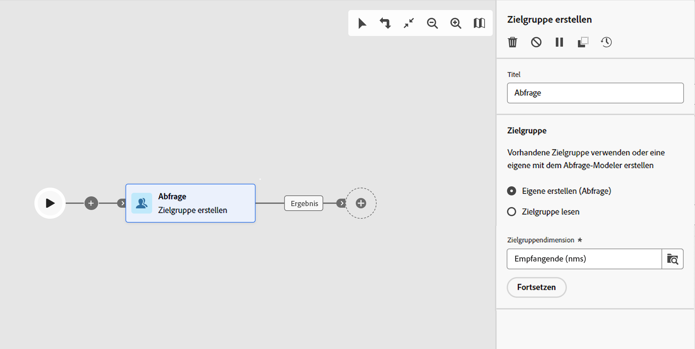

# Zielgruppe erstellen {#build-audience}

>[!CONTEXTUALHELP]
>id="acw_orchestration_build_audience"
>title="Aktivität „Zielgruppe erstellen“"
>abstract="Die Aktivität **Zielgruppe erstellen** ermöglicht Ihnen das Definieren der Zielgruppe, die in den Workflow aufgenommen wird. Beim Senden von Nachrichten im Kontext eines Kampagnen-Workflows wird die Nachrichtenzielgruppe nicht in der Kanalaktivität, sondern in der Aktivität **Zielgruppe erstellen** definiert."

Die Aktivität **Zielgruppe erstellen** ist eine Aktivität zur **Zielgruppenbestimmung**. Diese Aktivität ermöglicht Ihnen die Definition der Zielgruppe, die in den Workflow aufgenommen wird. Beim Senden von Nachrichten im Kontext eines Kampagnen-Workflows wird die Nachrichtenzielgruppe nicht in der Kanalaktivität, sondern in der Aktivität **Zielgruppe erstellen** definiert.

Zur Definition der Zielgruppenpopulation haben Sie folgende Möglichkeiten:

* Wählen Sie eine vorhandene Zielgruppe aus, die als Liste in der Client-Konsole erstellt wurde.
* Wählen Sie eine Adobe Experience Platform-Zielgruppe aus.
* Erstellen Sie mit dem Abfrage-Modeler eine neue Zielgruppe, indem Sie Filterkriterien definieren und kombinieren.

>[!NOTE]
>
>Zielgruppen, die aus einer Datei geladen wurden, können nicht mit der Aktivität „Zielgruppe erstellen“ angesprochen werden. Dazu müssen Sie die Aktivitäten **Datei laden** und anschließend **Abstimmung** verwenden. [Weitere Informationen](../../audience/about-recipients.md)

<!--
The **Build audience** activity can be placed at the beginning of the workflow or after any other activity. Any activity can be placed after the **Build audience**.
-->

## Konfigurieren der Aktivität „Zielgruppe erstellen“ {#build-audience-configuration}

>[!CONTEXTUALHELP]
>id="acw_orchestration_build_audience_audienceselector"
>title="Zielgruppe"
>abstract="Wählen Sie Ihre Zielgruppe auf die gleiche Weise aus wie beim Entwerfen eines neuen Versands."

Führen Sie die folgenden Schritte aus, um die Aktivität **Zielgruppe erstellen** zu konfigurieren:

1. Fügen Sie die Aktivität **Zielgruppe erstellen** hinzu.
1. Definieren Sie einen Titel.
1. Definieren Sie die Art der Zielgruppe: **Eigene erstellen** oder **Zielgruppe lesen**.
1. Konfigurieren Sie Ihre Zielgruppe anhand der Schritte in den unten stehenden Registerkarten.

>[!BEGINTABS]

>[!TAB Eigene erstellen (Abfrage)]

Gehen Sie wie folgt vor, um Ihre eigene Abfrage zu erstellen:

1. Wählen Sie **Eigene erstellen (Abfrage)** aus.
1. Wählen Sie die **Zielgruppendimension**. Die Zielgruppendimension ermöglicht die Bestimmung der vom Vorgang betroffenen Population: Empfängerinnen und Empfänger, Vertragsbegünstigte, Benutzerinnen und Benutzer, Abonnentinnen und Abonnenten usw. Standardmäßig wird die Zielgruppe aus den Empfängerinnen und Empfängern ausgewählt. [Erfahren Sie mehr über Zielgruppendimensionen](../../audience/about-recipients.md#targeting-dimensions)
1. Klicken Sie auf **Fortfahren**.
1. Verwenden Sie den Abfrage-Modeler, um Ihre Abfrage zu definieren, genauso wie Sie eine Zielgruppe beim Entwerfen einer neuen E-Mail erstellen. [Erfahren sie mehr über die Arbeit mit dem Abfrage-Modeler](../../query/query-modeler-overview.md)

>[!TAB Zielgruppe lesen]

Gehen Sie wie folgt vor, um eine vorhandene Zielgruppe auszuwählen:

1. Wählen Sie **Zielgruppe lesen** aus.
1. Klicken Sie auf **Fortfahren**.
1. Wählen Sie Ihre Zielgruppe auf die gleiche Weise aus wie beim Entwerfen eines neuen Versands. Näheres dazu finden Sie in [diesem Abschnitt](../../audience/add-audience.md).

>[!ENDTABS]

## Beispiele{#build-audience-examples}

Im Folgenden finden Sie ein Beispiel für einen Workflow mit zwei Aktivitäten vom Typ **Zielgruppe erstellen**. Die erste Version richtet sich an die Zielgruppe derjenigen, die Poker spielen, gefolgt von einem E-Mail-Versand. Die zweite Version ist die Zielgruppe der VIP-Kundinnen und -Kunden, gefolgt von einem SMS-Versand.

