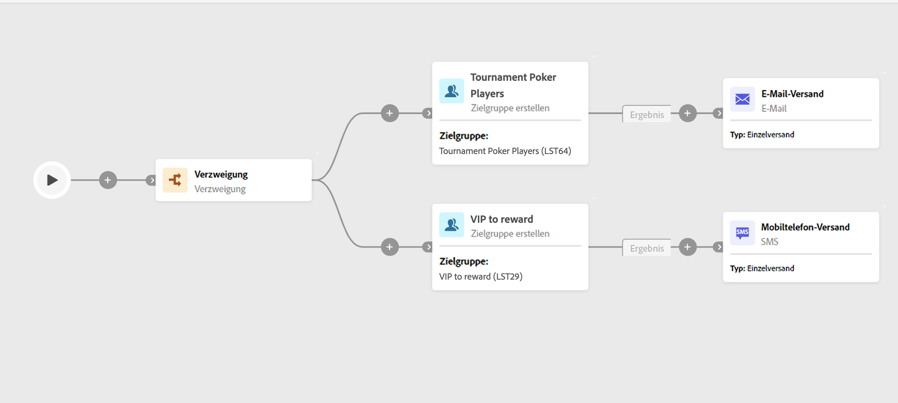

# Erstellen einer Zielgruppe {#build-audience}

Die Aktivität **Zielgruppe erstellen** ist eine Aktivität zur **Zielgruppenbestimmung**. Diese Aktivität ermöglicht Ihnen die Definition der Zielgruppe, die in den Workflow aufgenommen wird. Beim Senden von Nachrichten im Rahmen eines Kampagnen-Workflows wird die Nachrichtenzielgruppe nicht in der Kanalaktivität, sondern in der Aktivität **Zielgruppe erstellen** definiert.

Zur Definition der Zielgruppenpopulation haben Sie folgende Möglichkeiten:

* Wählen Sie eine vorhandene Zielgruppe aus, die als Liste in der Client-Konsole erstellt wurde.
* Wählen Sie eine Adobe Experience Platform-Zielgruppe aus.
* Erstellen Sie mit dem Regel-Builder eine neue Zielgruppe, indem Sie Filterkriterien definieren und kombinieren.

>[!NOTE]
>
>In diesem Zusammenhang können Sie keine Zielgruppe aus einer Datei laden. Dazu müssen Sie einen eigenständigen Versand erstellen. [Weitere Informationen](../../audience/about-audiences.md)

<!--
The **Build audience** activity can be placed at the beginning of the workflow or after any other activity. Any activity can be placed after the **Build audience**.
-->

## Konfiguration

Führen Sie die folgenden Schritte aus, um die Aktivität **Zielgruppe erstellen** zu konfigurieren:

1. Fügen Sie die Aktivität **Zielgruppe erstellen** hinzu.
1. Definieren Sie einen Titel.
1. Definieren Sie die Art der Zielgruppe: **Eigene erstellen** oder **Zielgruppe lesen**.

Um Ihre eigene Abfrage zu erstellen, führen Sie diese zusätzlichen Schritte aus:

1. Wählen Sie **Eigene erstellen (Abfrage)** aus.
1. Wählen Sie die **Zielgruppendimension**. Die Zielgruppendimension ermöglicht die Bestimmung der vom Vorgang betroffenen Population: Empfängerinnen und Empfänger, Vertragsbegünstigte, Benutzerinnen und Benutzer, Abonnentinnen und Abonnenten usw. Standardmäßig wird die Zielgruppe aus den Empfängerinnen und Empfängern ausgewählt. Weiterführende Informationen finden Sie in der [v8-Dokumentation](https://experienceleague.adobe.com/docs/campaign/automation/workflows/introduction/wf-type/targeting-workflows.html?lang=de#targeting-and-filtering-dimensions){target="_blank"}.
1. Klicken Sie auf **Fortfahren**.
1. Verwenden Sie den Regel-Builder, um Ihre Abfrage zu definieren, genauso wie Sie eine Zielgruppe beim Entwerfen einer neuen E-Mail erstellen. Näheres dazu finden Sie in [diesem Abschnitt](../../audience/segment-builder.md).

Gehen Sie wie folgt vor, um eine vorhandene Zielgruppe auszuwählen:

1. Wählen Sie **Zielgruppe lesen** aus.
1. Klicken Sie auf **Fortfahren**.
1. Wählen Sie Ihre Zielgruppe auf die gleiche Weise aus wie beim Entwerfen einer neuen E-Mail. Näheres dazu finden Sie in [diesem Abschnitt](../../audience/add-audience.md).

## Beispiel

Im Folgenden finden Sie ein Beispiel für einen Workflow mit zwei Aktivitäten vom Typ **Zielgruppe erstellen**. Die erste Version richtet sich an die Zielgruppe derjenigen, die Poker spielen, gefolgt von einem E-Mail-Versand. Die zweite Version ist die Zielgruppe der VIP-Kundinnen und -Kunden, gefolgt von einem SMS-Versand.

