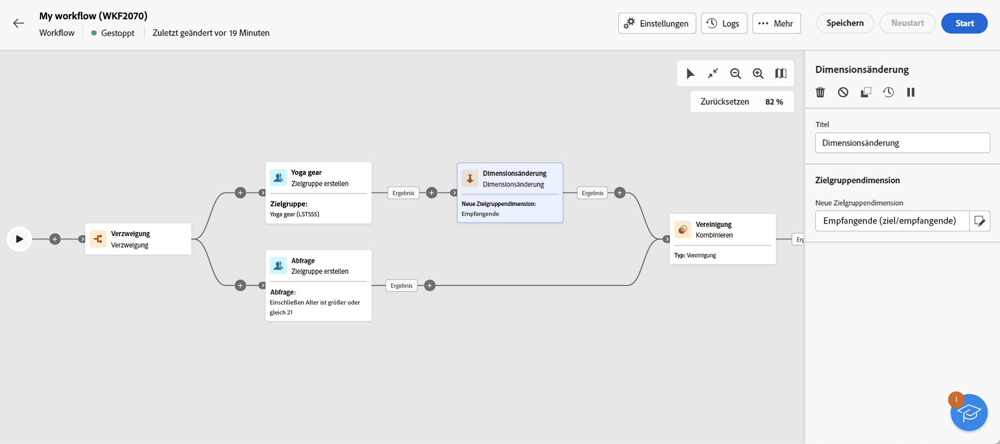

# Zielgruppe erstellen {#build-audience}

>[!CONTEXTUALHELP]
>id="acw_orchestration_build_audience"
>title="Aktivität „Zielgruppe erstellen“"
>abstract="Die Aktivität **Zielgruppe erstellen** ermöglicht Ihnen das Definieren der Zielgruppe, die in den Workflow aufgenommen wird. Beim Senden von Nachrichten im Kontext eines Kampagnen-Workflows wird die Nachrichtenzielgruppe nicht in der Kanalaktivität, sondern in der Aktivität **Zielgruppe erstellen** definiert."

Die Aktivität **Zielgruppe erstellen** ist eine Aktivität zur **Zielgruppenbestimmung**. Diese Aktivität ermöglicht Ihnen die Definition der Zielgruppe, die in den Workflow aufgenommen wird. Beim Senden von Nachrichten im Kontext eines Kampagnen-Workflows wird die Nachrichtenzielgruppe nicht in der Kanalaktivität, sondern in der Aktivität **Zielgruppe erstellen** definiert.

Zur Definition der Zielgruppenpopulation haben Sie folgende Möglichkeiten:

* Wählen Sie eine vorhandene Zielgruppe aus, die als Liste in der Client-Konsole erstellt wurde.
* Wählen Sie eine Adobe Experience Platform-Zielgruppe aus.
* Erstellen Sie mit dem Query Modeler Builder eine neue Zielgruppe, indem Sie Filterkriterien definieren und kombinieren.

>[!NOTE]
>
>In diesem Zusammenhang können Sie keine Zielgruppe aus einer Datei laden. Dazu müssen Sie einen eigenständigen Versand erstellen. [Weitere Informationen](../../audience/about-recipients.md)

<!--
The **Build audience** activity can be placed at the beginning of the workflow or after any other activity. Any activity can be placed after the **Build audience**.
-->

## Konfigurieren der Aktivität „Zielgruppe erstellen“{#build-audience-configuration}

>[!CONTEXTUALHELP]
>id="acw_orchestration_build_audience_dimension"
>title="Auswählen der Zielgruppendimension"
>abstract="Die Zielgruppendimension ermöglicht die Bestimmung der vom Vorgang betroffenen Population: Empfängerinnen und Empfänger, Vertragsbegünstigte, Benutzerinnen und Benutzer, Abonnentinnen und Abonnenten usw. Standardmäßig wird die Zielgruppe aus den Empfängerinnen und Empfängern ausgewählt."

Führen Sie die folgenden Schritte aus, um die Aktivität **Zielgruppe erstellen** zu konfigurieren:

1. Fügen Sie die Aktivität **Zielgruppe erstellen** hinzu.
1. Definieren Sie einen Titel.
1. Definieren Sie die Art der Zielgruppe: **Eigene erstellen** oder **Zielgruppe lesen**.
1. Konfigurieren Sie Ihre Audience anhand der unten stehenden Registerkarten.

>[!BEGINTABS]

>[!TAB Erstellen Sie Ihre eigene (Abfrage)]

Gehen Sie wie folgt vor, um eine eigene Abfrage zu erstellen:

1. Wählen Sie **Eigene erstellen (Abfrage)** aus.
1. Wählen Sie die **Zielgruppendimension**. Die Zielgruppendimension ermöglicht die Bestimmung der vom Vorgang betroffenen Population: Empfängerinnen und Empfänger, Vertragsbegünstigte, Benutzerinnen und Benutzer, Abonnentinnen und Abonnenten usw. Standardmäßig wird die Zielgruppe aus den Empfängerinnen und Empfängern ausgewählt. [Weitere Informationen zu Zielgruppendimensionen](../../audience/about-recipients.md#targeting-dimensions)
1. Klicken Sie auf **Fortfahren**.
1. Verwenden Sie das Abfragemodell, um Ihre Abfrage zu definieren. Dies entspricht der Erstellung einer Audience bei der Erstellung einer neuen E-Mail. [Erfahren Sie, wie Sie mit dem Abfragemodell arbeiten.](../../audience/../query/query-modeler-overview.md)

>[!TAB Audience lesen]

Gehen Sie wie folgt vor, um eine vorhandene Zielgruppe auszuwählen:

1. Wählen Sie **Zielgruppe lesen** aus.
1. Klicken Sie auf **Fortfahren**.
1. Wählen Sie Ihre Audience auf die gleiche Weise aus wie eine Audience bei der Konzeption eines neuen Versands. Näheres dazu finden Sie in [diesem Abschnitt](../../audience/add-audience.md).

>[!IMPORTANT]
>
>Wenn Sie die Aktivität **[!UICONTROL Zielgruppe erstellen]** verwenden möchten, die auf eine Experience Platform-Zielgruppe abzielt, müssen Sie danach eine Aktivität **[!UICONTROL Dimensionsänderung]** hinzufügen, um sicherzustellen, dass die Zielgruppendimension der Zielgruppe auf „Empfängerinnen und Empfänger“ gesetzt ist. Unten auf dieser Seite finden Sie ein Workflow-Beispiel.

>[!ENDTABS]

## Beispiele{#build-audience-examples}

Im Folgenden finden Sie ein Beispiel für einen Workflow mit zwei Aktivitäten vom Typ **Zielgruppe erstellen**. Die erste Version richtet sich an die Zielgruppe derjenigen, die Poker spielen, gefolgt von einem E-Mail-Versand. Die zweite Version ist die Zielgruppe der VIP-Kundinnen und -Kunden, gefolgt von einem SMS-Versand.

Hier ist ein weiteres Workflow-Beispiel, bei dem eine Adobe Experience Platform-Zielgruppe mit einer Adobe Campaign-Zielgruppe kombiniert wird. Damit diese Zielgruppen kombiniert werden können, muss eine Aktivität **[!UICONTROL Dimensionsänderung]** mit der Zielgruppendimension „Empfängerinnen und Empfänger“ nach der Adobe Experience Platform-Zielgruppe hinzugefügt werden. [Erfahren Sie, wie Sie eine Aktivität „Zielgruppe erstellen“ konfigurieren können](change-dimension.md)

